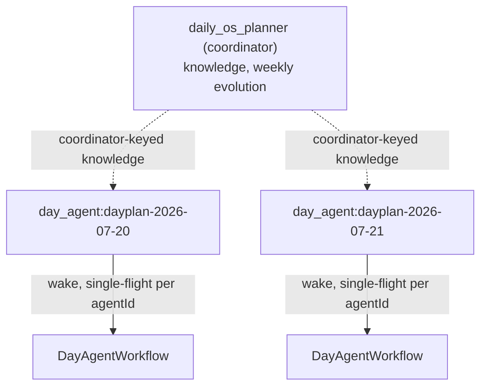

# Two roles, one kind

ADR 0032 splits planning into a **coordinator** (`daily_os_planner`) that owns
cross-day learning, durable knowledge and weekly evolution, and one **per-day
agent** (`day_agent:<dayId>`) per day going forward.

Both run under the identical `AgentKinds.dayAgent` kind and the same
`DayAgentWorkflow`. They are distinguished **only by id shape** — `perDayAgentId`,
`isPerDayAgentId`, `isDailyOsDayOwner`.

# The coordinator

`DayAgentService.getOrCreatePlannerAgent()` is the single creation entry point.
It mints the planner under the **deterministic** id `daily_os_planner`, so two
devices that independently create it converge through last-write-wins instead of
diverging into two identities. It is idempotent.

The planner pins **no** `activeDayId` slot and writes **no** per-day `agent_day`
link. A wake's day is carried explicitly by its trigger tokens —
`planning_day:<dayId>`, plus the mode tokens `drafting:` / `refine:` /
`capture_submitted:` — and a `day:<dayId>` workspace key on the queued `WakeJob`.
`DayAgentWorkflow` resolves the day strictly from that context and **fails the
wake when no day can be resolved**; there is no slot fallback.

This is what ADR 0022 established: a day the planner owns is an explicit
**workspace, not a separate mind**. (The `kind` string stays `day_agent` for
storage compatibility with the pre-0022 model.)

`dayAgentIdForDate(date)` → `dayplan-YYYY-MM-DD` is therefore a **workspace id,
not an identity**. That string is reused across storage namespaces without
colliding: the legacy journal `DayPlanEntry.id`, the `planning_day:` token,
`CaptureEntity.dayId`, and `DayPlanEntity.dayId`. The drafted plan is stored
under `day_agent_plan:<dayId>` so the agent draft never overwrites the journal
row, and the `agentId` discriminator separates planner identity from plan.

# Day-forward cutover, no migration

`getOrCreateDayAgentForDate(date)` creates a `day_agent:<dayId>` identity
**lazily on the first write for a day** — capture submit, draft or refine — but
only when the coordinator does not already own that day.

Ownership is a cheap probe: a non-deleted `day_agent_plan:<dayId>` written by the
coordinator, or any coordinator capture whose `dayId` matches. **If either is
true the coordinator keeps the day permanently** — there is no seeding or
re-parenting of old data onto the new identity.

`getDayAgentForDate(date)` is the read-only counterpart: per-day identity if one
exists, else the coordinator, else `null`.

## What the split buys

**Two concurrent wakes, for free.** `WakeRunner` is single-flight *per agentId*,
so distinct day-agent ids run concurrently under the orchestrator's existing
bounded drain with no new code.

**A log that does not grow with app age.** A per-day agent's
`CaptureEntity`/observation history is exactly that day's, so ADR 0016's
projection fold stays bounded — unlike the coordinator's, which accumulates
forever and owns every pre-cutover day.

## What stays coordinator-keyed

- **Durable knowledge.** A per-day wake reads `knowledge_index` /
  `knowledge_statements` under `dailyOsPlannerAgentId`, not its own id, and any
  `propose_knowledge` call from a per-day wake **persists under the coordinator
  id too** — so proposals land in the coordinator's weekly confirm loop instead
  of being stranded per-day.
- **Week lookback spans owners.** `DayAgentWeekContextService.buildForDay`
  accepts plan and summary rows from any `isDailyOsDayOwner` agent, since
  neighbouring days in the same week can be owned by different identities across
  the cutover.

## UI keying

`dayAgentIsRunningProvider(date)` is true while **either** the per-day agent for
that date **or** the coordinator is running — covering post-cutover and
pre-cutover days with one provider. Reconcile's running indicator, the
drafting/refine action-bar shader, and `capturesForDateProvider` all key off it.

`capturesForDateProvider` unions captures from the resolved owner *and* the
coordinator, deduped by id, so an offline peer syncing in a pre-cutover capture
after the day-agent exists still shows up.

# Legacy migration

Migration from the pre-0022 per-day `day_agent` identity model runs on **every**
`getOrCreatePlannerAgent` resolve — idempotent and best-effort, not only on first
creation. That matters because a legacy `day_agent` can sync in from another
device *after* the planner exists, or be stranded by an interrupted first pass.
After the first successful pass the active-`day_agent` query is empty and it
returns immediately.

For each other active `day_agent` identity:

1. Archive it — lifecycle → dormant, `scheduledWakeAt` cleared so it is never
   re-woken or restored.
2. Re-parent its recent (≤14-day) `dayPlan` / `capture` / `parsedItem` /
   `changeSet` entities to the planner id via normal synced upserts, so
   pre-flip plans stay visible.

Each legacy agent is migrated under its **own** try/catch, so one failure neither
blocks planner creation nor stops the others.

# Day-scoped reads

Opening a day used to load **every** capture and **every** day-status event the
owning agent had ever recorded, then filter in Dart. That cost grew with the
user's whole history on the main day surface, and it bit hardest on
planner-owned days.

The cause was the projected `subtype` column: `capture` stored the capture's own
id (redundant with the primary key) and `dayStatusEvent` its status name, so
neither could serve a day-scoped query — while `dayPlan`/`daySummary`/
`dayDirective` already stored the day and were indexed.

Both now store the **day workspace**, so `capturesForDateProvider` and
`dayAgentPersonaStateProvider` read through `idx_agent_entities_agent_type_sub`
instead of scanning.

A capture carrying no explicit `dayId` — synced from a peer old enough to predate
it — derives one from `capturedAt` in local time, the same rule `captureDayId`
applies on read, so legacy rows land on the right day rather than needing a
Dart-side fallback scan. **Schema v17 backfills existing rows through that same
Dart projection**, not a SQL `json_extract` update, because a backfilled value
that disagreed with the writer would silently drop rows out of their day.

# Not yet implemented

The `DayDirectiveEntity`/`DayStatusEvent` protocol is live (see
[coordination protocol](coordination-protocol.md)), but **dormancy for closed
days** is not — no day-close lifecycle exists yet. ADR 0032's Amendments section
carries the full list of where implementation diverged from the original text.
