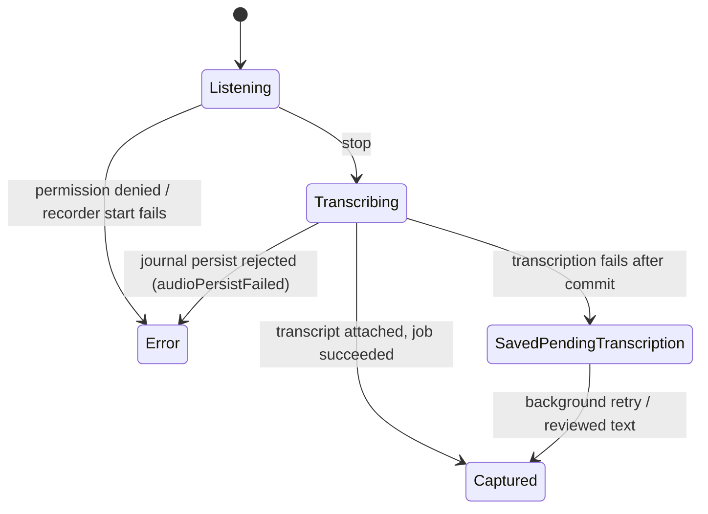

# The tool surface

`DayAgentStrategy` handles private observations itself and delegates the rest
through the workflow handler:

| Group | Tools |
|-------|-------|
| Scheduling | `set_next_wake` |
| Recall | `search_memory` |
| Knowledge | `propose_knowledge` |
| Capture / Reconcile | `submit_capture`, `parse_capture_to_items`, `match_to_corpus`, `link_capture_phrase_to_task`, `break_capture_link`, `surface_pending_decisions`, `apply_triage`, `create_task_from_phrase` |
| Planning | draft and refine tools |
| Week context | `write_day_summary` |
| Coordination | `issue_day_directive` (coordinator only), `raise_day_status` |

`DayAgentCaptureService` owns the direct Capture/Reconcile mutations.
**`apply_triage` and `create_task_from_phrase` both enforce the planner
identity's category allow-list** — the planner cannot close, re-date, or create
tasks outside its configured categories.

`submit_capture` persists a `CaptureEntity` and enqueues a manual wake with a
`capture_submitted:<captureId>` trigger token. **The caller supplies the selected
planning day independently of the recording timestamp**, so reusing a retained
check-in from a past or future Day Activity view cannot enqueue work into the
wrong workspace.

`DayAgentPlanService` writes the drafted plan as a `DayPlanEntity` under
`day_agent_plan:<dayId>`, plus `capture_to_plan` links, and persists refine
diffs as change sets and decisions.

# What the write path enforces

The distinction matters for reading eval results and for trusting the model:

| Enforcement | Constraints |
|-------------|-------------|
| **Hard — throws `DayAgentCaptureException`**, rejecting the whole `draft_day_plan` call and handing the message back to the model, which retries | Day boundaries, `end > start`, same-day past-start, allowed categories, committed-plan overwrite, model-authored `committed` blocks, `cal` blocks, unresolvable `taskId` |
| **Prompt contract only** | Block overlap, capacity, decided tasks actually being placed, blocker ordering |

So **the persisted plan is always *legal***, and inspecting it alone measures the
guards rather than the model. See [evaluation](evaluation.md).

## Three guards worth stating precisely

**Planning into the past is refused, whatever the block's type.** For today's
plan, `draft_day_plan` rejects any block it would be *planning* — state `drafted`
or `committed` — whose start precedes `clock.now()` **at the moment the tool
executes**.

That last clause is load-bearing, and getting it wrong was measurable. The
threshold moves between rendering the prompt and enforcing it, because the model
thinks in between — 13s to 152s in the eval. So a plan whose first block starts
at the instant the prompt advertised is *always* rejected: every sampled
`lateStart` cell across both models started the day at 15:00 when the prompt read
`15:00:00.005877`, and all 6/6 lost by under six milliseconds. Complying would
have meant predicting inference latency.

The prompt therefore carries a top-level `<planning_window>` section —
`advertisedPlanningStart`, the first five-minute boundary at least three minutes
out — rather than the raw instant. It is **top-level on purpose**: the
constraint belongs to the day, not to a wake mode. `draft_day_plan` is always
exposed and a scheduled `planning_day` wake builds neither a drafting nor a
refine context, so nesting it under either left exactly those wakes deriving the
threshold themselves. The guard is unchanged and unweakened; only what the model
is *told to aim at* moved.

Late enough in the day, walking forward for that headroom runs past midnight,
and a block outside the plan day is rejected just as firmly — advertising 00:05
tomorrow would steer the model into the same rejection from the other end. So
the window **closes**: `<planning_window>` carries `closed` instead, and the
rules say to leave the day alone rather than add to it. The three states are
deliberately distinct, because collapsing any two misleads:

| `<planning_window>` | Meaning |
|---|---|
| `{"earliestStart": …, "availableMinutes": …}` | today, still plannable — start here, and this is how much is left |
| `{"closed": true}` | today, no usable slot left (no five-minute window before midnight, or no working minutes left) — add nothing |
| `+ {"capacityMinutes": …, "scheduledMinutes": …}` | added on a refine wake — judge your *net* change against these, alongside whichever row above applies |
| `{"availableMinutes": …}` | neither `earliestStart` nor `closed` — the day has not begun, so no part of it is past |

`availableMinutes` is absent from the `closed` row deliberately, and absent
everywhere when the working hours cannot be parsed.

Reading `closed` as `{}` would let a wake at 23:58 plan freely from this
morning, and the guard would reject every block of it.

The day boundary is computed with calendar arithmetic (`DateTime(y, m, d + 1)`),
not by adding 24 hours: on a DST transition day the latter lands on 01:00 or
23:00 and would either advertise into tomorrow or close the window an hour
early.

**The agent cannot create a `committed` block.** `committed` asserts that *the
user approved this block*, and exactly two things may say that: the user
committing the day through the UI, and `acceptPlanDiff` on an already-agreed
plan. So the only `committed` block the model may emit is a faithful repeat of
one the plan already had — same id, same start, same state — which is what a
re-draft over an agreed plan does. Anything else is rejected.

The guard is unconditional rather than part of the past-start rule, which is why
it was missed: guarding `committed` against *backdating* made the hole look
covered, while a forward-dated committed block persisted and projected to the UI
as agreed work. Observed in 4 of 9 archived eval runs, always a single 09:00
block titled "Already scheduled" — the model depicting the directive's
`alreadyScheduledMinutes` as existing commitments. That is a fair thing to want
to express; `drafted` expresses it without claiming a verdict the user never
gave. `committed` stays in the tool schema, unlike `cal`, because its
carry-forward use is real — removing it would force a re-draft to call approved
work `drafted` and silently un-commit it.
**The day's remaining budget is stated, not derived.** `<planning_window>`
carries `availableMinutes` — working time still available, bounded by the
clock *and* by capacity, whichever binds harder. Without it the model had to
combine three separate facts: `capacityMinutes` and `workingHours` from the
system prompt's planning defaults, and `earliestStart` from the user message.
It did not, and the failures were exactly what that predicts — a plan running
to 17:45 against a 17:00 day, and 780 minutes scheduled against 480 of
capacity.

Same move as `advertisedPlanningStart`: compute what is already known rather
than asking the model to. It counts from the *advertised* start, so the budget
never describes minutes the model is not allowed to use, and it is suppressed
when the window is `closed` — that already carries the instruction, and a
second number saying the same thing invites the model to reconcile two
signals. **It is therefore never zero:** a day with no working minutes left
reports `closed` instead (see below), so `availableMinutes` always names time
the model can actually use. Malformed working hours leave it unstated rather
than guessed, since they are free-text config nothing else parses.

A **refine** wake gets `capacityMinutes` and `scheduledMinutes` *in addition to*
the temporal fields, not instead of them — `proposePlanDiff` enforces the same
past-start guard, so a diff still needs the floor and the clock-bounded
remainder. A diff edits an
existing plan, so what matters is the *net* change — dropping a 180-minute block
to add another is net zero, and judging the addition against the unused
remainder alone would report a conflict that does not exist. Occupancy is
recomputed from the blocks rather than read from the denormalized
`scheduledMinutes`, which can drift; the projection and the agenda view
recompute for the same reason. A drafting baseline is replaced wholesale, so the
whole-day budget is correct there.

A day with **no working minutes left** reports `closed` rather than a start
paired with a budget of zero. Those are the same instruction, and the pair left
a fresh draft no coherent move: the rules forbid running past working hours,
and there is no time left inside them. (`closed` still collides with the
mandatory `draft_day_plan` call on a drafting wake — a pre-existing conflict
tracked in lotti3-ddp, not introduced here.)

The rules pair it with what to do when the work does not fit: decide visibly —
leave work out and name it, or place a task for less than its estimate and say
so — rather than running past the end of the day or quietly shrinking
estimates so everything appears to fit.

**A block that names a task is filed under that task's category.** The block's
own `categoryId` and its `taskId` were each validated against the agent's
allow-set but never against *each other*, so a block could carry a task from one
area and bill its time to another — `plannedMinutesByCategory` and every rollup
built on it read that field.

Derived rather than rejected: the task's category is the only correct answer, so
asking the model to guess it would cost a round trip to learn something already
known. Safe by construction, because `resolveAllowedTaskIds` only returns tasks
whose category this agent may touch — the derived value is always inside the
allow-set the block was checked against. That resolver now returns
id → category from the same read that filters, so the two facts cannot drift
apart again. Blocks with no task (buffers, breaks, manual blocks) keep the
category the model chose, and an uncategorised task leaves it alone rather than
nulling it out of every rollup.

`categoryForPlannedBlock` states the rule once and **both doors apply it** — a
fresh `draft_day_plan` and an accepted `propose_plan_diff`. Enforcing it on one
door only is precisely how the original mismatch existed, so the diff route
derives at *acceptance* rather than at proposal: a ChangeSet is durable and
synced, so one written before this rule, or by a peer on an older build, is
filed correctly when the user accepts it instead of persisting the old
mismatch. A move re-derives even when it only shifts times, which is what makes
that self-healing.

**The agent cannot emit a `cal` block at all**, through either `draft_day_plan` or
`propose_plan_diff`, and the type is absent from both tool schemas. `cal` means
"imported calendar event", and no calendar reaches this agent — `calendarBlocks`
is a deferred parameter `RealDayAgent` drops, and no context section renders
events. Such a block could therefore only assert an import that never happened,
and `DayAgentPlanEditor` would then refuse to edit it, **leaving the user a block
they can neither change here nor find in a calendar.** All of this reverses
together if calendar events are ever rendered into the drafting context.

**A block's `taskId` must resolve to a live task in a category this agent may
touch, on both routes.** `decidedTaskIds` is an argument the model writes itself,
so it is resolved against the journal rather than trusted — and a
`propose_plan_diff` snapshot is held to the same standard, because an accepted
diff copies its `taskId` onto the live plan while the approval summary shows only
title and times. An unchecked reference would be **approved unseen**.

# Batch-first durable voice capture

**Every voice session fixes its context before the microphone opens**: a fresh
recording-session id, a deterministic UUIDv5 activity id, the selected
`dayId`/`planDate` (never the wall clock at stop), the capture intent
(`dayPlan` / `dayRefine`), and the host id when available.

The platform recorder writes a plain `.m4a`. Stop follows a **strict local-first
commit order**:

1. Persist the `JournalAudio` with its `DayAudioContext` provenance.
2. Enqueue and claim the durable transcription job.
3. Run foreground batch transcription through that job's state machine.

A transcription or network failure **keeps the saved recording** and hands
retries to the background runtime, displayed as a saved-pending warning — never
as a successful empty capture or a lost recording.

**Controller lifecycle epochs fence each start boundary**, so a reset, route
disposal, or superseding start cannot resurrect an obsolete microphone session.

There is **no streaming/realtime transcription path and no live transcript**. The
orb caption carries listening/transcribing status and the waveform freezes dimmed
in its slot — deliberately no inference-bars animation on the recorder surface.
The Reconcile step is where the wait is made visible.

# The review fence

Each unsubmitted recording card embeds `EditorWidget` keyed by the recording's
journal id — **the same Quill editor, toolbar and save path used everywhere else
in the app**; there is no separate text dialog.

Because that save flows through generic journal persistence,
`DayAudioReviewFence` (started with the processing runtime) listens to journal
audio update notifications and terminalizes any non-terminal transcription job
whose recording now carries user-authored `entryText` via `satisfyWithReviewedText`.

**"User-authored" is derived, not flagged**: non-empty text that no machine
transcript on the entity produced.

The transcript writer applies the same invariant, so a late-arriving machine
transcript is recorded as a receipt but **never overwrites reviewed wording**. A
claim revoked mid-attempt — reviewed text or deletion — surfaces as
`DayProcessingClaimRevokedException`, which the processor treats as a benign
deferral.

# Denormalized day columns

`JournalAudio` writes denormalize `dayContext.dayId` and
`dayContext.recordingSessionId` into **indexed journal columns**. Activity and
outbox repair therefore perform bounded day/session lookups instead of
deserializing the full audio history. The schema migration backfills existing
rows and preserves one canonical owner for each stable recording session.

# Attribution

When Capture attaches the transcript to the persisted `JournalAudio`,
`TranscriptAttributionCoordinator` has **already** created an in-memory
attribution session before inference — whenever the coordinator is available,
independently of the concrete transcriber implementation.

The resulting `AudioTranscript` carries a stable sub-id and embedded attribution;
unreported provider cost stays null. Attribution is projected **only after the
journal update confirms it applied**, while the embedded carrier remains
authoritative.

Provider failures, empty transcripts, rejected transcript persistence and user
cancellation all terminalize **without a carrier**; process interruption leaves
no fabricated terminal record. See [AI attribution](../ai/attribution.md).

# Activity

The Day header exposes Agenda, Day and Activity. Activity is a **local
chronological projection** over day-scoped `JournalAudio`, outbox state, typed
and voice `CaptureEntity` check-ins, and the generated plan. It keeps the day's
already-tracked sessions visible in a `TimeSpentCard`, including before the first
plan exists.

It remains available offline and keeps the prior list visible during background
refresh. A saved recording can be played, retried, deleted (cancel job, then
soft-delete the journal entry), edited in place, or routed into the
Reconcile/Refine flow.

**A submitted capture remains a visible durable continuation handle**: reopening
it re-enqueues parsing after a process restart. Missing local audio is reported to
both Activity and the agent context, and setup-required rows link directly to AI
settings.
