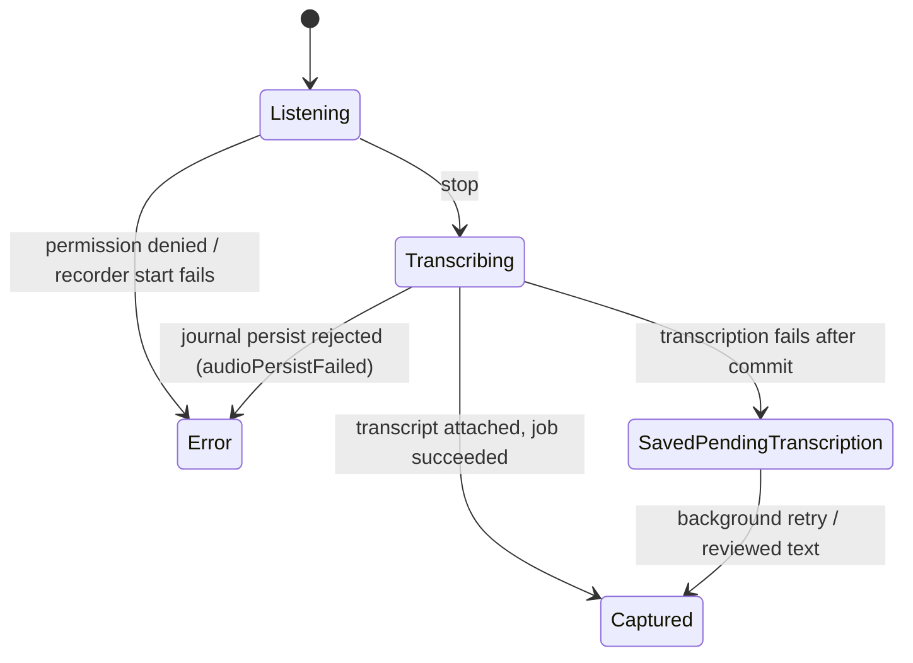

# The tool surface

`DayAgentStrategy` handles private observations itself and delegates the rest
through the workflow handler:

| Group | Tools |
|-------|-------|
| Scheduling | `set_next_wake` |
| Recall | `search_memory` |
| Knowledge | `propose_knowledge` |
| Capture / Reconcile | `submit_capture`, `parse_capture_to_items`, `match_to_corpus`, `link_capture_phrase_to_task`, `break_capture_link`, `surface_pending_decisions`, `apply_triage`, `create_task_from_phrase` |
| Planning | draft and refine tools |
| Week context | `write_day_summary` |
| Coordination | `issue_day_directive` (coordinator only), `raise_day_status` |

`DayAgentCaptureService` owns the direct Capture/Reconcile mutations.
**`apply_triage` and `create_task_from_phrase` both enforce the planner
identity's category allow-list** — the planner cannot close, re-date, or create
tasks outside its configured categories.

`submit_capture` persists a `CaptureEntity` and enqueues a manual wake with a
`capture_submitted:<captureId>` trigger token. **The caller supplies the selected
planning day independently of the recording timestamp**, so reusing a retained
check-in from a past or future Day Activity view cannot enqueue work into the
wrong workspace.

`DayAgentPlanService` writes the drafted plan as a `DayPlanEntity` under
`day_agent_plan:<dayId>`, plus `capture_to_plan` links, and persists refine
diffs as change sets and decisions.

# What the write path enforces

The distinction matters for reading eval results and for trusting the model:

| Enforcement | Constraints |
|-------------|-------------|
| **Hard — throws `DayAgentCaptureException`**, rejecting the whole `draft_day_plan` call and handing the message back to the model, which retries | Day boundaries, `end > start`, same-day past-start, allowed categories, committed-plan overwrite |
| **Prompt contract only** | Block overlap, capacity, decided tasks actually being placed, blocker ordering |

So **the persisted plan is always *legal***, and inspecting it alone measures the
guards rather than the model. See [evaluation](evaluation.md).

The past-start guard exempts `PlannedBlockType.cal` alone — which is how a model
plans the past without being rejected, and why fabricated `cal` blocks are worth
scoring.

# Batch-first durable voice capture

**Every voice session fixes its context before the microphone opens**: a fresh
recording-session id, a deterministic UUIDv5 activity id, the selected
`dayId`/`planDate` (never the wall clock at stop), the capture intent
(`dayPlan` / `dayRefine`), and the host id when available.

The platform recorder writes a plain `.m4a`. Stop follows a **strict local-first
commit order**:

1. Persist the `JournalAudio` with its `DayAudioContext` provenance.
2. Enqueue and claim the durable transcription job.
3. Run foreground batch transcription through that job's state machine.

A transcription or network failure **keeps the saved recording** and hands
retries to the background runtime, displayed as a saved-pending warning — never
as a successful empty capture or a lost recording.

**Controller lifecycle epochs fence each start boundary**, so a reset, route
disposal, or superseding start cannot resurrect an obsolete microphone session.

There is **no streaming/realtime transcription path and no live transcript**. The
orb caption carries listening/transcribing status and the waveform freezes dimmed
in its slot — deliberately no inference-bars animation on the recorder surface.
The Reconcile step is where the wait is made visible.

# The review fence

Each unsubmitted recording card embeds `EditorWidget` keyed by the recording's
journal id — **the same Quill editor, toolbar and save path used everywhere else
in the app**; there is no separate text dialog.

Because that save flows through generic journal persistence,
`DayAudioReviewFence` (started with the processing runtime) listens to journal
audio update notifications and terminalizes any non-terminal transcription job
whose recording now carries user-authored `entryText` via `satisfyWithReviewedText`.

**"User-authored" is derived, not flagged**: non-empty text that no machine
transcript on the entity produced.

The transcript writer applies the same invariant, so a late-arriving machine
transcript is recorded as a receipt but **never overwrites reviewed wording**. A
claim revoked mid-attempt — reviewed text or deletion — surfaces as
`DayProcessingClaimRevokedException`, which the processor treats as a benign
deferral.

# Denormalized day columns

`JournalAudio` writes denormalize `dayContext.dayId` and
`dayContext.recordingSessionId` into **indexed journal columns**. Activity and
outbox repair therefore perform bounded day/session lookups instead of
deserializing the full audio history. The schema migration backfills existing
rows and preserves one canonical owner for each stable recording session.

# Attribution

When Capture attaches the transcript to the persisted `JournalAudio`,
`TranscriptAttributionCoordinator` has **already** created an in-memory
attribution session before inference — whenever the coordinator is available,
independently of the concrete transcriber implementation.

The resulting `AudioTranscript` carries a stable sub-id and embedded attribution;
unreported provider cost stays null. Attribution is projected **only after the
journal update confirms it applied**, while the embedded carrier remains
authoritative.

Provider failures, empty transcripts, rejected transcript persistence and user
cancellation all terminalize **without a carrier**; process interruption leaves
no fabricated terminal record. See [AI attribution](../ai/attribution.md).

# Activity

The Day header exposes Agenda, Day and Activity. Activity is a **local
chronological projection** over day-scoped `JournalAudio`, outbox state, typed
and voice `CaptureEntity` check-ins, and the generated plan. It keeps the day's
already-tracked sessions visible in a `TimeSpentCard`, including before the first
plan exists.

It remains available offline and keeps the prior list visible during background
refresh. A saved recording can be played, retried, deleted (cancel job, then
soft-delete the journal entry), edited in place, or routed into the
Reconcile/Refine flow.

**A submitted capture remains a visible durable continuation handle**: reopening
it re-enqueues parsing after a process restart. Missing local audio is reported to
both Activity and the agent context, and setup-required rows link directly to AI
settings.
