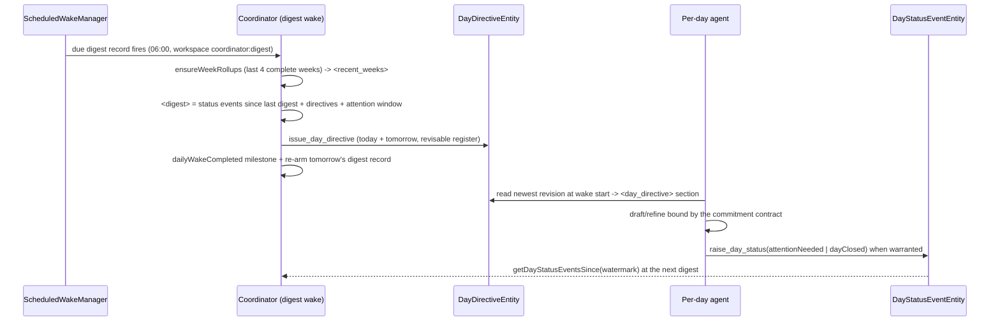
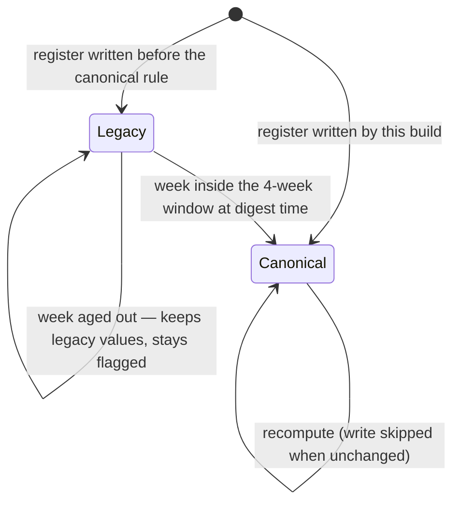
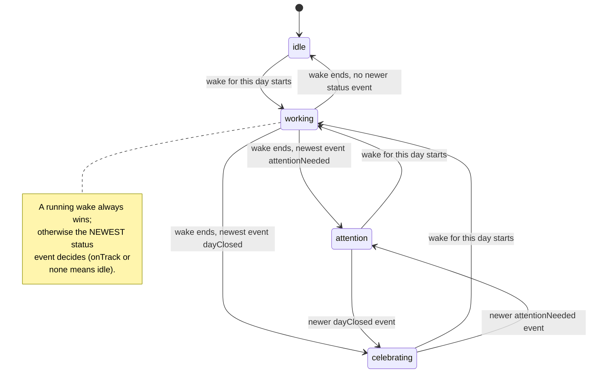

The coordinator and per-day agents coordinate through **two durable, synced
entities — no RPC** (ADR 0016/0018/0019). Everything is an append-only or
last-write-wins register that converges on its own.

# Downward: `DayDirectiveEntity`

One **revisable register per day** (`day_directive:<dayId>`), coordinator-authored
only — `DayAgentDirectiveService` rejects other issuers, and the tool is only
*offered* on coordinator wakes.

It carries distilled commitments (source, window, minutes, evidence refs), a
capacity budget (available and already-scheduled minutes, energy bands),
carry-over items, bounded constraints and attention notes — **never transcripts**.

Bounded by validation: ≤12 commitments and carry-over items, ≤8 notes and
constraints, 280-character strings, windows inside the day. Revisions upsert the
deterministic id with a fresh `directiveRevisionId` under last-write-wins,
preserving `createdAt`.

The per-day wake reads it **by primary key — no projection table** — and renders
`<day_directive>` in the byte-stable prompt prefix, after `<knowledge_index>`.

**The drafting contract makes it binding.** Every commitment is either placed,
traded away in a diff naming the collision, or escalated via `raise_day_status`
with `status: attentionNeeded` and `directiveUnsatisfiable` among its `reasons`.
Requested minutes reconcile against the capacity budget before drafting.

# Upward: `DayStatusEventEntity`

Append-only typed events (`day_status:<dayId>:<uuid>`):

| Status | Reasons |
|--------|---------|
| `onTrack` | — |
| `attentionNeeded` | `overCommitted`, `directiveUnsatisfiable`, `userDivergence`, `processingBlocked` |
| `dayClosed` | — |

`raise_day_status` may only target **the wake's own day** (`wakeDayId` threaded
through the tool dispatch), caps at one event per wake via a per-`runKey` guard,
requires typed reasons with `attentionNeeded`, and bounds notes at 500
characters.

It is a **new entity variant, not an `AgentMessageKind`**, so status stays out of
the compaction fold and scans via the type/subtype index — `getDayStatusEventsSince`
is cross-agent, oldest-first, served by `idx_agent_entities_active_type_created`.

# The digest wake

The coordinator's consumption point: a `digest:<dayId>` token wake on the
`coordinator:digest` workspace — **its own lane, never coalescing with day
work**.

It assembles `<digest>` from status events since the last digest (watermark = the
newest `dailyWakeCompleted` milestone, with a 48-hour fallback), today's and
tomorrow's current directives, and the two-day attention window.

**Digest rules: react by revising directives — never by drafting plans.**

Completion writes the watermark milestone and deterministically re-arms
tomorrow's digest record. `DayAgentService.restoreSubscriptions` bootstraps the
first record, and recovers a missed re-arm, whenever the coordinator identity is
active.

## A digest anchors to the day it runs on, not the day it was scheduled for

The record's `digest:<dayId>` token is minted when the *next* digest is armed, so
a record that stays pending through its slot — device asleep, offline, or the app
not running — fires carrying a day that may already be over. `resolvePlannerWakeDay`
would then hand the wake a dead workspace and the coordinator would issue
directives for a day nobody can act on.

`reanchorDigestTriggerTokens` rewrites a stale `digest:` token to today's day id
before the workspace is resolved. A current or future token is left alone: firing
early is clock skew, not staleness, and pulling the anchor backwards would digest
a day twice.

**Missed windows collapse into one run rather than replaying one digest per
skipped day.** The catch-up still sees everything back to its watermark, so a
week offline surfaces that week's escalations in the single catch-up digest —
*provided a previous digest completed*. With no `dailyWakeCompleted` milestone
at all (a fresh install, or every prior attempt failed), the watermark falls
back to 48 hours plus the 12-hour sync slack, and escalations older than that
are not rendered before the watermark advances past them. That bound belongs to
the watermark fallback, not to re-anchoring.

The re-arm is bounded by the day just digested (`nextDigestTimeAfterDay`), not
merely by `now`. A catch-up that runs at 03:00 re-anchors to today, and the plain
next slot would be *today* at 06:00 — a second digest for the day just digested.

**Only a run that actually digested applies that bound** — which is not the same
as a run that reported success. `AgentSyncService` rethrows a buffered outbox
failure *after* its transaction commits, so a digest can be durably complete and
still be reported as failed; the failure path therefore reads the
`dailyWakeCompleted` milestone back from the log for its own run key rather than
trusting the result. When nothing committed it re-arms unbounded and keeps
today's 06:00 retry, because skipping to tomorrow would cost the user today's
briefing over a transient error.

The resulting invariant is **at most one digest per day per record history** —
it is enforced by one device consuming and re-arming the record in sequence, and
says nothing about two devices holding the same pending record before either
`consumed` flip has synced. Cross-device exclusion is a separate concern with
its own mechanism, tracked as `lotti3-hkb.11`.

## Severity ranking, not arrival order

When more events exist than the digest renders (50), selection is severity-ranked
by `selectDigestStatusEvents`:

1. `attentionNeeded` > `dayClosed` > `onTrack`
2. `directiveUnsatisfiable` > `overCommitted` > `processingBlocked` >
   `userDivergence`
3. Newer beats older within a tier
4. Ascending id as the final deterministic tiebreak for equal timestamps

The section then carries `statusEventsTruncated: true`.

**Ranking sees every event since the watermark.** The oldest-first query refetches
with a doubled limit whenever a page fills (ceiling 2000), because a fixed-size
fetch would drop the newest events *pre-ranking* and the advancing watermark
would then skip them forever.

# Weekly rollups

A digest wake first refreshes `WeekRollupEntity` registers
(`week_rollup_v2:<Monday>`, coordinator-owned) for the **last 4 complete weeks**:
planned minutes per category (dropped blocks excluded), recorded minutes per
category (empty-string key = uncategorized), and days-with-plans.

**Every week is recomputed from source on every digest.** That is what makes
plain last-write-wins converge: a late-synced entry, and an incomplete aggregate
that won a concurrent-LWW race on another device, both self-heal at the next
digest.

Cost stays bounded by batching — one plan read and one recorded-time read span
all four weeks, bucketed per week — unchanged aggregates skip the write (steady
state writes nothing), and tombstones are never resurrected.

The rollups render as `<recent_weeks>` (names resolved, newest first), so the
digest can spot month-scale pacing trends without re-reading a month of raw
entities.

## Bucketing is canonical, or LWW does not converge

"Recomputed from source on every digest" only self-heals when every device
computes the *same* value from that source. Device-local bucketing broke that:
`weekStartFor(span.start)` resolved through the reading device's zone, so a
laptop and a phone in different zones produced different totals for the same
past week and flapped the register between them forever — a convergence bug
wearing the costume of a bucketing bug.

Two rules make the computation a property of the data rather than of the reader:

**The fix rests on how `dateFrom` crosses the wire.** It is a local-typed
timestamp serialized with `toIso8601String()`, which emits **no zone suffix**,
and the receiver parses it back as local. Its *components* are therefore the
recording device's wall clock on every device that holds the entry — while the
instant it denotes is reader-relative, because each device resolves those
components in its own zone. Reading the components is what makes the answer a
property of the data; converting first (`toUtc()`, `toLocal()`) turns it back
into a reader-relative instant, which was the bug.

| Input | Canonical rule |
|-------|----------------|
| Recorded minutes | `recordedWallClock(span.start)` — `dateFrom`'s calendar components, read as-is |
| Planned minutes | already stable: keyed by date-only `dayplan-<date>` ids, never by an instant |
| Week key | `canonicalWeekStart` reads calendar **components** and returns a UTC-typed midnight; `weekRollupEntityId` hashes those, never a converted instant |
| Week label | `isoCalendarDate` formats those components; a converting read renders the canonical Monday as the preceding Sunday west of UTC |
| Recorded length | `canonicalRecordedDuration` subtracts the two ends' components. `dateTo - dateFrom` on the parsed values is reader-relative for the same reason the bucket was, so a DST-crossing interval is 60 minutes in one zone and 120 in another — and both would be stamped canonical |
| Planned length | `canonicalWallClockDuration` over the block's `startTime`/`endTime`, which are zone-less for the same reason |

**Canonical durations are confined to the rollup.** The rendered week context is
read on one device, beside a timeline lane that uses elapsed time, so switching
it too would make a DST-crossing entry read as 120 minutes in `<recent_days>`
and 60 in the timeline.

`Metadata.utcOffset` is deliberately **not** consulted. It records the offset at
*creation*, not at `dateFrom`, so a backfilled or cross-DST entry carries an
offset that does not apply to its own timestamp — and it is absent on older
entries, which would put them on a different rule from everything else. The
components need neither.

The spanning read still widens a day at each end: for the ordinary local-typed
timestamp the stored instant and the components agree, but a UTC-typed
`dateFrom` (imported data) can sit up to 14 hours off the reader-local range.
Bucketing discards whatever falls outside.

**Which weeks** to compute still follows the reading device's calendar — "recent"
means recent to the user. Two devices straddling a Monday boundary may therefore
compute different *sets*, but never different *values*, so nothing flaps.

**The register id carries a generation: `week_rollup_v2:<Monday>`.** During a
staggered upgrade a device still on the previous build recomputes the *old* id
with the old reader-local rule and writes it back unstamped; had both
generations shared an id, the two builds would have overwritten each other for
as long as the rollout lasted — the exact loop this change exists to end.
Old-generation rows are inert with one exception: their **tombstones** are
still read, and carried forward. A week the user deliberately deleted must not come back to life
because the id generation changed underneath it, so `ensureWeekRollups` checks
the v1 id's tombstone before creating a v2 register — and, when a peer that had
not yet received that tombstone already created a live v2 row, applies the
deletion to it rather than merely skipping the recompute.

`WeekRollupEntity.bucketingRule` records which rule produced a register:
`recordedLocal` for canonical, null for legacy. The steady-state
skip-when-unchanged check requires the stamp as well as matching numbers —
matching numbers on a legacy register are a coincidence, not evidence.

`recentWeekRollups` renders **canonical registers only**. `ensureWeekRollups` is
fail-soft, so a refresh that threw part-way can leave legacy registers live
beside migrated ones; rendering both would feed the digest two bucketing rules
in one section without saying so. A failed migration therefore shows up as an
absent week rather than as a wrong trend.

# The other two upward channels

They predate this protocol and still carry their own traffic:

- **Day summaries** — `write_day_summary` → `<recent_days>`, carrying the
  distilled narrative. See [wake context](wake-prompt.md).
- **`propose_knowledge`** — coordinator-keyed even on per-day wakes, so durable
  learnings land in the coordinator's confirm loop directly.

# Visibility: the status chip

The Day page header shows a `DayAgentStatusChip` when the day's agent has
something to say.

Idle renders nothing. The tooltip adds per-day token spend **for per-day
identities only** — coordinator-owned days show none, because the coordinator's
lifetime aggregate would misattribute other days. Tapping opens agent internals,
the same destination as the header menu's "Inspect agent" entry.

Both facts come from `state/day_agent_persona_provider.dart`:
`dayAgentPersonaStateProvider` (the ADR §7 persona contract the character
animation will bind to) and `dayAgentTokenSpendProvider` (`getTokenUsageForAgent`
by agent id — **no new storage**).
