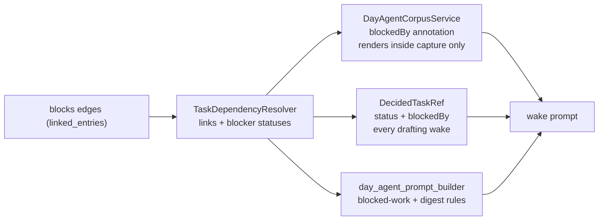

ADR 0042 gives tasks typed `blocks` links. This concept covers how the day-agent
planning surfaces consume that substrate, per ADR 0043.

# The resolver

`TaskDependencyResolver` answers "which of these task ids are blocked, and by
what" in **two bounded batch queries** — one type-scoped `blocks`-link fetch, one
batch status load for the distinct blocker ids. Never per-task fan-out, always one
call against the whole id set, mirroring the batch-read discipline used by the
week-context service.

It is **independent of, and not shared code with**, the task feature's own
`TaskBlockersController` (single-task, UI-facing, autoDispose-Riverpod-backed).
The resolver is stateless, plain Dart, and batch-shaped for a corpus of up to
`maxCorpusTasks` ids.

## Serialization differs from the human-facing chip, on purpose

| Case | Corpus (model-facing) | Task detail header (human-facing) |
|------|----------------------|-----------------------------------|
| Blocker resolves to a real, open task | Serializes with title, status and **its own `categoryId`** | Tappable chip |
| Blocker link whose target cannot be loaded (a sync gap) | `{"taskId": "<id>"}` with no `title`/`status`/`categoryId` — **still a non-empty `blockedBy` entry** | A bare untappable "Blocked" pill |

The blocker's own `categoryId` is carried because the rule tells the model to
schedule that blocker, and `draft_day_plan` requires a `categoryId` on every
block. On a capture-less wake the nested blocker object is the model's *only*
description of it — there is no corpus row to read a category from — so without
it a blocker in a different category than the task it blocks gets guessed wrong.
The write path validates the block's `taskId` and its `categoryId`
independently, so a wrong guess persists rather than being rejected.

The corpus keeps the entry so "still blocked" is never silently downgraded to
"ready" just because the blocker has not synced yet. A bare id is a usable token
for a model; for a human it is not.

# One field drives everything

`dependencyResolver` is a **single nullable field** on `DayAgentWorkflow`, threaded
into **two** carriers of the blocked-work data, so that every wake carrying the
rules below also carries data they can apply to:

| Carrier | Assembled in | Covers |
|---------|--------------|--------|
| `DayAgentCorpusService.buildTaskCorpusSnapshot` | capture-context | corpus rows — wakes with a capture only (the corpus lives inside `<capture>`) |
| `DayAgentPlanService.hydrateDecidedTasks` → `DecidedTaskRef` | drafting-context | tasks the user approved for placement, on **every** drafting wake |
| `resolvePlannedTaskStates` → `drafting.baselinePlan.blocks[]` | drafting-context | tasks an **earlier draft** already scheduled |

That one field drives the annotation on both paths and the prompt gates below, so
they **can never drift out of sync** — there is no separate "is this feature on"
flag.

## Why three carriers

The corpus alone was not enough, and the eval proved it. `<capture>` is absent on
a drafting wake with no capture — a scheduled pre-warm, or a plan-my-day trigger
on its own — so the rules arrived describing a `status` and `blockedBy` the model
was never shown. The `blockedWithoutCorpus` scenario failed `blockerBeforeBlocked`
on **every sample of every model** while its capture-carrying twin `blockedChain`
passed every one; after `DecidedTaskRef` gained the fields, both models stopped
placing the blocked leaf. See [evaluation](evaluation.md).

`DecidedTaskRef` serializes `status` (`toDbString`, e.g. `OPEN`, `BLOCKED`) and
`blockedBy` in exactly the spelling `DayAgentCorpusService.buildTaskCorpusSnapshot` uses, so the rule
reads the same against either carrier. Resolution is one batched
`resolveBlockedStatus` call per wake, keyed by the ids that survive category
filtering, and skipped entirely when none do.

The third carrier exists because a re-draft **replaces the whole block list**,
so the model re-affirms every baseline block — including one whose task became
blocked *after* that draft was written. Such a task is in neither `decidedTasks`
(the user did not approve it this wake) nor, on a capture-less wake, the corpus.
Folding it into `decidedTasks` would be wrong: the prompt defines that list as
tasks the *user* approved for placement, and a block the agent drafted earlier is
not that. So the annotation lands on the block. Baseline ids already resolved as
decided tasks are skipped, so the common re-draft costs no extra query.

It projects **`status` as well as `blockedBy`**, because ADR 0043's predicate is
a *union* — blocked means `"status": "BLOCKED"` **or** a non-empty `blockedBy` —
and the two halves come from different places. `TaskDependencyResolver` reports
only link-derived blockers, so a task a user marked blocked by hand has none at
all and would be invisible if blockers were the only thing projected. Entries
exist only for tasks that are actually blocked, so an ordinary re-draft of
unblocked work adds nothing.

**Everything is omitted rather than emitted empty**, on all three carriers: no
`status` and no `blockedBy` when the resolver is null, no `blockedBy` key on an
unblocked task or block. The same field gates the rules below, so a wake without
a resolver gets no rule *and* no annotation, and its prompt stays byte-identical
to pre-ADR-0043. An empty array would spend prompt bytes to say nothing and break
the prefix cache for it.

`day_agent_prompt_builder.dart` gates two prompt-contract additions on the same
field, both rendering the empty string when it is null — so a wake with no
resolver produces a **byte-identical** prompt to pre-ADR-0043, preserving the
prefix cache:

- **Blocked-work rules**, appended after the Refine rules for any drafting or
  refine wake. A task is "blocked for planning" when its corpus row shows
  `"status": "BLOCKED"` (self-declared, ADR 0042 §4) **or** carries a non-empty
  `blockedBy` (computed). Place it only if the same plan schedules its blocker
  earlier the same day, or the block's `reason` explicitly names the blocker and
  why the work can proceed anyway. Prefer placing the blocker itself when a
  decided or committed task turns out to be blocked.
- **A digest-rule bullet**, appended to the digest rules on coordinator wakes
  only, and only when `directiveService` is also configured: a directive
  commitment on blocked-for-planning work should target the blocker instead, or
  name the blocker in an attention note so the per-day agent inherits the
  dependency context from the directive itself.

# Why the corpus annotates rather than filters

Capture matching (`match_to_corpus`) needs blocked tasks to stay matchable, so the
corpus never excludes anything. A row for a task with a live `blocks` link gains a
`blockedBy` array; a row with none gains **no extra key at all**.

See [wake context](wake-prompt.md) for where the corpus sits in the prompt, and
the tasks feature for the typed-link substrate itself.
