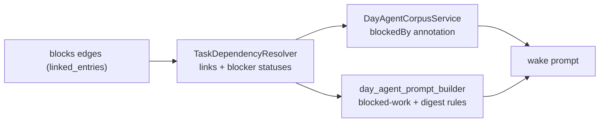

ADR 0042 gives tasks typed `blocks` links. This concept covers how the day-agent
planning surfaces consume that substrate, per ADR 0043.

# The resolver

`TaskDependencyResolver` answers "which of these task ids are blocked, and by
what" in **two bounded batch queries** — one type-scoped `blocks`-link fetch, one
batch status load for the distinct blocker ids. Never per-task fan-out, always one
call against the whole id set, mirroring the batch-read discipline used by the
week-context service.

It is **independent of, and not shared code with**, the task feature's own
`TaskBlockersController` (single-task, UI-facing, autoDispose-Riverpod-backed).
The resolver is stateless, plain Dart, and batch-shaped for a corpus of up to
`maxCorpusTasks` ids.

## Serialization differs from the human-facing chip, on purpose

| Case | Corpus (model-facing) | Task detail header (human-facing) |
|------|----------------------|-----------------------------------|
| Blocker resolves to a real, open task | Serializes with title and status | Tappable chip |
| Blocker link whose target cannot be loaded (a sync gap) | `{"taskId": "<id>"}` with no `title`/`status` — **still a non-empty `blockedBy` entry** | A bare untappable "Blocked" pill |

The corpus keeps the entry so "still blocked" is never silently downgraded to
"ready" just because the blocker has not synced yet. A bare id is a usable token
for a model; for a human it is not.

# One field drives everything

`dependencyResolver` is a **single nullable field** on `DayAgentWorkflow`, threaded
through the capture-context assembly into
`DayAgentCorpusService.buildTaskCorpusSnapshot`.

That one field drives both the corpus annotation and the prompt gates below, so
they **can never drift out of sync** — there is no separate "is this feature on"
flag.

`day_agent_prompt_builder.dart` gates two prompt-contract additions on the same
field, both rendering the empty string when it is null — so a wake with no
resolver produces a **byte-identical** prompt to pre-ADR-0043, preserving the
prefix cache:

- **Blocked-work rules**, appended after the Refine rules for any drafting or
  refine wake. A task is "blocked for planning" when its corpus row shows
  `"status": "BLOCKED"` (self-declared, ADR 0042 §4) **or** carries a non-empty
  `blockedBy` (computed). Place it only if the same plan schedules its blocker
  earlier the same day, or the block's `reason` explicitly names the blocker and
  why the work can proceed anyway. Prefer placing the blocker itself when a
  decided or committed task turns out to be blocked.
- **A digest-rule bullet**, appended to the digest rules on coordinator wakes
  only, and only when `directiveService` is also configured: a directive
  commitment on blocked-for-planning work should target the blocker instead, or
  name the blocker in an attention note so the per-day agent inherits the
  dependency context from the directive itself.

# Why the corpus annotates rather than filters

Capture matching (`match_to_corpus`) needs blocked tasks to stay matchable, so the
corpus never excludes anything. A row for a task with a live `blocks` link gains a
`blockedBy` array; a row with none gains **no extra key at all**.

See [wake context](wake-prompt.md) for where the corpus sits in the prompt, and
the tasks feature for the typed-link substrate itself.
