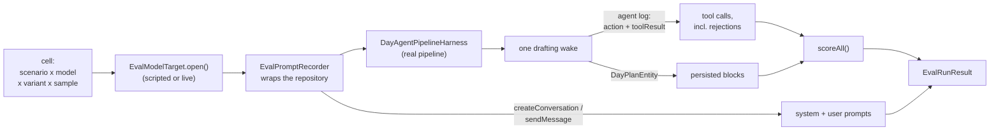

# Two lanes, and the distinction matters

- **`framework/` runs in ordinary CI.** The scorers, value types and
  fixture-coherence checks are deterministic and provider-free, so they are plain
  tests expected to stay green like any other.
- **`integration/day_agent_durable_jobs_smoke_test.dart` runs the complete
  deterministic protocol.** It submits real captures through the durable
  outbox, parses against large mixed-category corpora, drafts from the selected
  results, and sends overcommit status back through a real coordinator digest.
  Only the model responses are scripted.
- **The live runner is opt-in and never in CI.** It spends money against a real
  provider and is non-deterministic, so it **always passes and reports** rather
  than failing — a red build people learn to ignore is worse than no signal.

# Why the scorers split the way they do

The write path enforces hard constraints by throwing, which rejects the whole
`draft_day_plan` call and hands the message back to the model (see
[capture and planning](capture-and-planning.md)). **So the persisted plan is
always legal, and inspecting it alone measures the guards rather than the model.**

| Scored on | Constraints |
|-----------|-------------|
| Objective structure in the persisted plan | overlap, capacity as written, estimated-capacity failures and passes that do not need partial-prose credit, working hours, estimate fidelity, decided tasks placed, required work placed, expected omissions honoured, blocker ordering, fabricated task ids, fabricated calendar blocks, fabricated history, invented work, task-work typing, duplicate ids |
| Weak semantic evidence in plan prose and accepted status/diff calls | estimated-capacity passes that depend on audited partial prose, conflict surfaced, blocker-bypass justification, directive honoured — visible per constraint, but excluded from ranking |
| The rejection count | whether the model complied without being corrected |

A run that never attempted `draft_day_plan` is **inapplicable** for the rejection
constraint too, not a pass: an empty rejection list would otherwise read as
"accepted on the first attempt", so a model that was unreachable, answered in
prose, or called only `raise_day_status` and stopped would collect compliance
credit it did nothing to earn.

Likewise, a constraint that reads the plan is **inapplicable when no plan was
persisted** — an empty block list would otherwise read as "no overlaps, nothing
fabricated, every omission honoured" and hand a failed run a clean sweep.

## Three load-bearing semantics

- **"Not applicable" is a third result, not a pass.** A scenario with no blocked
  tasks says nothing about blocker handling; counting it as a pass would make the
  laziest model look like the best one.
- **Some decided tasks must *not* be placed.** A stale task the capture says is
  done is an `expectedOmission` — placing it fails. A blocked task is a
  `permittedOmission` — omitting or correctly sequencing it both pass.
- **Permitting an omission is not enough on its own.** A scenario that lets the
  planner drop work must also require it to *say so*, or a single buffer block
  that ignores twelve hours of requested work scores clean. Capacity is likewise
  checked against task **estimates**, not the block lengths the model wrote, since
  the cheapest way to make an impossible day fit is to claim each task is shorter
  than it is. The one exception is an auditable partial placement: the block
  duration may replace the full estimate only when its reason gives concrete
  minute arithmetic (`60m of 120m scheduled`,
  `60m of an estimated 120m scheduled`, `60m out of 120m scheduled`, or an
  affirmative `partial` plus a task-bound remainder such as
  `60m remain for later`, `Remaining 60m move to tomorrow`,
  `60m still remain`, `60 more minutes remain`,
  `60 additional minutes remain`, `60m will still remain`, or
  `Remaining 60m are carried over`) that agrees with both the summed duration
  of that task's work blocks and the corpus estimate. Numeric evidence must
  start at a complete numeric token, so a thousands or decimal suffix such as
  the `060` in `1,060 minutes remain`, or digits after a positive or negative
  sign such as the `60` in `-60 minutes remain`, cannot restart a match. A numeric
  completed/estimate split must describe task allocation,
  not omitted/deferred arithmetic or coincidentally equal workday capacity, so
  the surrounding clause must include an affirmative scheduled, allocated,
  completed, planned, placed, or fitting action that is nearer to the numbers
  than any omitted/deferred predicate in the same comma-delimited clause. A
  merely possible action such as `task-c might schedule 60 of 120 minutes` is
  not an affirmative allocation, and neither is
  `task-c might be partially scheduled`. Modal remainder arithmetic such as
  `task-c might have 60 minutes remaining` is likewise hypothetical and cannot
  qualify or contradict a placement. Probabilistic complements such as
  `task-c is likely to schedule 60 of 120 minutes` are non-asserted too.
  Conditional and subjunctive clauses are counterfactual rather than evidence:
  `If task-c were scheduled for 60 of 120 minutes` cannot earn partial credit,
  even when a comma separates its later denial.
  Commands are not assertions either: `Schedule for 60 of 120 minutes` does
  not say that the allocation occurred.
  Intended, planned, aimed, hoped,
  wanted, expected, proposed, considered, attempted, tried, failed, refused,
  or declined actions are likewise not affirmative. Neither are expectation
  forms such as
  `was supposed to schedule`, `was meant to schedule`, or
  `was going to schedule`, nor interrogative clauses such as
  `Was task-c omitted?`. A later comma-delimited rhetorical question does not
  make an earlier declarative allocation clause interrogative. Inability
  complements such as
  `was unable to schedule`, `was not able to schedule`, or
  `was incapable of scheduling` are not affirmative, nor are actions the prose
  says were avoided or prevented, including passive
  `was prevented from being scheduled` wording. Negation words inside the
  current task id or title are names, not clause operators, so
  `No-code prototype scheduled 60 of 120 minutes` remains affirmative, as does
  the partial label in `No-code prototype is partial`. Allocation predicates
  accept ordinary third-person present forms such as `schedules`, `allocates`,
  `completes`, `plans`, and `places`. A
  selected allocation action must govern the numeric split on either side; an
  earlier action with intervening object prose, such as scheduling a meeting
  before reviewing `60 of 120` recording minutes, cannot supply task-allocation
  context, nor can later meeting scheduling borrow an earlier `60 of 120`
  recording count. Object complements are excluded in the same way:
  `task-c reviews a meeting with 60 of 120 minutes scheduled` describes the
  meeting's arithmetic, not task-c's allocation. A grammatical
  auxiliary/adverb bridge such as
  `were successfully scheduled` or `60 of 120 minutes do fit` remains
  affirmative. A direct quantity preposition or exact quantity modifier, such as
  `scheduled for 60 of 120 minutes` or
  `scheduled exactly 60 of 120 minutes`, may bridge the action to its
  arithmetic without admitting arbitrary intervening object prose, while a
  failure qualifier such as `were unsuccessfully scheduled` or the trailing
  equivalent `were scheduled unsuccessfully` does not. Obligation alone
  is not evidence that placement happened: `must schedule`, `needs to
  schedule`, and `is required to schedule` cannot validate allocation
  arithmetic. Failure qualifiers are rejected on either side of the action, so
  neither `unsuccessfully scheduled 60 of 120 minutes` nor
  `failed scheduling 60 of 120 minutes` is allocation evidence. A standalone
  task-bound failure predicate retracts earlier arithmetic too:
  `scheduled 60 of 120 minutes, but the allocation failed` is not credit. A
  failure explicitly scoped to a non-task subject does not retract the task:
  `the allocation failed for the meeting` is meeting evidence even when the
  non-task head follows the failure predicate. A
  later action describing “the rest” cannot validate earlier omitted
  arithmetic.
  Unrelated meeting/workday scope is likewise associated with its nearest
  allocation action, so later meeting arithmetic does not poison an
  earlier valid task split. Explicit historical scope is rejected whether it
  leads or trails the evidence: `Yesterday, task-c scheduled 60 of 120 minutes`,
  `scheduled 60 of 120 minutes yesterday`, and the equivalent `last week`
  describe prior allocation rather than the current block. Explicit future
  scopes outside the plan day are excluded too: `will schedule 60 of 120
  minutes next week` cannot earn current-day credit. The same scope rule
  applies to full-allocation retractions, so a note claiming `fully scheduled
  yesterday` cannot veto current partial evidence. Historical denials and
  allocation failures are excluded too, so `was not scheduled yesterday`
  cannot retract today's valid split. Unbound splits are ignored
  before their values are checked, and allocation explicitly scoped to another
  subject or another
  corpus task, named by id or full title, cannot earn credit for the placed
  task. Explicit current-task scope wins over a later temporal meeting modifier,
  such as `during the meeting`, but not over an explicit allocation destination:
  `task-c: 60 of 120 minutes are scheduled for the meeting` remains
  meeting-scoped evidence.
  Allocation-action words that occur inside the current task's id or full title
  are references, not predicates: `task-fit 60 of 120 minutes` contains no
  assertion that the work was placed. A possessive task reference also retains
  its following head noun, so `task-c's meeting has 60 of 120 minutes
  scheduled` remains meeting evidence rather than task-c allocation, and
  `omitted task-c's meeting` omits the meeting rather than task-c.
  The block's task is the default arithmetic subject; a corpus reference
  overrides it when it is comma-led, adjacent, linked by an allocation action
  (including postpositive `allocated to Task D`), possessive, attached by `for`
  or `of`, or connected through ordinary copula/future grammar such as
  `task-d will be deferred`. Distinct task ids retain distinct identities even
  when their titles collide; an explicit id can therefore attribute arithmetic
  to the other task, while an ambiguous shared title is handled conservatively.
  Explicit full-title references retain that precedence even for short titles
  such as `PR`. A grammatical one-letter title such as `A` is not treated as a
  bare reference because that would attribute every article to the task;
  explicit `task A` wording remains available.
  This allows one clause to audit the current split and name a deferred casualty
  before or after it. The same attribution applies to remainder evidence. The
  partial mention and task-bound remainder must occur in the same block reason,
  as required by the model-facing prompt. Notes cannot earn partial credit, but
  their concrete arithmetic and denials remain audit evidence that can veto a
  reason. An explicitly task-named note is routed to that task across every
  scheduled block, including notes on another task or a buffer; an unbound note
  remains attached to its enclosing work block. Task-named reasons are audited
  across blocks in the same way, but only the enclosing work block's reason may
  positively qualify its own partial placement. A task-bound standalone
  allocation denial such as
  `task-c was not scheduled after all` therefore retracts reason-field partial
  arithmetic even when the note contains no split or remainder of its own; the
  same applies to `not completed` because completion can supply allocation
  context. Speculative denials such as `this task might not be scheduled after
  all` do not retract an affirmative placement. Failure retractions work in
  either order: both `the allocation failed` and a later `failed to allocate
  the task` invalidate earlier split arithmetic. An affirmative task-bound
  claim such as `task-c was fully scheduled after all` or the postpositive
  equivalent `task-c was scheduled in full after all` still contradicts and
  vetoes partial accounting. An outer falsehood such as
  `It is false that task-c was fully scheduled` denies that completion and
  therefore cannot veto valid partial evidence. A full-allocation adjective
  phrase with an explicit non-task noun head, such as `Fully planned day` or
  `Fully planned our day`, does not describe the attached task and cannot veto
  its partial evidence; ordinary possessive determiners are accepted before
  those full-plan heads. A denial or full-completion claim explicitly naming
  another corpus task does not retract the enclosing task's arithmetic, while
  qualified non-completion such as `not fully scheduled` describes a partial
  placement rather than no allocation. A prepositional non-task phrase such as
  `Fully planned for the day` is likewise about the day. Subjectless attached
  denials such as `Not completed after all` default to the block's task after
  non-task and other-task subjects have been excluded.
  The
  partial mention cannot be borrowed from a claim attributed to
  another corpus task or an explicit non-task subject. Unrelated meeting/workday
  remainder scope is rejected before a later disposition can bind it, and
  unrelated workday-capacity prose cannot supply the remainder.
  Task qualifiers may sit inside the arithmetic, as in
  `60 minutes of this task remain`; leading forms may also qualify the noun, as
  in `the remaining work is 60 minutes`. Remainder arithmetic explicitly scoped
  to another subject such as a meeting or workday is ignored. The same applies
  to an object-owned quantity such as `reviews a recording with 60 minutes
  remaining`, or subject-owned arithmetic such as `the battery shows 60 minutes
  remaining`; a nearby placement claim does not transfer either remainder to
  the task. Every concrete task-bound split and remainder across the block
  reason and note must agree; one matching fragment cannot override a
  contradictory remainder elsewhere in the task's disclosure. Consequently,
  `30 of 120 minutes remain` cannot be credited as 30 completed minutes.
  Negation binds to nearby evidence and to the allocation action leading into
  it. Thus both
  `cannot be scheduled` and
  `do not have enough room to schedule 60 of 120` invalidate a split, without
  letting a later explanation that the full task `cannot fit` invalidate
  affirmative arithmetic. Likewise, `60 of 120 are scheduled and no more`
  remains affirmative because the later `no` follows the allocation action
  instead of negating it; `not only` is likewise affirmative emphasis rather
  than negation, and leading `no more than` is an exact quantitative cap.
  Likewise, `60 minutes remain and no more fits today` leaves the concrete
  remainder affirmative because the later limit explains the capacity trade
  instead of denying that unfinished work exists. A negative fit quantifier
  that explains the partial, such as
  `not all work fits so 60 of 120 are scheduled`, also leaves the concrete
  allocation affirmative. `Partial`, `partially`, and `partly` are accepted
  disclosure forms. Bare `partial` must be a standalone label or explanation,
  follow a copula, or modify a placement noun such as task, work, placement, or
  block; a task-owned noun phrase such as `task-c's partial index` is not
  placement evidence. Inflected forms must modify a placement action, so
  `partially scheduled` qualifies while `partially dependent on the API` does
  not. Progressive copulas remain subject-bearing: `the meeting is being
  partially scheduled` is still a meeting claim, not task evidence. A partial
  keyword is negated only by a preceding negator,
  so `partial because not all work fits` remains affirmative. Split syntax
  cannot provide its own allocation context: an affirmative allocation action
  must appear outside the matched numbers. A task reference can attribute that
  action, but cannot replace it. Explicit other-subject scope also outranks a
  nearby `partial` keyword, so `remain for`, `before`, or `until` a meeting
  cannot earn task remainder credit while `partial for today` remains valid.
  Future allocation scope cannot earn current-day partial credit. `Tomorrow`
  is future scope when the evaluator has a same-day `now`, but remains the
  current plan day for a future-day fixture whose `now` is absent.
  Bare numeric remainders in another field of the same task block are still
  audited, because a contradictory note must not be hidden from matching
  arithmetic in the reason. Numeric continuity such as `60 minutes remain
  scheduled` is not a remainder claim.
  Outer falsehoods such as `It is false that task-c scheduled 60 of 120
  minutes` negate numeric split or remainder evidence and therefore veto
  otherwise matching partial credit. Negated or vague “partial” prose, silence,
  contradictory numbers, buffer or calendar blocks carrying a task id,
  allocations below 10% of the estimate, and overlapping blocks for one task
  are charged at the full estimate or receive no placement score. Estimated
  charges are compared with the clock-bounded `plannableMinutes`, not nominal
  full-day capacity. Scheduled non-task blocks retain their written duration in
  that charge while estimated task allocations are replaced by their estimate
  or audited-partial value, so buffers and calendar blocks cannot disappear
  from effective capacity. An allocation longer than its estimate retains its
  actual duration and cannot cancel another task's estimate shortfall. A
  late-start scenario therefore cannot silently
  compress work into the remaining window. Every structurally shortened decided task counts
  as deferred work for `surfacedConflict`, whether or not its disclosure earns
  audited partial credit, so a plan that represents every task only partially
  must still name the trade or escalate it. Merely repeating a shortened task's
  title is not a trade: the prose must also disclose partial, deferred, omitted,
  remaining, shortened, or conflicting work in the same individual block
  reason or note field that names the task by token-bounded id or full title.
  The same disclosure requirement applies to fully omitted tasks; mentioning an
  omitted task only as context for retained work does not surface the omission.
  A `partial` claim cannot disclose a fully omitted task because there is no
  positive structural placement to shorten; it must instead name an actual
  omission, deferral, or other applicable trade.
  Numeric remainder claims for a fully omitted estimated task must equal its
  full estimate and be affirmative; `task-c may leave a remainder: 120
  minutes` is hypothetical rather than an actual disclosed trade. Omission does
  not make arbitrary positive arithmetic valid.
  Hyphenated task ids also remain whole tokens: a title such as `Report` is not
  named merely because another task id contains `weekly-report`.
  The scorer does not combine a task name in one field with unbound trade prose
  in the other. A name occurring only inside another task id or word,
  task-binding grammar such as `for this task`, and trade wording in unrelated
  plan prose cannot satisfy that disclosure.
  Trade language in the same reason is attributed to its nearest corpus task,
  so one task's deferred disposition cannot disclose another task's shortening.
  A coordinated subject made entirely of corpus task references is attributed
  to every named task, so `task-c and task-d were omitted` surfaces both
  casualties without admitting a mixed subject such as a meeting and a task.
  Label punctuation binds too, so `Partial: task-d` remains owned by `task-d`
  rather than the task attached to the enclosing block.
  Trade-shaped words inside the task's own id or full-title span are only
  naming evidence, not a separate disclosure in either capacity or conflict
  scoring.
  An explicit non-task subject is rejected too: `the meeting is deferred`
  cannot disclose the shortening merely because the same reason names a task,
  and neither can `the meeting is scheduled for later`; `the remainder is
  deferred` remains task-trade evidence. An exact current-task id or title
  takes precedence over that generic head vocabulary, so a task actually titled
  `Meeting` can be disclosed as `Meeting was omitted`. A task reference inside a modifier
  does not replace the head subject, so `the meeting for task-c is partial`
  remains a meeting claim; copula modifiers do not change that head, so `the
  meeting was only partial` is rejected too. The same head-subject rule applies
  to denials: `the meeting for task-c was not scheduled` retracts the meeting,
  not task-c's partial allocation, including future forms such as `task-c notes
  that the meeting will not be scheduled`.
  Ordinary possessive verbs retain their head subject as well, so
  `the meeting has 60 minutes remaining` cannot supply the task's remainder;
  remainder-producing verbs such as `the meeting leaves 60 minutes remaining`
  retain the meeting subject too.
  Bare continuity such as `remains scheduled` is not a trade: numeric remainder
  arithmetic matching the structural remainder, or an actual
  omit/defer/shorten/conflict disposition, is required. Likewise, `left
  unchanged` and moving a block to another clock slot are continuity or
  rescheduling, while `left unfinished`, `left some work unfinished`, and moving
  work to tomorrow are actual remainder dispositions on a same-day plan. On a
  future-day run, `tomorrow` names the day currently being planned, so
  `scheduled for tomorrow` or `moved to tomorrow` alone cannot surface a
  deferral. Unfinished work remains
  distinct from full omission, so `not left out; left unfinished` still
  discloses the unfinished remainder. A quantitative complement
  such as `shortened by 60 minutes` also remains a task-bound disposition. A
  disposition word must govern the task or unfinished work: domain language
  such as `task-c documents deferred revenue` or
  `task-c documents unscheduled maintenance`, and purpose phrases such as
  `formats notes for later reference` or terminal `formats notes for later`, do
  not disclose that task-c itself was deferred or left unscheduled. Active
  dispositions may govern a token-bounded task id or full title directly, so
  `We omitted task-c due to capacity` and `We omitted Core due to capacity`
  name the casualty when those references identify the current task.
  Conjunction-delimited objects retain each governed task, so
  `We omitted task-a and task-c` names task-c too. A
  `for later` disposition must be governed by a scheduling, movement, copula,
  or remainder predicate. The same object binding rejects domain phrases
  such as `reviews trade policy`, `evaluates a trade`, and `carries over
  balances`. Negative-fit evidence is subject-bound too: `task-c doesn't fit`
  remains affirmative, but
  `task-c validates that the payload cannot fit in memory` describes the
  payload, not the task. Ordinary causal suffixes remain valid, so
  `task-c was omitted due to capacity` discloses the omission, as does
  `task-c was omitted from today's plan`; bounded affirmative modifiers remain
  valid too, as in `task-c was omitted entirely due to capacity`. A contrast
  boundary also preserves the preceding disposition, as in `task-c was omitted
  but the remaining plan stayed intact`. A causal clause about another corpus
  task also retains its own negation: `task-c was deferred because Deployment
  was not scheduled` does not retract task-c's affirmative deferral.
  Imperative wording such as `Omit task-c due to capacity` requests a trade but
  does not assert that one happened.
  It must also be affirmative and internally consistent: `not partial` and
  `no conflict` explicitly deny the trade, while `without conflict` and
  `conflict-free` are denials rather than disclosures. Outer falsehoods deny
  positive dispositions too: `It is false that task-c conflicts` cannot surface
  a trade. Modal dispositions such as `might be omitted`, `could be deferred`,
  or
  `may ultimately need to be deferred` are speculative, not actual trades;
  modal complement length and a coordinated predicate such as `may need to be
  shortened and ultimately deferred` do not make the disposition affirmative.
  Modal scope ends only when the conjunction begins an independently asserted
  clause. Attempt and failure complements are likewise not actual
  dispositions: neither `attempted to be omitted`, `failed to be omitted`, the
  denial complement `denied being omitted`,
  near miss `was almost omitted`, expectations such as `was supposed to be
  omitted`, `was meant to be omitted`, or `was going to be omitted`,
  consideration such as `considered deferring`, nor the direct requirement
  `requires deferring` surfaces a trade. The same rules
  reject allocation prose such as `almost scheduled 60 of 120 minutes`,
  `was supposed to schedule 60 of 120 minutes`,
  `was meant to schedule 60 of 120 minutes`, and
  `was going to schedule 60 of 120 minutes`. Avoidance and prevention
  complements are denials too:
  neither `task-c avoided being omitted` nor
  `task-c avoided getting omitted` asserts an omission.
  Long negated complements retain their negation as well:
  `never actually got around to omitting` does not assert an omission merely
  because more than three words separate the negator from the disposition.
  An affirmative claim plus denial of that same
  disposition receives no credit in either order or across two task-named
  fields. A task-bound full-completion claim retracts every trade
  disposition, including across reason and note fields; `was omitted, but it
  was fully scheduled after all` is contradictory rather than a surfaced
  casualty. Denials do not cancel a different asserted disposition:
  `task-c was not dropped; it was deferred to tomorrow` still surfaces the
  actual deferral. A contrastive replacement predicate is the same boundary:
  `task-c was not dropped but deferred to a later day` denies only the drop.
  Correlative negation covers both dispositions, so
  `task-c was neither omitted nor deferred` asserts neither trade.
  Necessity idioms are affirmative rather than negated: `We had no choice but
  to omit task-c` explicitly names the unavoidable casualty despite the word
  `no`. Historical scope is never current trade evidence, so
  `Yesterday, task-c was omitted` cannot surface today's conflict.
  `Cannot fit`, `will not fit`, `conflicts`, and `conflicting` are affirmative
  disclosures, including label-bound forms such as `task-c: Cannot fit today`.
  Causal explanations introduced by `because`, `since`, `as`, `due to`, or
  `owing to` remain attached to the preceding trade and do not retract it:
  `task-c cannot be scheduled because no time remains` still names the omitted
  task even though its explanation contains `no`.
  `Postponed` is normalized as a deferral alongside moved, deferred, and
  carried-over work. Coordinated task subjects may use comma-separated and
  Oxford-comma lists; every corpus task in
  `task-a, task-b, and task-c were omitted` is a named casualty.
  A bare conflict object is not: `task-c resolves conflict` and `task-c
  resolves conflicts` describe subject matter rather than a scheduling
  casualty, while the task-bound predicate `task-c has a scheduling conflict`
  does disclose one. An explicit omission
  such as
  `task-c was not scheduled due to capacity` is affirmative too. Inability
  forms such as `cannot be scheduled`, `can't be
  scheduled`, `could not be scheduled`, `will not be scheduled`, or
  `was unable to be scheduled` disclose the same omission,
  unless an outer falsehood construction such as `not true that task-c cannot
  fit` or `not true that task-c was not scheduled` denies the whole claim. All
  equivalent negative-scheduling forms, including `unable` wording without a
  lexical negation token, share one disposition identity, so an affirmative
  spelling in one field is retracted by an equivalent denial in another.
  Omission synonyms (`omitted`, `dropped`, `unscheduled`, and `left out`) share
  an identity as well; deferral and unfinished-work dispositions remain
  distinct.
  The detail records every credited
  partial and every shortening denied credit, so the judge bundle preserves the
  accounting evidence rather than only the final pass/fail.
- **Weak semantic outcomes are not ranking evidence.** `surfacedConflict`
  passes either when an accepted `attentionNeeded`
  escalation uses an allowed typed conflict reason or when block prose names
  omitted work. `directiveHonoured` accepts commitments named in plan or trade
  prose, the typed `directiveUnsatisfiable` escalation, or another allowed
  escalation whose status note is merely non-empty. Both are wholly heuristic.
  `blockerBeforeBlocked` is mixed: a pass from actual blocker ordering and an
  unexcused ordering failure remain objective, while a pass that relies on a
  reason naming a blocker is heuristic. The semantic paths catch the important
  failure mode of saying nothing, but their string and structural presence tests
  can pass without demonstrating comprehension. They remain visible per
  constraint as weak priors, carry a caveat into the JSON and judge bundle, and
  only those heuristic outcomes are excluded from the objective model
  leaderboard. A reviewer must inspect the plan, changes, reasons, and status
  notes before calling a heuristic green result good reasoning.
  `withinCapacityByEstimate` is mixed for the same reason: full-estimate
  accounting and failures remain objective. A pass is marked heuristic and
  excluded from the objective headline rate only when parsing free-form partial
  prose changes full-estimate accounting from a failure to a pass; an audited
  partial whose full estimate already fits remains objective.
  Markdown reports name both mixed constraints and the judge bundle serializes
  every scored block reason and note, so reviewers can inspect the evidence
  behind an excluded heuristic pass.
- **Fabrication is judged against what the model was shown.** The task corpus
  renders only inside the capture context, so a wake without a capture sees only
  its decided tasks — which do carry `status` and `blockedBy`, but not
  `estimateMinutes`, `due` or `priority`. `EvalFixtureInputs.corpus` stays ground
  truth — the scorer must still know what is blocked — while `visibleTaskIds`
  bounds what the model could legitimately name.

`noFabricatedCalendarBlocks` is the only constraint scoring a block's claimed
**provenance**. `PlannedBlockType.cal` means "imported calendar event" and the
plan editor refuses in-app edits to one, while the day agent is shown no calendar
events — `calendarBlocks` is a deferred parameter `RealDayAgent` drops, and no
context section renders events.

**The write path now refuses a model-emitted `cal` block outright**, on both the
draft and the diff route, and `cal` is no longer offered in either tool schema —
so this constraint can no longer fail through the agent. **It stays because the
eval is also how a regression would be caught**: if calendar events are ever wired
into the drafting context and the exemption returns, this is the scorer that has
to be taught what a *legitimate* calendar block looks like.

# The matrix runner



It drives scenario × model × variant × sample through the **real** pipeline —
outbox, runtime, executor, orchestrator, workflow and plan writer are all
production code, and **only the inference layer is injected**. That is what lets
the same runner drive a scripted model in CI and a live provider behind an opt-in
flag. Each cell gets its own harness, so no run can read another's plan, jobs or
tool log, and a failing cell is recorded while the matrix continues.

## Four details carry the design

- **Rejections are recovered from the agent log.** `DayAgentStrategy` writes an
  `action` message before each tool call and a `toolResult` after it, carrying the
  rejection text in `metadata.errorMessage`. Nothing else keeps that text, and
  without it a plan that only became legal on the third attempt is
  indistinguishable from a first-time-right one.
- **Prompts are captured by wrapping the conversation repository.** The system
  prompt is handed straight to `createConversation` and never persisted, so it
  cannot be read back. The wrapper records one transcript **per conversation**,
  which is what makes the forced-retry signal trustworthy:
  `_forceDraftDayPlanIfMissing` sends a second message into the *same*
  conversation, whereas a durable job retry opens a fresh one. Counting messages
  across the whole cell would report a transient provider failure as the model
  ignoring the prompt; `jobAttempts` is where infrastructure retries belong.
- **The dependency resolver is always wired**, matching production. It gates the
  blocked-work annotation on all three carriers — corpus rows, `decidedTasks` and
  baseline blocks — *and* whether the rule reaches the prompt at all, so a null
  resolver would quietly measure a prompt the app never sends. The fixture
  resolver mirrors production's category scoping and carries each blocker's own
  `categoryId`, since omitting it would hand the model a materially different
  prompt than the app does and force it to guess a value the app supplies.
- **The capture is seeded directly, without its parse job.** Production's
  `submitCapture` also enqueues `parseCapture`, which the runtime drains as a
  *second* wake with its own prompt and tool calls. The unit of measurement here
  is one drafting wake, so the runner writes the capture entity itself — which is
  what makes `captureContext` non-null and therefore what renders the transcript
  and task corpus into the prompt. Parse quality would need its own scenario type.

## Scenarios and variants

Each scenario encodes a tension the planner must resolve: a crowded day; a
mid-afternoon start with a task too long to fit; four decided tasks that cannot
all happen; a two-hop blocker chain; and that same chain with the capture removed
so only the one hop ADR 0043 resolves reaches the model.

That last pair is the instrument justifying itself. With the corpus hidden, every
sample of every model failed `blockerBeforeBlocked` while the twin passed every
one — which is how the missing `blockedBy` on `decidedTasks` was found and fixed
(see [dependency-aware planning](dependency-aware-planning.md)). Post-fix the
models decline the blocked leaf instead of placing it blindly, and the pair now
measures the residual one-hop horizon: the leaf names its immediate blocker, and
nothing reveals the task behind *that*. `blockedWithoutCorpus` therefore still
fails `requiredWorkPlaced`, and that failure is the finding rather than a defect —
its ground truth stays identical to the twin's on purpose, so the gap remains
attributable to the hidden corpus. Weakening it to match what the model can see
would delete the signal.

Variants are a **matrix dimension rather than a separate run**, so one pass yields
the A/B. A variant transforms the `DayAgentConfig` a scenario asks for, which is
what renders into the system prompt's planning defaults — and the same effective
config is what the scorers grade against, so **a variant can never be graded
against a contract the model was not given**. The shipped set is the control only:
a variant that tightens capacity also changes what the scenarios ask for, and
would make `requiredWorkPlaced` and `withinCapacity` mutually unsatisfiable on a
crowded day.

# Reading a run

Reports aggregate into JSON and Markdown under the git-ignored
`tmp/day-planning-eval/`, with the run's timestamp in the basename so runs
genuinely accumulate and can be diffed — a fixed name would have each invocation
overwrite the last.

The report leads with a **model leaderboard**, then per-constraint rates, cost,
prompt stability and failure excerpts. Two properties carry it:

- **Rates are over *applicable* results only.** A constraint that did not apply is
  neither a pass nor a fail, and folding it in either direction produces a
  plausible-looking number that is wrong: counting it as a pass makes the laziest
  model look best, counting it as a fail punishes a scenario for not exercising a
  dimension. **A constraint nothing exercised reports `—`, never 100%.**
- **Prompt stability is measured per wake, per model, across scenarios** — not per
  cell. Within one scenario the prompt barely varies, so a per-cell figure just
  restates the prompt size, which is exactly what the first generated report
  showed before it was fixed. Across wakes it answers the question that matters:
  how much of the prompt a provider could cache. On the current prompt that is the
  whole 7.7 KB system message, with all variation in the user message.

## The judge bundle

Plan **quality** is judged by a person, not by an in-harness LLM judge — that
would bake scoring noise and cost into every run while saying little you can act
on.

So the report emits a **judge bundle**: one self-sufficient JSON object per
(scenario, model, variant, sample) carrying the scenario and its intent, the exact
prompts, every tool call including rejections and their text, the persisted plan
including each block reason and note, and that run's constraint results and cost.
Each constraint result is labelled
`objective` or `heuristic`; heuristic entries repeat their caveat beside the
evidence so a detached bundle cannot make a string match look like a semantic
judgement.

The bundle is bounded to the newest samples per cell and **states what it
dropped**, because a truncated bundle that does not say so reads as complete. It
carries **every wake of a cell, not just the last**: a durable retry opens a fresh
conversation, and showing one prompt beside tool calls and cost covering the whole
cell leaves a judge unable to reconcile them.

Corpus rows carry **three separate visibility flags**, because conflating any two
misleads in exactly the direction the flags exist to prevent:

| Flag | True when | Sole carrier of |
|------|-----------|-----------------|
| `corpusRowShown` | the corpus rendered, i.e. the wake had a capture | `estimateMinutes`, `due`, `priority` |
| `statusShown` | the corpus rendered, **or** the task is decided, **or** it appears as a visible task's blocker | — |
| `blockersShown` | the corpus rendered **or** the task is decided | — |
| `taskIdReferenceable` | the model could name the id at all | — |

ADR 0043's rule is a **union** — blocked means `status: BLOCKED` *or* a non-empty
`blockedBy` — and the two halves do not travel together, so they are reported
apart. A task reached only as somebody else's blocker shows its status (
`ResolvedBlocker` carries it) but never its own `blockedBy`, because resolution
is one hop. That is exactly the `blockedWithoutCorpus` shape: the middle task's
status is visible while its dependency on the root is not.

`blockersShownFor` explains a `blockerBeforeBlocked` failure; it does not
excuse one. Hiding a task's blockers removes both *exceptions* the rule grants —
schedule the blocker earlier, or name it in the reason — but not compliance
itself: omitting the task is always available, and the prompt now says so
outright. So every placed blocked task is still judged, and the failure detail
distinguishes "ignored a blocker it was shown" from "could not comply and should
have left it out". A judge draws opposite conclusions from those two.

Measured, and why the distinction is worth carrying: on `blockedWithoutCorpus`,
glm-5.2 placed `task-b-middle` (the decided leaf's blocker), noted in the reason
that it was itself `BLOCKED`, gated it behind an investigation block and
sequenced the leaf after it. That is thoughtful, and still a plan that schedules
work the model had been told cannot start — so it fails, with a detail saying
the blocker was never rendered rather than implying the model ignored one.

Collapsing any two of these misleads in the direction the flags exist to prevent.
Reading blockedness off `corpusRowShown` would report a model as having ignored a
blocker it was shown; reading dependency visibility off `statusShown` would report
the root as something the model ignored rather than never saw; reporting
referenceability as if it were the row would print `estimateMinutes` next to "the
model saw this".

# Running it live

```sh
set -a; source .env; set +a   # MELIOUS_API_KEY / MELIOUS_BASE_URL
LOTTI_DAY_PLANNING_EVAL_LIVE=1 \
DAY_PLANNING_EVAL_MODELS=glm-5.2 \
DAY_PLANNING_EVAL_SAMPLES=3 \
  fvm flutter test test/features/daily_os_next/eval/day_planning_eval_live_test.dart
```

`DAY_PLANNING_EVAL_SCENARIOS` narrows the run; `DAY_PLANNING_EVAL_DIR`,
`DAY_PLANNING_EVAL_JSON` and `DAY_PLANNING_EVAL_MARKDOWN` choose where the report
lands.

The quality matrix above isolates one drafting wake. The full-journey runner
measures the interaction the user actually waits for, plus the coordinator's
follow-up as a separate stage:

```sh
LOTTI_DAY_PLANNING_FULL_JOURNEY_LIVE=1 \
DAY_PLANNING_EVAL_MODELS=glm-5.2,qwen3.5-397b-a17b \
DAY_PLANNING_EVAL_DATE=2030-01-15 \
  fvm flutter test \
  test/features/daily_os_next/eval/day_planning_full_journey_live_test.dart
```

`DAY_PLANNING_EVAL_DATE` is optional and defaults to `2030-01-15`. The runner
anchors every scenario and seeded task to that calendar date and freezes each
cell's planning clock at the fixture's `startHour`. Latency uses stopwatches
without advancing the model-facing clock, and wall-clock timestamps are reserved
for report metadata. This keeps prompt context and results comparable across
models, runs and midnight boundaries.

It uses two shared realistic fixtures rather than an empty smoke corpus:

- a 12-task, 12-category rest-of-day capture with six mentioned items, mixed
  open/in-progress state, an overdue invoice, fixed times, sequencing and a
  required break;
- an eight-task overloaded afternoon whose five selected items total 255
  minutes against 180 available, requiring the day agent to name omissions and
  escalate them to the planner.

The system prompt's worked examples deliberately use different tasks and
constraint shapes from both fixtures, so the live matrix measures held-out
instruction handling rather than recall of a demonstrated answer.

The JSON report splits parse, draft and coordinator latency; records every wake,
provider interaction, durable retry, tool rejection, parsed match, planned task
and status event; and reports the **user-visible latency** as parse plus draft.

One-sample Melious measurements after narrowing each user-facing wake to its
artifact-producing tools (2026-07-27; provider latency is non-deterministic):

| Model / scenario | Parse | Draft | User-visible | Coordinator | Result |
|---|---:|---:|---:|---:|---|
| GLM 5.2 / dense | 3.2s | 7.7s | 10.9s | 6.0s | 6/6 matched and placed |
| GLM 5.2 / overloaded | 2.3s | 14.4s | 16.7s | 10.4s | 5/5 matched; two omissions named and escalated |
| Qwen 3.5 397B / dense | 13.9s | 51.2s | 65.1s | 8.6s | 6/6 matched and placed |
| Qwen 3.5 397B / overloaded | 7.2s | 153.0s | 160.2s | 15.9s | first draft timed out at 120s; durable retry succeeded |

This separates two defects that otherwise look like one spinner. Extra
application-induced tool turns were real and are preventable. Qwen still took
more than a minute with a minimal tool surface and no forced follow-up, so that
remainder is provider/model-route latency, not local outbox scheduling.

**It always passes when it runs.** Violations are reported, never asserted. The
report and its judge bundle are the deliverable. **Only setup errors fail hard:
missing credentials, an unknown scenario id, or an invalid evaluation date**,
because none is something the model did. A blank model selection uses the
default GLM 5.2 matrix rather than emitting an empty successful report.

There are two live eval paths on purpose: the quality matrix isolates drafting
behavior for comparable scoring, while the full journey measures latency and
instruction survival across capture, selection, drafting and coordination.

# The storage benchmark

`test/features/daily_os_next/benchmark/` seeds a synthetic corpus at 1, 6 and 12
simulated months and reports the cost of the operations a user action actually
triggers. It is opt-in:

```sh
fvm flutter test --dart-define=LOTTI_BENCHMARK=1 \
  test/features/daily_os_next/benchmark/
```

The corpus deliberately has the shape a real install has — **a small pending head
over a large terminal ledger** — because leaving every job pending would measure a
backlog nobody has and hide the property under test. A smoke test runs
unconditionally so the harness cannot rot unnoticed.

Baseline on a dev machine (median of 9, microseconds; absolute values are
machine-specific, **the slope is the point**):

| metric | 1 month | 6 months | 12 months |
|---|---|---|---|
| `outbox.claimNext` | 157 | 94 | 127 |
| `dayView.captures` | 224 | 144 | 136 |
| `dayView.statusEvents` | 313 | 344 | 159 |
| `dayView.plannerOwnsDay` | 122 | 113 | 86 |
| `planEditor.pendingDiffs` | 80 | 56 | 53 |
| `planWriter.lookback` | 666 | 445 | 262 |

Corpus sizes: 360 / 2,184 / 4,380 agent entities and 90 / 546 / 1,095 processing
jobs. **Every metric is flat or lower at twelve months than at one**, across a 12×
increase in stored history — the property the partial indexes and day-scoped
subtypes were built for. (Values drifting *down* with size is measurement noise
and cache warming, not a real speedup.)

**What this does not measure:** wake prompt bytes, token counts, and digest wake
duration. Those need the full agent workflow rather than the storage layer, and
are tracked separately.
