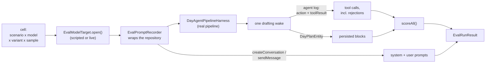

# Two lanes, and the distinction matters

- **`framework/` runs in ordinary CI.** The scorers, value types and
  fixture-coherence checks are deterministic and provider-free, so they are plain
  tests expected to stay green like any other.
- **The live runner is opt-in and never in CI.** It spends money against a real
  provider and is non-deterministic, so it **always passes and reports** rather
  than failing — a red build people learn to ignore is worse than no signal.

# Why the scorers split the way they do

The write path enforces hard constraints by throwing, which rejects the whole
`draft_day_plan` call and hands the message back to the model (see
[capture and planning](capture-and-planning.md)). **So the persisted plan is
always legal, and inspecting it alone measures the guards rather than the model.**

| Scored on | Constraints |
|-----------|-------------|
| The persisted plan | overlap, capacity (as written *and* as estimated), working hours, estimate fidelity, decided tasks placed, required work placed, expected omissions honoured, conflict surfaced, blocker-before-blocked, fabricated task ids, fabricated calendar blocks, fabricated history, duplicate ids |
| The rejection count | whether the model complied without being corrected |

A run that never attempted `draft_day_plan` is **inapplicable** for the rejection
constraint too, not a pass: an empty rejection list would otherwise read as
"accepted on the first attempt", so a model that was unreachable, answered in
prose, or called only `raise_day_status` and stopped would collect compliance
credit it did nothing to earn.

Likewise, a constraint that reads the plan is **inapplicable when no plan was
persisted** — an empty block list would otherwise read as "no overlaps, nothing
fabricated, every omission honoured" and hand a failed run a clean sweep.

## Three load-bearing semantics

- **"Not applicable" is a third result, not a pass.** A scenario with no blocked
  tasks says nothing about blocker handling; counting it as a pass would make the
  laziest model look like the best one.
- **Some decided tasks must *not* be placed.** A stale task the capture says is
  done is an `expectedOmission` — placing it fails. A blocked task is a
  `permittedOmission` — omitting or correctly sequencing it both pass.
- **Permitting an omission is not enough on its own.** A scenario that lets the
  planner drop work must also require it to *say so*, or a single buffer block
  that ignores twelve hours of requested work scores clean. Capacity is likewise
  checked against task **estimates**, not the block lengths the model wrote, since
  the cheapest way to make an impossible day fit is to claim each task is shorter
  than it is.
- **Fabrication is judged against what the model was shown.** The task corpus
  renders only inside the capture context, so a wake without a capture sees only
  its decided tasks — which do carry `status` and `blockedBy`, but not
  `estimateMinutes`, `due` or `priority`. `EvalFixtureInputs.corpus` stays ground
  truth — the scorer must still know what is blocked — while `visibleTaskIds`
  bounds what the model could legitimately name.

`noFabricatedCalendarBlocks` is the only constraint scoring a block's claimed
**provenance**. `PlannedBlockType.cal` means "imported calendar event" and the
plan editor refuses in-app edits to one, while the day agent is shown no calendar
events — `calendarBlocks` is a deferred parameter `RealDayAgent` drops, and no
context section renders events.

**The write path now refuses a model-emitted `cal` block outright**, on both the
draft and the diff route, and `cal` is no longer offered in either tool schema —
so this constraint can no longer fail through the agent. **It stays because the
eval is also how a regression would be caught**: if calendar events are ever wired
into the drafting context and the exemption returns, this is the scorer that has
to be taught what a *legitimate* calendar block looks like.

# The matrix runner



It drives scenario × model × variant × sample through the **real** pipeline —
outbox, runtime, executor, orchestrator, workflow and plan writer are all
production code, and **only the inference layer is injected**. That is what lets
the same runner drive a scripted model in CI and a live provider behind an opt-in
flag. Each cell gets its own harness, so no run can read another's plan, jobs or
tool log, and a failing cell is recorded while the matrix continues.

## Four details carry the design

- **Rejections are recovered from the agent log.** `DayAgentStrategy` writes an
  `action` message before each tool call and a `toolResult` after it, carrying the
  rejection text in `metadata.errorMessage`. Nothing else keeps that text, and
  without it a plan that only became legal on the third attempt is
  indistinguishable from a first-time-right one.
- **Prompts are captured by wrapping the conversation repository.** The system
  prompt is handed straight to `createConversation` and never persisted, so it
  cannot be read back. The wrapper records one transcript **per conversation**,
  which is what makes the forced-retry signal trustworthy:
  `_forceDraftDayPlanIfMissing` sends a second message into the *same*
  conversation, whereas a durable job retry opens a fresh one. Counting messages
  across the whole cell would report a transient provider failure as the model
  ignoring the prompt; `jobAttempts` is where infrastructure retries belong.
- **The dependency resolver is always wired**, matching production. It gates the
  blocked-work annotation on all three carriers — corpus rows, `decidedTasks` and
  baseline blocks — *and* whether the rule reaches the prompt at all, so a null
  resolver would quietly measure a prompt the app never sends. The fixture
  resolver mirrors production's category scoping and carries each blocker's own
  `categoryId`, since omitting it would hand the model a materially different
  prompt than the app does and force it to guess a value the app supplies.
- **The capture is seeded directly, without its parse job.** Production's
  `submitCapture` also enqueues `parseCapture`, which the runtime drains as a
  *second* wake with its own prompt and tool calls. The unit of measurement here
  is one drafting wake, so the runner writes the capture entity itself — which is
  what makes `captureContext` non-null and therefore what renders the transcript
  and task corpus into the prompt. Parse quality would need its own scenario type.

## Scenarios and variants

Each scenario encodes a tension the planner must resolve: a crowded day; a
mid-afternoon start with a task too long to fit; four decided tasks that cannot
all happen; a two-hop blocker chain; and that same chain with the capture removed
so only the one hop ADR 0043 resolves reaches the model.

That last pair is the instrument justifying itself. With the corpus hidden, every
sample of every model failed `blockerBeforeBlocked` while the twin passed every
one — which is how the missing `blockedBy` on `decidedTasks` was found and fixed
(see [dependency-aware planning](dependency-aware-planning.md)). Post-fix the
models decline the blocked leaf instead of placing it blindly, and the pair now
measures the residual one-hop horizon: the leaf names its immediate blocker, and
nothing reveals the task behind *that*. `blockedWithoutCorpus` therefore still
fails `requiredWorkPlaced`, and that failure is the finding rather than a defect —
its ground truth stays identical to the twin's on purpose, so the gap remains
attributable to the hidden corpus. Weakening it to match what the model can see
would delete the signal.

Variants are a **matrix dimension rather than a separate run**, so one pass yields
the A/B. A variant transforms the `DayAgentConfig` a scenario asks for, which is
what renders into the system prompt's planning defaults — and the same effective
config is what the scorers grade against, so **a variant can never be graded
against a contract the model was not given**. The shipped set is the control only:
a variant that tightens capacity also changes what the scenarios ask for, and
would make `requiredWorkPlaced` and `withinCapacity` mutually unsatisfiable on a
crowded day.

# Reading a run

Reports aggregate into JSON and Markdown under the git-ignored
`tmp/day-planning-eval/`, with the run's timestamp in the basename so runs
genuinely accumulate and can be diffed — a fixed name would have each invocation
overwrite the last.

The report leads with a **model leaderboard**, then per-constraint rates, cost,
prompt stability and failure excerpts. Two properties carry it:

- **Rates are over *applicable* results only.** A constraint that did not apply is
  neither a pass nor a fail, and folding it in either direction produces a
  plausible-looking number that is wrong: counting it as a pass makes the laziest
  model look best, counting it as a fail punishes a scenario for not exercising a
  dimension. **A constraint nothing exercised reports `—`, never 100%.**
- **Prompt stability is measured per wake, per model, across scenarios** — not per
  cell. Within one scenario the prompt barely varies, so a per-cell figure just
  restates the prompt size, which is exactly what the first generated report
  showed before it was fixed. Across wakes it answers the question that matters:
  how much of the prompt a provider could cache. On the current prompt that is the
  whole 7.7 KB system message, with all variation in the user message.

## The judge bundle

Plan **quality** is judged by a person, not by an in-harness LLM judge — that
would bake scoring noise and cost into every run while saying little you can act
on.

So the report emits a **judge bundle**: one self-sufficient JSON object per
(scenario, model, variant, sample) carrying the scenario and its intent, the exact
prompts, every tool call including rejections and their text, the persisted plan,
and that run's constraint results and cost.

The bundle is bounded to the newest samples per cell and **states what it
dropped**, because a truncated bundle that does not say so reads as complete. It
carries **every wake of a cell, not just the last**: a durable retry opens a fresh
conversation, and showing one prompt beside tool calls and cost covering the whole
cell leaves a judge unable to reconcile them.

Corpus rows carry **three separate visibility flags**, because conflating any two
misleads in exactly the direction the flags exist to prevent:

| Flag | True when | Sole carrier of |
|------|-----------|-----------------|
| `corpusRowShown` | the corpus rendered, i.e. the wake had a capture | `estimateMinutes`, `due`, `priority` |
| `statusShown` | the corpus rendered, **or** the task is decided, **or** it appears as a visible task's blocker | — |
| `blockersShown` | the corpus rendered **or** the task is decided | — |
| `taskIdReferenceable` | the model could name the id at all | — |

ADR 0043's rule is a **union** — blocked means `status: BLOCKED` *or* a non-empty
`blockedBy` — and the two halves do not travel together, so they are reported
apart. A task reached only as somebody else's blocker shows its status (
`ResolvedBlocker` carries it) but never its own `blockedBy`, because resolution
is one hop. That is exactly the `blockedWithoutCorpus` shape: the middle task's
status is visible while its dependency on the root is not.

`blockersShownFor` / `statusShownFor` are **shared with the scorers**, not just
the report. `blockerBeforeBlocked` exempts a placed task whose own `blockedBy`
was never rendered, because both escapes the rule grants — schedule the blocker
earlier, or name it in the reason — need an id the model was never given.

Measured, and the reason the exemption exists: on `blockedWithoutCorpus`,
glm-5.2 placed `task-b-middle` (the decided leaf's blocker), noted in the reason
that it was itself `BLOCKED`, gated it behind an investigation block and
sequenced the leaf after it — then was failed for not naming `task-a-root`, an
id it had never seen. A model that placed nothing scored 100% on the same
constraint. That is the "laziest model looks best" inversion this eval exists to
avoid, so the exemption is a correctness fix, not a leniency. It is narrow: a
decided task whose blockers *were* rendered is still judged in full, and the
`notApplicable` detail names how many placements were exempted rather than
passing them in silence.

Collapsing any two of these misleads in the direction the flags exist to prevent.
Reading blockedness off `corpusRowShown` would report a model as having ignored a
blocker it was shown; reading dependency visibility off `statusShown` would report
the root as something the model ignored rather than never saw; reporting
referenceability as if it were the row would print `estimateMinutes` next to "the
model saw this".

# Running it live

```sh
set -a; source .env; set +a   # MELIOUS_API_KEY / MELIOUS_BASE_URL
LOTTI_DAY_PLANNING_EVAL_LIVE=1 \
DAY_PLANNING_EVAL_MODELS=glm-5.2 \
DAY_PLANNING_EVAL_SAMPLES=3 \
  fvm flutter test test/features/daily_os_next/eval/day_planning_eval_live_test.dart
```

`DAY_PLANNING_EVAL_SCENARIOS` narrows the run; `DAY_PLANNING_EVAL_DIR`,
`DAY_PLANNING_EVAL_JSON` and `DAY_PLANNING_EVAL_MARKDOWN` choose where the report
lands.

**It always passes when it runs.** Violations are reported, never asserted. The
report and its judge bundle are the deliverable. **Missing credentials are the one
hard failure**, because that is a setup error rather than anything a model did.

There is one live eval path. The earlier single-scenario eval was folded in: its
subject — a same-day draft where the model's proposed times meet the past-start
guard — is now the `lateStart` scenario, which additionally seeds real work so the
run can say something about planning rather than only about the guard.

# The storage benchmark

`test/features/daily_os_next/benchmark/` seeds a synthetic corpus at 1, 6 and 12
simulated months and reports the cost of the operations a user action actually
triggers. It is opt-in:

```sh
fvm flutter test --dart-define=LOTTI_BENCHMARK=1 \
  test/features/daily_os_next/benchmark/
```

The corpus deliberately has the shape a real install has — **a small pending head
over a large terminal ledger** — because leaving every job pending would measure a
backlog nobody has and hide the property under test. A smoke test runs
unconditionally so the harness cannot rot unnoticed.

Baseline on a dev machine (median of 9, microseconds; absolute values are
machine-specific, **the slope is the point**):

| metric | 1 month | 6 months | 12 months |
|---|---|---|---|
| `outbox.claimNext` | 157 | 94 | 127 |
| `dayView.captures` | 224 | 144 | 136 |
| `dayView.statusEvents` | 313 | 344 | 159 |
| `dayView.plannerOwnsDay` | 122 | 113 | 86 |
| `planEditor.pendingDiffs` | 80 | 56 | 53 |
| `planWriter.lookback` | 666 | 445 | 262 |

Corpus sizes: 360 / 2,184 / 4,380 agent entities and 90 / 546 / 1,095 processing
jobs. **Every metric is flat or lower at twelve months than at one**, across a 12×
increase in stored history — the property the partial indexes and day-scoped
subtypes were built for. (Values drifting *down* with size is measurement noise
and cache warming, not a real speedup.)

**What this does not measure:** wake prompt bytes, token counts, and digest wake
duration. Those need the full agent workflow rather than the storage layer, and
are tracked separately.
