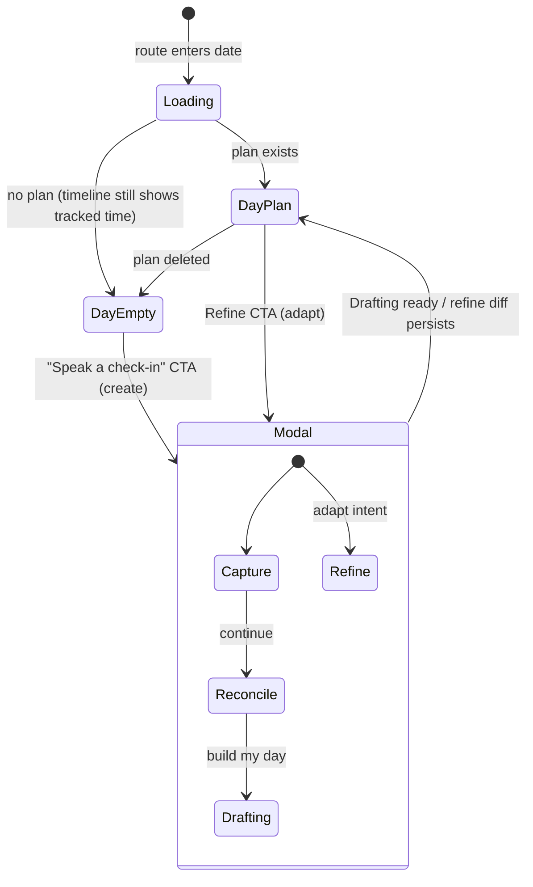
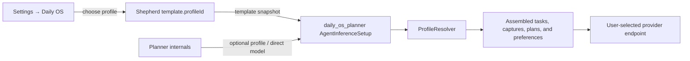

Daily OS Next is **the** Daily OS surface: `CalendarRoot` — the `/calendar` tab
root — mounts `DailyOsNextRoot` directly. The legacy `features/daily_os`
implementation has been removed.

The surface is an opt-in rollout behind the historical
`enable_daily_os_page` config row. The row seeds `false` when absent, while
`insertFlagIfNotExists` preserves a stored `true` from an earlier rollout.
`NavService` omits the `/calendar` destination while it is off; enabling it in
*Settings → Advanced → Config flags* adds the destination and its global
navigation command reactively. Onboarding eligibility watches that same flag,
so an already-running app re-evaluates the walkthrough immediately when the
surface is enabled.

The one shared piece is the day-plan aggregate in `lib/classes/day_plan.dart`.
That model is already the durable representation of a day, so Daily OS Next
extends it rather than creating a second store: agent code reuses `DayPlanData`,
`PlannedBlock`, `PinnedTaskRef` and `dayPlanId`, and does not depend on the old
UI controllers.

# Shape of the module

```text
lib/features/daily_os_next/
├── agents/     # day-agent workflow, services, domain, prompt building
├── database/   # day_processing.sqlite — the device-local outbox
├── logic/      # pure predicates (day-plan availability, recorded time)
├── services/   # processing jobs, outbox repository, job executor
├── state/      # Riverpod providers, selected date, runtime wiring
├── ui/         # Day page, planning modal, timeline, editors
└── util/
```

The day-agent layer reuses the shared agent infrastructure from
[`features/agents`](../agents/) and adds only Daily OS runtime surface area. The
wake executor routes `AgentKinds.dayAgent` to `DayAgentWorkflow`, but that
workflow lives here, not in the agents feature.

# The ritual



Once the rollout flag exposes the destination, `DailyOsNextRoot` always renders
`DayPage` for the selected date — the real plan when one exists, otherwise the
empty Day surface. The selected local plan date lives in
`dailyOsNextSelectedDateProvider`; the desktop sidebar's month calendar drives
the same provider.

**The root surface is identical on every no-plan day.** `DayPage` mounts in
*empty mode* with a synthetic `DraftPlan.emptyForDay`, so recorded sessions stay
visible in Activity without creating a plan first. Empty mode renders an honest
"No plan yet" stat strip, swaps the Refine/Commit footer for a single "Speak a
check-in" CTA, and hides the delete-plan menu entry.

Background agent or sync updates reload **stale-while-revalidate**: the root
keeps rendering the last Day surface while the provider re-fetches, and only
shows a loading shell on the initial route load. The same contract applies inside
the modal's Reconcile and Drafting steps, Shutdown, and the captures panel — if
an `AsyncValue` still has a previous value, that value is rendered rather than a
spinner.

# Concepts

* [Agent identities](agent-identities.md) - the coordinator, per-day agents, and the day-forward cutover.
* [Wake context and prompt](wake-prompt.md) - tagged plaintext sections, prefix-stable ordering, the task corpus, knowledge tiers and week context.
* [Capture and planning](capture-and-planning.md) - the Capture/Reconcile/Draft/Refine tools and services.
* [Processing outbox](processing-outbox.md) - the device-local job table, claiming order, retention and the job executor.
* [Coordination protocol](coordination-protocol.md) - directives, status events, the digest wake and week rollups.
* [Dependency-aware planning](dependency-aware-planning.md) - how typed `blocks` links reach the planner.
* [UI surfaces](ui-surfaces.md) - the Day page, planning modal, voice template, timeline editing and onboarding walkthrough.
* [Evaluation and benchmarks](evaluation.md) - measuring what the model plans and that storage does not degrade.

# Inference settings

Daily OS inference is split across two synced ownership levels:



The `Shepherd` template's `profileId` is the general default; the
`daily_os_planner` identity's typed `AgentInferenceSetup` is the optional
instance override. `updateDefaultInferenceProfile` updates an existing planner
**only while it still follows a template snapshot**, so a later default change
never replaces a user-owned profile or direct model override. Clearing the
override copies the current template profile back as a new snapshot.

The settings page lists every configured compatible route and maintains **no
provider denylist** — the selected endpoint determines the privacy boundary.
Daily OS *sends* its assembled planning context to that provider. Loopback and
embedded endpoints are described as on-device; every other endpoint is described
as remote with its provider and host. The Day surface links to these settings
from its overflow menu, blocks a new check-in when no route resolves, and shows a
non-blocking preferred-name prompt when inference is ready but personalization is
missing.

# Preferences

`DailyOsPreferencesController` persists personalization in `SettingsDb`. The
display name is edited in *Settings → Daily OS* and read by the Capture greeting.
It **syncs**: an edit stamps a last-write timestamp and enqueues a debounced
`SyncMessage.dailyOsUserName`, and an inbound change reloads under last-write-wins.

A name that exists locally but was never published — a pre-sync name, or one
edited while the outbox was unavailable — is bootstrapped once on load, stamped
as the oldest-possible write so an explicit edit elsewhere always wins.

Category exclusions are edited from the processing filter button and stay
**device-local**. `ReconcileController` applies the same preference to parsed
capture items and pending decisions before the user sees them.

# Day-plan category availability

Availability is strictly opt-in via the category editor's "Day planning" switch
(`CategoryDefinition.isAvailableForDayPlan`). Pure predicates in
`logic/day_plan_availability.dart` define the universe:

- `filterDayPlanCategories` (active, non-deleted, flag on) feeds the processing
  filter button's category list, layered **under** the session-scoped exclusion
  preference. Exclusions are scoped to the day-plan universe: confirming the
  picker rebuilds the exclusion set from currently flagged categories, so
  exclusions of since-unflagged categories are dropped.
**Category constraints are not yet wired into the planner identity.**
`AgentIdentity.allowedCategoryIds` treats an **empty** set as allow-all, so
passing the strict — possibly empty — opt-in set would invert the semantics.
Wiring the agent layer needs an explicit "constrained" marker first. The per-wake
prompt derives its `touchedScopes` from attention claims and the baseline plan's
categories instead.

# Known gaps

- **Shutdown is still mock-backed.** `ShutdownController` and its surfaces do not
  read real data.
