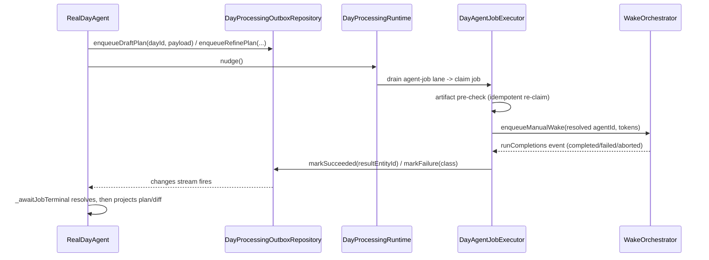
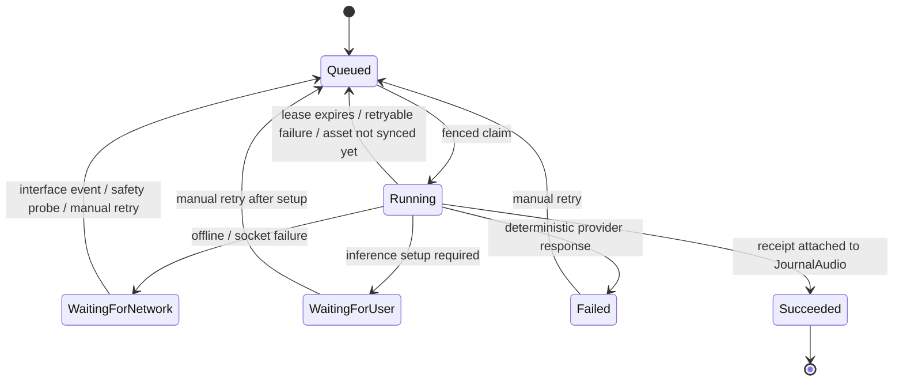

# A table, not a file per job

The outbox is a table in its own database (`day_processing.sqlite`), not the
file-per-job store ADR 0031 introduced. It lives outside the journal and agent
databases because **every column describes *this* device's progress** — claim
tokens, leases, attempt counters — and must never sync.

Job kinds: `transcribeAudio`, `parseCapture`, `draftPlan`, `refinePlan`, each
behind a sealed `DayProcessingPayload`.

## Why durable jobs replaced in-memory polling

`RealDayAgent.draftDayPlan` / `proposePlanDiff` used to poll on a timer after
firing a wake directly. A process kill between enqueue and drain **lost the
request outright**, and the UI's only progress signal was silence until a 60 s
timeout. Both now go through the same outbox transcription uses.

# Bounded by two independent mechanisms

Terminal jobs are retained deliberately — Activity and startup repair read them
as the local processing ledger. Retention caps how far back it reaches, while
partial indexes keep even rows inside that window off every hot path, so **query
cost never depends on ledger size**:

| Index | Covers | Serves |
|-------|--------|--------|
| `idx_day_processing_jobs_pending` | `status NOT IN ('succeeded','cancelled')`, keyed `(created_at, id)` | Claim selection, the review fence, the runtime's schedule probe |
| `idx_day_processing_jobs_day` | `(day_id, kind, created_at)` | Activity's day-scoped read |
| `idx_day_processing_jobs_retention` | Terminal rows by `completed_at` | The retention sweep |

**Consequently there is no `getAll()`.** The three readers that once scanned
everything are bounded: `DayActivityRepository.getForDay(dayId, kinds: …)`,
`DayAudioReviewFence.getPendingByKind(transcribeAudio)`, and
`DayProcessingRuntime.getSchedulable()`. Claim cost tracks outstanding work
rather than install age.

# What Activity shows, and how agent jobs join

The Activity timeline is a projection over three sources — journal recordings,
outbox jobs, and agent captures — and its join key is the **activity entry id**.
Only `transcribeAudio` carries one, so it is the only kind that joins *to* a
card.

Agent jobs (`parseCapture` / `draftPlan` / `refinePlan`) carry no activity entry
id by design: the recording they came from is not what they are about. They are
projected as **rows of their own, keyed by the durable job id** — which the
outbox already derives deterministically (`draft_<dayId>`, `parse_<captureId>`),
so a retried job updates one row rather than accumulating a card per attempt.

**Only stalled agent jobs earn a row.** `queued` and `running` are in flight and
already visible through the plan surface's progress affordance; surfacing them
here would be noise. The three states that do not progress on their own do earn
one, because otherwise the failure is silent in the app even though it raised a
notification:

| Status | Why it earns a row |
|--------|--------------------|
| `failed` | Deterministic — it will not retry itself |
| `waitingForUser` | Needs a prerequisite only the user can supply (e.g. a configured model) |
| `waitingForNetwork` | Parked until connectivity returns |

The row is placed at `requestedAt`, not `updatedAt`. While the device is offline
the runtime probes each waiting job on a timer, re-queuing and re-parking it,
and both transitions rewrite `updatedAt` — ordering by it made the row jump to
the newest timeline position on every probe with no attempt having run.

A **failed `parseCapture` whose capture has since been deleted** earns no row:
nothing reschedules it, and Retry would only run a pre-check that terminates on
its own.

Retries go through the existing `retryNow`, which re-queues the job and clears
its error state — so retrying removes the row: the work is in flight again.

**`onJobFinished` fires for every observed outcome, not only terminal ones.**
`failed` is deliberately *not* terminal — a retry can resurrect it — so gating
delivery on `isTerminal` meant the plan-failure notification could never reach
`DayPlanReadyNotifier`. Delivery is not the place to decide what is worth
saying; the listener filters.

# Claiming

**Order is tiered.** All agent job kinds share one serial drain lane, so without
an ordering rule a 30-second draft for a day nobody is looking at would block a
capture just recorded for today:

1. Anything that has already waited past `dayProcessingPriorityAging`
   (15 minutes) — so a busy foreground cannot starve another day.
2. The day the user has selected.
3. Today.
4. Tomorrow.
5. Everything else.

Ties fall through to FIFO by `(created_at, id)`, which preserves ordering
*within* a day: a capture's parse still runs before that day's draft.

Priority is **viewer-relative**, so it is a query-time expression rather than a
stored column, evaluated over the candidate set the pending partial index already
bounds. `DayProcessingOutboxProcessor.priority` is a resolver called per claim
(not per drain), reading the selected-date provider through `ref.read` — so
navigating between days takes effect on the next job without rebuilding the
long-lived runtime.

The claim and schedulable selectors repeat the pending index predicate
`status NOT IN ('succeeded', 'cancelled')` verbatim alongside their narrower
drainable-status predicate. SQLite does not infer that the narrower status set
implies the partial-index predicate; without the explicit clause it scans the
retained ledger and builds a temporary ordering table.

**Claiming is one atomic statement** —
`UPDATE … WHERE id = (SELECT … ORDER BY created_at, id LIMIT 1) RETURNING …` —
so there is no window in which a second claimer can take a row between it being
chosen and owned.

**Mutations by a claim holder are fenced on `claim_token`**, so a worker whose
claim was revoked — reviewed text satisfied the job, or its recording was deleted
— cannot overwrite the terminal state.

# Retention

Terminal rows whose `completed_at` is older than `dayProcessingLedgerRetention`
(90 days) are removed on the once-per-start repair pass.

**No non-terminal row is ever eligible regardless of age.** A job parked in
`failed`, `waitingForUser` or `waitingForNetwork` is outstanding user intent that
`retryNow` or a re-enqueue can still resurrect.

# Migration off the file store

`initializeDayProcessingOutbox` runs the one-off cutover during app start,
**before the runtime starts and before any enqueue path is wired up** — that
quiescing is the write barrier, since a transaction cannot span the filesystem.

It imports every job file and verifies **by identity** — the set of ids on disk,
re-scanned until stable, because a row count can match while the ids differ — then
commits the sentinel into `day_processing_migrations` **in the same transaction
as the confirming scan**, so the import and the cutover marker share one
durability domain.

Verification is one-directional: a table row with no file behind it is **kept**,
because no code path deletes a job file to express intent.
`DayProcessingLegacyFileStore` is the read-only remnant, keeping the
partial-recovery and quarantine logic the table does not need, and goes when the
job files are deleted a release later.

# The job executor

`DayAgentJobExecutor`:

- **Resolves the target agent at execution time**, never persisting it on the
  job, so ownership can change between enqueue and drain without breaking
  anything.
- **Runs an artifact pre-check before spending any tokens.** A re-claim after a
  crash sees the already-written plan or diff and succeeds without re-inferring.
- Enqueues the wake and awaits `WakeOrchestrator.runCompletions` — the broadcast
  stream of `WakeRunCompletion { runKey, agentId, status, error }` emitted at
  every finalization point.
- **Defers a refine job behind an in-flight draft** with a short retry rather
  than racing it.
- Maps the workflow's forced-tool-retry and output-ceiling exceptions to
  `providerBusy` (worth one more attempt) and caps retries (`maxAttempts`,
  default 5) by downgrading to `deterministic` — because unlike transcription's
  free backoff, **every agent retry spends model tokens**. The output wrapper
  rejects a truncated stream before buffered tool calls execute, so the retry
  never follows a half-written plan.

Every agent-job wake also carries
`processing_job:<jobId>@<requestedAtMicros>`. The per-attempt `runKey` remains
the provenance key for plans and diffs, while this durable **intent** scope
governs side effects that may happen before the terminal artifact. In
particular, `raise_day_status` upserts
`day_status:<dayId>:job:<intentScope>`: a retry can revise the status from its
failed attempt, but cannot append a duplicate escalation. Re-arming a
deterministic job changes `requestedAt`, so a later independent user request
gets a new append-only status event instead of overwriting the earlier
request's history.

The outbox retains `last_failure_class` and `last_error` when a retry later
succeeds. `attempts` still counts failed provider requests, and a new user
request that re-arms the deterministic job clears all three fields. This makes
a successful eval row explain that it recovered from a classified timeout
instead of hiding the first attempt.

## Two independent drain lanes

`DayProcessingRuntime`'s composed `drain` runs `drain(kinds: {transcribeAudio})`
and `drain(kinds: dayAgentJobKinds)` **concurrently**, so a slow agent wake never
blocks the transcription lane or vice versa.

## Coalescing differs per kind

| Kind | Job id | Behaviour |
|------|--------|-----------|
| `draftPlan` | `draftJobId(dayId)` — deterministic | **Re-armable**: a repeated request re-arms a terminal job with fresh `requestedAt`/payload, or attaches to an already-`running` job as-is |
| `refinePlan` | `refine_<dayId>_<suffix>` | **Never coalesced** — each refine carries distinct user input and produces its own ChangeSet |
| `parseCapture` | `parseJobId(captureId)` — deterministic | One job per capture: a queued/running job attaches; a stuck or terminal job is re-armed with fresh attempts |

`submitCapture` and `retryCapture` enqueue through the outbox plus a deferred
runtime nudge instead of firing a volatile wake directly — the executor enqueues
the actual wake when the job runs, so **a process kill between capture submit and
parse no longer loses the parse**.

## Awaiting a terminal state

`RealDayAgent._awaitJobTerminal` subscribes to the outbox's `changes` stream —
event-driven, not a poll — and races only a periodic cancellation/soft-cap check
(1 s tick, 10 min soft cap) against it. There is **never** a fixed-interval
re-read of job state.

A caller's `isCancelled` firing leaves the durable job running; a fresh request
for the same day re-enqueues, which coalesces onto (draft) or attaches to
(refine) the still-live job, so the eventual result is not lost.

`failed` and `waitingForUser` end the wait — both need explicit user action.
`waitingForNetwork` is waited through, since the outbox retries it automatically.

# Transcription job lifecycle

`DayProcessingRuntime` repairs journal/outbox gaps by rebuilding jobs from
persisted `dayContext` provenance, reclaims expired leases, resumes network waits
on interface changes and periodic safety probes, and writes a job-correlated
`AudioTranscript` receipt **before** acknowledging success.
