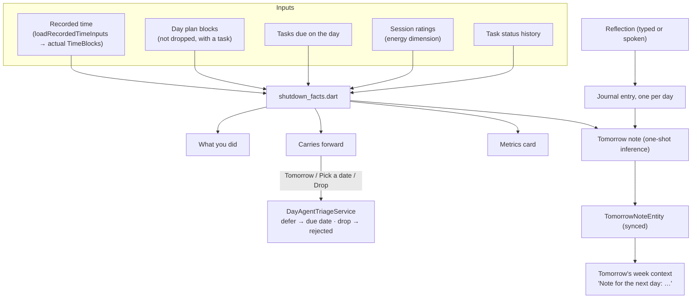
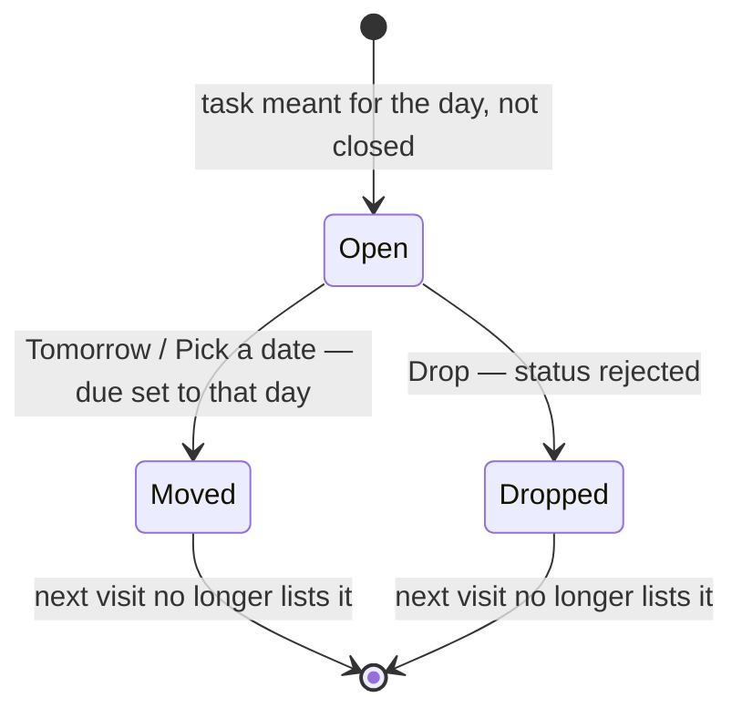

# What Shutdown is

The end-of-day screen (`/calendar/shutdown/:date`, reached from the Day page).
It shows what the day's time went to, the tasks meant for the day that are still
open, a metrics card, a reflection box and a short "For tomorrow" note. Every
piece is real: nothing on it is scripted. `RealDayAgent` delegates all five
Shutdown calls to `DayAgentShutdownService`.

# The facts

All computed in `shutdown_facts.dart` from the Actual lane's `TimeBlock`s, so the
Shutdown screen and the Day timeline never disagree about what was recorded. A
block counts for the day it lies **entirely inside** — the containment rule of
the timeline's own per-day query — so a recording across midnight appears on
neither day, here as there.

- **What you did** — the day's blocks grouped by task (untasked recordings by
  title within their category), minutes with overlaps counted once, the number of
  recordings, longest first. Tasks whose status history has a `TaskDone` on the
  day are marked *done today*; one done without recorded time still appears, with
  no minutes. Candidates come from the day's blocks, the plan, the due query and
  `JournalDb.getTasksClosedSince(day)` — tasks DONE or REJECTED whose row changed
  since the day began — so an unplanned task finished that day is not missed.
- **Carries forward** — tasks **meant for the day**: in the day plan (dropped
  blocks excluded, plan order) or due on it (by title). A task is left out once it
  is closed, or once its due date is already past the day — a decision taken in
  an earlier visit. Each row carries the minutes recorded against it and is
  re-placed on the next day by default. Tasks decided in this session stay meant
  for the day even when only their due date put them there, so the note still
  reports them as moved or dropped; a task dropped that day without being
  planned or due counts as dropped too.
- **Metrics** (constants beside the functions):
  - *Focus* — recorded work minutes; calendar events are time spent, not focus.
  - *Flow sessions* — runs of work on one thing of at least `flowSessionMinimum`
    (45 min). A run is consecutive recordings of the same task at most
    `workRunMaxGap` (5 min) apart, so pausing a timer does not split it.
  - *Context switches* — changes of what was worked on between runs, compared
    with the mean over the previous `shutdownLookbackDays` (7) days that had any
    recorded work.
  - *Energy* — the mean `energy` dimension (0–1) of the day's **session ratings**
    on a 0–10 scale, compared with the previous week's mean. There is no other
    measured energy signal (the plan's energy bands are predictions), so an
    unrated day shows a dash and "Rate sessions to see it".

The service loads one range — the day plus the seven before it — through the
shared recorded-time loader, so the week comparisons cost no extra queries.

# Decisions, reflection, note

- **Carryover decisions** go through `DayAgentTriageService.applyTriage` under
  the planner identity — the same, category-scoped write Reconcile uses. A due
  date on the next day is exactly how a task reaches tomorrow's Reconcile and
  drafting corpus. *Pick a date* opens the design-system date picker starting on
  the next day; dismissing it decides nothing. A failed write leaves the row
  undecided and says so.
- **Reflection** — one journal text entry per day, id
  `MetadataService.deterministicId('daily_os_reflection:<dayId>')`, so devices
  converge on one entry. Typed text is appended; *Speak it* creates the entry if
  needed and opens the standard recorder linked under it, so the recording and
  its transcript attach to the day's reflection. A reflection on a past day is
  filed at that day's 23:59. The entry lives in the Logbook like any other.
- **Tomorrow note** — `DayAgentShutdownService.tomorrowNote`. The prompt is the
  day's facts as plain lines (worked on, still open, moved, dropped, the
  reflection). Its SHA-256 is the note's `inputFingerprint`: the stored
  `TomorrowNoteEntity` (`day_agent_tomorrow_note:<dayId>`, synced, newest
  `updatedAt` wins) is reused while the facts are unchanged, so reopening
  Shutdown spends no tokens. Otherwise one completion runs on the day agent's
  resolved thinking model (the planner's when the day has no agent), capped at
  `tomorrowNoteMaxTokens` and `tomorrowNoteMaxChars`, through
  `OneShotTextGeneration.generateText`, which records it in the consumption
  ledger as `automation:daily-os-tomorrow-note`.
- **Close the day** refreshes the note after the decisions and reflection, then
  leaves; a note that cannot be written does not keep the day open. *Save &
  close* leaves without rewriting it.
- **Tomorrow's draft reads it**: the week context fetches each lookback day's
  note with its plan and summary and renders it under that day as
  `Note for the next day: …`.

# Failure behaviour

The note loads through its own provider (`shutdownTomorrowNoteProvider`), so the
rest of Shutdown renders while it is written or when it cannot be. No resolvable
inference profile is a typed `TomorrowNoteUnavailableException`
(`noInferenceProvider`) and the card asks for an AI provider; any other failure
shows an error with a retry. An empty answer is never stored.

# Tests

`shutdown_facts_test.dart` pins every definition (including a property test that
runs follow the task sequence exactly), `day_agent_shutdown_service_test.dart`
builds a realistic day from mocks, and the controller, page and card tests drive
the UI against the scripted `MockDayAgent` in `test/.../test_doubles/` — test-only
since this change.
