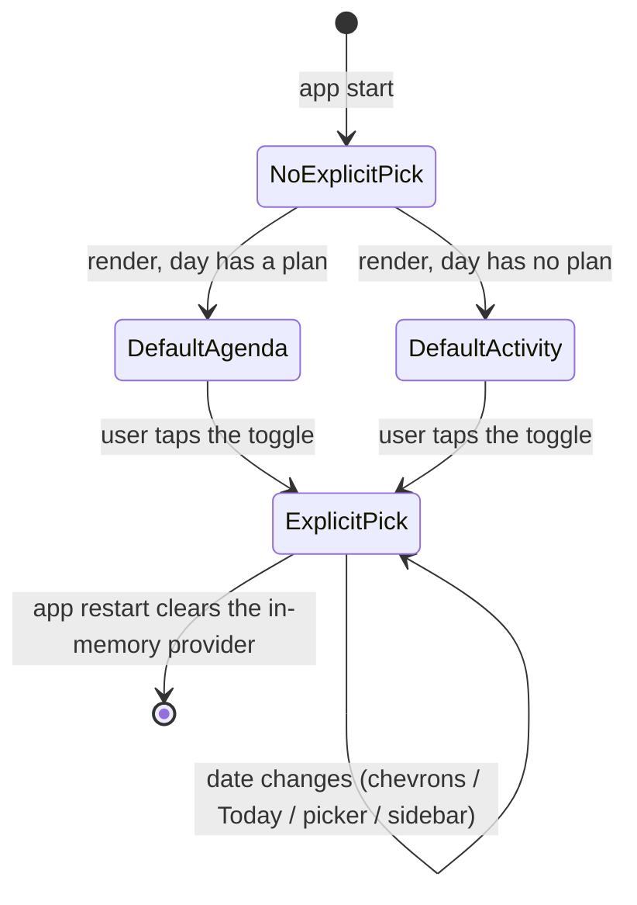
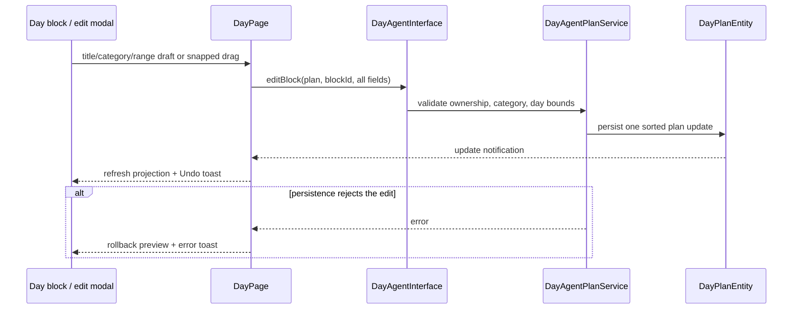
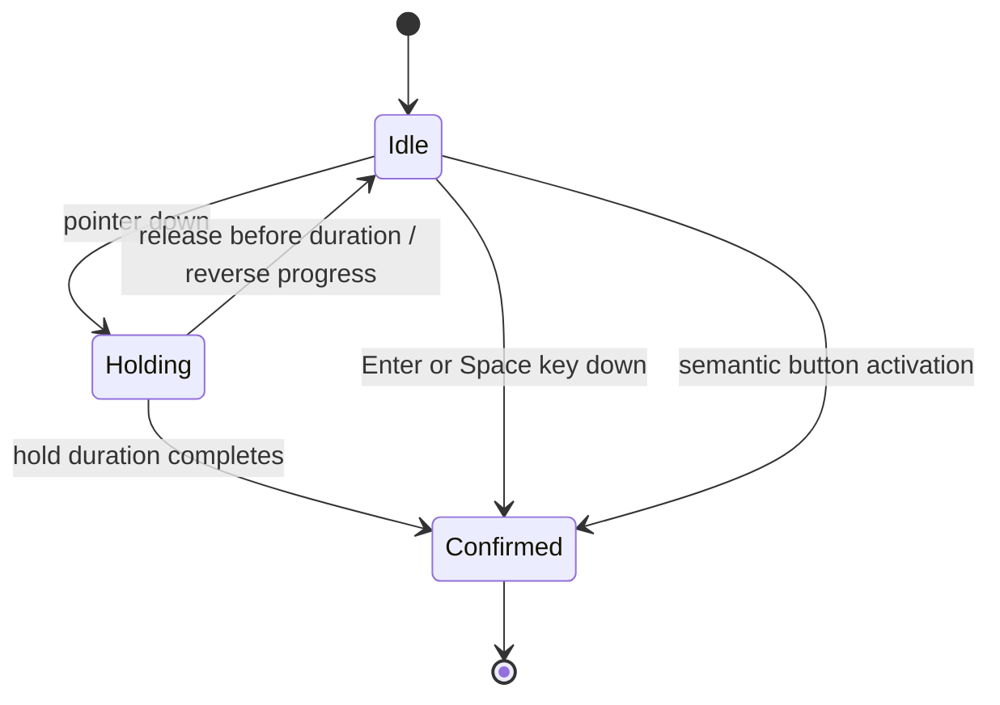

# The planning modal

The Capture → Reconcile → Drafting ritual runs inside a full-height
**day-planning modal** — a Wolt multi-page sheet pushed on the root navigator. It
is a full-height bottom sheet on phones (covering the bottom nav) and a
right-anchored full-height **side panel** on wide screens (45% of the window
clamped to 480–720 px), so the day surface stays visible beside the conversation.

It opens from the empty surface's footer CTA and the Day surface's Refine CTA.
Each step submits against the selected date for day-agent routing. On create, the
Drafting step closes the whole modal once the plan is ready and invalidates
`currentDraftPlanProvider` so the root re-renders.

## The anchored voice template

Capture and Refine share one layout:

```text
headline (state narrator)        ← copy cross-fades in place
middle zone                      ← transcript / editor / plan / diff rows
waveform slot · orb · caption    ← fixed height, orb stays put
sticky glass action bar          ← never empty; all actions live here
```

**The orb never moves between phases.** The live transcript grows *upward* from
just above it inside the bounded middle zone (bottom-pinned, reverse-scrolled,
top fade); the editable transcript takes the same zone after capture; Refine's
idle zone shows read-only current-plan rows. On viewports shorter than the
template's minimum the body scrolls from a bottom anchor rather than overflowing,
so the orb, caption and sticky actions remain reachable.

`CaptureState` keeps two live audio signals while the mic is open: normalized
`amplitudes` for the compact waveform bars and raw `dbfs` for the shader voice
affordance. `VoiceButton` mounts the AI tension-loop shader **only during
`listening`** and removes the shader subtree for other phases.

The glyph is bound to the state machine — mic (idle/error), an inverted stop mark
(listening: the filled teal disc drops away and the stop square is drawn in the
orb's teal, sitting in the shader field), dimmed mic (transcribing), outlined mic
(captured — demoted so the advance CTA carries primary weight). Presses scale the
core down with an overshoot release, and the ink ripple paints *above* the
gradient so taps read as alive.

**The sticky glass bar is populated in every phase**: idle/error → "Type
instead"; listening → a teal "Done" pill mirroring the orb's stop action in the
thumb zone; transcribing → a quiet "Cancel"; captured → "Re-record" + "Review".
On the desktop side panel the pills render at intrinsic width aligned to the
trailing edge instead of stretching edge-to-edge, and bar content is capped at the
560 px content width.

Capture supports **both voice and typed intake**: the idle copy exposes a real
"type instead" action that moves the controller directly to the editable
transcript state without opening the microphone. Opening Capture for a previous
selected date renders a prompt asking whether there is still time to track for
that concrete day. The captured-state editor is a grow-with-content textarea, so
multiline recognition uses the available middle zone instead of stopping after an
arbitrary five or six lines.

## Making the wait honest

- **Reconcile's first frame is never visually idle.** `ReconcileLoadingView`
  renders the decoder-bars shader plus localized "Listening back and matching your
  day…" copy immediately after Review is pressed. *Build my day* stays disabled
  until parsed and pending decisions resolve. The modal owns **one** indicator in
  the body — no duplicate footer animation.
- **The Drafting wait is a hero thinking moment, not skeleton shimmer**: the
  decoder-bars shader over a `DraftingStatusTicker` — a deterministic ~21 s
  rotation of localized narration lines that cross-fade in place — with
  yesterday's learning cards below as real content to read.
  `DraftingProgressTimeline` adds a deterministic stage trail (queued → reading →
  matching → blocks → validating → saving) **because the backend only exposes
  completion, not individual tool checkpoints.** If draft creation fails before
  auto-advance, `DraftingErrorRecovery` keeps the user in context with Retry and
  Back-to-decisions actions. The drafting step has no sticky bar while active — it
  offers no actions and auto-advances.
- **Refine** runs on the same template: idle shows the current plan where the
  spoken words will land, diff rows render in the middle zone with inline
  accept/reject, and the bar carries "Revert" (enabled once a diff is pending) and
  "Looks good". Quick review buttons on the Day surface open Refine and
  immediately submit that prompt through the normal diff/accept/revert path, so
  "Too much", "Move lighter" and "Add buffer" are **shortcuts over the same
  user-gated machinery**, not a separate path.

# The Day surface

## Day navigation and view memory

`DailyOsNextRoot` renders one `DayPage` per selected day and injects a
`_DateStrip` — prev chevron, tappable date label (tap opens the picker,
long-press returns to today), next chevron, and a `Today` button shown when
the selection has left today *and* the pane measures wide enough for it — as
that page's header title. Nothing keys off a device class: a wide pane on a
phone would carry the button, and a narrow pane on a desktop does not.

Three invariants make repeated navigation cheap:

- **The chevrons never move.** The date label reserves the width of the widest
  string its date pattern can produce, measured with the real style and
  `MediaQuery.textScalerOf` (`_stableDateLabelWidth`, cached per locale ×
  pattern × style × scale) and rendered with tabular figures. The reservation
  is measured rather than hardcoded, so it follows the user's font-size setting
  instead of clipping at large text. Which pattern is reserved — `yMMMEd` or
  year-less `MMMEd` — is itself a fit check against the pane (see below), not a
  device class: the widest `yMMMEd` string plus two chevrons does not fit a
  390 pt phone, but it does fit a wide pane on any device.
- **Day navigation owns its row when the header stacks.** `_MeasuredDayHeader`
  lays title, toggle and actions out inline when they fit; when they do not, the
  date strip takes the first row alone. The toggle and the actions then share
  the second row **only if the room left over covers the toggle's measured
  width** — otherwise the actions drop to a third row, because the segmented
  control shrink-wraps to a minimum and would otherwise paint over them.
  Sharing row one with the actions cluster is what truncated the date to an
  ellipsis on a phone.
- **The strip sizes itself against the pane, not the window.** A `LayoutBuilder`
  supplies the width, because the desktop sidebar is resizable to
  `maxSidebarWidth` (500 px) and a "desktop" `MediaQuery` can still leave this
  pane under 500 px. The year is carried only when the widest `yMMMEd` string
  plus both chevrons fit; the `Today` button only when that *and* the button's
  own token-derived width fit. Where `Today` is dropped, the way back survives
  in `showDesignSystemDatePicker`, which the label opens and which carries its
  own Today quick action.



- **The projection survives the day change.** The root re-keys `DayPage` on
  every date change, so the selected `PlanView` lives in
  `dailyOsNextPlanViewProvider` rather than in the page's `State`. `null` there
  means "not chosen yet" and the page falls back to its per-day default —
  Agenda with a plan, Activity without one. The provider is in-memory, so a
  fresh app start lands on that default again, while every date-change path
  (chevrons, `Today`, the picker, the sidebar month calendar) keeps whichever
  view the user picked.

## Tracked time

"Today so far" is one shared widget, `TimeSpentCard`: calm eyebrow plus
right-aligned mono summary (`4h 35m · 3 done`), one row per recorded session
(category dot, truncating title, mono clock range, green check when done),
bounded to 3 rows on desktop / 2 on mobile with a ghost "N earlier sessions"
expander that keeps the most recent sessions visible.

Capture pins it at the top of its column with a date-neutral title for non-today
dates; the Agenda tab reuses it as the empty-state body under a dashed "No plan
yet" hint card.

The Day timeline's **Actual** lane is the same recorded time, one block per
entry, projected by `dailyOsActualTimeBlocksProvider`. Imported workouts count as
recorded time too. A workout block is titled by its activity — `Walking`,
`Functional Strength Training`, through `humanWorkoutType` — unless the user
annotated the entry, in which case the first line of the annotation wins as it
does for any recording; it stays in the uncategorised grey because a workout
carries no category. (Before this, a workout fell through every title fallback
and the lane printed its entry id.) Nothing on this surface used to *import*
workouts — a walk reached the lane only after some dashboard with a workout
chart had been opened — so each recompute of the lane now nudges
`HealthSignalRefreshService.refreshWorkouts()`, fire and forget: the importer
throttles it to one delta per ten minutes, a failure is logged and swallowed,
and the journal write a delta produces comes back through the same notification
stream that triggers the recompute. See [health import](../health_import.md).

## Task-linked versus standalone

**Task-linked is the marked case; standalone is the unmarked default.** A
task-linked agenda row carries a blue `LinkBadge` and a task-linked Day block
prefixes an info-blue link icon. Standalone items carry **no** marker — there is
no `StandaloneTag` in the codebase, and the absence of a badge is what identifies
them.

Both projections resolve task identity through the lightweight
`liveTaskMetadataProvider`, which subscribes to task and category database
notifications, re-fetches the task plus its current category directly from
`JournalDb`, and **overlays the live title, category name and colour on the stored
day-plan snapshot**. A task rename, category reassignment, or category name/colour
edit therefore reaches the visible Agenda and timeline on the next frame. A
missing task renders the localized missing-entry title while category metadata
falls back to the persisted snapshot.

## Editing

Standalone titles are click-to-edit through `EditableTitle` (pencil on hover,
Enter/blur saves, Esc cancels). Every editable planned block also carries an
explicit edit icon opening `DayBlockEditModal`, a responsive Wolt multi-page
editor built from design-system form sections, inputs, buttons and the shared
glass footer.

- **Standalone blocks** can change title, category and time atomically. The
  picker uses the same strict `filterDayPlanCategories` universe as Capture, and
  the persistence boundary **revalidates that opt-in before writing**.
- **Task-linked blocks** have read-only title and category fields — the task is
  their source of truth — and the modal submits no identity fields for them. It
  offers *Open task*; start and end stay editable.
- The time subpage reuses the public `EntryDateTimeEditor` and modal sizing
  contract from time-recording entries.

The timeline toolbar's **Arrange** action expands folded regions and enables
direct manipulation on planned non-calendar blocks: drag the body to move, or the
top/bottom handles to resize. Preview motion is optimistic and snaps to
fifteen-minute increments within the plan day.

On phone layouts the drafted-plan footer folds its three refinement shortcuts
into one **Adjust** menu. At large accessibility text sizes it also omits the
explanatory reason rows, preserving the plan projection and primary actions.
When the timeline itself receives less height than its toolbar requires, the
toolbar yields and the scrollable timeline takes the available space.



Both the modal and the drag path persist through the **same atomic `editBlock`
contract**. A failed or cancelled gesture rolls back; a successful edit refreshes
the plan and shows a countdown Undo toast.

## The capacity ring

Agenda and Commit surfaces use `CapacityDonut` (86 px on the Agenda stat strip,
62 px on the Commit recap): a 5 px stacked **category ring** whose slices mirror
the legend dots — via `categoryTotalsFor`, shared by both so they cannot disagree
— over a faint remainder track, with the **remaining** capacity in the centre over
a LEFT/OVER eyebrow whose word is always honest. Days without a capacity show the
scheduled total with no eyebrow.

Pressure wording lives in the stat card's overline; the ring **only changes colour
when the day is genuinely over capacity** (error tone, half-alpha over-arc).
Callers without segments get a single teal arc. The honest no-plan strip passes
`neutral: true`, which keeps the calm colour but never flips OVER into LEFT.

## Typography

Daily OS follows the calm system through the design-system helpers:
`calmEyebrowStyle` (11/600/0.04em) for every overline, `calmPageTitleStyle`
(23/600) for page titles, `calmDisplayStyle` (26/600) for the Capture headline,
Commit lead-in, and LockInScene captions, and `calmGreetingStyle` (12/500) for
quiet helper lines.

**No Daily OS surface uses the legacy 12/700/+8-tracking overline token
directly.**

# Commit confirmation

`CommitPage` uses `HoldToConfirm` as its final user-owned transition.



Pointer input retains the timed hold and reverse-on-early-release behaviour. Once
the control has focus, **Enter or Space confirms immediately**, and semantic
button activation does the same — keyboard and assistive-technology users are
never required to simulate a long pointer press. Every path shares the same
exactly-once `_done` guard and `onConfirmed` callback.

# The onboarding walkthrough

A first-time user lands on a real but unexplained empty `DayPage` with one "Speak
a check-in" CTA. The walkthrough teaches that **real** ritual in place rather than
simulating it.

**Status: dark launch.** Phases 0–2c are implemented end to end — a session
coordinates it, `AppScreen` auto-arms it (sequenced behind What's New and the FTUE
welcome), the spotlight mounts over the empty-Day CTA, coach strips render inside
the create modal, and the modal's typed result drives completion or a skip. The
walkthrough config flag seeds **off**. Candidate eligibility also requires the
separate `enable_daily_os_page` rollout flag, so an install whose Daily OS
destination is hidden cannot be auto-invited into it. Both flag dependencies
are watched streams, so changing either advanced toggle re-evaluates the
long-lived eligibility provider without an app restart. Still deferred: the
completion celebration beat and the Settings replay entry.

| Piece | Role |
|-------|------|
| `isDailyOsOnboardingEligible` | Pure candidate-eligibility predicate over already-resolved inputs — fully unit-testable across every branch |
| `shouldAutoShowDailyOsOnboardingProvider` | Read-only async check resolving the predicate's inputs |
| `dailyOsOnboardingProviderReadyProvider` + `hasResolvableDailyOsPlannerThinkingRoute` | The readiness seam: waits for agent initialization so the default template/version are seeded, then resolves **the exact thinking route a drafting wake would use** — read-only, never creating the planner. Its own library because both this gate and the independent Welcome backfill consume it |
| `DailyOsOnboardingCadence` | `recordShown()` / `markCompleted()`, persisted under a private `SettingsDb` key prefix (four shows within fourteen days) |
| `AgentRepository.countEntitiesByType` | The "has a plan ever existed" query. Deliberately **includes soft-deleted tombstones** and counts across planner identities, so a returning user who deleted their only plan is not mistaken for a new user |
| Daily OS event vocabulary | Six `dailyOs*` events reuse the shared metrics DB but are excluded from `OnboardingFunnelState`, so they never shift the general FTUE metrics |
| `DayPlanningResult` + `attributeCreatedTaskIds` | `showDayPlanningModal` resolves to a typed result: `DayPlanningCreated`, `DayPlanningAdapted`, or `null`. Attribution reconstructs created task ids from `ParsedItem.matchedTaskId` transitions — best-effort, empty when it cannot be established |
| `DailyOsOnboardingSession` / `…SessionController` | Stable id, target date, tips-visible state, and exactly-once guards for stage and skip events. Sessions do not carry an origin; the deferred Settings replay entry will need an explicit entry-point contract when it is implemented |
| `DailyOsOnboardingSpotlight` | Presentational full-screen overlay: dims the surface, cuts a highlight hole around a measured target rect, floats a glass card with one primary action. Attention ring pulses under normal motion, static under reduced motion. Copy, callbacks and rect all injected |
| `DailyOsOnboardingCoachStrip` / `…CoachSlot` | A static glass banner narrating one modal beat; the slot renders it only while a session is active and records its stage event once on mount. Collapses to nothing for normal users |
| `DayCheckInSpotlightHost` | Mounts the spotlight over the measured CTA while a session is active. "Try it" opens the **real** modal, a dismissal records the skip. Inert for normal users |

The whole substrate is built so that **for a normal user every piece collapses to
nothing** — the walkthrough adds no widget, no query and no metric when no session
is active.
