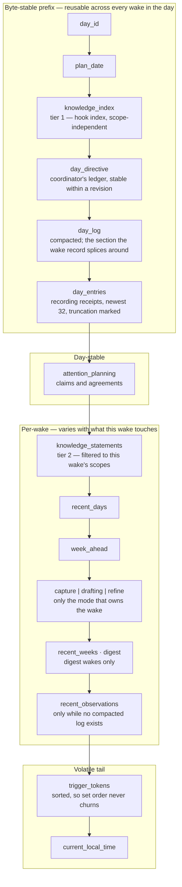

# The payload is tagged plaintext, not JSON

The user message is a set of `<snake_case>` sections rather than one
`jsonEncode`d map. Tags keep JSON's named sections and boundary integrity while
letting **prose** sections carry real newlines — which weak local models read far
better than newline-escaped run-on strings.

| Shape | Sections | Why |
|-------|----------|-----|
| **Prose** | `day_log`, `knowledge_index`, `knowledge_statements`, `recent_days`, `week_ahead`, scalars | Readability for local models |
| **JSON inside the tag** | `attention_planning`, `capture`, `drafting`, `refine`, `recent_observations`, `trigger_tokens` | Data-shaped and tool-facing — the model copies ids verbatim into tool calls |

**Every interpolation runs through a shared sanitizer** that neutralizes forged
tag boundaries — including the JSON-kept sections, since `jsonEncode` does not
escape `<` or `>`. Single-line interpolations additionally collapse whitespace so
a multi-line value cannot fabricate a section.

# Ordering is stable → volatile

Sections are ordered to maximise the cacheable prompt prefix for local KV-cache
and provider prefix-cache reuse. `DayAgentContextBuilder` appends them in exactly
this order, and a section with no content is **omitted rather than reordered or
emitted empty** — so the bands below always nest the same way:

Read top to bottom, each band is more volatile than the one above it, and the
cost of a cache miss falls as you descend — which is the whole reason for the
order.

**The two knowledge tiers are split by stability.** The always-on
`knowledge_index` — global and slow-changing — leads the prefix *before* the
large `day_log`, while the scope-filtered `knowledge_statements` vary by which
scopes the wake touches (capture vs drafting vs refine) and therefore trail the
`day_log`. A changing statement set must never evict the much larger `day_log`
prefix behind it.

Week context trails the knowledge statements because the today-so-far line churns
with tracked time. `current_local_time` sits last and lets same-day drafting
distinguish future plan slots from time that has already passed.

**`day_entries` is a bounded index, not a log.** It carries recording receipts so
a later wake can recover a completed offline check-in immediately, capped at the
newest 32 with the omitted count rendered explicitly rather than silently. It
closes the byte-stable prefix — five sections precede it, twelve follow — so a
heavy capture day must not be allowed to inflate it. Anything that grows this section pushes the whole
per-wake band out of cache.

## Prompt-record splice

Once the read flips to the compacted `day_log`, the whole `<day_log>…</day_log>`
section is a pure function of the synced event log. The persisted wake record
therefore stores only the non-derivable head and tail around it (`day-log-section`
wrap), and `WakePromptReconstructor` re-renders the section on demand for the
history UI. Records persisted before the tagged-plaintext conversion used a
`json-day-log-line` wrap and stay decodable. See
[agent memory](../agents/memory-and-compaction.md).

# The task corpus snapshot

`DayAgentCorpusService.buildTaskCorpusSnapshot` produces at most
`maxCorpusTasks` rows: open tasks for the wake's allowed categories plus every
task due on or before the plan date, deduped and capped, projected to
`{taskId, title, status, categoryId, due, estimateMinutes, priority}`.

It serves two masters, and that shapes one rule: capture matching
(`match_to_corpus`) needs blocked tasks to stay matchable, so **the corpus never
excludes anything — it only annotates**. A task with a live `blocks` link gains a
`blockedBy` array; a task with none gains **no extra key at all**, so a
dependency-free plan's corpus stays byte-identical to before, which matters for
prefix caching. See [dependency-aware planning](dependency-aware-planning.md).

The corpus renders **only inside the capture context**, so a wake without a
capture sees only its decided tasks.

# Week context and day summaries

## Facts versus testimony

`<recent_days>` renders one paragraph per day over a rolling last-7-days lookback
plus the plan date:

1. **Facts first** — deterministic, template-rendered planned-versus-recorded
   minutes per category (integer-tenths arithmetic, **never doubles**), named
   block-level misses, plan status, total.
2. **Then the agent's own contemporaneous day summary** as an `Agent note:` line.

Facts come exclusively from entities; the note is testimony rendered adjacent for
self-auditing. **On contradiction the facts line wins.**

`<week_ahead>` carries future days `[planDate+1 .. planDate+5]` that have plans,
plus claim deadlines within `[today, today+5)`.

All wording lives in **one** renderer (`agents/domain/week_context.dart`); the
service assembles inputs — one chunked `getEntitiesByIds` for the 21
deterministic plan/summary ids, recorded spans via the shared
`logic/recorded_time.dart` core over an end-of-day-bounded calendar query, claims
by visibility window — and is **fail-soft**: a load error logs and the wake
proceeds without the sections.

## Wall-clock day classification

`today := localDay(clock.now())`, **not the wake's workspace day**. Past days
render "Missed:", today renders "(today so far)" / "Still planned:", days after
today render "(upcoming)" — never "Missed:" and never fake "Nothing recorded."
rest-day lines for days that have not happened. A drafting-tomorrow wake
therefore sees tomorrow as upcoming.

## `write_day_summary`

Persists `AgentDomainEntity.daySummary` (`day_agent_summary:<dayId>`) — a keyed
mutable register, upserted in place within its window and preserving `createdAt`.

It is windowed to the **wall clock**: today or yesterday only, independent of the
wake workspace. This is the sole, ADR-governed exception to the workspace-day tool
guard, dispatched before the blanket dayId rejection.

Text is whitespace-normalized and capped at 500 characters at the write path.
Concurrent versions resolve **earliest-createdAt wins** — the most
contemporaneous testimony is canonical.

**Channel partition:** `write_day_summary` is the sole channel for day
retrospectives; `record_observations` is forward-looking learnings only, never
day recaps.

## Caps and cost gating

Max 6 categories per day (by `max(planned, recorded)`), 5 named misses or
still-planned items, 10 deadline lines — each truncation renders a deterministic
overflow marker.

Week context builds **only** on wakes whose day came from day-carrying tokens
(planning-day / drafting / refine / scheduled). Capture-submitted wakes skip the
8-day journal + links + claims load.

# Recall

`search_memory` is the planner's recall and memory-linking tool, handled by
`DayAgentWorkflow._searchMemory` over `AgentLogCompactor`.

- With `query` it keyword-scans the **full** immutable capture-and-observation
  log — including detail folded out of the current summary — newest-first and
  bounded.
- With `ids` it pulls up specific entries — the "follow a link" path.

**Recall is lazy**: per-wake assembly resolves only the tail, and `search_memory`
is the one reader that scans beyond it, and only when the agent explicitly
recalls. Submitted capture events and `search_memory` are filtered to the wake's
selected day, preventing the long-lived planner from mixing workspaces.

## Author-time memory links

Notes the agent writes — observations, knowledge — may cite a related entry
inline as `[[relation:id]]`, where relation is `refines`, `supersedes`,
`contradicts` or `relates`.

The token is **plain content of an append-only entry**, so it never mutates
history, never touches the cached prompt prefix, and stays convergent because the
cited id is the synced entity id.

`search_memory` resolves each hit's outgoing links and validates existence:

| Case | Rendering |
|------|-----------|
| Hallucinated id | `(not found)` — never followed |
| Non-`supersedes` link to a superseded entry | Forward-follows to the live version, rendered `relation:old → live` |
| Entry a newer note supersedes | Flagged |

Validation is widened with the planner's durable-knowledge keys (passed as
`extraKnownIds`), so a cross-tier link to a knowledge entry — for example a **Map
of Content** keyed `moc-<topic>` whose statement curates `[[relates:id]]` links —
resolves rather than reading as dead.

The result is a navigable, append-only memory graph with **no explicit edge store
and no in-place rewrite**. The system prompt fosters the Zettelkasten habits this
enables: atomic keyword-led notes, superseding rather than overwriting, distilling
captures into linked permanent observations, maintaining MOCs, and actually
following links via `search_memory(ids:)`.

# Day entries

Later planner wakes load metadata for every persisted day recording plus bounded
reviewed/correlated text into `<day_entries>`, **even before a `CaptureEntity`
exists**. Pending recordings therefore remain discoverable without fabricated
transcript content.
