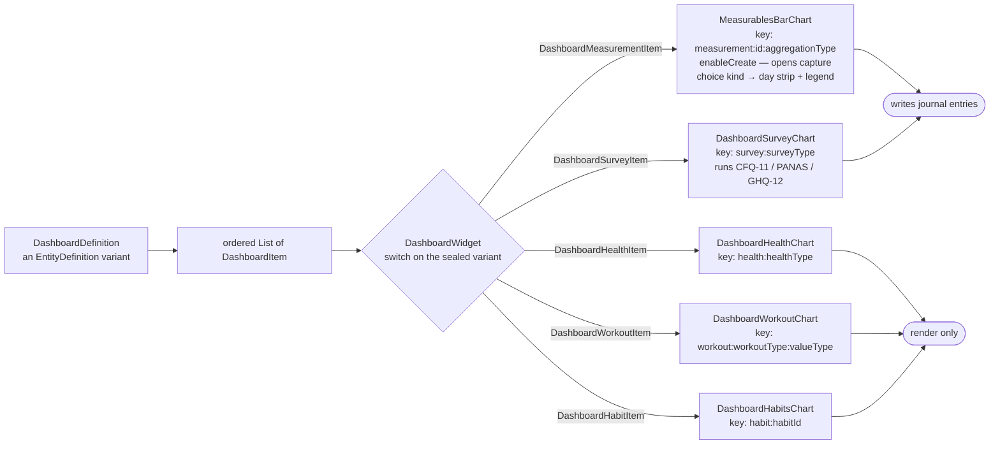
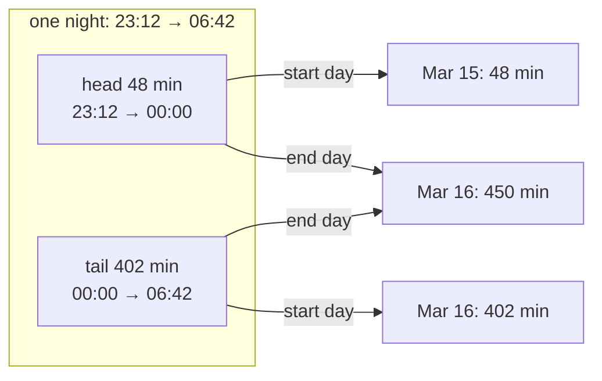

The dashboards feature reads stored `DashboardDefinition` entities, routes each
`DashboardItem` to the right chart widget, and keeps those charts refreshed from
journal-backed data.

**This is a view layer, not a separate analytics warehouse.** The source data
lives in the journal database and neighbouring features; dashboards mostly
assembles and visualizes it — "mostly", because a few charts can also launch
capture flows directly.

# What it owns

Listing active dashboards; locally filtering that list by category; the single
dashboard page lifecycle and its time-range control; routing each item type to
its chart widget; the measurement capture flow reachable from a chart; and the
refresh and caching model that keeps charts current without re-querying on every
notification.

A `DashboardDefinition` is an `EntityDefinition` variant carrying its name,
description, category, visibility flags and an ordered list of `DashboardItem`s.
**The items are the definition** — reordering or removing a chart is an edit to
that list, made in the [settings](settings.md) dashboard editor rather than here.

# Item rendering is a matrix

The sealed `DashboardItem` has **five** variants, and `DashboardWidget` switches
each to exactly one chart widget. Adding a chart type means extending that
matrix, not the page.

Each chart is keyed by **item identity, not range**. The charts keep their last
data across a range change, so the `State` has to follow the item; without
identity keys, replacing an item with another of the same type at the same index
would reuse the old `State` and show the previous item's cached data under the new
header.

**A choice measurable is the one item whose chart is not a series of
numbers.** `MeasurablesBarChart` branches on `MeasurableDataType.isChoice`
before any aggregation is resolved: its raw entries for the range are reduced
by `choiceDaySeries` (`state/measurable_choice_series.dart`) to one choice per
calendar day — the day's **latest** recording, by time then entry id, so two
replicas agree — and drawn by `MeasurableChoiceStrip` as one cell per day under
the same `kChartLeftAxisWidth` inset every other card uses, so the shared date
axis reads across it. The cells are **painted** (`ChoiceStripPainter`), not
laid out: a range runs to a year, and a row of flex children with fixed gaps
would be wider than a phone long before that. The painter fits the range to
its width, drops the gaps once a cell would be narrower than one and then
merges neighbouring days of one choice into a single run; one tooltip, worded
for the day under the pointer, replaces a tooltip per cell. Cell colours come from `choiceColorsFor`: the accent
token stepped from `background.level03` to `interactive.enabled` across the
definition's choice list in the user's order (archived choices keep their
step, an unknown id draws in `decorative.level02`), which reads the list as
the ordinal scale it is without a categorical palette the token set does not
have. A recorded day names its date and choice in a tooltip; the footer is a
`MeasurableChoiceLegend` of the active choices plus any archived one still
colouring a day. The dashboard editor neither names nor edits an aggregation
for such an item, and the measurable picker adds it with `AggregationType.none`.

**Two of those keys carry a second discriminator**, and it is load-bearing:
`measurement:id:aggregationType` and `workout:workoutType:valueType`. Changing
only the aggregation on the same measurable is therefore a different chart
identity — drop that component and the new aggregation would render against the
old one's retained data.

**Two of the five can write.** A measurement chart is constructed with
`enableCreate: true` and opens the capture flow for its data type, and a survey
chart runs the matching questionnaire — CFQ-11, PANAS or GHQ-12, dispatched on
`surveyType` — which records a survey entry through `PersistenceLogic
.createSurveyEntry`. Both mean recording a value does not require navigating away,
which is why this feature is not purely read-only.

The other three render only: health and workout data arrive from outside the app
— see [health import](health_import.md) for how, including the background delta
each health chart schedules on construction — and a habit is completed on its own
surface.

# Which day a health sample belongs to

`aggregateByType` reduces samples to one observation per day, and the choice of
*which* day is not uniform — it is a property of the metric.

| Aggregation | Configured for | Day key |
|---|---|---|
| `none` | heart rate, weight, BP… | none — one observation per sample |
| `dailyMax` | cumulative step/distance counters | start |
| `dailySum` | *(no chart currently uses it)* | start |
| `dailyTimeSum` | the six sleep types, and only those | **end** |

**Sleep is keyed on the day a sample ends, and this is load-bearing.** A night
crosses midnight, so on a start-day key a bed time of 23:12 puts the first
48 minutes on one date and the remaining seven hours on the next. No bar is then
ever one night — each is the tail of the night before plus the head of the night
after — and, until the user next goes to bed, today's bar holds only the
post-midnight portion, so "last night" reads short by exactly the time they were
asleep before midnight. Every day, all day.

Attributing to the end day matches Apple Health and the question a sleep chart
is read to answer. A daytime nap is unaffected — it starts and ends the same
afternoon either way.

`aggregateDailySumByEndDay` is that rule; `aggregateDailySum` keeps the start-day
behaviour for everything else, and both share one implementation so the two
cannot drift. Goal signals reach the same code through `aggregateByType`
(`goal_signal_reader.dart`), so a sleep goal and the sleep chart agree by
construction.

# Refresh and caching

Charts subscribe to the notification stream for the entity kinds they render,
rather than rebuilding the whole page on any journal write. The page owns the
selected time range, so changing it re-slices without re-fetching definitions.

# Related

* [Insights](insights.md) - the dedicated time-analysis dashboard, which is a separate surface with its own data path.
