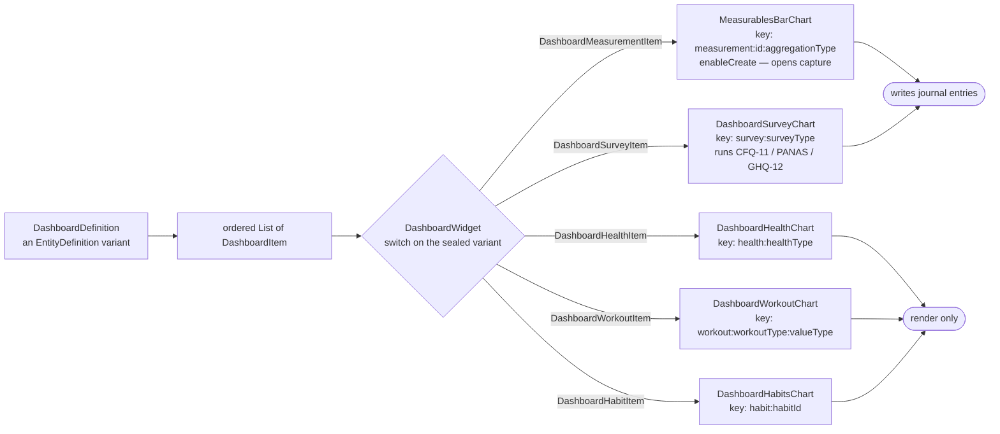

The dashboards feature reads stored `DashboardDefinition` entities, routes each
`DashboardItem` to the right chart widget, and keeps those charts refreshed from
journal-backed data.

**This is a view layer, not a separate analytics warehouse.** The source data
lives in the journal database and neighbouring features; dashboards mostly
assembles and visualizes it — "mostly", because a few charts can also launch
capture flows directly.

# What it owns

Listing active dashboards; locally filtering that list by category; the single
dashboard page lifecycle and its time-range control; routing each item type to
its chart widget; the measurement capture flow reachable from a chart; and the
refresh and caching model that keeps charts current without re-querying on every
notification.

A `DashboardDefinition` is an `EntityDefinition` variant carrying its name,
description, category, visibility flags and an ordered list of `DashboardItem`s.
**The items are the definition** — reordering or removing a chart is an edit to
that list, made in the [settings](settings.md) dashboard editor rather than here.

# Item rendering is a matrix

The sealed `DashboardItem` has **five** variants, and `DashboardWidget` switches
each to exactly one chart widget. Adding a chart type means extending that
matrix, not the page.

Each chart is keyed by **item identity, not range**. The charts keep their last
data across a range change, so the `State` has to follow the item; without
identity keys, replacing an item with another of the same type at the same index
would reuse the old `State` and show the previous item's cached data under the new
header.

**Two of those keys carry a second discriminator**, and it is load-bearing:
`measurement:id:aggregationType` and `workout:workoutType:valueType`. Changing
only the aggregation on the same measurable is therefore a different chart
identity — drop that component and the new aggregation would render against the
old one's retained data.

**Two of the five can write.** A measurement chart is constructed with
`enableCreate: true` and opens the capture flow for its data type, and a survey
chart runs the matching questionnaire — CFQ-11, PANAS or GHQ-12, dispatched on
`surveyType` — which records a survey entry through `PersistenceLogic
.createSurveyEntry`. Both mean recording a value does not require navigating away,
which is why this feature is not purely read-only.

The other three render only: health and workout data arrive from outside the app,
and a habit is completed on its own surface.

# Refresh and caching

Charts subscribe to the notification stream for the entity kinds they render,
rather than rebuilding the whole page on any journal write. The page owns the
selected time range, so changing it re-slices without re-fetching definitions.

# Related

* [Insights](insights.md) - the dedicated time-analysis dashboard, which is a separate surface with its own data path.
