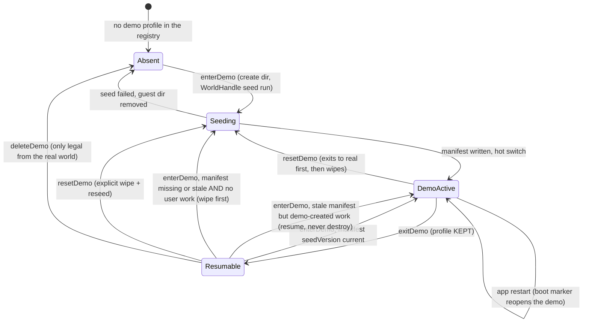

# What this feature owns, and what it does not

The demo feature owns everything that makes the demo world a *product*: the
seed content and its manifest, the seeder, the UI-facing gateway, the
persistent banner, the entry points, the exit sheet with copy-over, and the
guided real-AI enablement. It does **not** own the machinery that makes a
second world possible — the profile registry, the isolation contract, the
in-app switch and its generation-keyed `ProviderScope` rebuild all belong to
`lib/features/profiles/` and are documented in
[profiles and demo mode](../architecture/profiles-and-demo-mode.md). Read
that first: this concept assumes a guest world exists, is isolated, and can
be hot-switched into.

| Owned here | Delegated to profiles |
|------------|-----------------------|
| Seed fixture (`seed/demo_world.dart`, `seed/demo_world_ai.dart`, `seed/l10n/`) | Registry + `profiles.json` |
| `DemoSeeder` + `DemoSeedManifest` | `WorldHandle` (non-active world writes) |
| `DemoModeGateway` (enter/exit/reset/delete/copy decisions) | `ProfileSwitcher` (the actual switch) |
| Banner, entry points, exit sheet, AI setup sheet | `DemoWorldCreator` (create dir → seed → activate ordering) |
| Copy-over candidates + copier | Capability gating (`syncEnabled`, `healthImportEnabled`) |

[`DemoModeGateway`](../../lib/features/demo/state/demo_mode_gateway.dart) is
deliberately **not** in getIt (getIt is reset by the switch it drives); the
UI builds it on demand from the ambient `ProfileSwitcherScope` via
`demoModeGatewayOf`/`maybeDemoModeGatewayOf`.

# The seed manifest is the boundary

One seed run writes the Intergalactic Penguin Logistics fixture plus the
tutorial "first mission", then records what it wrote in
`demo_seed_manifest.json` at the demo world's root: `seedVersion`, seed
timestamp, locale tag, and the full id sets of seeded journal entities,
entity definitions, and AI configs
([`demo_seed_manifest.dart`](../../lib/features/demo/seed/demo_seed_manifest.dart)).
Every later decision reads that file:

- **Resume vs reseed**: `enterDemo` resumes an existing demo profile when
  its manifest's `seedVersion` equals the compiled-in `demoSeedVersion`. A
  missing, malformed, or stale manifest means wipe and recreate — but only
  when the stale world holds no demo-created work: `enterDemo` runs the
  exit sheet's candidate scan against the non-active world first (via a
  `WorldHandle`), and a stale world with user work resumes as-is instead,
  so an app upgrade can never silently destroy something the user made
  (`resetDemo` remains the explicit, confirmed wipe). Bump
  `demoSeedVersion` whenever the seeded world changes in a way that should
  retire existing demo profiles.
- **Copy-over**: only entities whose ids are *not* in the manifest are
  demo-created and therefore candidates.
- **Real-AI detection**: an inference provider whose id is *not* in
  `seededAiConfigIds` is one the user connected for real.

Manifest read failures always degrade in the safe direction: a corrupt
manifest reseeds rather than resumes, over-offers on copy rather than losing
user work, and suppresses the AI nudge rather than blocking a working setup.

The seeder writes exclusively through the `WorldHandle` — never through
getIt or `PersistenceLogic` — in dependency order: category + labels, AI
configs (providers → models → profiles → skills), media bytes from the asset
bundle, journal entities in reference order, the hero-task time link, config
flags (Daily OS and tooltips on; sync, notifications, geolocation, habits,
dashboards off), and FTUE suppression in the demo's own `settings.sqlite`.
Everything arrives with `vectorClock: null` — a guest world has no sync
stack to stamp one.

# Copy-over: closure semantics and the v1 line

Exit offers to carry demo-*created* work into the real world
([`demo_copy_candidates.dart`](../../lib/features/demo/copy/demo_copy_candidates.dart),
[`demo_data_copier.dart`](../../lib/features/demo/copy/demo_data_copier.dart)).
Roots are non-seeded, non-deleted tasks plus entries with no inbound link
(a linked entry travels with its parent instead of being offered twice).
From the selected roots the copier BFS-closes over outbound entry links and
the checklist wiring, **cut off at any manifest-listed id**.

The crossing runs in two phases around the switch: `prepare` reads the full
closure into memory while the demo generation is still active (fresh uuid
per journal entity, internal references — checklist wiring and a task's
`coverArtId` — remapped, media staged to a temp directory, targeting
`/demo_import/` under the real root); `apply` runs after the switch and
writes through `PersistenceLogic`, so every copy gets a real-world vector
clock and syncs like any other entity. Entry links keep their relationship
semantics (`EntryLinkType`) and `collapsed` flag across the crossing, and
each applied entity is indexed into the real world's FTS5 table —
`createDbEntity` deliberately never touches FTS, so without this the copies
would be invisible to search until edited. Category and label definitions
travel with their **original** ids and are upserted idempotently; so are
user-created AI configs (per-device configuration, not content that could
collide).

Deliberate v1 exclusions, documented rather than accidental:

- **Edits and additions to seeded entities do not copy.** An entry the user
  attached to a seeded task has an inbound link and is never offered; a
  checklist item added to a seeded checklist is cut off by the manifest
  boundary.
- **Seeded AI fixtures never copy.** The fictional providers, models,
  profiles, and skills exist only to make the demo look real; only
  user-connected providers (and their user-created dependents) appear in the
  exit sheet's "AI setup" group.

# The real-AI nudge

The seeded AI configs point at fictional endpoints that can never answer, so
AI in the demo starts as scenery. The gate
([`demo_ai_gate.dart`](../../lib/features/demo/ai/demo_ai_gate.dart)) exposes
`demoRealAiAvailableProvider` — true once any non-manifest inference
provider exists — and `shouldNudgeForRealAi`, which short-circuits to false
outside the demo. The AI trigger surface (`unified_ai_popup_menu.dart`)
consults it before opening the skills modal: in the demo with no real
provider, the tap is intercepted by
[`DemoAiSetupSheet`](../../lib/features/demo/ui/demo_ai_setup_sheet.dart) —
the *same* connect + API-key panels onboarding uses, writing through the
active (demo) generation's `AiConfigRepository` into the demo's own
`ai_config.sqlite` — and on success the intercepted action retries. A
settings row offers the same flow proactively. The key stays inside the demo
world unless the user copies the AI setup over on exit; the explicit
copy-over remains the single demo→real crossing point.

Connecting alone is not enough for the seeded tasks: they were written
straight into the world, so they carry neither an agent nor a
`TaskData.profileId`, and `ProfileAutomationResolver.resolveForTask` would
find nothing to run. The moment the key panel reports a connected provider,
[`demo_real_ai_wiring.dart`](../../lib/features/demo/ai/demo_real_ai_wiring.dart)
points the demo world at the provider's bundled profile
(`onboardingSeededProfileId`): the seeded category gets it as
`defaultProfileId` (only if the user hasn't set one), and every non-deleted
task without a `profileId` — seeded fixtures plus tasks created before
connecting — is stamped with it. Both writes are idempotent, run
fire-and-forget inside the demo generation, and a failure only degrades back
to the pre-connect behavior (logged, never surfaced).

# Entry points and chrome

Three ways in, one strip while inside:

- Onboarding welcome modal: "Explore with sample data" (recorded neither as
  completed nor skipped — the real FTUE cadence is not burned).
- Tasks empty state: `DemoTryButton`, self-gating on "journal truly empty"
  (zero rows, not filtered-empty) and not already in the demo.
- Settings → Onboarding panel: Try/Resume, and while active: real-AI row,
  Exit (opens the exit sheet), Reset, Delete.

`DemoModeScaffold` wraps the app shell in `beamer_app.dart` and mounts the
persistent banner while a demo world is active — structural height (a
Column, never an overlay), absorbing the top safe-area itself. Entry and
reset push a blocking full-screen progress route; the generation switch
replaces the entire tree, which is also why no post-exit toast can report
the copied-item count (the gateway returns it for logs and tests only).

# Content ownership — do not grow the fixture

`ManualDemoWorld.penguinLogistics()` is the manual's deterministic
screenshot fixture first and the demo seed second: the manual screenshot
suites and the tutorial-video harness depend on its output staying
pixel-identical. **Never add demo-only content there.** Demo-only content
goes in
[`DemoTutorialContent`](../../lib/features/demo/seed/demo_tutorial_content.dart),
which is seeded *on top of* the fixture and invisible to the screenshot
suites. World content strings live in the `DemoSeedText` locale tables under
`seed/l10n/` (one source for manual screenshots and the production seed),
not in ARB files.

Related: [profiles and demo mode](../architecture/profiles-and-demo-mode.md)
for isolation and switching,
[ADR 0049](../../docs/adr/0049-profile-scoped-storage-and-demo-mode.md) for
the storage-scoping decision, and
[onboarding](onboarding.md) for the welcome flow the demo hooks into.
