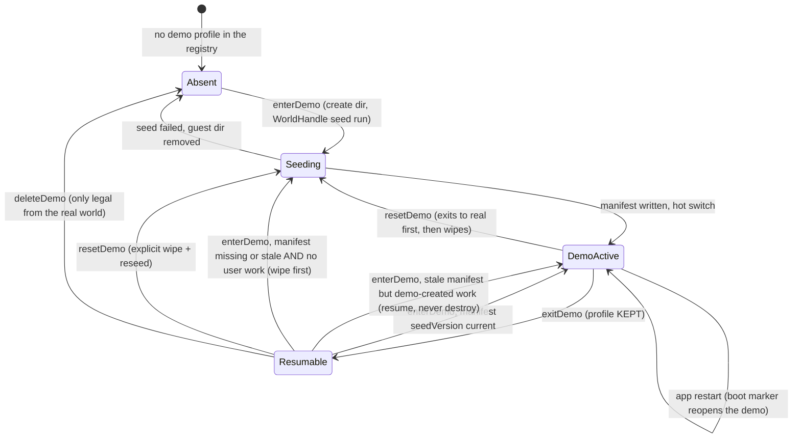
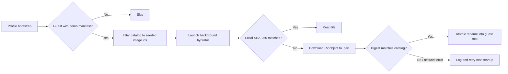

# What this feature owns, and what it does not

The demo feature owns everything that makes the demo world a *product*: the
seed content and its manifest, the seeder, the UI-facing gateway, the
persistent banner, the entry points, the exit sheet with copy-over, and the
guided real-AI enablement. It does **not** own the machinery that makes a
second world possible — the profile registry, the isolation contract, the
in-app switch and its generation-keyed `ProviderScope` rebuild all belong to
`lib/features/profiles/` and are documented in
[profiles and demo mode](../architecture/profiles-and-demo-mode.md). Read
that first: this concept assumes a guest world exists, is isolated, and can
be hot-switched into.

| Owned here | Delegated to profiles |
|------------|-----------------------|
| Seed fixture (`seed/demo_world.dart`, `seed/demo_world_ai.dart`, `seed/l10n/`) and R2 media catalog | Registry + `profiles.json` |
| `DemoSeeder` + `DemoSeedManifest` | `WorldHandle` (non-active world writes) |
| `DemoModeGateway` (enter/exit/reset/delete/copy decisions) | `ProfileSwitcher` (the actual switch) |
| Banner, entry points, exit sheet, AI setup sheet | `DemoWorldCreator` (create dir → seed → activate ordering) |
| Copy-over candidates + copier | Capability gating (`syncEnabled`, `healthImportEnabled`) |

[`DemoModeGateway`](../../lib/features/demo/state/demo_mode_gateway.dart) is
deliberately **not** in getIt (getIt is reset by the switch it drives); the
UI builds it on demand from the ambient `ProfileSwitcherScope` via
`demoModeGatewayOf`/`maybeDemoModeGatewayOf`.

# The seed manifest is the boundary

One seed run writes the Intergalactic Penguin Logistics fixture plus the
tutorial "first mission", then records what it wrote in
`demo_seed_manifest.json` at the demo world's root: `seedVersion`, seed
timestamp, locale tag, and the full id sets of seeded journal entities, entry
links, entity definitions, and AI configs
([`demo_seed_manifest.dart`](../../lib/features/demo/seed/demo_seed_manifest.dart)).
Every later decision reads that file:

- **Resume vs reseed**: `enterDemo` resumes an existing demo profile when
  its manifest's `seedVersion` equals the compiled-in `demoSeedVersion`. A
  missing, malformed, or stale manifest means wipe and recreate — but only
  when the stale world holds no demo-created work: `enterDemo` scans the
  non-active world's RAW rows against the manifest first (via a
  `WorldHandle`) — any non-deleted journal row not listed in the manifest,
  any non-manifest active entry link, or any non-manifest inference provider
  (the user's API key), counts. v4 manifests predate the link inventory, so
  their deterministic seeded link IDs remain a compatibility allow-list.
  Deliberately not the exit sheet's candidate scan, which drops non-seeded
  entries with inbound links (a recording attached to a seeded task) and
  would green-light wiping them. A stale world with user work resumes
  as-is, so an app upgrade can never silently destroy something the user
  made (`resetDemo` remains the explicit, confirmed wipe). Bump
  `demoSeedVersion` whenever the seeded world changes in a way that should
  retire existing demo profiles.
- **Copy-over**: only entities whose ids are *not* in the manifest are
  demo-created and therefore candidates.
- **Real-AI detection**: an inference provider whose id is *not* in
  `seededAiConfigIds` is one the user connected for real.

Manifest read failures always degrade in the safe direction: a corrupt
manifest reseeds rather than resumes, over-offers on copy rather than losing
user work, and suppresses the AI nudge rather than blocking a working setup.

The seeder writes exclusively through the `WorldHandle` — never through
getIt or `PersistenceLogic` — in dependency order: categories + labels +
habits, AI configs (providers → models → profiles → skills), journal entities
in reference order (including R2-backed image metadata and habit completions,
which is why the habit definitions precede them), then every
`linked_entries` row (links last, because both endpoints must already exist),
config flags (Daily OS, tooltips and the habits page on; sync, notifications,
geolocation and dashboards off), and FTUE suppression in the demo's own
`settings.sqlite`.

The habits page is on because the world carries seven habits — six active
logistics/operations routines and one retired — with four weeks of completion
history ending *yesterday*, so the demo opens with real streaks and something
still to tick off. The history is deliberately imperfect: it contains skips
and failures, because a page of unbroken green teaches nothing about the states.
Everything arrives with `vectorClock: null` — a guest world has no sync
stack to stamp one.

# R2 media is best-effort, never part of seeding

The catalog in
[`demo_media_asset.dart`](../../lib/features/demo/media/demo_media_asset.dart)
contains immutable versioned object keys, SHA-256 digests, owning task/category
ids, relative capture times, cover roles, and localized captions. The source
files live only in Cloudflare R2; the app bundle contains no demo artwork.

After each profile bootstrap, `registerDemoMediaHydration` first proves the
active guest is this product demo by reading its seed manifest. It filters the
current catalog to image ids that manifest actually owns, then intersects that
set with non-deleted database rows — essential when an older demo is resumed
to protect user work, and so a permanently purged seeded image stays purged —
and launches a bounded-concurrency
`DemoMediaHydrator` without awaiting or registering it as switch-blocking
startup work. Its getIt disposal callback cancels in-flight requests when the
user leaves the demo. Existing files are accepted only when their digest
matches. Catalog directories are created synchronously before the background
work begins, so mounted cover widgets can install their file watchers. Missing
or corrupt objects download to `.part`, pass the catalog checksum, and rename
atomically inside that guest root. Individual failures are
logged and contained; placeholders remain usable and the next startup retries
the incomplete catalog.

`DemoMediaHydrator.progress` publishes the successfully verified or installed
catalog count against the manifest-owned total, plus any failed or cancelled
items. `DemoModeBanner` observes that snapshot with the shared determinate
progress component: it hides only after every asset succeeds; otherwise it
keeps the incomplete count visible and explains that failed items retry on the
next startup. The workspace stays usable without one live announcement per
image.

# Copy-over: closure semantics and the v1 line

Exit offers to carry demo-*created* work into the real world
([`demo_copy_candidates.dart`](../../lib/features/demo/copy/demo_copy_candidates.dart),
[`demo_data_copier.dart`](../../lib/features/demo/copy/demo_data_copier.dart)).
Roots are non-seeded, non-deleted tasks plus entries with no inbound link
(a linked entry travels with its parent instead of being offered twice).
From the selected roots the copier BFS-closes over outbound entry links and
the checklist wiring, **cut off at any manifest-listed id**.

The crossing runs in two phases around the switch: `prepare` reads the full
closure into memory while the demo generation is still active (fresh uuid
per journal entity, internal references — checklist wiring and a task's
`coverArtId` — remapped, media staged to a temp directory, targeting
`/demo_import/` under the real root); `apply` runs after the switch and
writes through `PersistenceLogic`, so every copy gets a real-world vector
clock and syncs like any other entity. Entry links keep their relationship
semantics (`EntryLinkType`) and their `collapsed` and `hidden` flags across
the crossing, and each applied entity is indexed into the real world's FTS5
table — `createDbEntity` deliberately never touches FTS, so without this the
copies would be invisible to search until edited. Category and label
definitions travel with their **original** ids and are upserted
idempotently; so are user-created AI configs (per-device configuration, not
content that could collide).

`apply` re-resolves the carried AI configs against the TARGET world before
anything references them: an id that already exists there is skipped —
including as a tombstone, which additionally takes carried dependents down
transitively (models without their provider, profiles without their
thinking model; optional slots and skill assignments are pruned, and a
carried skill only lands while a surviving profile still references it). A
`TaskData.profileId` or `CategoryDefinition.defaultProfileId` stamped by
the demo's real-AI wiring survives only when the referenced profile is
usable in the target (carried and saved, or already live there); anything
else is cleared rather than left dangling.

Deliberate v1 exclusions, documented rather than accidental:

- **Edits and additions to seeded entities do not copy.** An entry the user
  attached to a seeded task has an inbound link and is never offered; a
  checklist item added to a seeded checklist is cut off by the manifest
  boundary.
- **Seeded AI fixtures never copy.** The fictional providers, models,
  profiles, and skills exist only to make the demo look real; only
  user-connected providers (and their user-created dependents) appear in the
  exit sheet's "AI setup" group.

# The real-AI nudge

The seeded AI configs point at fictional endpoints that can never answer, so
AI in the demo starts as scenery. The gate
([`demo_ai_gate.dart`](../../lib/features/demo/ai/demo_ai_gate.dart)) exposes
`demoRealAiAvailableProvider` — true once any non-manifest inference
provider exists — and `shouldNudgeForRealAi`, which short-circuits to false
outside the demo. The AI trigger surface (`unified_ai_popup_menu.dart`)
consults it before opening the skills modal: in the demo with no real
provider, the tap is intercepted by
[`DemoAiSetupSheet`](../../lib/features/demo/ui/demo_ai_setup_sheet.dart) —
the *same* connect + API-key panels onboarding uses, writing through the
active (demo) generation's `AiConfigRepository` into the demo's own
`ai_config.sqlite` — and on success the intercepted action retries. A
settings row offers the same flow proactively. The key stays inside the demo
world unless the user copies the AI setup over on exit; the explicit
copy-over remains the single demo→real crossing point.

Connecting alone is not enough for the seeded tasks: they were written
straight into the world, so they carry neither an agent nor a
`TaskData.profileId`, and `ProfileAutomationResolver.resolveForTask` would
find nothing to run. The moment the key panel reports a connected provider,
[`demo_real_ai_wiring.dart`](../../lib/features/demo/ai/demo_real_ai_wiring.dart)
points the demo world at the provider's bundled profile
(`onboardingSeededProfileId`): the seeded category gets it as
`defaultProfileId` (only if the user hasn't set one), and every non-deleted
task without a `profileId` — seeded fixtures plus tasks created before
connecting — is stamped with it. Both writes are idempotent and run inside
the demo generation, concurrently with the success beat; the
intercepted-action retry (`DemoAiSetupSheet.show`'s `onConfigured`) awaits
them (bounded) so the retried skill run never races the stamping. A wiring
failure only degrades back to the pre-connect behavior (logged, never
surfaced).

# Entry points and chrome

Three ways in, one strip while inside:

- Onboarding welcome modal: "Explore with sample data" (recorded neither as
  completed nor skipped — the real FTUE cadence is not burned).
- Tasks empty state: `DemoTryButton`, self-gating on "journal truly empty"
  (zero rows, not filtered-empty) and not already in the demo.
- Settings → Onboarding panel: Try/Resume, and while active: real-AI row,
  Exit (opens the exit sheet), Reset, Delete.

`DemoModeScaffold` wraps the app shell in `beamer_app.dart` and mounts the
persistent banner while a demo world is active — structural height (a
Column, never an overlay), absorbing the top safe-area itself. Entry and
reset push a blocking full-screen progress route; the generation switch
replaces the entire tree, which is also why no post-exit toast can report
the copied-item count (the gateway returns it for logs and tests only).
Copy-apply *failures* do surface, though: they happen after the switch, so
the gateway reports them into the static `DemoCopyFailureNotices` mailbox
(which survives both the getIt reset and the tree replacement) and the new
generation's `DemoModeScaffold` — mounted in every generation — drains it
into an error toast.

# Content ownership — one world, grown additively

`ManualDemoWorld.penguinLogistics()` is the manual's deterministic screenshot
fixture *and* the production demo seed. There is exactly one world; there is
no production-only content layer beside it.

**The rule is additive only: never rename, remove or reorder an existing id,
name or list position.** Eight manual pages quote the original nine task
names as literal text and the screenshot suites resolve them by id, so those
nine stay first, in order, with their strings unchanged — `demo_world_test`
pins that as `originalTaskIds`. Growth is appended after them. Demo-only
content (the guided "first mission") still goes in
[`DemoTutorialContent`](../../lib/features/demo/seed/demo_tutorial_content.dart),
seeded *on top of* the world and invisible to the screenshot suites. World
content strings live in the `DemoSeedText` locale tables under `seed/l10n/`
(one source for manual screenshots and the production seed), not in ARB
files — and `demo_seed_text_test` fails if any string the builders pass
through `t()` is missing from any of the nine catalogs.

The shared world is 28 tasks in four clusters (launch readiness, habitat
engineering, logistics & supply, colony life) across three categories, wired
by more than 160 `linked_entries` rows to each other and to 21 notes, 11
logged-time records, 28 unique covers, and 60 supporting photos/artifacts. The
tutorial adds the twenty-ninth cover and two more artifacts, for 91 R2 images
overall. Every task has at least one non-image activity record, two attachments,
and its cover; the four operational hubs have a third attachment. That web is what the
[knowledge graph](../../lib/features/knowledge_graph/README.md) walks:
it BFSes two hops from the focus task, so a fixture of isolated tasks would
render a single node. Four hub tasks carry six or more neighbours; every
task carries at least two, and the whole task web sits within three hops of
the hero task.

## Every seeded id is a UUID

The world file names its entities by readable slug — `task-air-scrubbers`,
`note-scrubber-order`, `manual-rehearsal-item-2` — but what reaches the
database is
[`demoUuid(slug)`](../../lib/features/demo/seed/demo_ids.dart): a v5 UUID
derived under a namespace that is fixed forever, so the same slug always
yields the same id on every machine, run and app version.

This is not cosmetic. Seeded entities live in a real world and must be
indistinguishable from anything the user made there, and two mechanisms
read a journal-entity id as a UUID:

- the route locations gate their detail page on `isUuid`
  ([`TasksLocation`](../../lib/beamer/locations/tasks_location.dart),
  [`JournalLocation`](../../lib/beamer/locations/journal_location.dart),
  and the events/dashboards locations). A non-UUID id opens *nothing*: on
  desktop `resetDesktopTaskDetail(null)` clears the pane, on mobile no
  `BeamPage` is pushed. The URL changes, the screen does not, and there is
  no error — the tap simply appears not to have happened. Settings is
  unaffected because `SettingsLocation` has no such gate, which is why a
  slug-id world could still walk the whole settings tree;
- [`getIdFromSavedRoute`](../../lib/services/nav_service.dart) extracts the
  linked id from the persisted route with a UUID regex, which is how the
  global create-entry commands know what to link the new entry to.

Slug ids for entity *definitions* (categories, labels) and AI configs are
fine — nothing routes them through `isUuid` — but journal entities,
checklist items and `linked_entries` rows all go through `demoUuid`.
Changing the derivation namespace orphans every already-seeded world, so
`demoSeedVersion` must be bumped alongside it.

## Dates are semantic, not calendar literals

[`DemoDates`](../../lib/features/demo/seed/demo_dates.dart) resolves every
due date, creation stamp and logged session against the injected `now`:
`today(17)`, `tomorrow(9)`, `overdue(2)`, `nextMonday(9)`,
`pastWeekday(3, 14)`. Two properties matter:

- **Whole-day snapping.** A value authored as `anchor + 3h` becomes tomorrow
  when the demo is entered at 23:00; `today(17)` is today's date whatever
  the clock says. Overdue content is at least two days back, so no chip
  depends on the seeding hour.
- **Byte-identity under the fixed clock.** Every original due date already
  *meant* "today at 12:00" relative to `manualDemoNow`, so expressing it
  semantically leaves the screenshot fixture unchanged. Creation and
  tracking stamps on the original nine still track `now` by a rigid delta;
  expansion content deliberately does not, because it snaps to day
  boundaries.

Related: [profiles and demo mode](../architecture/profiles-and-demo-mode.md)
for isolation and switching,
[ADR 0049](../../docs/adr/0049-profile-scoped-storage-and-demo-mode.md) for
the storage-scoping decision, and
[onboarding](onboarding.md) for the welcome flow the demo hooks into.
