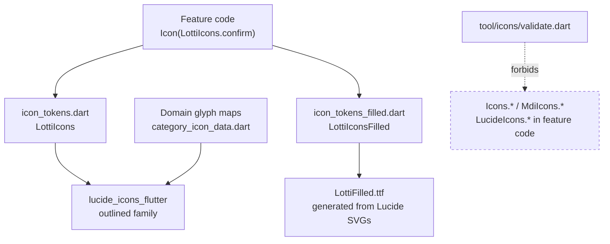

# Why this exists

Icons used to be chosen glyph-by-glyph at the call site: 1,741 references to
`Icons.*` and `MdiIcons.*` across 449 files, spelling 593 distinct Material
symbols. Two consequences followed, and both were structural rather than
cosmetic.

The same idea wore different faces. One "dismiss" was spelled `close`, `clear`
and `cancel`; one affirmative tick was spelled four ways across the
`_rounded` / `_outlined` / bare variants. Nothing was wrong at any single call
site — the inconsistency only existed between them, which is precisely what
code review cannot see.

And the icon family was unchangeable. Committing to a different set meant
editing 449 files, so the app was locked into whatever it had started with.

Naming the *intent* instead of the glyph fixes both. `LottiIcons` is the whole
UI vocabulary — 239 tokens covering every one of those Material and MDI
concepts — and it is the only place the app names an icon family. The
migration is complete: `lib/`, `test/` and `integration_test/` contain no
`Icons.*` or `MdiIcons.*` at all, and the `flutter_material_design_icons`
dependency is gone.

# The layers

Feature code names an intent. The token layer resolves it to a glyph. Only the
token file and the allow-listed domain maps ever mention Lucide.

# What belongs where

`LottiIcons` carries **UI vocabulary**: actions, status, navigation, structure —
things whose meaning is the same wherever they appear. Pick by meaning, never by
appearance. Two tokens may resolve to the same glyph today (`expand` and
`chevronDown` are both a down chevron); they stay separate because they answer
to different intents, and either can be retuned without disturbing the other.

**Domain pictograms** stay out. A category's icon, an entry type, a health data
kind — these stand for a value the user picked, not for an interaction, and they
already live behind an enum in their own map (`category_icon_data.dart` and
friends). Those maps are allow-listed to reference Lucide directly. Folding
several hundred one-off pictograms into `LottiIcons` would make the vocabulary
unsearchable without making it any more consistent.

The persisted value in those maps is the **enum**, never the glyph, so
re-pointing a domain map at a different icon is a display change and needs no
data migration.

# Filled states

Lucide is stroke-only by design, and that is most of why the app reads as one
family now. It costs exactly one thing: Material let a *toggle* show its
on-state as the same glyph, filled. Migrating turned each of those into
`state ? X : X` — a no-op.

Most of those sites also change colour, so they degraded rather than broke, and
they now carry the state in colour alone (which is the idiomatic answer for an
outline-only set). One did not: `entry_detail_header`'s flag had no colour
signal, so a flagged entry became indistinguishable from an unflagged one.

`LottiIconsFilled` closes that: an eight-glyph font generated from **Lucide's own
SVG geometry** with the silhouette filled — same shapes, same optical weight, no
second icon family. Only glyphs whose outline is a single closed silhouette can
be built this way; `book` fills to a featureless square, and `list`,
`chartColumn` and `users` are open strokes. `tool/icons/filled_font/README.md`
carries the build, the exclusions, and why `flag` needed its pole re-added.

One of the eight is not a toggle. `square` is the timer's stop control — the
entry footer's `DurationWidget` and the task action bar's tracking pill —
where the outline read as an empty checkbox. The footer's continue control
reuses `circle` as a full-size record dot; it used to be Lucide's `dot`, a
~4px mark inside a 20px glyph that all but vanished beside "Duration: 0m".
The two states share one glyph size so the footer keeps its footprint when
the timer flips.

Codepoints are assigned positionally by the generator, so **adding a glyph
renumbers every glyph after it**. `icon_tokens_filled_test.dart` derives the
expected numbering from the checked-in SVG sources rather than restating the
constants, which is the only thing that catches that.

# The guard

`make icon_check` enforces two rules:

1. No `Icons.*` or `MdiIcons.*` in `lib/`.
2. `LucideIcons.*` only in `icon_tokens.dart` and the domain allow-list.

The baseline in `tool/icons/baseline.json` now reads zero, so rule 1 is
effectively absolute: any reintroduced `Icons.*` fails the build. The ratchet
machinery stays because it is what got the count to zero — it let the migration
land without ever leaving `main` red — and because it is the natural shape for
the next such sweep.

Rule 2 is never ratcheted — reaching past the token layer is a design error
regardless of how much legacy a file still holds, and `--update-baseline`
deliberately refuses to launder it away.

`dart run tool/icons/validate.dart --update-baseline` regenerates the baseline;
with the migration complete it should only ever write zero again.

# Gotchas

- **`new` is a reserved word.** The "newly available / verified" token is named
  `verified` for that reason.
- **Lucide ships nine stroke weights** (`check100` … `check900`) and mirrored
  `…Dir` forms. Tokens must bind the *base* glyph; mixing weights would put
  different stroke widths side by side, which is the inconsistency this whole
  concept exists to remove. `icon_tokens_test.dart` fails the build on it.
- **Screenshot tests had their own font loaders.** Three of them, two
  hardcoding families by path and hunting the pub cache for the MDI webfont by
  name — so Lucide rendered as tofu in captures while the app was fine. They
  now all delegate to the manifest-driven `loadAppFonts()`. A capture that
  shows boxes is a broken loader, not a broken icon.
- **The guard's regexes use a lookbehind** to keep `LucideIcons.` and
  `MdiIcons.` from counting as the Material family. Without it the ratchet
  could never reach zero, because every migrated call site would keep counting
  as debt.

# Related

* [Design tokens and theming](tokens-and-theming.md) - the generated colour,
  spacing and typography pipeline these sit alongside.
* [Component contracts](component-contracts.md) - token-first sizing, including
  the glyph dimensions icons are rendered at.
