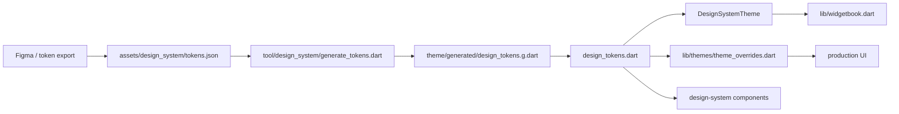

# The pipeline



`make design_system_import` runs the generator and formats its output. The
generator reads `tokens.json`, converts it into nested typed classes, emits
`DsTokens` as a `ThemeExtension`, and **writes the generated file into source
control**.

**The generator reads exactly four top-level groups**: `color`, `typography`,
`spacing`, `borderRadius` — producing `dsTokensLight` and `dsTokensDark`, and a
typed surface of colors, typography, spacing and radii.

**There is no sizing or motion group in the export.** If the export grows, the
seam to update is the generator, not every component downstream. Two token
sets are hand-authored outside this pipeline for the same reason — their
values are brightness-invariant, so nothing lerps, and neither exists as a
Figma variable to import: **motion** (`motion_tokens.dart`, because `Duration`
and `Curve` are not lerp-able — see
[agent UI surfaces](../agents/ui-surfaces.md)) and **sizing**
(`sizing_tokens.dart`: `IconSizes` for glyph dimensions, `BorderWidths` for
strokes). Before the sizing set existed, call sites borrowed
`tokens.spacing.stepN` as icon and stroke dimensions, which retuned glyphs
whenever the gap scale moved.

## One token, three names

The generator renames as it goes, so the same token reads differently in each
tool. They are one token with normalised naming, not three concepts:

| Where | Form |
|-------|------|
| Figma (node inspect panel, under Colors) | `background/02` |
| `assets/design_system/tokens.json` | `color.background.02` |
| Dart | `tokens.colors.background.level02` |

**Tracing a token backwards through that table is how to resolve a visual value**
— not hard-coding a substitute at the call site because the name looks absent.

Two rules produce the Dart form, and they are easy to conflate:

- A **purely numeric key** becomes `levelNN`, zero-padded to two digits, **only
  when its parent group is `background` or `decorative`**.
- Any other name that would start with a digit gets a `value` prefix instead, so
  a numeric leaf elsewhere in the tree is `value02`, not `level02`.

Everything else is lower-camel-cased with `/` and `-` treated as word breaks.

# Two runtime theme paths

| Path | Purpose |
|------|---------|
| `DesignSystemTheme.light()` / `.dark()` | A standalone `ThemeData` built from the tokens — maps colors into a `ColorScheme`, typography into a `TextTheme`, and attaches the active `DsTokens` as a `ThemeExtension`. **The design-system-native theme used by Widgetbook.** |
| `theme_overrides.dart` `withOverrides` | Injects `dsTokensLight`/`dsTokensDark` into the **app** theme's `extensions`, so production widgets get the same token tree without swapping wholesale. |

That split matters: one is the clean standalone sandbox, the other is the
integration path.

## The access API

```dart
final tokens = context.designTokens;
```

`designTokens` throws a `StateError` when the extension is missing. **The explicit
null check is deliberate** — missing token injection is a wiring bug, not
something a widget should quietly improvise around.

# The alert ramp: `default` fills, `ink` writes

`colors.alert.{error,success,warning,info}` carries four steps, and which one a
call site binds is **a contrast decision, not a taste one**:

| Step | Role | Obligation |
|------|------|------------|
| `defaultColor` | Fills, dots, borders, glyphs, chart series | ≥ 3:1 on `background.level01`/`level02` (WCAG SC 1.4.11) |
| `hover` / `pressed` | Interaction states of a control already using the tone | Inherits the control's |
| `ink` | **Any alert-toned text**, and the glyph paired with it | ≥ 4.5:1 (SC 1.4.3) |

**`ink` is not a fifth hue.** It resolves per brightness to the least-extreme step
of the same ramp that clears AA — `pressed` in light for success/warning/info,
`hover` in light and dark for error, `defaultColor` in dark for the rest. Widgets
used to make that pick by hand with `brightness` branches; **that is now the
token's job.**

Two consequences worth stating plainly:

- **A component painting the tone as both a fill and a label needs both
  bindings.** `DesignSystemBadge` is the reference: fill and outline take
  `defaultColor`, label and glyph take `ink`.
- **The light ramp's `defaultColor` and `hover` currently coincide** for warning,
  success and info. The exported light `default` sat at 2.15–2.96:1 against
  level02 — below the non-text floor — so it was moved onto the `hover` value, the
  nearest step that clears it. A future Figma pass should re-derive a distinct
  light `hover`; nothing binds those three today.

`design_tokens_test.dart` pins both floors across all four families and both
brightnesses. **Nothing else in the build checks the palette**, which is how the
light ramp shipped below the floor and stayed there.
