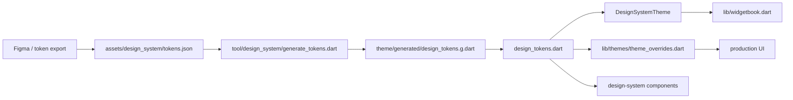
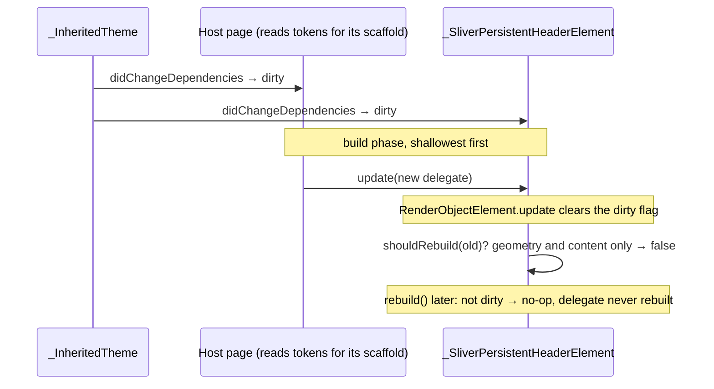

# The pipeline



`make design_system_import` runs the generator and formats its output. The
generator reads `tokens.json`, converts it into nested typed classes, emits
`DsTokens` as a `ThemeExtension`, and **writes the generated file into source
control**.

**The generator reads exactly four top-level groups**: `color`, `typography`,
`spacing`, `borderRadius` — producing `dsTokensLight` and `dsTokensDark`, and a
typed surface of colors, typography, spacing and radii.

**There is no sizing, motion or opacity group in the export.** If the export
grows, the seam to update is the generator, not every component downstream.
Three token sets are hand-authored outside this pipeline for the same reason —
their values are brightness-invariant, so nothing lerps, and none exists as a
Figma variable to import:

| Set | File | Contents |
|-----|------|----------|
| **motion** | `motion_tokens.dart` | `Duration` and `Curve` are not lerp-able — see [agent UI surfaces](../agents/ui-surfaces.md) |
| **sizing** | `sizing_tokens.dart` | `ControlSizes` for visible controls and container tiles, `TapTargets` for interaction shells, `IconSizes` for glyph dimensions, `BorderWidths` for strokes |
| **opacity** | `alpha_tokens.dart` | `SurfaceAlphas` — fades applied to a surface or accent colour that must stay the same hue while receding |

Before the sizing set existed, call sites borrowed `tokens.spacing.stepN` as
control, icon, and stroke dimensions, which retuned them whenever the gap scale
moved. `ControlSizes.iconChip`/`iconChipCompact` exist for the same reason: a
filled tile behind a glyph is a container, not a gap, even where the two happen
to share a number today.

**`SurfaceAlphas` is deliberately small, and an alpha is rarely the answer.**
Two categories look like they need one and do not:

- **Text.** `colors.text.{high,medium,low}Emphasis` *is* the fade ramp for
  type, and each step already carries its own alpha. Fading one further just
  re-derives a step that exists.
- **An error-toned fill.** `colorScheme.errorContainer` is the design system's
  own error wash, derived from `alert.error.defaultColor`. Tinting that colour
  by hand forks the decision.

The exception that earns `SurfaceAlphas.tint` is a **tone-tinted card fill**,
where the tint carries a categorisation. `colorScheme.*Container` cannot
express it: only `errorContainer` keeps its accent, while `primaryContainer`
and `tertiaryContainer` resolve to neutral `background.level02`/`level03`.
Binding those would collapse a three-tone scale into one red and two greys —
which is exactly what `matrix_stats/metrics_grid.dart` uses the tint to avoid.

## One token, three names

The generator renames as it goes, so the same token reads differently in each
tool. They are one token with normalised naming, not three concepts:

| Where | Form |
|-------|------|
| Figma (node inspect panel, under Colors) | `background/02` |
| `assets/design_system/tokens.json` | `color.background.02` |
| Dart | `tokens.colors.background.level02` |

**Tracing a token backwards through that table is how to resolve a visual value**
— not hard-coding a substitute at the call site because the name looks absent.

Two rules produce the Dart form, and they are easy to conflate:

- A **purely numeric key** becomes `levelNN`, zero-padded to two digits, **only
  when its parent group is `background` or `decorative`**.
- Any other name that would start with a digit gets a `value` prefix instead, so
  a numeric leaf elsewhere in the tree is `value02`, not `level02`.

Everything else is lower-camel-cased with `/` and `-` treated as word breaks.

# Two runtime theme paths

| Path | Purpose |
|------|---------|
| `DesignSystemTheme.light()` / `.dark()` | A standalone `ThemeData` built from the tokens — maps colors into a `ColorScheme`, typography into a `TextTheme`, and attaches the active `DsTokens` as a `ThemeExtension`. **The design-system-native theme used by Widgetbook.** |
| `theme_overrides.dart` `withOverrides` | Injects `dsTokensLight`/`dsTokensDark` into the **app** theme's `extensions`, so production widgets get the same token tree without swapping wholesale. |

That split matters: one is the clean standalone sandbox, the other is the
integration path.

## The access API

```dart
final tokens = context.designTokens;
```

`designTokens` throws a `StateError` when the extension is missing. **The explicit
null check is deliberate** — missing token injection is a wiring bug, not
something a widget should quietly improvise around.

### Read tokens in a widget, never in a sliver delegate's `build`

`context.designTokens` is `Theme.of(context)` underneath, so it registers a
theme dependency on whichever element the `context` is. Inside a widget's
`build` that is the widget's own element and the read follows every theme
change. Inside `SliverPersistentHeaderDelegate.build` it is the sliver's
render-object element, and there the dependency can be silently lost:



The settings header hit exactly this: its surface colour was read in the
delegate, the page above it reads tokens for its scaffold colour, and after a
light/dark switch the bar kept the old theme until the route was rebuilt from
scratch. The fix is structural, not a `shouldRebuild` tweak —
`SettingsPageHeader` keeps every theme read in widgets *below* the sliver, so
each owns an element whose dirty flag nothing else clears. Any new delegate
follows the same rule: the delegate carries geometry and content, the widgets
it builds resolve the tokens.

# The alert ramp: `default` fills, `ink` writes

`colors.alert.{error,success,warning,info}` carries four steps, and which one a
call site binds is **a contrast decision, not a taste one**:

| Step | Role | Obligation |
|------|------|------------|
| `defaultColor` | Fills, dots, borders, glyphs, chart series | ≥ 3:1 on `background.level01`/`level02` (WCAG SC 1.4.11) |
| `hover` / `pressed` | Interaction states of a control already using the tone | Inherits the control's |
| `ink` | **Any alert-toned text**, and the glyph paired with it | ≥ 4.5:1 (SC 1.4.3) |
| `glyphOnLevel03` | A static alert-toned glyph on the `background.level03` fill — the mid-grey chip and square fill none of the above is tuned for | ≥ 3:1 on `background.level03` (SC 1.4.11) |

**`ink` is not a fifth hue.** It resolves per brightness to the least-extreme step
of the same ramp that clears AA — `pressed` in light for success/warning/info,
`hover` in light and dark for error, `defaultColor` in dark for the rest. Widgets
used to make that pick by hand with `brightness` branches; **that is now the
token's job.** `glyphOnLevel03` is the same idea for the one surface `ink` does
not cover: `level03` is the mid grey on which no error step reaches AA in dark
and even the surface ink stops at 2.9:1, so a glyph there (the missed-day
cross on a habit square) binds this step rather than borrowing `pressed` for
its contrast — an interaction-state token can be retuned for button feedback
without anyone thinking of a static indicator.

Two consequences worth stating plainly:

- **A component painting the tone as both a fill and a label needs both
  bindings.** `DesignSystemBadge` is the reference: fill and outline take
  `defaultColor`, label and glyph take `ink`.
- **The light ramp's `defaultColor` and `hover` currently coincide** for warning,
  success and info. The exported light `default` sat at 2.15–2.96:1 against
  level02 — below the non-text floor — so it was moved onto the `hover` value, the
  nearest step that clears it. A future Figma pass should re-derive a distinct
  light `hover`; nothing binds those three today.

`design_tokens_test.dart` pins both floors across all four families and both
brightnesses. **Nothing else in the build checks the palette**, which is how the
light ramp shipped below the floor and stayed there.
