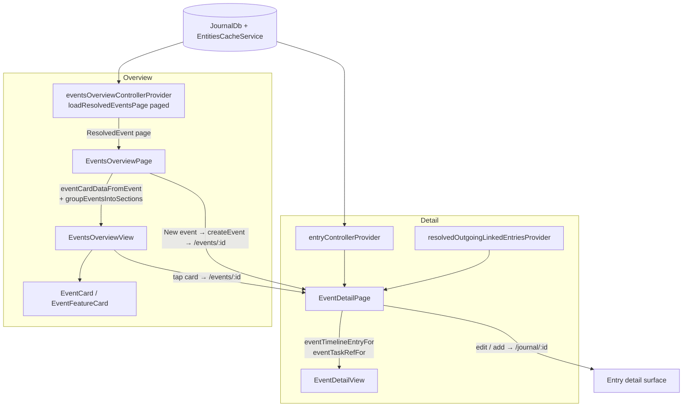

Events are the meaningful moments — a birthday, a trip, a wedding, an upcoming
race — promoted from a bare journal entry type to their own destination with a
memory-forward overview and a photographic detail page.

**Gated behind `enableEventsFlag`.** With it off, events are hidden *everywhere*:
the logbook query drops the `JournalEvent` type, `EntryDetailsWidget` renders a
linked event as nothing, and the tab, create-event and type-filter affordances are
absent.

# An entity, not a task subtype

An event stays its own `JournalEntity.event` with `EventData`. It **reuses** the
generic infrastructure tasks happen to use rather than **inheriting** task
semantics — so it gets linking, categories and the entry substrate without
acquiring statuses, checklists, estimates or a task agent's contract.

# The view layer is pure

Presentational widgets render plain view models; **pages own the glue** — they
watch providers, apply the locale-dependent labelling and grouping the view models
cannot, and feed the result to the widgets. The pure mapping and grouping logic is
unit-tested in isolation.

**Status and relative-date labels are resolved at the presentation boundary** from
the active localizations and locale-aware formatter. Persistence stores only
stable status enums and timestamps, **never rendered copy** — so changing the app
language updates both surfaces immediately without migrating an event.

# One way in

There is **one** way to open an event: `/events/<id>`. Every entry point routes
there — the overview, a logbook card tap, a freshly created event, and a linked
event inside a task's timeline. A linked event renders as a compact summary card
resolved the same way the detail page resolves its cover, **not** the generic
entry editor.

# The hero is the interaction surface

Title is tap-to-edit; category and status pills open shared pickers; the date
line opens the shared date-time modal and is **the single source of the event's
when** — the body no longer repeats it.

**Rating stars only appear once the event has happened** or already carries a
rating, so a fresh or tentative event is not pushed gold stars.

**Cover art becomes automatic then explicit**: while there is no cover, an "add
cover photo" action opens the create-entry menu and the first linked photo becomes
the cover; once one exists, the overflow menu offers a picker over the event's
linked photos.

*Add task* mirrors the linked-tasks flow — create the task linked from the event
(so the event surfaces under the task's "Linked from"), auto-assign the category's
default agent, then beam to the new task.

**When a callback is null the corresponding control is read-only or hidden**, so
the same widget renders cleanly in screenshots and tests. Empty events still
render the Timeline and Tasks scaffolding with tappable hints rather than a blank
void.

# Related

* [Project and event agents](agents/project-and-event-agents.md) - the recap writer, and the human-only rating/cover invariant.
