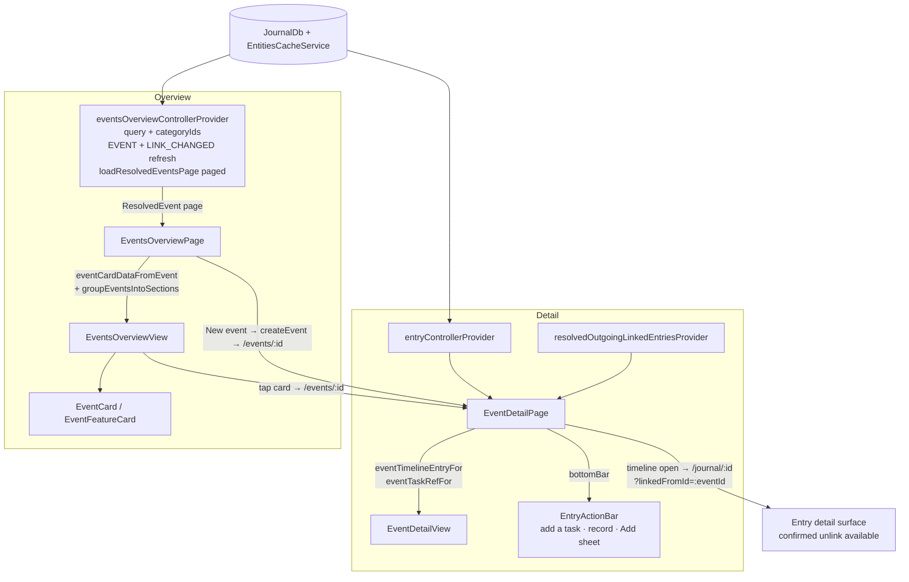
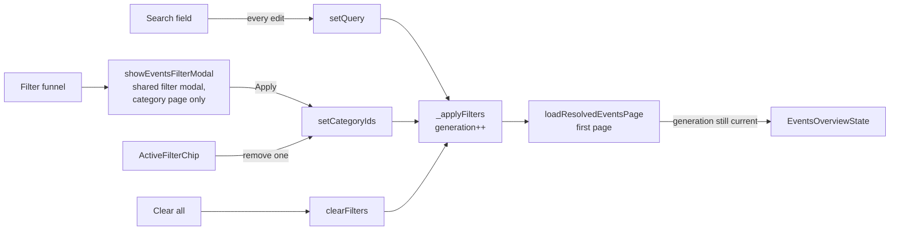

Events are the meaningful moments — a birthday, a trip, a wedding, an upcoming
race — promoted from a bare journal entry type to their own destination with a
memory-forward overview and a photographic detail page.

**Gated behind `enableEventsFlag`.** With it off, events are hidden *everywhere*:
the logbook query drops the `JournalEvent` type, `EntryDetailsWidget` renders a
linked event as nothing, the tab, create-event and type-filter affordances are
absent, and the Daily OS timeline's recorded lane — and the planner's
recorded-time lookback behind it — leave events out.

# An entity, not a task subtype

An event stays its own `JournalEntity.event` with `EventData`. It **reuses** the
generic infrastructure tasks happen to use rather than **inheriting** task
semantics — so it gets linking, categories and the entry substrate without
acquiring statuses, checklists, estimates or a task agent's contract.

# The view layer is pure

```mermaid
flowchart TD
    DB[(JournalDb + EntitiesCacheService)]

    subgraph Overview
      ESP[eventsOverviewControllerProvider<br/>query + categoryIds<br/>EVENT + LINK_CHANGED refresh<br/>loadResolvedEventsPage paged] -->|ResolvedEvent page| OP[EventsOverviewPage]
      OP -->|eventCardDataFromEvent<br/>+ groupEventsIntoSections| OV[EventsOverviewView]
      OV --> CARD[EventCard / EventFeatureCard]
    end

    subgraph Detail
      EC[entryControllerProvider] --> DP[EventDetailPage]
      RLE[resolvedOutgoingLinkedEntriesProvider] --> DP
      DP -->|eventTimelineEntryFor<br/>eventTaskRefFor| DV[EventDetailView]
      DP -->|bottomBar| BAR[EntryActionBar<br/>add a task · record · Add sheet]
    end

    DB --> ESP
    DB --> EC
    OV -->|tap card → /events/:id| DP
    OP -->|New event → createEvent → /events/:id| DP
    DP -->|timeline open → /journal/:id<br/>?linkedFromId=:eventId| LEGACY[Entry detail surface<br/>confirmed unlink available]
```

Presentational widgets render plain view models; **pages own the glue** — they
watch providers, apply the locale-dependent labelling and grouping the view models
cannot, and feed the result to the widgets. The pure mapping and grouping logic is
unit-tested in isolation.

**Status and relative-date labels are resolved at the presentation boundary** from
the active localizations and locale-aware formatter. Persistence stores only
stable status enums and timestamps, **never rendered copy** — so changing the app
language updates both surfaces immediately without migrating an event.

# Finding an event

The overview header is the shared `TabSectionHeader` the Tasks, Projects and
Logbook tabs use — title and bell, then a real search field beside the filter
funnel — and the page, header and card grid share one content column
(`detailContentInsets`), so the title, the field and the first card start on
the same edge. There is no events-only chip row: the category filter works the
way the Tasks filter does.

```mermaid
flowchart LR
    Field[Search field] -->|every edit| SQ[setQuery]
    Funnel[Filter funnel] --> Modal[showEventsFilterModal<br/>shared filter modal,<br/>category page only]
    Modal -->|Apply| SC[setCategoryIds]
    Chip[ActiveFilterChip] -->|remove one| SC
    ClearAll["Clear all"] --> CF[clearFilters]
    SQ --> AF[_applyFilters<br/>generation++]
    SC --> AF
    CF --> AF
    AF --> Load[loadResolvedEventsPage<br/>first page]
    Load -->|generation still current| State[EventsOverviewState]
```

**Search is a substring match over the title and the note text, run in Dart.**
The full-text index does not carry event titles (`Fts5Db.insertText` indexes a
title only for tasks), so matching there would miss the one field a user
searches by. With a query, `loadResolvedEventsPage` reads the whole category
scope, keeps `eventMatchesQuery` hits and pages *those*; without one it pages in
the database as before. Covers resolve only for the returned page either way.

**Every keystroke reloads, and only the newest one lands.** Like the Tasks
search there is no debounce; `_applyFilters` bumps the generation that already
guards `loadMore` and sync refreshes, so a slow earlier keystroke cannot
overwrite a later result. Filter changes merge against the *requested* filter
(`_requestedQuery`, `_requestedCategoryIds`), which runs ahead of the committed
state while a load is in flight — otherwise a category picked before the query
landed would drop the query, and a clear typed before it landed would look like
a no-op. A sync refresh reloads that requested filter too, and every committed
reload bumps the generation once more, so a `loadMore` page read under the old
filter cannot land on the new list. The previous list stays on screen while a reload
runs, and a filter that matches nothing shows an empty state that offers
**Clear all** rather than a blank page.

**Categories are multi-select, behind the funnel.** `showEventsFilterModal` is
the shared `showDesignSystemFilterModal` with only the category field — Unassigned
(`''`) first, then each category with its icon and colour. With a single field
the shared modal opens straight on that field's page (see
[Tasks filtering](tasks/filtering.md#the-filter-modal)). Applied categories show
as `ActiveFilterChip`s in their own colours, the funnel tints, and from two
narrowings up — the query counts as one — a **Clear all** chip ends the session.

**New event** is the page's `DesignSystemFloatingActionButton`, a bare glyph
like Projects'. On phones the navigation launcher docks it instead
(`eventsTabDockAction`). The launcher itself leaves on an event's own page
(`isEventDetailRoute`), which docks the entry action bar in its place — see
[Adding to an event](#adding-to-an-event).

# One way in

There is **one** way to open an event: `/events/<id>`. Every entry point routes
there — the overview, a logbook card tap, a freshly created event, a linked
event inside a task's timeline, and the event's block on the Daily OS Day
timeline. A linked event renders as a compact summary card resolved the same
way the detail page resolves its cover, **not** the generic entry editor.

# On the day

An event with a span is recorded time on the Daily OS Day timeline: it sits on
the recorded lane at the start and end the date line gave it, titled and
coloured as the event itself — never as a task it hangs off — and its block
opens the event page. A cancelled, missed or postponed event stays off the
lane. The
query, the flag gate and the status rule live with the lane, in
[Daily OS UI surfaces](daily_os_next/ui-surfaces.md#tracked-time).

# The hero is the interaction surface

Title is tap-to-edit; category and status pills open shared pickers; the date
line opens the shared date-time modal and is **the single source of the event's
when** — the body no longer repeats it.

**Rating stars only appear once the event has happened** or already carries a
rating, so a fresh or tentative event is not pushed gold stars.

**Cover art becomes automatic then explicit**: while there is no linked photo,
an "add cover photo" action opens the create-entry menu; the **newest** linked
photo then stands in as the cover — a default that moves with every newer
photo, on the overview card and the detail hero alike (`_resolveEventCovers`
and `eventDetailDataFromEntities` pick it the same way, so the two never
disagree). A cover becomes *chosen* only through `coverArtId`, and the view
model says which is which: `EventCardData.coverChosen` and, on the gallery's
photos, `EventPhoto.isCover` (chosen only, never the default — so a `coverArtId`
pointing at an unlinked or deleted photo counts as no choice). Three surfaces
set it, all through `EntryController.updateEventCover`: the overflow menu's
picker (`showEventCoverPicker`), a "Set cover" chip on the hero that opens the
same picker while the cover is only the default, and the full-screen viewer's
"Set cover" pill for the photo in view (`EventPhotoGalleryViewer.onSetCover`,
forwarded through `EventPhotoGrid`). The viewer sits on the root navigator
with a snapshot of the photos, so it advances its own cover id optimistically
to flip the pill to "Cover" at once and awaits the write. The controller's
event edits (`_updateEventData`) return the persistence layer's verdict and
roll their own optimistic state back on `false` (the entity is gone); the
viewer takes the pill back on `false` or on a thrown error — the latter also
captured under the `event_photo_gallery` log domain like the download button
does — and shows the shared save-failed line. One gap is deliberate and lives
below this feature: `updateEvent` logs a storage exception and, by its
documented contract (pinned in `persistence_logic_test`), reports `true`, so
such a failure is invisible to every event edit on the page, not only to the
cover; the grid's "Cover"
badge follows on the page's next resolve. When the grid is capped, the "+N"
tile wears the badge whenever the chosen cover is among the photos it stands
for. The viewer chips — counter, date, badge, labelled action — all sit on one
`ImageViewerPill` shell in the journal's image-viewer widgets.

Linked photos render as a compact grid and open into a swipeable, zoomable
full-screen gallery. The gallery contains each image without changing its aspect
ratio, downloads the currently visible file, shows its capture/file date, hides
all chrome on a single tap, and keeps pinch zoom/pan while rotation is disabled.
It participates in the shared mobile image-viewer orientation lifecycle described
in [shared widgets](../architecture/shared-widgets.md).

The overview controller refreshes its loaded window for event entity
notifications and for `LINK_CHANGED` notifications whose endpoint ids include
an event currently loaded in the overview. Photo links are separate rows from
the event, so listening only for `EVENT` leaves fallback covers stale after
local linking or sync; gating by endpoint avoids reloading covers for unrelated
task and journal links.

Opening a timeline source preserves the event id as `linkedFromId`. Mobile
passes it into the pushed detail page; desktop mirrors it beside the selected
entry id into the split pane. The journal detail resolves that exact live link
and exposes the existing confirmed unlink action; once removed, the link
notification updates the event timeline, gallery, and overview cover without
deleting the photo entry.

**When a callback is null the corresponding control is read-only or hidden**, so
the same widget renders cleanly in screenshots and tests. An empty event renders
the Timeline header over a quiet hint naming what the bar below adds — and no
Tasks section at all.

# Adding to an event

An event is a `JournalEntity`, so its page ends in the very same
`EntryActionBar` an entry's page does ([journal
overview](journal/overview.md#create-import-and-paste)): `EventDetailPage` hands
it to `EventDetailView.bottomBar`, which docks it in the Scaffold's
`bottomNavigationBar` slot over an extended body and consumes its height with a
trailing `SliverPadding`, exactly as `EntryDetailsPage` does. Left to right:

* **Add a task** — `EntryCreationService.createTaskAndOpen` creates the task
  linked *from* the event and in its category (so the event shows under the
  task's "Linked from"), hands it the category's default agent and opens it. A
  task made here is the event's preparation or follow-up.
* **Record** — the shared `GlassRecordButton`
  ([recording UI](speech/recording-ui.md)), lit while a recording linked to
  *this* event is in progress. A recording made here is the event's voice memo.
* **Plus** — the Add sheet (`CreateEntryModal`) with `linkedFromId` set to the
  event, for photos, notes and the long tail.

The sections carry **no add buttons of their own** any more, and the **Tasks
section exists only once a task is linked** — on a wide body the tasks rail
appears with the first task, and an event without one reads as a single column
at every width. The one add affordance outside the bar is the hero's cover pill
while there is no cover ("Add cover photo", which opens the same Add sheet),
because the cover is the hero's own concern.

Two consequences follow the entry page's lead. The page nests a
`ScaffoldMessenger` so a toast raised on it — the delete-failed line, anything
the recap or change-set cards show — floats above the bar rather than at the
window's bottom edge under it. And the mobile shell **unmounts the launcher on
`/events/<uuid>`** — menu button, docked create action and activity island
alike — so the bar docks flush with the home indicator
([navigation](../architecture/navigation.md#chrome-rules-are-pure-functions-of-router-state)).
Go back to reach the overview and its launcher, as on a task or an entry.

# Related

* [Project and event agents](agents/project-and-event-agents.md) - the recap writer, and the human-only rating/cover invariant.
