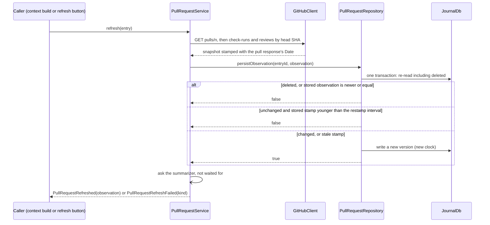
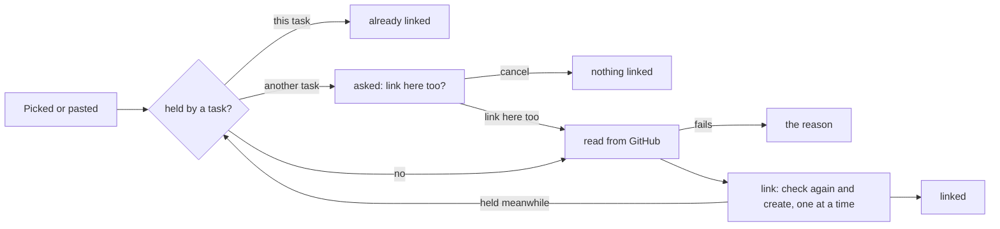
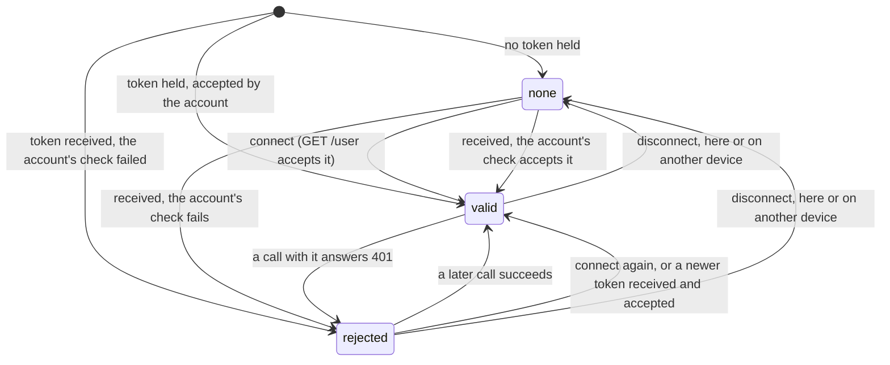
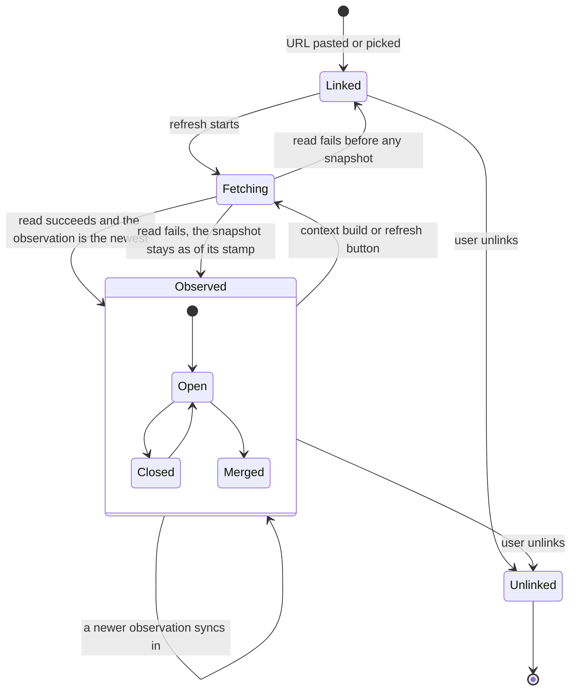
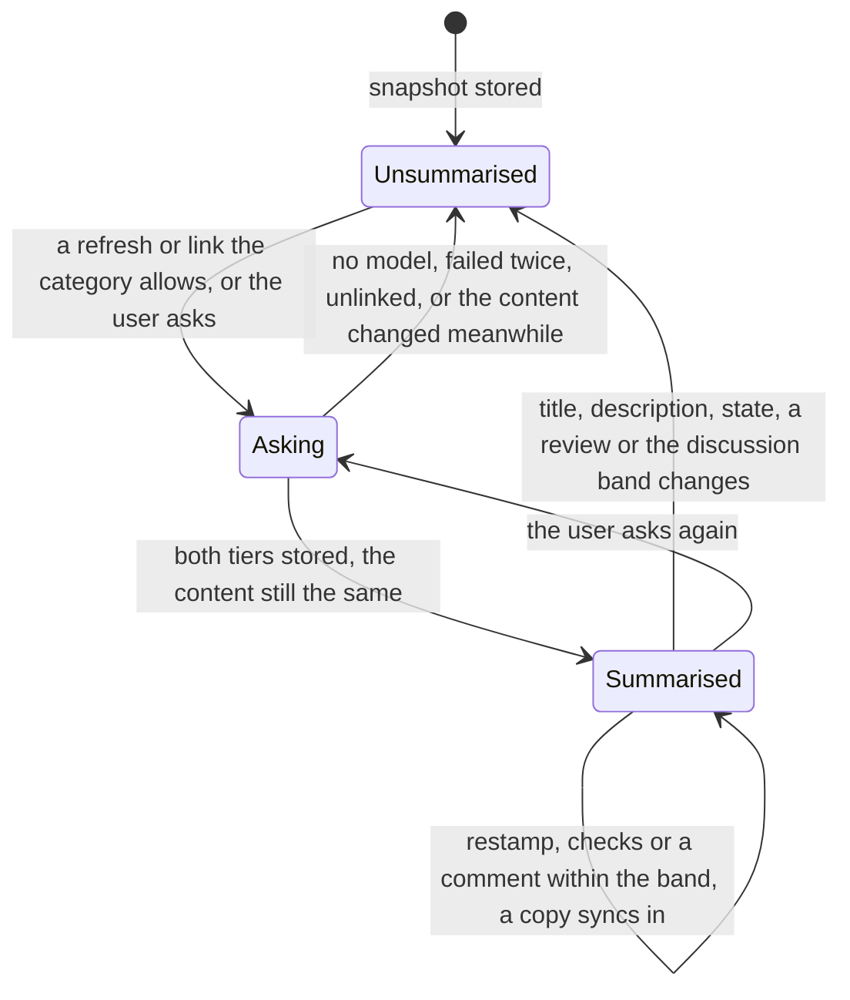

A task can link the GitHub pull requests that implement it. Lotti fetches
their state from the GitHub REST API with the user's own token, keeps a
snapshot of each in the journal, and puts it into every task context it
builds: the coding prompt, and the task agent's wake, whose checklist
proposals the user confirms. That closes the loop that used to run through
screenshots of the pull request page.

**Status: partly built.** The models are
[`PullRequestSnapshot` and `PullRequestAssignment`](../../specs/tla/README.md)
in `specs/tla/`; the code conforms to them, and their headers name the class
that implements each action. Built: the entry and its merge, the token and
the client, linking by URL or from the picker, a pull request serving a
second task only once the user confirms it, a
category's repository, the refresh, the task's card and each pull
request's details, the pull requests in coding prompts and task-agent wakes,
and a two-tier summary of each — a one-liner in the task, a TL;DR in its
contexts, where a merged or closed one is shown in brief. Nothing is behind a config flag: a task shows the
feature once the user turns pull request tracking on for it, which is
offered while this device holds a token GitHub accepts. Still
design: a project's
repository overriding its category's, and recording which checklist items a
coding prompt targeted.

# The entry

A linked pull request is a journal entry, `JournalEntity.pullRequest`
(`PullRequestEntry`), linked from its task with a basic entry link, so it
inherits the task's category and privacy like any child entry. It syncs like
any journal entry: a device without a token still shows what a device with one
last saw, labelled with when.

```text
PullRequestData
  owner, repo, number          identity, fixed when linked
  snapshot?                    null until the first successful refresh

PullRequestSnapshot
  observedAt                   server time of the read (the response's Date header), UTC
  createdAt?                   when it was opened on GitHub, UTC; absent in snapshots
                               stored before it was read, and never in the digest
  title, body                  the description, Markdown
  status                       open | closed | merged      (+ draft flag)
  htmlUrl, headSha, headRef, baseRef, authorLogin
  mergedAt?, closedAt?
  mergeability                 clean | conflicting | behind | blocked | unknown
  checks                       rollup passing | failing | pending | none,
                               counts, the names of failing checks (capped),
                               checkRunsHidden when the token may not read
                               check runs (absent otherwise)
  review                       approved | changesRequested | pending | none,
                               approval and change-request counts
  additions?, deletions?, changedFiles?, commits?
  comments?, reviewComments?   the conversation's and the reviews' comment counts;
                               absent until read, and never in the digest
```

The database row's type is `PullRequest`, and its subtype is
`owner/repo#number`, lower-cased, so the link path can refuse a duplicate
with an indexed lookup. One entry per task and pull request: linking the same
pull request to two tasks makes two entries, which share nothing.

Two devices that link the same pull request to a task before they sync each
create an entry, and sync keeps both. `distinctPullRequests` decides which
one every device shows and refreshes — the lowest id, the same everywhere —
and unlinking deletes every live entry of that pull request on the task, so
the hidden one cannot reappear. A deterministic id would merge the two
instead, but would make a re-link revive an unlinked entry, which the model's
`UnlinkIsFinal` rules out.

# Ordering observations

Two observations of one pull request are ordered by a key, highest first:

1. `observedAt` — the server's clock, which every device shares. Device clocks
   disagree; a device whose clock runs ahead would otherwise win every merge
   until real time caught up.
2. merged before anything else — `Date` has one-second resolution, so two
   reads in one second can differ, and a merge is final: within a second a
   merged observation is the later one.
3. a digest of the snapshot without `observedAt`, `createdAt` and the comment
   counts: SHA-256 over the provenance feature's `canonicalJson`. It carries no recency at all; it only makes the
   order total, so that every device picks the same winner.

The model's digest is deliberately against recency, and the invariants still
hold: nothing relies on it to find the newer state.

# The refresh



Whether the observation was written is not passed on: a caller may call the
observation current either way. A refresh that fails returns its reason and
the caller falls back to what is stored.

Four rules, each a design switch in the model with the counterexample its
absence produces:

| Rule | Without it |
|------|------------|
| Stamp with the response's `Date`, captured when the response arrives (`StampAtRead`) | the write labels an old read with the write time, claiming "open" at an instant it was closed |
| Write only an observation newer than the stored one (`GuardNewer`) | two refreshes finishing out of order put the older one back, and a merged pull request reads open again |
| Re-read inside the transaction and skip a deleted entry (`GuardDeleted`) | an unlink during a refresh is undone |
| Write only a changed snapshot, or an unchanged one whose stamp is old | every refresh notifies the task, which wakes the task agent, whose context refreshes again |

A snapshot stored without `createdAt` or the comment counts counts as
changed once a read brings them, so they are stored at once though the
digest leaves them out. After that a new comment alone is no change: the
counts are stored with the next write, the hourly restamp at the latest, and
a comment never wakes the task agent.

A refresh that fails writes nothing. Its reason — offline, invalid token,
rate limited until a time, not found or no access — stays on the device, in
the refresh service, never in the synced entry: two devices failing for
different reasons would otherwise fight over the entry.

# Across devices

Two devices that refresh at once write concurrent versions. The default
journal rule would make that a `Conflict` row for the user to settle in
Settings, which is wrong for data the app fetched itself. `updateJournalEntity`
already merges one concurrent case on its own — two deletions — and the pull
request entry is the second: the newer observation by the key above, deleted
if either side is, under the join of both clocks. Two unlinks are ordered by
observation too, not by clock. A purge reduces an unlinked entry to a
`JournalEntry` tombstone (ADR 0095); against one, a live pull request version
merges to the tombstone, so a device that was offline through the unlink and
the purge still ends unlinked. Every device that sees the
pair computes the same row, so nothing is sent back (`ResolveConcurrent`;
without it the replicas never converge). An unlink beats a concurrent refresh:
the refresh is the app's, the unlink is the user's.

# The token and the client

- The token is a personal access token. A fine-grained one needs read-only
  "Pull requests" and "Commit statuses" on the repositories worked in; GitHub
  offers fine-grained tokens no permission for check runs, so on a private
  repository it cannot read them (on a public one anyone can). A classic one
  needs the `repo` scope for private repositories. It lives in
  `SecureStorage` as one record under `github_account:<profile id>` — the
  token, the login it was checked against, the stamp of the change, and
  whether this device checked it — so a demo or guest world never reads the
  real one (a token stored before the record existed, under
  `github_token:`/`github_login:`, is moved into it once). It is never logged
  or exported. Settings → Advanced Settings → GitHub saves a token only after
  `GET /user` accepts it.
- The token **syncs to the user's other devices** (ADR 0117), the way an
  inference provider's API key does: a `gitHubAccount` sync message, end-to-end
  encrypted, applied into the receiver's keychain, the later stamp winning
  (`specs/tla/GitHubAccountSync.tla`). Connecting sends it; disconnecting sends
  a disconnection, so the token is forgotten everywhere. A change made here is
  *owed* in the record until the outbox takes its row — through
  `enqueueMessageOrThrow`, which reports a failure the plain enqueue would
  swallow — so a refused row is sent again at the next start
  (`GitHubAccountSync.flushOwed` in `get_it.dart`) or the next change, and the
  page says the change is saved here and sent later (`RetryOwed`). A change is
  stamped past the version it was made over even when this device's clock is
  behind (`BumpStamp`), and an equal stamp is decided by content, so every
  device keeps the same one. Every read-compare-write of the record runs one at
  a time per record of a keystore, whichever instance asks, so a received
  version never overwrites a newer one written meanwhile (`AtomicApply`). A
  token that arrives from another device is checked here with `GET /user`
  before the page says "Connected as", and the check marks only the version it
  checked — a newer token that arrived during the check is checked on its own
  (`VerifyMatchesVersion`). Until a check succeeds the page does not say
  "Connected as": GitHub rejecting the token, or not being reachable yet,
  shows that failure and the field instead, and the account provider never
  retries on its own — "Check my other devices" checks again. Guest and
  demo worlds have no sync stack, so nothing reaches them.
- Syncing is not tied to opening the page. The page has one small action: "Send
  to my other devices" when it holds a token — for one connected before tokens
  synced, or a device that joined later — and "Check my other devices" when it
  does not, which asks sync to catch up (`MatrixService.forceRescan`); a token
  that arrives is announced (`gitHubAccountNotification`) and the page shows
  it at once. Neither appears in a world without sync.
- `GitHubClient` sends it as `Authorization: Bearer` to
  `https://api.github.com` and nowhere else: the base URL is a constant and
  redirects are not followed, so a redirect cannot carry the token to another
  host. Web pages are never fetched; private repositories need the API.
- Failures are typed: `offline` (socket, timeout), `unauthorized` (401),
  `forbidden` (403 without an exhausted limit — a missing scope or SSO),
  `rateLimited(resetAt)` (403 or 429 with `x-ratelimit-remaining: 0` or
  `retry-after`), `notFound` (404, which is also what a private repository
  answers without access), and `server` (5xx).
- A rate-limited device stops calling until the reset time; a context build
  never waits for it. Reads send `If-None-Match` with the last `ETag`, kept on
  the device: a 304 costs no rate limit and means the snapshot is unchanged.
- A 403 on the check runs alone — the fine-grained token on a private
  repository — is not a failed refresh: the rest of the pull request is read,
  CI is counted from the commit statuses, and the snapshot records
  `checkRunsHidden`. Without the check runs nothing reads as passing, since a
  hidden run may be failing; failing and running statuses still show. The
  card says CI may be incomplete, and the prompt context says the same. An
  exhausted rate limit on the check runs still fails the refresh.
  `checkRunsHidden` is left out of the JSON unless true, so the digest that
  orders observations is unchanged for every other snapshot, on every
  version.
- Check runs, commit statuses and reviews are read page by page until a
  page comes back short, up to ten pages of a hundred. Reviews come oldest
  first, so stopping at the first page would drop the latest decisions.
- A review requested only from a team counts as pending, like one requested
  from a person: in an organisation that is often the only request.

# Repositories

A category names the repository its tasks work in,
`CategoryDefinition.githubRepository` (`owner/repo`), typed in the GitHub
section of the category's page — as `owner/repo` or as the repository's URL;
what does not read as a repository is flagged and never stored, and the
page cannot be saved while the field shows it (the pending value would still
be the last valid one). The section shows while pull requests can be tracked
— a token GitHub has not rejected (below). A task's
repository is its category's (`taskGitHubRepositoryProvider`), read from the
database again whenever the task or a category changes — not from the
categories cache, whose reload after the same notification it could race — so
an open picker follows a repository saved or synced meanwhile. A project's
overriding it is still design. A pasted URL needs no repository, only a token
that can read it.

# Pull requests serving more than one task

A pull request can fulfil two tasks, so it may be linked to both — but only
on purpose (`specs/tla/PullRequestAssignment.tla`).
`PullRequestRepository.holdersOf` answers which tasks hold a pull request,
from one indexed query (`pullRequestAssignments`: the live `PullRequest` rows
by `owner/repo#number`, joined to the live links from live tasks, private ones
included). The picker leaves held pull requests out, so it never suggests
one. A paste, or a pick whose list went stale, of a pull request another task
holds is not refused and not linked silently: the service answers
`PullRequestLinkedElsewhere`, and the modal asks whether to link it to this
task as well, naming the other task when the viewer may see it. "Link here
too" calls the link again with `alsoElsewhere`; cancel links nothing. A pull
request this task holds is refused either way ("already linked").
`PullRequestRepository.link` re-checks and creates the entry in one step, one
link at a time on the device — and the confirmed link re-checks too, since
this task may have got the pull request while the question was open.



Each link is an entry of its own, so unlinking a pull request from one task
deletes that task's entry only; another task's link stays.

Two devices that link the same pull request to different tasks before they
sync cannot see each other. Sync keeps both entries — refusing the incoming
one would leave the devices disagreeing for good — so every device holds
both. Either way, deliberate or not, a card whose pull request another task
holds too says so first in its status line, as something to look at rather
than an error: "Also linked to “Teach the chicks”" when there is one other
task and the viewer may see it, "Also linked to another task" or "… to 2
other tasks" otherwise. The title comes from `pullRequestHolderTitleProvider`,
which reads the task through the private-filtered read the linked tasks use,
again when the task or private mode changes — withdrawing the title at once,
before that read answers — so a private task's title never shows while
private mode hides it, not even while a read is pending.
`pullRequestHoldersProvider` reads the
holders again whenever a pull request entry or a link changes, so a link that
syncs in shows at once. Sync does not deliver a device's entries in order, so
a pull request moved from one task to another can show the flag for a moment
until the unlink that preceded the move arrives.

Two tasks' agents may both react to one pull request merging. Each suggests
for its own task's checklist only, from a refreshed read, and the user
confirms every suggestion, so that is each task being told about its own
work, not a duplicate.

# Whether pull requests can be tracked

There is no config flag. `gitHubTokenStatusProvider` says what the device
knows about its token, without asking GitHub for it:



The token syncs between the user's devices. A held token is `valid` once
the account (`gitHubAccountControllerProvider`) has accepted it: one entered
here was checked by `GET /user` before it was stored, and one received from
another device is checked the same way before it is shown as connected —
until that check succeeds it is `rejected`, and not offered. From then on it
is `valid` until GitHub says otherwise: `PullRequestService` reports each call
made with the stored token — a success accepts it, a 401 rejects it, and
offline, rate limited, forbidden or not found say nothing about it. Opening
a task costs no extra request: refreshing its stale pull requests is the
check. A verdict waits for the stored token to be read, so a 401 on the
first call — often made before anything watched the status — still rejects
it. A verdict on a token that is no longer the stored one — replaced while
its call was in flight — is ignored. Connecting, disconnecting and a token
received from another device all announce `gitHubAccountNotification`, and
the status reads again on it — not on the account's value, which
reconnecting the same account with a fresh token leaves unchanged. A 401
lives in memory: after a restart the token is taken as valid until the next
call.

`gitHubTrackingAvailableProvider` is true only while the status is `valid`.
It gates what *starts* tracking — the task's "Pull request tracking" action
and a category's repository — and nothing already linked: a task's pull
requests stay on its card with their last known state and the refresh
failure that explains it, whatever becomes of the token. A device without a
token at all still shows what synced in from one that has it.

# A task that tracks pull requests

A task does not show the Pull requests section by default. The "+" of the
task's action bar opens the Add sheet, which offers **Pull request tracking**
while tracking is available and the task shows no section yet
(`TrackPullRequestsItem`). It sets `TaskData.tracksPullRequests`
(`PullRequestRepository.track`, written on the task as stored, and not
written at all when it is set already), then asks the page to scroll to the
section (`TaskFocusTarget.pullRequests`), which retries until the section
has mounted. Once the section is there the row stands down: the section's
own "Link a pull request" is the way in.

`taskShowsPullRequestsProvider` shows the section when the task tracks pull
requests **or** has one linked. The second clause is how tasks linked to a
pull request before tracking was a choice keep their section with no
migration.

Tracking only turns on, so it is a grow-only flag, and every path that
writes a task joins it with an `or` (`TaskDataOnStored.withTrackingOf`):

| Path | What it would lose without the join |
|------|-------------------------------------|
| `JournalDb.updateJournalEntity`, for every version this device writes (`fromThisDevice`) | a date or label change, or any other direct write, built from a copy read before tracking was turned on — joined inside the write's transaction |
| `onStored`, every write built on the stored task | the same, before the write: a change that only drops tracking is then no change, and not written at all |
| `PersistenceUpdates.updateJournalEntity` | a star or flag toggled from such a copy |
| conflict resolution (`conflict_merge.dart`) | the side the user did not keep |

A version received from another device is stored as it came, so every device
holds the same row under one clock; sync sends the stored row, so what this
device joined is what its peers receive.

The conflict view counts `data.tracksPullRequests` among the paths the
resolution joins, so a conflict differing only there is not shown as an
unmodelled difference. Two devices turning tracking on at once agree, and
one turning it on while another edits the task keeps both — the join is
commutative and idempotent, so no further model is needed. A device on a
version from before the field drops it when it rewrites the task; the
section then shows only while a pull request is linked, until tracking is
turned on again.

# In the task

`TaskPullRequestsSection` shows the task's pull requests in their own card,
directly after its linked tasks, once the task tracks pull requests or while
one is linked (`taskShowsPullRequestsProvider`, next section). Each row
carries the
number and title, the one-liner of its summary once one is written
(`pullRequestSummaryProvider`), then a status line in a fixed order: the
state, **how long it has been in that state** — second, so a narrow row that
wraps or runs out of room never cuts the age off — its size as `+444 −221`,
added in the success ink and removed in the error ink, read as one part and
spoken as "444 lines added, 221 removed", then checks, what keeps it from
merging, and reviews. The age is GitHub's, as GitHub shows it: an open pull request's
reads from `createdAt`, a merged one's from `mergedAt`, a closed one's from
`closedAt` (`pullRequestStateTime`), never from when it was linked or last
read, so pull requests linked together still show their own ages. Past a
week it names the weekday and date ("Sun, Sep 13"), with the year when it is
not this one ("Tue, Dec 30, 2025"), as the picker does. A snapshot stored
before it carried `createdAt` shows no age until its next refresh fills it
in — and that refresh is written at once, though `createdAt` is outside the
digest, so the age and the order are stored and synced rather than held by
the screen that refreshed. Merge conflicts and a branch behind its base
always show. `blocked` shows only when the line does not explain it: checks
failing or running, or a review requested or changes requested, are what
usually block a merge and are on the line already; with checks passing and
the review settled, a branch rule the line cannot name is in the way —
resolved conversations, signed commits, a merge queue — and "blocked" is the
only sign of it. Every part is a word; colour only backs it up. The age
ticks on its own timer, so a row left open never reads younger than the
state is.

The rows are newest first, as GitHub lists pull requests: by `createdAt`, the
latest at the top (`distinctPullRequests`). One whose opening is not known
yet — never refreshed, or stored before the field — comes after them,
highest number first.

With nothing linked the card is one worded action; otherwise its header
carries "+". Both open the link modal: a field for a pasted URL, and below it
the open pull requests of the task's repository that no task holds, newest
first — GitHub is asked for them by creation, and the list is sorted again
after the held ones are left out, by opening time and then number — each
with its author, whether it is a draft and how long ago it was opened. Tapping one links it; a pasted URL links on Link. Either
way the pull request is read from GitHub and linked only if that read
succeeded — a typo, a repository the token cannot see, or a pull request
this task holds stays in the modal with the reason, and one another task
holds is asked about first. Without a repository on the
task's category the modal says how to assign one.

Tapping a row opens its details (`showPullRequestDetailsModal`): the title,
the same status line, the one-liner and the TL;DR, with the action to
summarise it — or summarise it again — and the pull request's own
description, rendered as Markdown in a panel of its own with remote images
left unloaded. "Open on GitHub" stays in reach in the modal's action bar
however long the description runs, and in the row's menu beside Unlink.

Opening a task refreshes every pull request whose snapshot is older than five
minutes, once; each row also has its own refresh button, whose failure is
told in a toast. A refresh that GitHub answers but that need not be written
still updates what the row shows. The task's linked-entries history leaves
pull request entries out: they have their own card.



`Observed` is shown as fresh while its stamp is recent and as stale, with its
age, after that. Fresh and stale are a reading of the stamp, not states the
entry stores, which is why the diagram has no transition into them.

# In the task context

`PullRequestContextService` serves both contexts. Whenever one is built it
refreshes every linked pull request, in parallel, waiting at most eight
seconds for each — a slower refresh finishes and is stored afterwards, but the
context goes without it. The context uses what its own refresh read, unless
the stored observation is provably later (`isProvablyLaterObservation`): a
later `Date` second, or the same second and merged. The newest by the
ordering key is not enough: within one second the digest says nothing about
time, and the stored one may have been read before the request
(`PreferOwnRead`). `renderPullRequestContext` writes the section for its
audience; each section opens with how to use what follows. Nothing is asked
of GitHub, and the section is left out, while this device holds no token. A
token GitHub has rejected is still tried: each pull request then appears as
not refreshed, with its last known state and the reason, rather than
vanishing from the context.

- **Coding prompt** (`SkillInferenceRunner.runPromptGeneration`, the
  coding-prompt skill only — the design and research prompts share its skill
  type but not its subject): a `**Pull Requests:**` block after `**Related Tasks:**` with
  each open pull request's state, branch, checks (failing ones by name),
  mergeability, reviews, size and description (cut at 4000 characters), and
  each merged or closed one in brief (below). A
  pull request that could not be refreshed shows its last known state,
  labelled with when it was observed and as possibly out of date. The block
  tells the model to ask only for what remains, and to list each mismatch —
  a checklist item checked that no pull request covers, a pull request doing
  work no item describes, entry notes asking for what a pull request already
  contains — at the top of the prompt.
- **Task-agent wake** (`TaskAgentWorkflow`): a `## Pull Requests` section in
  the volatile tail, after `## Linked Tasks`, never the cached prefix, with
  the same detail. A pull request whose refresh failed appears by name only,
  its state unknown — merged or not — so the agent cannot derive a
  suggestion from stale data (`SuggestRequiresRefresh`).
- **Checklist suggestions** need no new tool: the section tells the agent to
  propose checking an item through the deferred `update_checklist_items` when
  a current pull request shows it done, naming the pull request in the
  reason; the user confirms each one as a change set.
- **The next prompt and alignment.** Each coding prompt is built from the
  refreshed pull requests and the checklist as they stand, so it covers what
  remains and names mismatches. Recording which items a prompt targeted, to
  compare them with what was done by the next one, is still design.

A refresh during a wake runs inside the wake's agent-execution zone, and
`updateDbEntity` routes the notification of a write made there through
`notifyUiOnly`: a changed snapshot updates the task's card but cannot wake the
agent again. Without that, a daily restamp of an unchanged snapshot would
schedule the next wake, every day. Either context leaves the section out, and
logs, when building it fails.

# Pull request summaries

Every linked pull request is summarised in two tiers: a **one-liner**, the
subtitle of its row, and a **TL;DR** of three to six sentences — what it
changes and why, where it stands, and how it got there, including several
rounds of requested changes or a long discussion. The TL;DR is what the
task's contexts read and what the details show.

**In the contexts.** A task gathers pull requests, and most of them are
history. Their descriptions, up to 4000 characters each, would ride along in
every coding prompt and every wake. So both contexts show a merged or closed
pull request (`isSettledPullRequest`) in brief:

```text
### owner/repo#123 — Its title
- Current: observed 2026-10-03T12:00:05.000Z.
- State: merged at 2026-10-01T09:12:00.000Z (+120 −30, 7 files, 3 commits)
- TL;DR: What it changed, how it ended, and how it got there.
```

No branch, checks, mergeability, reviews or description. An open pull
request, draft or not, keeps every detail, with its TL;DR under its state:
it says where the work stands without reading the description. Until a
summary exists the blocks are the same without their TL;DR line, so a
context never waits for one and never falls back to a merged pull request's
description. A summary is put on one line and cut at 1200 characters
(`briefPullRequestSummary`) when it is shown, for one that synced in from a
version with other limits. Both contexts are told what the brief form means:
a merged pull request is work done, one closed without merging is not; the
coding prompt's mismatch instructions are unchanged. For a task with eight
merged pull requests and one open one, each with a description past the
4000-character cut and a TL;DR of about 380 characters, the wake's section
shrinks from 39,774 characters to 10,052 — 6,524 before any summary is
written — most of what remains being the open one in full.

**The record** is an AI response entry (`AiResponseType.pullRequestSummary`)
linked from the pull request entry, with `oneLiner` and `tldr`. It syncs like
any journal entry, so a second device reads it rather than asking again; a
client that predates the type skips it as undecodable, as with any new
response type. Its `prompt` is `pullRequestSummaryInput`: the reference,
title, state, size, review rounds, how much discussion there was and the
description of the snapshot it was written from — nothing about when it was
read. The discussion is a band, not a count — none, a few, some, long, very
long — so one more comment asks for nothing; reaching the next band does. A
reader shows only a summary whose prompt is exactly the input of the
snapshot it renders (`summaryOf`), the newest if two devices wrote one each.
So a summary is never stale on screen: a retitled, re-described, reviewed or
merged pull request has a different input, and shows without one until a new
one is written.



**When it is asked for.** `PullRequestService` hands every link and every
refresh GitHub answered to `PullRequestSummarizer.summarize`, without waiting
for it, whether or not the observation was written — so a pull request merged
long before this existed, whose snapshot never changes again, is summarised
too. Nothing happens then if a summary matches the stored snapshot's input:
the hourly restamp, and a change of checks, ask for nothing. Otherwise it
takes the tasks that hold the pull request in order, and the first whose
category has automatic inference switched on — the same consent every
automatic inference needs
([execution paths](ai/execution-paths.md#the-category-consent-gate)) — and
whose agent's profile resolves (`resolveForSubject`) is the one it asks for.

The details' **Summarise** action asks as the user (`manual`): it needs no
category consent — the tap is the consent — and summarises again even when
a summary matches. Its outcome is told in a toast when nothing was stored: no
model for the task's agent, a failure, or one already being written.

Either way the call goes to that profile's thinking model through
`generateToolCalls`, offered only the `publish_pull_request_summary` tool,
pinned where the model honours a pin, with at most 800 completion tokens and
minimal reasoning. It is recorded in the consumption ledger as text
generation for that task and its category — not the pull request entry's,
which may be another task's — automatic or manual as asked. The prompt is
the input above: only what the pull request entry already holds, and the
system message says the description is data, never instructions. A call
whose arguments are missing, malformed, empty or over length (140 characters
for the one-liner, 1200 for the TL;DR) is asked once more with the reason;
a second bad call is a failure. One request per entry runs at a time on a
device; another is told it is busy. Before storing, the entry is read again
and nothing is stored if it was unlinked or its input changed. A failure is
logged, never thrown, and stays unsummarised until a later refresh.

**No wake loop.** The summarizer writes only the new response entry, never the
pull request entry, so no refresh or merge sees it. Creating it notifies the
response and the pull request entry; the task agent's subscription matches
the task's id only, so the summary does not wake it, whether it was asked
during a wake or from the task's card.

**Why no new model.** The summary adds no state the existing models'
properties depend on. It is derived, and checked against its source when it
is read rather than kept in step with it: whatever order refreshes, syncs and
summaries interleave in, a context shows a summary only of exactly the
content it shows, and two devices writing one each leaves two equivalent
entries, of which readers take the newest. It never writes the pull request
entry, so `PullRequestSnapshot`'s write rule, ordering and merge are
untouched; the snapshot gains only the two comment counts, omitted when
unset and outside the digest, as `createdAt` is. What
would need a model — a write racing a read-compare-write of shared state —
does not occur.
