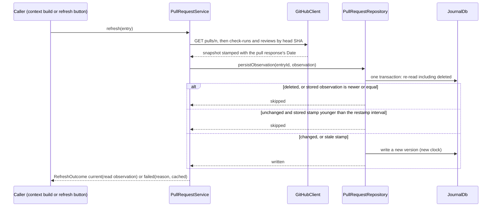
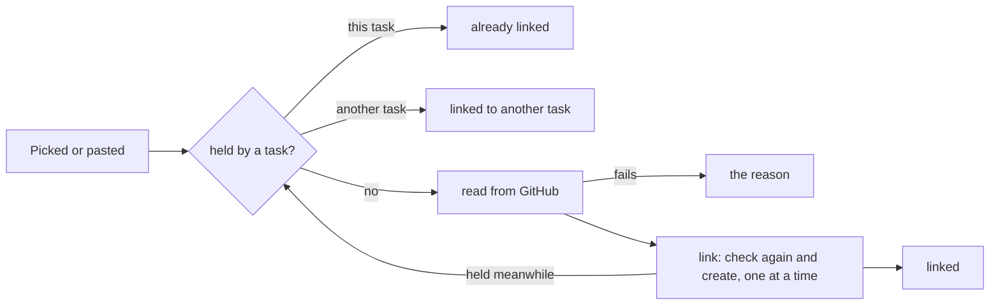
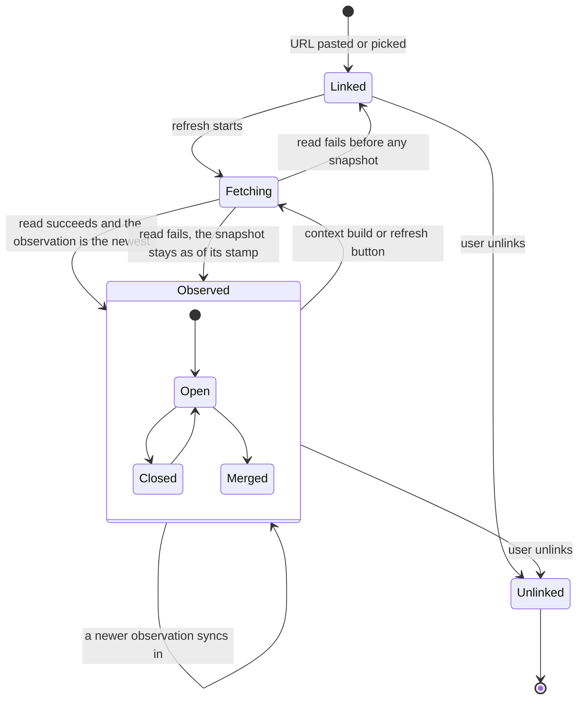

A task can link the GitHub pull requests that implement it. Lotti fetches
their state from the GitHub REST API with the user's own token, keeps a
snapshot of each in the journal, and puts it into every task context it
builds: the coding prompt, and the task agent's wake, whose checklist
proposals the user confirms. That closes the loop that used to run through
screenshots of the pull request page.

**Status: partly built.** The models are
[`PullRequestSnapshot` and `PullRequestAssignment`](../../specs/tla/README.md)
in `specs/tla/`; the code conforms to them, and their headers name the class
that implements each action. Built: the entry and its merge, the token and
the client, linking by URL or from the picker, one task per pull request, a
category's repository, the refresh, the task's card, and the pull requests in
coding prompts and task-agent wakes, all behind the
`enable_github_pull_requests` config flag. Still design: a project's
repository overriding its category's, and recording which checklist items a
coding prompt targeted.

# The entry

A linked pull request is a journal entry, `JournalEntity.pullRequest`
(`PullRequestEntry`), linked from its task with a basic entry link, so it
inherits the task's category and privacy like any child entry. It syncs like
any journal entry: a device without a token still shows what a device with one
last saw, labelled with when.

```text
PullRequestData
  owner, repo, number          identity, fixed when linked
  snapshot?                    null until the first successful refresh

PullRequestSnapshot
  observedAt                   server time of the read (the response's Date header), UTC
  title, body                  the description, Markdown
  status                       open | closed | merged      (+ draft flag)
  htmlUrl, headSha, headRef, baseRef, authorLogin
  mergedAt?, closedAt?
  mergeability                 clean | conflicting | behind | blocked | unknown
  checks                       rollup passing | failing | pending | none,
                               counts, the names of failing checks (capped),
                               checkRunsHidden when the token may not read
                               check runs (absent otherwise)
  review                       approved | changesRequested | pending | none,
                               approval and change-request counts
  additions?, deletions?, changedFiles?, commits?
```

The database row's type is `PullRequest`, and its subtype is
`owner/repo#number`, lower-cased, so the link path can refuse a duplicate
with an indexed lookup. One entry per task and pull request: linking the same
pull request to two tasks makes two entries, which share nothing.

Two devices that link the same pull request to a task before they sync each
create an entry, and sync keeps both. `distinctPullRequests` decides which
one every device shows and refreshes — the lowest id, the same everywhere —
and unlinking deletes every live entry of that pull request on the task, so
the hidden one cannot reappear. A deterministic id would merge the two
instead, but would make a re-link revive an unlinked entry, which the model's
`UnlinkIsFinal` rules out.

# Ordering observations

Two observations of one pull request are ordered by a key, highest first:

1. `observedAt` — the server's clock, which every device shares. Device clocks
   disagree; a device whose clock runs ahead would otherwise win every merge
   until real time caught up.
2. merged before anything else — `Date` has one-second resolution, so two
   reads in one second can differ, and a merge is final: within a second a
   merged observation is the later one.
3. a digest of the snapshot without `observedAt`: SHA-256 over the provenance
   feature's `canonicalJson`. It carries no recency at all; it only makes the
   order total, so that every device picks the same winner.

The model's digest is deliberately against recency, and the invariants still
hold: nothing relies on it to find the newer state.

# The refresh



Four rules, each a design switch in the model with the counterexample its
absence produces:

| Rule | Without it |
|------|------------|
| Stamp with the response's `Date`, captured when the response arrives (`StampAtRead`) | the write labels an old read with the write time, claiming "open" at an instant it was closed |
| Write only an observation newer than the stored one (`GuardNewer`) | two refreshes finishing out of order put the older one back, and a merged pull request reads open again |
| Re-read inside the transaction and skip a deleted entry (`GuardDeleted`) | an unlink during a refresh is undone |
| Write only a changed snapshot, or an unchanged one whose stamp is old | every refresh notifies the task, which wakes the task agent, whose context refreshes again |

A refresh that fails writes nothing. Its reason — offline, invalid token,
rate limited until a time, not found or no access — stays on the device, in
the refresh service, never in the synced entry: two devices failing for
different reasons would otherwise fight over the entry.

# Across devices

Two devices that refresh at once write concurrent versions. The default
journal rule would make that a `Conflict` row for the user to settle in
Settings, which is wrong for data the app fetched itself. `updateJournalEntity`
already merges one concurrent case on its own — two deletions — and the pull
request entry is the second: the newer observation by the key above, deleted
if either side is, under the join of both clocks. Two unlinks are ordered by
observation too, not by clock. A purge reduces an unlinked entry to a
`JournalEntry` tombstone (ADR 0095); against one, a live pull request version
merges to the tombstone, so a device that was offline through the unlink and
the purge still ends unlinked. Every device that sees the
pair computes the same row, so nothing is sent back (`ResolveConcurrent`;
without it the replicas never converge). An unlink beats a concurrent refresh:
the refresh is the app's, the unlink is the user's.

# The token and the client

- The token is a personal access token. A fine-grained one needs read-only
  "Pull requests" and "Commit statuses" on the repositories worked in; GitHub
  offers fine-grained tokens no permission for check runs, so on a private
  repository it cannot read them (on a public one anyone can). A classic one
  needs the `repo` scope for private repositories. It lives in
  `SecureStorage` under `github_token:<profile id>`, so a demo or guest world
  never reads the real one, next to the login it was checked against. It is
  never synced, logged or exported. Settings → Advanced Settings → GitHub
  saves a token only after `GET /user` accepts it.
- `GitHubClient` sends it as `Authorization: Bearer` to
  `https://api.github.com` and nowhere else: the base URL is a constant and
  redirects are not followed, so a redirect cannot carry the token to another
  host. Web pages are never fetched; private repositories need the API.
- Failures are typed: `offline` (socket, timeout), `unauthorized` (401),
  `forbidden` (403 without an exhausted limit — a missing scope or SSO),
  `rateLimited(resetAt)` (403 or 429 with `x-ratelimit-remaining: 0` or
  `retry-after`), `notFound` (404, which is also what a private repository
  answers without access), and `server` (5xx).
- A rate-limited device stops calling until the reset time; a context build
  never waits for it. Reads send `If-None-Match` with the last `ETag`, kept on
  the device: a 304 costs no rate limit and means the snapshot is unchanged.
- A 403 on the check runs alone — the fine-grained token on a private
  repository — is not a failed refresh: the rest of the pull request is read,
  CI is counted from the commit statuses, and the snapshot records
  `checkRunsHidden`. Without the check runs nothing reads as passing, since a
  hidden run may be failing; failing and running statuses still show. The
  card says CI may be incomplete, and the prompt context says the same. An
  exhausted rate limit on the check runs still fails the refresh.
  `checkRunsHidden` is left out of the JSON unless true, so the digest that
  orders observations is unchanged for every other snapshot, on every
  version.
- Check runs, commit statuses and reviews are read page by page until a
  page comes back short, up to ten pages of a hundred. Reviews come oldest
  first, so stopping at the first page would drop the latest decisions.
- A review requested only from a team counts as pending, like one requested
  from a person: in an organisation that is often the only request.

# Repositories

A category names the repository its tasks work in,
`CategoryDefinition.githubRepository` (`owner/repo`), typed in the GitHub
section of the category's page — as `owner/repo` or as the repository's URL;
what does not read as a repository is flagged and never stored, and the
page cannot be saved while the field shows it (the pending value would still
be the last valid one). The section shows only while the flag is on. A task's
repository is its category's (`taskGitHubRepositoryProvider`), read from the
database again whenever the task or a category changes — not from the
categories cache, whose reload after the same notification it could race — so
an open picker follows a repository saved or synced meanwhile. A project's
overriding it is still design. A pasted URL needs no repository, only a token
that can read it.

# One task per pull request

A pull request belongs to one task (`specs/tla/PullRequestAssignment.tla`).
`PullRequestRepository.holdersOf` answers which tasks hold a pull request,
from one indexed query (`pullRequestAssignments`: the live `PullRequest` rows
by `owner/repo#number`, joined to the live links from live tasks, private ones
included). The picker leaves held pull requests out, but its list can be stale
by the time the user picks, and a paste lists nothing; so
`PullRequestRepository.link` re-checks and creates the entry in one step, one
link at a time on the device. A pull request held by this task reads "already
linked", one held by another "already linked to another task".



Two devices that link the same pull request to different tasks before they
sync cannot see each other. Sync keeps both entries — refusing the incoming
one, the tempting way to enforce one task, would leave the devices disagreeing
for good — so every device holds both, and a card whose pull request another
task holds too says "Also linked to another task" first in its status line,
until the user unlinks one. `pullRequestHoldersProvider` reads the holders
again whenever a pull request entry or a link changes, so a conflict that
syncs in shows at once. Sync does not deliver a device's entries in order, so
a pull request moved from one task to another can show the flag for a moment
until the unlink that preceded the move arrives.

# In the task

`TaskPullRequestsSection` shows the task's pull requests in their own card,
directly after its linked tasks, while the flag is on. Each row carries the
number and title, then a status line in a fixed order: the state, **how long
ago it was observed** — second, so a narrow row that wraps or runs out of
room never cuts the age off — then checks, mergeability and reviews. Every
part is a word; colour only backs it up. The age ticks on its own timer, so a
row left open never reads younger than its snapshot.

With nothing linked the card is one worded action; otherwise its header
carries "+". Both open the link modal: a field for a pasted URL, and below it
the open pull requests of the task's repository that no task holds, most
recently updated first, each with its author, whether it is a draft and how
long ago it changed. Tapping one links it; a pasted URL links on Link. Either
way the pull request is read from GitHub and linked only if that read
succeeded — a typo, a repository the token cannot see, or a pull request a
task holds stays in the modal with the reason. Without a repository on the
task's category the modal says how to assign one.

Opening a task refreshes every pull request whose snapshot is older than five
minutes, once; each row also has its own refresh button, whose failure is
told in a toast. A refresh that GitHub answers but that need not be written
still updates the age the row shows. The task's linked-entries history leaves
pull request entries out: they have their own card.



`Observed` is shown as fresh while its stamp is recent and as stale, with its
age, after that. Fresh and stale are a reading of the stamp, not states the
entry stores, which is why the diagram has no transition into them.

# In the task context

`PullRequestContextService` serves both contexts. Whenever one is built it
refreshes every linked pull request, in parallel, waiting at most eight
seconds for each — a slower refresh finishes and is stored afterwards, but the
context goes without it. The context uses what its own refresh read, unless
the stored observation is provably later (`isProvablyLaterObservation`): a
later `Date` second, or the same second and merged. The newest by the
ordering key is not enough: within one second the digest says nothing about
time, and the stored one may have been read before the request
(`PreferOwnRead`). `renderPullRequestContext` writes the section for its
audience; each section opens with how to use what follows. Nothing is asked
of GitHub while the flag is off.

- **Coding prompt** (`SkillInferenceRunner.runPromptGeneration`, the
  coding-prompt skill only — the design and research prompts share its skill
  type but not its subject): a `**Pull Requests:**` block after `**Related Tasks:**` with
  each pull request's state, branch, checks (failing ones by name),
  mergeability, reviews, size and description (cut at 4000 characters). A
  pull request that could not be refreshed shows its last known state,
  labelled with when it was observed and as possibly out of date. The block
  tells the model to ask only for what remains, and to list each mismatch —
  a checklist item checked that no pull request covers, a pull request doing
  work no item describes, entry notes asking for what a pull request already
  contains — at the top of the prompt.
- **Task-agent wake** (`TaskAgentWorkflow`): a `## Pull Requests` section in
  the volatile tail, after `## Linked Tasks`, never the cached prefix. A pull
  request whose refresh failed appears by name only, its state unknown, so
  the agent cannot derive a suggestion from stale data
  (`SuggestRequiresRefresh`).
- **Checklist suggestions** need no new tool: the section tells the agent to
  propose checking an item through the deferred `update_checklist_items` when
  a current pull request shows it done, naming the pull request in the
  reason; the user confirms each one as a change set.
- **The next prompt and alignment.** Each coding prompt is built from the
  refreshed pull requests and the checklist as they stand, so it covers what
  remains and names mismatches. Recording which items a prompt targeted, to
  compare them with what was done by the next one, is still design.

A refresh during a wake runs inside the wake's agent-execution zone, and
`updateDbEntity` routes the notification of a write made there through
`notifyUiOnly`: a changed snapshot updates the task's card but cannot wake the
agent again. Without that, a daily restamp of an unchanged snapshot would
schedule the next wake, every day. Either context leaves the section out, and
logs, when building it fails.
