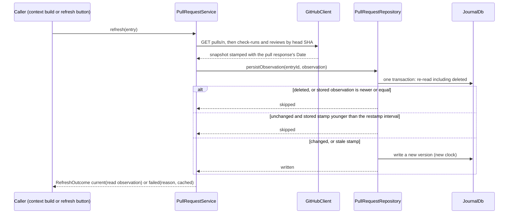
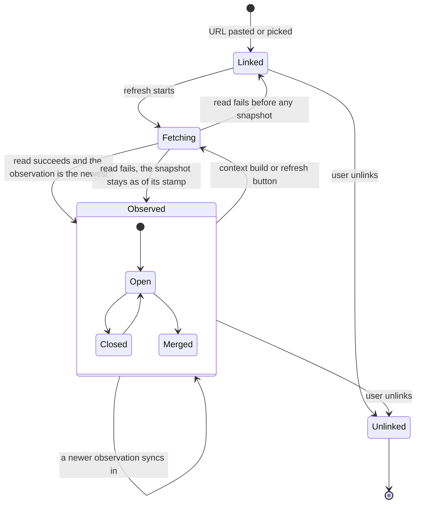

A task can link the GitHub pull requests that implement it. Lotti fetches
their state from the GitHub REST API with the user's own token, keeps a
snapshot of each in the journal, and puts it into every task context it
builds: the coding prompt, and the task agent's wake, whose checklist
proposals the user confirms. That closes the loop that used to run through
screenshots of the pull request page.

**Status: partly built.** The model is
[`PullRequestSnapshot`](../../specs/tla/README.md) in `specs/tla/`; the code
conforms to it, and its header names the class that implements each action.
Built: the entry and its merge, the token and the client, linking by URL, the
refresh, and the task's card, all behind the `enable_github_pull_requests`
config flag. Still design: repository assignment and the picker, and
everything under *In the task context*.

# The entry

A linked pull request is a journal entry, `JournalEntity.pullRequest`
(`PullRequestEntry`), linked from its task with a basic entry link, so it
inherits the task's category and privacy like any child entry. It syncs like
any journal entry: a device without a token still shows what a device with one
last saw, labelled with when.

```text
PullRequestData
  owner, repo, number          identity, fixed when linked
  snapshot?                    null until the first successful refresh

PullRequestSnapshot
  observedAt                   server time of the read (the response's Date header), UTC
  title, body                  the description, Markdown
  status                       open | closed | merged      (+ draft flag)
  htmlUrl, headSha, headRef, baseRef, authorLogin
  mergedAt?, closedAt?
  mergeability                 clean | conflicting | behind | blocked | unknown
  checks                       rollup passing | failing | pending | none,
                               counts, the names of failing checks (capped)
  review                       approved | changesRequested | pending | none,
                               approval and change-request counts
  additions?, deletions?, changedFiles?, commits?
```

The database row's type is `PullRequest`, and its subtype is
`owner/repo#number`, lower-cased, so the link path can refuse a duplicate
with an indexed lookup. One entry per task and pull request: linking the same
pull request to two tasks makes two entries, which share nothing.

Two devices that link the same pull request to a task before they sync each
create an entry, and sync keeps both. `distinctPullRequests` decides which
one every device shows and refreshes — the lowest id, the same everywhere —
and unlinking deletes every live entry of that pull request on the task, so
the hidden one cannot reappear. A deterministic id would merge the two
instead, but would make a re-link revive an unlinked entry, which the model's
`UnlinkIsFinal` rules out.

# Ordering observations

Two observations of one pull request are ordered by a key, highest first:

1. `observedAt` — the server's clock, which every device shares. Device clocks
   disagree; a device whose clock runs ahead would otherwise win every merge
   until real time caught up.
2. merged before anything else — `Date` has one-second resolution, so two
   reads in one second can differ, and a merge is final: within a second a
   merged observation is the later one.
3. a digest of the snapshot without `observedAt`: SHA-256 over the provenance
   feature's `canonicalJson`. It carries no recency at all; it only makes the
   order total, so that every device picks the same winner.

The model's digest is deliberately against recency, and the invariants still
hold: nothing relies on it to find the newer state.

# The refresh



Four rules, each a design switch in the model with the counterexample its
absence produces:

| Rule | Without it |
|------|------------|
| Stamp with the response's `Date`, captured when the response arrives (`StampAtRead`) | the write labels an old read with the write time, claiming "open" at an instant it was closed |
| Write only an observation newer than the stored one (`GuardNewer`) | two refreshes finishing out of order put the older one back, and a merged pull request reads open again |
| Re-read inside the transaction and skip a deleted entry (`GuardDeleted`) | an unlink during a refresh is undone |
| Write only a changed snapshot, or an unchanged one whose stamp is old | every refresh notifies the task, which wakes the task agent, whose context refreshes again |

A refresh that fails writes nothing. Its reason — offline, invalid token,
rate limited until a time, not found or no access — stays on the device, in
the refresh service, never in the synced entry: two devices failing for
different reasons would otherwise fight over the entry.

# Across devices

Two devices that refresh at once write concurrent versions. The default
journal rule would make that a `Conflict` row for the user to settle in
Settings, which is wrong for data the app fetched itself. `updateJournalEntity`
already merges one concurrent case on its own — two deletions — and the pull
request entry is the second: the newer observation by the key above, deleted
if either side is, under the join of both clocks. Two unlinks are ordered by
observation too, not by clock. A purge reduces an unlinked entry to a
`JournalEntry` tombstone (ADR 0095); against one, a live pull request version
merges to the tombstone, so a device that was offline through the unlink and
the purge still ends unlinked. Every device that sees the
pair computes the same row, so nothing is sent back (`ResolveConcurrent`;
without it the replicas never converge). An unlink beats a concurrent refresh:
the refresh is the app's, the unlink is the user's.

# The token and the client

- The token is a fine-grained or classic personal access token with read
  access to pull requests, commit statuses and checks. It lives in
  `SecureStorage` under `github_token:<profile id>`, so a demo or guest world
  never reads the real one, next to the login it was checked against. It is
  never synced, logged or exported. Settings → Advanced Settings → GitHub
  saves a token only after `GET /user` accepts it.
- `GitHubClient` sends it as `Authorization: Bearer` to
  `https://api.github.com` and nowhere else: the base URL is a constant and
  redirects are not followed, so a redirect cannot carry the token to another
  host. Web pages are never fetched; private repositories need the API.
- Failures are typed: `offline` (socket, timeout), `unauthorized` (401),
  `forbidden` (403 without an exhausted limit — a missing scope or SSO),
  `rateLimited(resetAt)` (403 or 429 with `x-ratelimit-remaining: 0` or
  `retry-after`), `notFound` (404, which is also what a private repository
  answers without access), and `server` (5xx).
- A rate-limited device stops calling until the reset time; a context build
  never waits for it. Reads send `If-None-Match` with the last `ETag`, kept on
  the device: a 304 costs no rate limit and means the snapshot is unchanged.
- Check runs, commit statuses and reviews are read page by page until a
  page comes back short, up to ten pages of a hundred. Reviews come oldest
  first, so stopping at the first page would drop the latest decisions.
- A review requested only from a team counts as pending, like one requested
  from a person: in an organisation that is often the only request.

# Repositories

A category can name a repository, `CategoryDefinition.githubRepository`
(`owner/repo`); a project can name one too, and the project's wins. The
picker lists the open pull requests of the task's repository; a pasted URL
needs no repository assignment, only a token that can read it.

# In the task

`TaskPullRequestsSection` shows the task's pull requests in their own card,
directly after its linked tasks, while the flag is on. Each row carries the
number and title, then a status line in a fixed order: the state, **how long
ago it was observed** — second, so a narrow row that wraps or runs out of
room never cuts the age off — then checks, mergeability and reviews. Every
part is a word; colour only backs it up. The age ticks on its own timer, so a
row left open never reads younger than its snapshot.

With nothing linked the card is one worded action; otherwise its header
carries "+". Both open a modal that takes a pasted URL, reads the pull
request from GitHub, and links it only if that read succeeded — a typo, a
repository the token cannot see, or a pull request already on the task stays
in the modal with the reason. (The picker of a repository's open pull
requests comes with repository assignment.)

Opening a task refreshes every pull request whose snapshot is older than five
minutes, once; each row also has its own refresh button, whose failure is
told in a toast. A refresh that GitHub answers but that need not be written
still updates the age the row shows. The task's linked-entries history leaves
pull request entries out: they have their own card.



`Observed` is shown as fresh while its stamp is recent and as stale, with its
age, after that. Fresh and stale are a reading of the stamp, not states the
entry stores, which is why the diagram has no transition into them.

# In the task context

Whenever a task context is built, every linked pull request is refreshed first,
in parallel and with a short timeout. The context uses what its own refresh
read, unless the stored observation is provably later — a later `Date`
second, or the same second and merged. The newest by the ordering key is not
enough: within one second the digest says nothing about time, and the stored
one may have been read before the request (`PreferOwnRead`).

- **Coding prompt** (`SkillPromptBuilder`): a `Pull Requests` section with
  each pull request's status, checks, mergeability, review state and
  description, labelled current or "could not refresh, as of …".
- **Task-agent wake** (`TaskAgentContextBuilder`): a `## Pull Requests`
  section in the volatile tail, never the cached prefix. A pull request whose
  refresh failed appears with its identity and "not refreshed" only. With no
  status in front of it the agent cannot derive a suggestion from stale data
  (`SuggestRequiresRefresh`).
- **Checklist suggestions** need no new tool: the agent proposes them through
  the deferred `update_checklist_items`, citing the pull request in the
  item's reason, and the user confirms each one as a change set.
- **The next prompt and alignment.** A coding prompt records which checklist
  items it targeted. The next one compares them with what is now checked and
  with the refreshed pull request, and reports by name the items it targeted
  that are not done and the items done that it did not target, before
  writing the prompt for the items that remain.

Writes made while building a context use the agent-execution notification
path, so a refresh inside a wake cannot schedule another wake.
