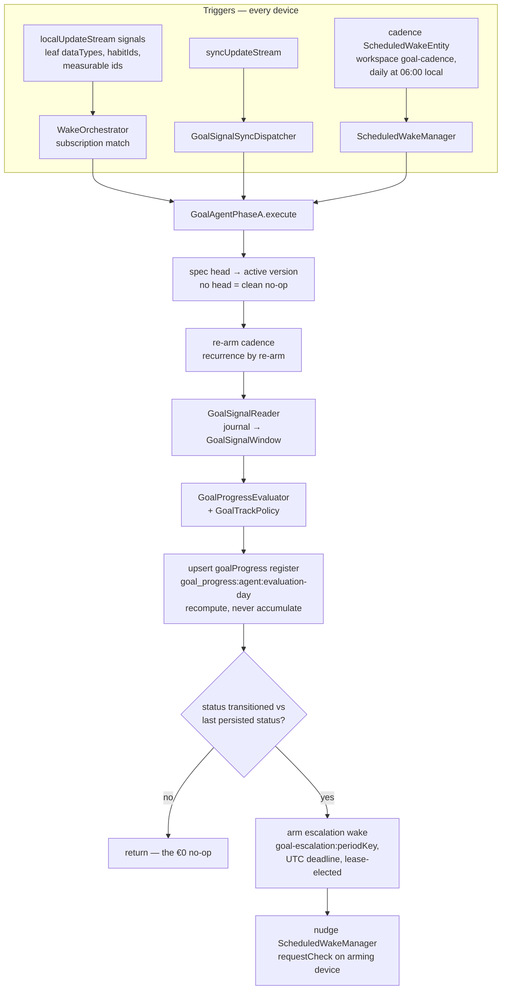

# Goal Agents — Deterministic Runtime

One long-lived agent per user goal (ADR 0053), built deterministic-first
(ADR 0054): the invariant is that **a tick that changes nothing costs €0
and writes no messages**. What runs today is Phase A — the model-free
tier; the LLM tier (Phase B) consumes the escalation wakes this tier arms
and is a later increment, as are the banner surface (ADR 0058) and the
goal chat.

## Runtime flow

## Invariants

- **Convergence over coordination.** The register row id is deterministic
  per `(agentId, evaluation-day)`; every device recomputes the same
  content from the same journal, so concurrent Phase A runs converge
  instead of duplicating. A recompute over a synced row carries that
  row's vector clock forward — dropping it would make the write causally
  concurrent with its own input.
- **Transitions compare against the last persisted status** — today's own
  earlier row first, yesterday's otherwise — so an escalation wake that
  re-runs Phase A is a no-op, not a self-re-arming loop.
- **Grace history is a consecutive, same-spec-version streak**: prior-row
  collection stops at the first missing day and at the first row computed
  under a superseded spec version.
- **Borrowed data semantics.** Quantitative day totals follow the health
  charts' per-type aggregation (`cumulative_step_count` day total is the
  daily max), point-sample types keep the day's latest sample, habit days
  follow the habits UI's latest-completion-per-day collapse with
  success-only counting, and day keys re-stamp the local calendar date as
  midnight UTC. The goal agent must never disagree with the chart the
  user is looking at.
- **Phase B is reachable only through the lease.** Sync-received signals
  run Phase A directly (the orchestrator deliberately listens local-only);
  anything LLM-worthy becomes a `goal-escalation:<periodKey>` scheduled
  wake whose lease election picks exactly one device.
- **Calendar arithmetic is component-based** (`DateTime(y, m, d ± n)`),
  never `Duration` math, so DST transitions cannot shift the cadence hour,
  skip a prior-day register key, or truncate a 25-hour day's query range.

## Gotchas

- `agent_wiring.dart` silently routes unregistered kinds to the
  task-agent workflow; the bootstrap merges the Daily OS and Goals runner
  maps, and `test/app_bootstrap_test.dart` pins both registrations — do
  not turn that merge back into a replacement.
- Subscriptions are in-memory: `GoalRuntimeMaintenance.restoreSubscriptions`
  rebuilds them at startup. A goal agent synced in mid-session is not
  subscribed until restart (known limitation, tracked for the Phase B
  increment).
- Imported workout rules currently produce metric leaves whose dataTypes
  only match `QuantitativeEntry` rows; workout-entry signals are a
  documented follow-up.

## Related

- [Agents](agents/) — the shared runtime this plugs into.
- [Daily OS](daily_os_next/) — the reference plug-in implementation.
- ADRs 0053–0058 in `docs/adr/` — the decision record for this feature.
