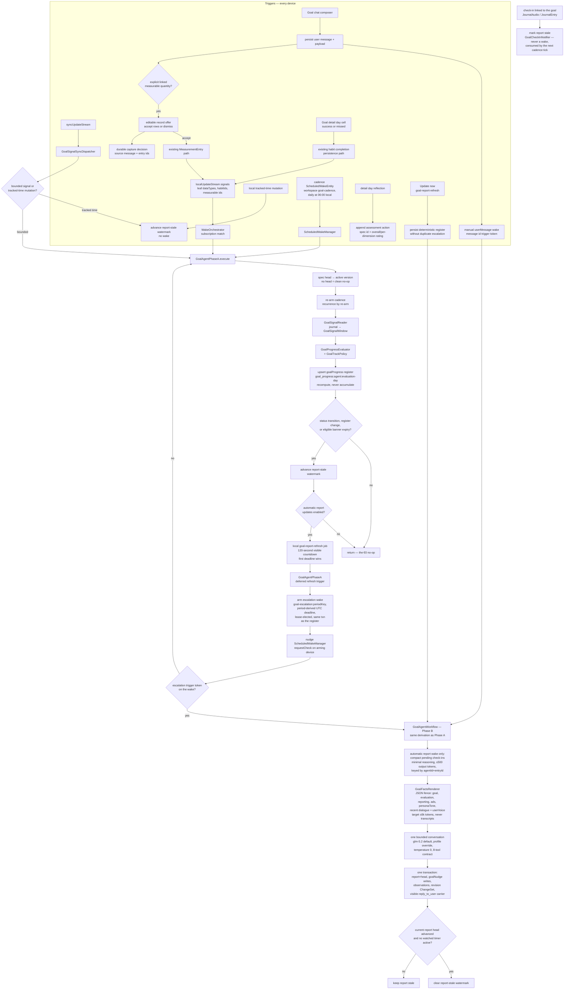
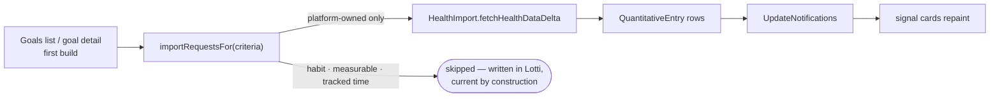
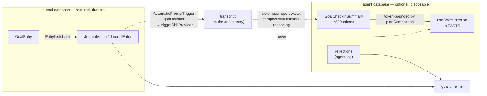
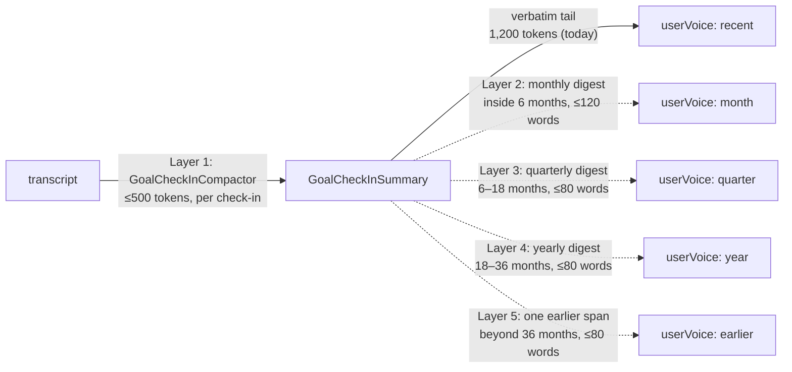

# Goal Agents — Runtime

One long-lived agent per user goal (ADR 0053), built deterministic-first
(ADR 0054): the invariant is that **a tick that changes nothing costs €0
and writes no messages**. Phase A is the model-free tier that runs on
every wake; Phase B is the lease-elected LLM tier that consumes the
escalation wakes Phase A arms, speaking the contract that was validated
in the eval harness *before* this runtime existed (the prompt and tool
definitions live in `goal_agent_contract.dart` and the eval suite imports
them — one artifact, zero drift). The banner surface, unified Goals tab,
rolling progress detail, and the first durable two-way chat slice are
visible behind the `enable_unified_goals` rollout flag.

## Runtime flow



## Invariants

- **Convergence over coordination.** The register row id is deterministic
  per `(agentId, evaluation-day)`; every device recomputes the same
  content from the same journal, so concurrent Phase A runs converge
  instead of duplicating. A recompute over a synced row carries that
  row's vector clock forward — dropping it would make the write causally
  concurrent with its own input.
- **Transitions compare against the last persisted status** — today's own
  earlier row first, yesterday's otherwise — so an escalation wake that
  re-runs Phase A is a no-op, not a self-re-arming loop.
- **Banner expiry can be LLM-worthy without a status transition.** Phase A's
  deterministic staleness sweep records an overdue active banner as expired.
  When the unchanged goal still qualifies for automatic copy (off track, or
  at risk on the initial/worsening path), that expiry re-arms the period's
  escalation so Phase B creates or reuses a replacement. Healthy expiry stays
  a EUR0 maintenance event.
- **A blocked banner is unofferable, not merely forbidden.** Before the first
  inference of a scheduled wake, `GoalAgentWorkflow` drops `create_goal_ad` and
  `rerun_goal_ad` from the tool list whenever the deterministic tier has already
  ruled a banner out — `automaticGoalAdEligible` false, or a dismissal cooldown
  active. A tool absent from the wire cannot be called, so the prohibition needs
  no prompt compliance. The override is keyed on the deterministic request
  detector (`isExplicitGoalAdReplacementRequest`), not on "a message exists":
  merely being spoken to is not a request for a banner, and treating it as one
  left the ad tools on the wire for every dialogue turn — calls persistence
  discards anyway, since `interactiveAdRequested` gates the write on the same
  signal. A non-English request that the English heuristic misses is carried
  instead as data, by `reply_to_user(userAskedForBanner: true)`. The forced-ad
  repair path receives every tool, since it runs only where an ad is REQUIRED.
  The measurement that motivated this is
  in `docs/evaluations/goal_agent_models/README.md`: prompt wording could only
  trade ad over-creation against skipping ads policy demands, because the model
  was being asked to re-derive a decision the runtime had already made.
- **Banners are dirty-tracked against their evidence.** Phase B stamps a
  `factsDigest` (coarse status plus each dimension's actual value and
  satisfaction plus a hash of the exact health timestamps and values that the
  criterion's authored window can render at that evaluation reference,
  `goalFactsDigest`) into every minted or re-run banner's provenance. Phase A's
  sweep — which runs after derivation for exactly this reason — expires an
  active banner whose stamped digest no longer matches the current derivation,
  so a banner quoting "129/94" dies when a new reading or same-value backfill
  lands inside that model-facing window, and the expiry re-arms the escalation
  for replacement copy. A prior-period backfill that FACTS cannot expose leaves
  valid copy alone. Health
  signal subscriptions also advance the standing-report stale watermark
  directly because the persisted progress register intentionally contains
  aggregates rather than the full raw series.
  Two deliberate limits: the digest comparison only runs when the goal
  qualifies for automatic copy (never strip a banner that will not be
  re-minted), and same-day banners are exempt (their replacement would
  collide with the day's deterministic creation id in Phase B, and one
  automatic banner per day is the ceiling anyway). Banners minted before the
  stamp existed keep deadline-only expiry.
- **The report is dirty-tracked before inference.** A status transition,
  eligible banner expiry, or derivation that differs from today's persisted
  register (`goalRegisterDigest` vs `goalAggregateFactsDigest`) makes Phase A
  advance the durable report-stale watermark immediately. With automatic
  updates enabled, it also queues one local `goal-report-refresh` job behind
  the shared 120-second agent countdown. Bursts merge into the first job and
  keep its original deadline; they cannot postpone inference forever. The
  detail page uses the shared automation control to expose that deadline,
  Update now, Skip once, and the persisted automatic-updates switch. The first
  tick of a day is not "new data" (the window slid), and identical
  recomputation keeps the report fresh.
  **A direct identity write must ping `UpdateNotifications` itself.**
  `AgentSyncService.upsertEntity` does not notify; the wake path only appears
  to, because `WakeOutputWriter` pings separately after its own commit. So a
  user-initiated identity write — `GoalAgentService.updateAutomaticUpdates`
  toggling that switch — pings after its transaction commits, or
  `agentIdentityProvider` keeps its cached value and the switch renders the old
  state until the page is rebuilt from scratch, which reads as a switch that
  does not work.
- **The deferred arm and its escalation commit in one transaction.** When the
  local countdown fires, its dedicated trigger re-enters Phase A and writes the
  current register together with a forced report-refresh escalation. The
  escalation deadline is derived from the period (its UTC day key), never from
  the arming device's wall clock, so every device arming the same logical
  escalation writes an identical record and the concurrent resolver's
  later-deadline preference cannot resurrect a consumed wake. The scheduled
  wake's existing lease still elects the single device that spends inference.
- **Grace history is a consecutive, same-spec-version streak**: prior-row
  collection stops at the first missing day and at the first row computed
  under a superseded spec version.
- **Every criterion leaf is an accountable dimension.** A composite goal can
  combine any number of titled metric, measurable, habit, category-time, or
  label-time
  leaves through `allOf`, `anyOf`, or `atLeastCount`. Stable `criterionId`
  values connect each leaf to its persisted `GoalCriterionProgress` result in
  every period register: actual, target, ratio, satisfaction, sample count,
  pace feasibility, and coverage remain inspectable instead of disappearing
  into one overall score. The composite result controls goal health, while its
  children retain the evidence for which dimension carried or missed it.
- **Borrowed data semantics.** Leaf loading and day bucketing are delegated
  to the neutral [signals logic](../architecture/signals.md) (`SignalReader`,
  `signal_day_buckets.dart` in `lib/logic/signals/`), which habits share. Quantitative day totals follow the health
  charts' per-type aggregation (`cumulative_step_count` day total is the
  daily max), point-sample types keep the day's latest sample, habit days
  follow the habits UI's latest-completion-per-day collapse with
  success-only counting, measurable leaves reuse their authored data-type ids,
  and category time reuses the same category-attributed timer rows as Insights.
  Choice occurrence markers are excluded from numeric measurable evidence, so
  changing a measurable to choices cannot accidentally satisfy an older numeric
  goal with the stored marker value of one.
  A category-time leaf can enforce an `atLeast` or `atMost` number of hours and
  can clip every local day to an optional time band; a crossing band such as
  `21:30 → 07:00` spans midnight. Evaluation clips the current day at the
  evaluation instant, so future-dated entries never count as time already
  tracked. A live timer resolves category attribution through the same linked-
  task query as Insights and replaces its persisted prefix by entry id. Day
  keys re-stamp the local calendar date as midnight UTC. The goal agent must
  never disagree with the chart the user is looking at.
  A label-time leaf instead selects normalized `labeled` rows by stable
  `labelId`, across every category unless its optional `categoryId` narrows the
  match. It uses the same privacy, linked-task category attribution, overlap
  clipping, local-day splitting, optional daily time band, and interval-union
  rules as category time. Its daily aggregate is keyed by `criterionId`, so
  two criteria may watch the same label with different scopes or windows
  without sharing results.
- **Health FACTS preserve observations, not only aggregates.** Weight and
  systolic/diastolic blood-pressure criterion results keep `actual` as the
  deterministic rolling aggregate — quantized with the card's own display
  rule (`roundGoalAggregate` in `logic/goal_aggregate_rounding.dart`, shared
  with `formatGoalAggregate`) so the agent's report and the dimension card
  cannot quote two precisions of one number — and add a bounded
  `healthSeries` for the
  criterion's authored window and evaluation reference. Its ordered
  `observations` contain the newest 100 exact journal timestamps and values,
  `observationCount` and `observationsOmitted` disclose the wider series, and
  `latest` repeats the newest reading with deterministic `onTarget` and
  `isToday` flags relative to that evaluation day. It also classifies the
  reading as `completeOnTarget`, `measuredOffTarget`, or `notMeasuredToday`,
  while `latestChange` labels only the previous-to-latest movement relative to
  the authored direction. `evaluation.todayGuidance` indexes health logging
  complete today, health logging still needed today, and rolling habits behind,
  so Phase B does not have to infer today's actionability from unrelated
  aggregates. `evaluation.referenceIsCurrentDay` distinguishes a live
  evaluation from a delayed prior-day escalation; only the live case may call
  the evaluated day "today". Future samples and samples outside the criterion window are
  excluded. A delayed escalation therefore
  evaluates at the final representable microsecond before the encoded day's
  next local midnight: fractional-second samples at the boundary remain in the
  period, while its raw evidence cannot slide beyond the aggregate it explains.
  Phase B can
  describe the latest reading, direction and sparsity without inventing an
  intermediate measured value or overflowing a provider context; high-volume
  quantitative types such as steps remain aggregate-only.
  The journal query may reach the next local midnight for complete historical
  days, but the reader clips both quantitative aggregation and raw observations
  to the captured evaluation instant before either projection is built. A
  concurrent same-day write therefore appears in both representations on the
  next wake, never in only one side of the current FACTS.
- **Health level trends can be green before the threshold is crossed.** Weight
  and systolic/diastolic blood-pressure leaves use their latest observation per
  day and a rolling seven-day average. An unmet leaf with at least four sampled
  days is projected by a deterministic least-squares daily trend. When both the
  fitted slope and the earlier-vs-later sample means move in the authored
  direction and reach the target within 28 days, the leaf is on-track. This
  changes only the coarse status to green: `satisfied` remains false and a
  passed target date still resolves to off-track. Flat, wrong-way, slower,
  under-sampled, and unsupported metric trends receive no projection. FACTS
  includes the bounded projected days so Phase B can explain the verdict
  without recomputing it.
- **Pattern evidence is richer than the threshold.** Phase A reads only the
  bounded evaluation/lookback range. When Phase B actually runs, the same
  reader additionally loads every valid attributed session for a watched
  category since the goal agent was created, including sessions outside an
  optional cutoff band. FACTS unions overlaps per category and preserves
  sub-minute precision while summarizing the complete lifetime into bounded
  local-hour and weekday distributions. When that summary slice is full, the
  categories with the most tracked minutes are retained and the selected rows
  return to stable category-id order. FACTS then considers at most the 200
  most recent raw sessions with category, local start/end and duration before
  enforcing a serialized token slice. The raw session count
  remains available separately from the unioned duration. The coach can
  therefore notice late-night or clustering patterns without allowing one
  current model message to grow forever. Those signals are evidence only: the
  model may discuss them but cannot replace the deterministic per-dimension
  result.
  Label-time criteria add a parallel bounded evidence interface:
  `GoalSignalWindow.labelTimeEntriesByCriterion` carries counted entry
  segments with entry id, label id, resolved category, local start/end, and
  `entryText.markdown` (falling back to plain text for legacy entries).
  `GoalFactsRenderer` considers at most the newest 200 segments, then enforces
  a token slice over the serialized tail and clips each markdown field to its
  own allowance. Category raw sessions and lifetime summaries have separate
  slices, and the complete known high-volume FACTS payload targets 6,000 input
  tokens so the system prompt, tools and dialogue retain room in the wake
  budget. Total/omitted counts disclose the wider evidence. Their markdown is
  model-facing semantic evidence, so content changes
  participate in the facts digest even when the aggregate duration is
  unchanged.
- **Subjective assessment is a separate governance layer.** Deterministic
  `goalProgress` registers are recomputed from source and never carry a mutable
  opinion. `GoalAssessmentService` appends a durable action and payload for a
  user's Met/Improving/Mixed/Missed reflection, bound to the immutable spec
  version that was visible when it was recorded. Optional ratings use stable
  criterion ids; corrections append another record instead of rewriting
  measurement history. The payload also preserves whether the user rated
  directly or accepted a suggestion.

  **A recorded verdict outranks the measurement wherever both are shown.** The
  seven-day strip colours a day from `latestRatingsByDay`, falling back to the
  measured `DayMarkState` only where no verdict exists — the
  measurement is evidence about a day, the reflection is the user's ruling on
  it. Those lookups are scoped to the active `specVersionId`: spec versions are
  immutable and the history keeps them all, so an unscoped map would let a
  judgement of retired criteria colour a day under the current ones. Ties on
  `createdAt` break by record id so two devices cannot disagree.

  The same ruling reaches the habit cells. `latestDimensionRatingsByDay`
  reads a habit's own row (`dimensionRatings[criterionId]`) out of the
  latest record per day, and the detail page hands `GoalProgressCard` the
  history plus the spec id so each habit square wears its verdict over the
  measured outcome. Habits outside the goal pages get there through
  `goal_habit_watchers.dart` (see [day
  indicators](../architecture/day-indicators.md)).

  `improving` is the verdict a three-way split could not express — some of it
  missed, but the day moved the right way. It is newer than the shipped wire
  format, so `rating` carries the nearest legacy-decodable verdict (`mixed`)
  and `ratingV2` carries the real one: a client predating it discards any
  record whose rating it cannot decode, taking the note and per-dimension
  verdicts with it.

  `suggestedDayVerdict` proposes a starting point from the day's own evidence
  — deterministic, never a model call, because a suggestion that disagreed
  with the numbers printed above it in the same sheet would be worse than
  none. A day with no observations at all suggests nothing rather than
  Missed.
- **Conversation capture is offer-first and linked-source-only.**
  `parseGoalMeasurableRecordOffer` only recognizes an explicit positive
  quantity/unit pair for a `GoalCriterionMeasurable` in the active criteria
  tree. It does not infer from silence or from unlinked measurables. Ambiguous
  totals over multiple named recent days become editable estimated splits.
  `GoalRecordOfferCard` checks the journal for same-source/day conflicts before
  enabling a write; accepted rows go through `PersistenceLogic` as ordinary
  `MeasurementEntry` rows, while both acceptance and dismissal append a durable
  decision keyed by source message. The decision payload retains entry ids and
  agent name; progress maps those ids back to measured days and shows the quill
  provenance without creating a second measurement store.
- **Automatic Phase B is reachable only through the lease; direct chat and
  detail-page refreshes are explicit user wakes.** The orchestrator listens
  local-only. On sync, bounded habit/measured signals run Phase A directly,
  while category-time mutations only advance the receiving agent's durable
  report-stale watermark. Meaningful bounded evidence first becomes a local,
  workspace-scoped `goal-report-refresh` countdown. When it fires, its deferred
  trigger makes Phase A arm the synced `goal-escalation:<periodKey>` scheduled
  wake whose lease election picks exactly one device. Restart hydration
  reconstructs the local job with that trigger and workspace; Skip once clears
  only this pending refresh. Turning automation off cancels it but leaves the
  deterministic signal subscription live, and turning it back on schedules one
  catch-up when the standing report is absent or stale. A durable source chat
  turn instead carries a `goal-chat-message:<messageId>` trigger on a manual
  `userMessage` wake. The source exists before enqueue, the wake bypasses
  throttling, and no chat UI owns an inference loop. Visible reply rows name
  that source through `AgentMessageMetadata.operationId`. On startup, sync
  arrival and every pre-wake scan, runtime maintenance re-enqueues the oldest
  source turn without a linked reply; the router also checks for one before it
  dispatches any otherwise unrelated goal wake. Recovery scans the complete
  durable user/reply conversation rather than independently capped kind
  slices, which cannot omit only one side of an old pair. An explicit queued
  chat wake rechecks that its selected source remains pending before inference;
  if an earlier cadence wake answered it, the later wake cannot bill or mutate
  for the same turn again. That recovery state is durable even though the
  original waiter and queue were in memory. Only content-bearing reply actions
  count as answers; payload-less `reply_to_user` tool traces remain internal.
  Legacy visible reply rows are paired to the nearest preceding unmatched user
  turn so upgrading does not replay already-answered messages. Update now uses
  a manual wake in the same report-refresh workspace, supersedes the pending
  countdown, persists the deterministic register from the prose snapshot, and
  routes to Phase B immediately even when the coarse status did not change.
- **Phase B re-derives, never trusts.** The workflow calls the same
  `deriveWakeFacts` Phase A used to arm the escalation and renders every
  number into the FACTS block; the prompt forbids the model to recompute.
  FACTS names a criterion by its `title` and never by the habit or measurable
  id behind it — those are UUIDs, and a model handed one writes it into prose.
  A criterion authored without a title (an older or hand-written spec) is
  titled after its entity at render time: the workflow collects the habit and
  data-type ids under the tree (`goalCriterionEntityIds`) and resolves them
  through the injected `GoalCriterionNameReader` (`GoalRepository.criterionNames`
  via `goalCriterionNameReaderProvider`; null without a journal stack). The
  read is contained like the user voice: a failure leaves the criterion
  unnamed, never fails the wake. Backfilling titles onto specs was rejected —
  it would write a new spec version per goal to fix a presentation gap.
  For supported health criteria, it explicitly distinguishes the rolling
  `actual` from the timestamped `healthSeries` anchored to
  `evaluation.reference`: when the latest reading is on target for that day,
  copy says the evaluated day's logging is complete, describes any lagging
  rolling average separately, and does not ask for another reading. A delayed
  wake names the evaluated date and makes no claim about current-day actions.
  `update_goal_report` collects evaluated-period state, rolling standing,
  latest change, coverage, and actions as separate required slots; the strategy
  parses the same complete shape used by the eval classifier and assembles the
  localized model-authored sentences without injecting English headings.
  Evaluated-period and rolling-standing slots must be non-empty. Completeness
  is judged strictly, but the *rules* read a lenient view
  (`GoalStructuredReport.lenient`) so a report the parser refused is still
  checked for status tokens in prose and for quoting the deterministic
  aggregates — a wake gets one forced report retry, and a rejection naming
  only the shape would let those rules ambush it. Structured
  current actions carry a criterion id and survive only when deterministic
  `healthLoggingNeededCriterionIds` authorizes that id, so a lagging rolling
  habit cannot create a current action item; delayed overdue evaluations expose
  no current-action ids at all.
  Policy rows P16 and
  P17 regress this distinction with the six-dimensional BP fixture; model
  results and context-shape experiments live in the goal-agent eval run book.
  A wake with zero tool calls is legal (the no-op policy row) — the
  strategy never nags for output. Two deterministic exceptions are forced
  with one pinned retry each: a wake missing its report where the status
  transitioned, the detail page requested a refresh, **or the pending chat
  message asked for the standing report itself to be rewritten**; and policy
  row P5 (offTrack, no fresh ad, no cooldown) or an explicit new-banner
  request missing its ad. The chat-rewrite path is deliberately NOT the
  detail page's refresh token: that token also persists the derivation and
  re-bases `previousStatus`, neither of which a rewrite of the standing text
  may do. Its trigger mirrors the banner path — an English intent heuristic
  over the pending message (plus a short affirmation following the agent's own
  offer to rewrite), a matching FACTS-block instruction, and the model's own
  tool call as the language-independent carrier — and an explicit refusal
  ("don't make the report shorter") suppresses it, because forcing a rewrite
  over a refusal destroys the report the user asked to keep. A first evaluation that lands at risk is
  also ad-eligible, so a newly created goal does not wait for a three-day trend
  before receiving its initial banner.
  Interactive batches have a stricter publication fence: if any tool call is
  rejected, the wake fails before `persistOutputs`, including when the same
  model turn also supplied a plausible `reply_to_user` or a later accepted call
  to the same tool. A corrected call clears that rejection only in a later
  conversation turn. This keeps the retry state visible and prevents an
  accepted sentence from claiming that a rejected mutation succeeded.
- **Report freshness follows the durable standing head.** Producing report
  material or writing a historical report row is insufficient: the shared
  drain clears the stale watermark only when this wake actually advances the
  current report head. A report that includes a watched category or label
  timer's live
  elapsed prefix also remains stale, because in-memory timer ticks continue
  changing evidence without journal notifications.
- **The escalation carries its own baseline and period.** The wake record
  encodes the PRE-transition status as a `goal-baseline:<status>` trigger
  token (Phase A's register write hides it from any re-derivation, and a
  same-day double transition makes the prior-day row an insufficient
  reconstruction) and is evaluated at ITS period — a stale escalation
  resolves the spec version its register row recorded, and an older
  period never advances the current report head. A failed Phase B wake
  re-arms its escalation with a later deadline (the resolver's supported
  reschedule-beats-consume path), so a transient failure cannot orphan
  the period. Completed historical periods read category time through the next
  local midnight as an exclusive bound, so their final second is not lost;
  live periods remain clipped at the evaluation instant.
- **Ad contracts are enforced at persistence, not just in the prompt.**
  `persistOutputs` re-reads the nudge rows (a dismissal during inference
  must count), and suppresses creates/re-runs during the same-day dismissal
  cooldown, while a fresh active ad exists (ads retired in the same wake
  don't count — the P14 swap stays legal), and for duplicate brief
  digests. Automatic transition ads keep their period/baseline identity;
  chat-created replacements add the durable source message id so a retired
  transition ad cannot silently collide with the requested replacement.
  An affirmative chat request for a new banner is recognized from direct
  want/need/show language, replacement language, or a missing-banner report in
  the durable user message before inference. A short affirmation also qualifies
  when the immediately preceding visible assistant reply offered a banner.
  For every language, a typed create/re-run tool action on an interactive turn
  is the structured intent carrier and upgrades the same permission before
  persistence; the English heuristic is only the early force-action path.
  These interactive requests override
  the automatic dismissal cooldown and automatic health gates, and remain
  ad-eligible for the whole wake, so a recovering or healthy goal can serve
  explicitly requested positive copy without its persistence pass retiring the
  banner it just created. Negated
  requests, unrelated courtesy, and explanation prompts do not trigger that
  exception. The current active banner
  retires only after a sanitized, non-duplicate create or valid retired-ad rerun
  has been identified,
  so a replayed/invalid candidate cannot leave the goal bannerless. If the
  primary model replies with a cooldown refusal and omits the tool, the workflow
  forces `create_goal_ad` and withholds the now-contradictory refusal. A
  temporary-hide request instead calls `snooze_goal_ad` with any future instant
  carrying an explicit UTC marker or numeric offset, and an id from the
  active-ad subset (a retired reusable ad is not a snooze target): the same active nudge
  keeps its activation and rating history, stores typed current snooze state,
  appends timing evidence, disappears from the SHELL banner surfaces (the
  rotating dock and its reserved lane — the goal's own detail page keeps the
  banner with a return countdown, see the banner-surface invariant below),
  and returns to the dock
  when the active-banner provider reaches the deadline or reloads after it.
  Snooze extends the
  activation's `staleAt` past that reveal instant so the hidden interval cannot
  consume its remaining visible lifetime. A day dismissal likewise extends
  staleness past the next local midnight. A re-run clears current snooze and
  day-dismissal state but retains the historical timing evidence. Legacy
  provenance deadlines remain readable and are dual-written with typed snooze
  and day-dismissal state so mixed-version devices preserve the quiet period;
  a re-run clears that compatibility deadline. After a chat wake commits, the controller reads the persisted
  snooze deadlines into a short-lived local suppression map before invalidating
  the async projection; retained stale-while-revalidate data therefore cannot
  flash the hidden banner, and unrelated active banners remain visible.
  The three-day worsening requirement remains the automatic `atRisk` gate;
  an interactive `atRisk` wake that emits a structured create/rerun action
  honors the user's request while still enforcing duplicate-copy and stale-spec
  guards. Report prose passes
  `sanitizeAgentReportText`.
- **The goal spec never mutates in a wake.** `propose_goal_revision_v2`
  lands as a pending ChangeSet for user approval and persists the originating
  immutable spec version in its tool arguments; ad state is validated
  in-conversation against the ids the FACTS offered, and all outputs
  commit in one transaction.
- **Revision is approval-gated and conservative.** Accepting the proposal
  (`goalChangeSetConfirmationServiceProvider` → `GoalToolDispatcher` →
  `GoalSpecRevisionService`) applies the changes to the criteria tree via
  `applyGoalRevisionChanges` — which REJECTS anything ambiguous (two
  candidate leaves and no name, unparseable period/cadence, free-form
  `successCriteria` alone) rather than guessing — then supersedes the
  current version, mints `v(n+1)` with full provenance (`authoredBy:
  goal_agent`, `diffFromVersionId`, the proposal's rationale) and moves
  the head in one transaction. Approval refuses the item when that persisted
  base version is no longer the current head, including proposals that arrive
  late from an offline peer. The v2 tool name is also the capability fence for
  mixed client versions: an older client does not recognize or apply it, while
  a current client rejects and auto-retracts legacy v1 proposals. Malformed or
  stale v2 proposals are deterministic failures and are likewise retracted,
  rather than restored to a pending state that can never succeed. A missing
  spec head or a head whose immutable version has not synced yet is transient,
  so that approval stays retryable instead of being retracted. Grace history
  resets naturally: Phase A's
  prior-row streak breaks at the version change. The revision service rechecks
  that the identity is still an active goal inside the serialized path;
  inactive details hide the approval card as well. After acceptance the
  signal subscription re-registers from the NEW criteria; on other
  devices the synced-in head triggers the same re-registration through
  the sync processor's identity re-offer. A revision also retires the
  superseded goal's whole ad surface and pending inference in the same
  transaction: every non-terminal nudge (`draft`, `ready`, `active`,
  `retired`) moves to `superseded` — `retired` rows are the reuse library
  (`reusableTopRated`), so a top-rated ad written for the old target cannot
  be re-activated beside the revised statement — and every pending
  `goal-escalation` wake is consumed, so a wake armed under the old spec
  cannot later spend inference on a transition the new goal never made.
  The immediate post-acceptance evaluation re-arms anything genuinely due.
- **Owner edits are versioned, never in-place.** The explicit edit route uses
  `GoalSpecRevisionService.reviseFromOwner` with the complete user-authored
  title, intention, persona name and criteria tree. It serializes against the
  current head, refuses a no-op or a save whose loaded base version is no
  longer the head, supersedes the current version and mints `v(n+1)` with
  `authoredBy: user` and `diffFromVersionId`. The create/edit UI
  rewrites rolling-seven-day habit and measurable leaves, the supported
  at-least rolling-average steps metric, and rolling-average weight plus
  systolic/diastolic blood-pressure leaves with either target direction. It
  also creates and edits category-time sums with a rolling-seven-day hour
  target and either direction, plus label-time sums with a daily hour target
  and either direction. The label-time category selector defaults to all
  categories and can narrow the criterion to one category; an existing
  optional category scope round-trips unchanged;
  `all`, `any`, and `atLeastCount` wrappers round-trip through an explicit
  composite-rule picker. Category-time leaves with a local time band, other
  health leaves, and opposite-direction step
  criteria are retained exactly and shown read-only. Supported trees retain
  authored leaf titles, composite wrappers and stable collision-free node ids.
  Manual mapping choices survive back-navigation while the intention is
  unchanged. A category-stream refresh adds newly available intention matches
  without resetting other manual signals or targets, and a manually removed
  category match stays suppressed until the user reselects it.
  **An edited intention re-maps additively, and an explicit deselection
  outranks the re-map.** Health signals the user unticked are remembered for
  the lifetime of the form: a re-map still offers them as unchecked
  suggestions but never re-seeds their targets, and re-selecting one clears
  the memory and restores its default target. The same rule already governs
  category- and label-time matches, so no back-edit of the statement can silently
  resurrect a signal the user removed.
  When an edited goal references a measurable that is now choice-based, save
  waits for the current measurable definitions and removes that obsolete
  numeric leaf and target before rebuilding criteria; the measurable is also
  excluded from numeric record offers.
  Signals added through the picker likewise stay on the card as unchecked rows
  once unticked, until the step is re-entered and the row order is re-frozen —
  deselecting is never a deletion the user has to undo through the picker. Saving validates
  category-time selections through a direct database snapshot that includes
  hidden rows, retaining an active private category if it disappears from the
  discovery stream while removing newly selected inactive or deleted
  categories. It likewise
  reconciles selected habits against the latest active-habit stream so a paused
  or removed habit cannot be minted into a dead criterion. After a minted edit,
  the runtime re-registers the new signal set and enqueues an immediate `goal
  revised` wake so the report and health do not describe the old spec.
- **Nudge accumulators are CRDTs.** Terminal retirement is monotonic in the
  concurrent resolver, and exposure counters (per-host G-counters),
  rating histories, append-only snooze and day-dismissal histories, and shown-at
  watermarks merge losslessly on concurrent sync — the labeled ad library and
  its timing evidence must survive whole-row LWW. Concurrent snoozes for the
  same activation keep the later quiet deadline while retaining both events;
  their staleness extensions merge by the later deadline so the selected
  reveal cannot immediately disappear as stale. Successive snooze requests in
  one model turn fold over the just-written row rather than the turn's initial
  snapshot. Both the choice-time and requested-return offsets are retained, so
  a daylight-saving transition cannot shift learned return-hour evidence;
  interaction-event ids deterministically de-duplicate the append-only
  histories across peers.
- **Calendar arithmetic is component-based** (`DateTime(y, m, d ± n)`),
  never `Duration` math, so DST transitions cannot shift the cadence hour,
  skip a prior-day register key, or truncate a 25-hour day's query range.

## The visible layer (PR 5)

- **Banners**: procedural text banners per ADR 0058 — model-authored copy,
  code-owned animation presets (all degrade to plain text under reduced motion)
  and accent presets bound to design-system tokens. Since ADR 0059 the
  substrate itself is kind-agnostic and lives in `lib/features/nudges/`;
  `ui/goal_banner_card.dart` is the goal-owned surface on top of it. The
  register TINTS the accent (`nudgeBannerStyle`):
  one hue at graded washes (`SurfaceAlphas.washBorder/washChip/washControl`
  plus the `tint` fill) for the card fill, border, persona chip and CTA
  pill, so the banner's state reads before a word is (celebrate green,
  restart teal, nudge ember, roast the hand-authored `GoalAccentHues.neon`
  lime). Rendered in a single **shell-level dock** (`NudgeBannerDock`,
  mounted in `beamer_app.dart`) — one rotating slot at the bottom of the
  content region on desktop (beside the sidebar) and above the bottom nav
  on mobile. **Goal** banners appear on the main working tabs only (Tasks,
  DailyOS, Habits); the dock itself is kind-agnostic and other kinds carry
  their own surface gate, so the list here is goal-specific rather than the
  dock's — see [nudges](nudges.md) for `nudgeKindShowsOn` and the rotation
  state machine. One
  shared rotation state cycles every standing banner ~15s each; a fresh
  acknowledgment (a re-run) jumps the queue;
  hover/touch and app-backgrounding pause the cycle; the dock collapses to
  nothing when no tenant is speaking on the current surface. Every dock
  tenant NAMES its subject — the
  persona chip and a subject-title caption above the headline, on the desktop
  and compact (phone) docks alike, so the voice is never anonymous. The dock
  is mounted at the TOP of the shell, above the sidebar and the content, so it
  displaces what is below it rather than overlaying it. The goal detail page shows that goal's
  banners uncycled via `GoalBannerCard` directly — and applies NO snooze
  filter: snoozes, day dismissals and the optimistic local echo quiet the
  SHELL dock only (`nudgeBannerShellHiddenUntil`), while the page keeps the
  banner captioned with a live countdown until it returns to the bar
  (`goal-banner-shell-return-countdown`, the shared `WakeCountdownState`
  tick). Tapping a banner opens
  its goal's detail page (the banner→conversation flow); the star button
  — rendered only while an outcome is due — opens the per-activation
  rating prompt (one outcome per activation, skips count). Snooze is the
  prominent visibility action and opens fixed 1/3/6/8-hour choices as
  compact secondary duration chips. The
  de-emphasized final action dismisses the banner only for the current local
  calendar day; there is no direct X or swipe-to-dismiss shortcut.

  **The channel itself is not this feature's.** ADR 0059 generalized the dock,
  its rotation, the shared visibility contract, the snooze/rating sheets,
  exposure metering and the concurrent-merge rules into the kind-agnostic
  substrate at `lib/features/nudges/` — read
  [Nudges](nudges.md) for how any of that works. Goals is one *producer*: it
  registers `activeGoalNudgesProvider` as a banner source, and
  `nudgeKindShowsOn` keeps goal banners on exactly the main working tabs
  (Tasks, DailyOS, Habits).

  What remains goal-owned:

  - `ui/goal_banner_card.dart` — the full detail card. The goal detail page
    lists that goal's banners uncycled through it rather than through the
    shell dock, passing a CTA override that anchor-scrolls to the evidence the
    page already hosts. The card keeps `cardPadding` on its lateral and bottom
    edges but uses `spacing.step2` above the fixed-height action header,
    preventing the rating and snooze tap targets from creating a visually
    double-padded top edge.
  - Tapping a banner opens **its goal's** detail page — the
    banner→conversation flow, carried as the entry's `tapRoute`.
  - A **chat-requested snooze** accepts an arbitrary future duration or
    date/time and automatically restores the exact banner at that deadline;
    successive requests in one model turn fold over the just-written row
    rather than the turn's initial snapshot.
  - `GoalFactsRenderer` turns the append-only interaction histories into wake
    evidence: duration, local start, requested-return hour, weekday and recent
    choices under `ads.snoozeBehavior`; day-dismissal local hours, weekdays and
    recent quiet intervals under `ads.dismissalBehavior`. Repeated interaction
    hours are evidence for future initial display timing, not an automatic
    scheduling command.

  Every visibility choice persists on the `GoalNudgeEntity`: the effective
  `snoozedUntil`, `lastSnoozeDuration`, and `dismissedForDayAt` drive current
  projection state. Each snooze appends a `GoalNudgeSnooze` carrying its
  activation, start/deadline, exact duration in minutes, and the offset at the
  time of the choice. Each day dismissal likewise appends a
  `GoalNudgeDayDismissal` with its activation, start, local-midnight deadline,
  and local offset. Both histories are stable-id, append-only sync
  accumulators. The provider checks persisted state on every load and app
  resume, and also invalidates itself at the next snooze or local-midnight
  boundary, so expiry while the app is closed is handled without trusting a
  timer that did not run. Interaction writes return the exact persisted quiet
  deadline to optimistic local suppression, so a transaction crossing midnight
  cannot extend a day dismissal into the following day. That temporary local
  suppression is activation-scoped: a concurrent re-run of the same row id is
  immediately visible instead of inheriting the prior activation's quiet
  interval. Synchronized snooze
  and day-dismissal histories accept only timestamps with explicit UTC markers
  or numeric offsets, keeping expiry and learned local-hour evidence
  replica-independent. `GoalFactsRenderer` summarizes duration, local start,
  requested-return hour, weekday, and recent choices under
  `ads.snoozeBehavior`, and summarizes day-dismissal local hours, weekdays, and
  recent quiet intervals under `ads.dismissalBehavior`. Repeated interaction
  hours are evidence for future initial display timing, not an automatic
  scheduling command.
  Exposure is measured in visibility episodes by
  `NudgeBannerExposureTracker` gated on THREE signals — the tracker's
  stopwatch runs only while the app lifecycle is `resumed`, `TickerMode`
  reports the host tab on screen, AND the banner intersects its enclosing
  viewport (rechecked on scroll events, lifecycle changes and post-rebuild
  frames, never per frame; the dock and other non-scrollable hosts use the
  other two signals alone). Every
  visible→hidden transition — backgrounding, tab switch, scroll-out,
  unmount — flushes its own episode into the per-host G-counters, so
  returning starts a new episode. Writes per nudge are serialized in
  `NudgeInteractions` so a rapid flush/visibility-action pair cannot lose an
  update to a stale read.
  The dock and the full detail card both render the selected animation through
  `NudgeBannerAnimatedText`; the dock and its animated tenant span their host,
  and both desktop and compact docks show the complete authored headline with
  no avatar, secondary tagline, or line cap; compact snooze remains at the
  trailing edge. A chat-requested snooze accepts an arbitrary future duration
  or date/time and automatically restores the exact banner at that deadline.
  The card keeps `cardPadding` on its lateral and bottom edges but uses
  `spacing.step2` above the fixed-height action header, preventing the rating
  and snooze tap targets from creating a visually double-padded top edge.
- **The goal detail surface** (hosted by the unified Goals tab under
  `/goals/details/:agentId`): per-goal health at a glance — the same four-state
  chip used by the Goals list and chat (On track / At risk / Behind / No data;
  `recovering` reads At risk), the report one-liner, a pending-proposal badge and a trend
  arrow (`GoalHealthDirection`, computed in `goalAgentHealthProvider` from the
  two most-recent non-deleted registers for the ACTIVE spec version with a
  0.02 deadband — withheld when either register is insufficient-data, and only
  for rolling-window goals, since calendar/day windows reset attainment each
  period and a consecutive-register delta there is a boundary reset, not a
  decline). The detail header surfaces that independent direction as a second
  semantic pill, allowing combinations such as Behind + Trending up and
  On track + Trending down. The row shows a status chip rather than a raw attainment
  percentage; the one-liner is the agent's own prose, so keeping percentages
  out of it is a matter for the agent's instructions, not widget-level
  filtering. Below the one-liner a rolling-window habit goal shows a
  deterministic hint — successful days needed to recover when At risk or Behind
  (`deficit`), explicitly phrased as effort rather than a countdown, or the buffer
  before the oldest success ages out when exactly at rate (`buffer`; surplus
  completions do not receive an aging warning) — lifted from the
  root leaf to `GoalEvaluation`, persisted on the `goalProgress` register, and
  surfaced through `goalAgentHealthProvider`. A row whose per-agent
  health has not resolved shows no chip rather than a false "Not enough data",
  and the settled-empty state is a first-run explainer whose CTA is the sole
  creation affordance (the global FAB hides). When a spec is available,
  `goalAgentProgressViewProvider` reads the evaluator's daily aggregates and
  adds a seven-cell compact strip to the list — at the detail page's day-cell
  size, so the two surfaces draw the same instrument at the same scale (the
  strip's earlier 12px list default read as illegible dots). The detail page
  is the §4b dashboard: a centered column capped at the unified-Goals
  measure (`kUnifiedGoalsContentMaxWidth`, 760 — deliberately narrower than
  the Habits dashboard's effective ~900 after design review of the goal
  cards; shared by the goals list) whose hero stack leads with the
  timestamped Agent's-read card, the deterministic This-week card
  (`GoalThisWeekCard` — whole-goal strip under a title row whose trailing
  button IS Reflect-on-today, with the yesterday tally centered beneath)
  beneath it, both at the full content width on every viewport,
  with the Habits and Signals sections beneath, a goal-scoped completion-rate chart (`HabitsChartCard(habitIds: …)` — the shared card
  computed on the goal's slice of the habits day maps via
  `scopeHabitsStateToHabits`, same range tabs — in scoped mode the chart
  drops its own headline row and the card header carries the rate, its goal
  verdict and the week-over-week move as one stacked corner block, the same
  grammar every other card on the page uses), and the automation plumbing
  riding the read card itself. Daily reflections have NO
  main-column card: they render only in the check-ins rail, each as one
  tight row whose verdict pill rides the timeline header's trailing slot
  (`TimelineBeat.trailing`) and whose row tap (`TimelineBeat.onTap`)
  reopens the same reflection sheet the day strip uses; provenance
  ("Rated by you" / "suggested, you accepted") stays on the record but is
  not rendered. The retired-banner list ("Interactions" — past ads with
  Superseded/Dismissed outcomes) is gone from the dashboard entirely;
  `goalNudgeHistoryProvider` remains for bookkeeping but no page surface
  reads it. Each dimension card pins one stacked corner element top-right:
  the key reading over its status caption (semantic ink), replacing the
  old inline title-row pair. The reading names its window CONCRETELY
  ("1 of 3 · calendar week") because the track below can show several
  windows' worth of days; the cadence line is gone for every window type,
  and the window line carries only the date span it covers, with the
  rolling-week reliability tail on its trailing edge. Signal cards carry NO
  one-sentence summary: the corner's status caption is the card's only
  verdict, and the sentence restated it — the no-data case is the one
  exception, because "Not enough data" alone says nothing about why. Where
  a card plots a trailing seven-day average, the corner states the LATEST
  reading — never the period aggregate, which for an "average steps per day"
  criterion IS that same mean, so the card printed one number twice — with
  the mean set BESIDE it on the same baseline as "Ø 10,777", a type tier down
  and in the average line's own hue. One reading line and one verdict line,
  the same two-line corner every other card on the page uses; the mean folds
  onto a second line, and the block leaves the title row altogether, only
  when the reading is MEASURED not to fit (`goalTextWidth`) — a fixed
  breakpoint stacked the corner away on every phone while the figures
  occupied a third of the row. Off the title row, the status caption sits on
  the reading's own row at the trailing edge whenever the two are measured
  to fit, and drops beneath only when they do not; the habit row's deficit
  note likewise takes its whole fallback row rather than a capped fraction
  of it. The legend entry naming that series wears the hue too
  (`DashboardLegendEntry.labelWearsSeriesColor`), since colour is the only
  thing resolving the symbol to a mark on the chart. The target stays in the
  keyed legend entry ("Goal ≤ 88", or a compact "Goal 10K" for steps) rather
  than being named twice. Legends center under the charts they annotate. Chip shape encodes affordance on every goal
  surface: clickable elements are fully rounded (`radii.badgesPills`);
  informative chips — status/trend/verdict/cost — take the fixed
  `radii.smallChips` corner. The read card wears the SAME
  "intelligence" panel as the task agent section on Task Details — the
  shared `aiCardDecoration` chrome and `TldrHeader`, the shared
  `AgentAutomationRow` reload affordances, and the goal's cumulative
  inference-impact pill (`GoalAgentLifetimePills`) on its header rail
  beside the freshness caption — one
  panel language, changed in one place for both. A refresh that DIES
  (provider out of credits, network down, the executor timeout) says so on
  the card: it watches `goalReportWakeOutcomeProvider` — report-refresh and
  escalation wakes only, so a failed chat run or a passing Phase A
  subscription tick can neither raise nor clear the line — and renders the
  last failure's reason in an error line above the automation row. The line
  hides while a report wake runs (`goalReportWakeInFlightProvider`: the
  refresh workspace or any `goal-escalation:` workspace — never the
  agent-wide flag, which every chat and subscription tick flips), clears on
  the next completed report wake, and yields to durable evidence newer than
  the failure's start: a `reportFreshAt` watermark (a successful refresh,
  local or synced) or a displayed report published later — a timed-out
  executor is allowed to finish late, and its report must not sit beside
  its own stale timeout error. Fourteen silent 429s once read
  as a dead button. On phones the footer collapses to freshness plus Update
  now, while the set-once automatic-update preference moves into the overflow;
  desktop keeps the full one-row footer. The page has ONE time
  range: a picker on the first evidence heading (Habits, or Signals for a
  signal-only goal; backed by the habits controller's shared
  `timeSpanDays`) keys `goalAgentProgressViewForSpanProvider`, which
  DEFAULTS to auto-fit — until the user picks a preset on this page, the
  page drives the shared span to the day count that fits the content width
  at the authored day-cell density (`_fitSpanDays`), so the default fills
  the card with days instead of dead space, without stretching cells or
  gutters and without a scroller; no picker segment highlights in auto
  mode, and the completion chart and heatmap data follow the same fitted
  span. It
  renders the whole-goal strip and every habit and signal day track over
  the same span ending today. Switching ranges preserves the last rendered
  progress while the replacement span loads, so established content never
  flashes back to a loading shell. If the replacement span fails, the picker
  returns to the last settled span and the shared-controller chart stays hidden
  until that rollback lands; old evidence is never relabelled as the failed
  range. The retained snapshot is scoped to the active spec version and only
  promoted from a settled provider value, so a spec reload cannot relabel
  prior-spec evidence. A day track never resizes its
  squares: `dayTrackMetrics` is one `daySquareSize` square plus `step2`
  per column, and a span wider than the width it was given becomes a
  trailing-anchored (`reverse: true`) scroller joined to one
  `LinkedScrollGroup`, where every track then pans in unison. The habit
  squares and the whole-goal strip carry no label row — a square names its
  date in its tooltip and semantics and says its weekday, or its outcome's
  glyph, inside itself; only the hand-painted metric bars keep a caption
  axis (`_WeekdayTrack`, one-letter at this pitch), below the bars. Every tappable element on these cards carries the
  design system's `surface.hover` fill on its own transparent `Material` —
  ink painted on the Scaffold's Material sits under the opaque cards and
  never shows, which is why the day grids and rail rows previously had no
  hover feedback. One policy
  (`fitOrScrollDayTrack`), by WIDTH, for all three tracks: deciding by day count
  wrapped a span that provably fitted, and a fortnight at the authored pitch
  is wider than a phone card, so the scroller opened with the first days of
  the span cut in half off the left edge. A gutter is reserved where a VALUE
  AXIS is drawn and nowhere else — the time-series plots and the hand-painted
  metric bars take `kChartLeftAxisWidth`, the habit grids and the whole-goal
  strip start on the card's own rail with their span caption above them.
  That gutter is ONE constant rather than a per-chart measurement on purpose:
  a chart and the date axis beneath it are separate widgets, so a measured
  gutter has to be threaded to both by hand, and every card pairing them would
  have to re-derive the chart's own axis rule to do it — buying ~10px of plot
  at the price of the exact misalignment the width exists to prevent.
  Aggregates never fold the rendered list — the
  evaluator's numbers win — so a longer rendering cannot change a verdict,
  and the ages-out ring anchors at the window's own first day rather than
  the list head. The
  reading measure applies to the content *inside* the scroll view, never to
  the scroll view itself. The detail page builds **eagerly** — a `Column`
  in a `SingleChildScrollView`, never a lazy list: its section count is
  small and bounded, lazy mounting made scrolling janky, and a scrolled-away
  lazy section could unmount the `ensureVisible` anchor the banner CTA
  scrolls to. The detail page expands the
  same source into a habit grid or metric series using each leaf criterion's
  actual day/rolling/week/month range, CLAMPED to today (`_historyEnd`): a
  calendar window's `periodRange` covers its WHOLE week or month, and rendered
  unclipped a Tuesday's habit track ran on through Sunday — empty cells for
  days that have not happened, a period caption dated into the future, and,
  because the column pitch is the available width divided by the day count,
  squares smaller than the whole-goal strip drawn from the same span one card
  above. Canonical weight and daily-step data use
  a two-series time-series treatment: the observed values plus a trailing
  seven-calendar-day average. Daily steps render as discrete bars, while weight
  keeps the shared actual-value area treatment; both overlay the average as a
  dashed blue line. The average is drawn from the FIRST rendered day, not from
  the seventh: metrics carry a run-up (`GoalMetricProgressView.warmupValues`)
  of the six days before the visible span, which the signal reader already
  fetches (`historyDays + 7`) and used to discard. Where no run-up exists the
  series still waits for a full seven rendered days rather than averaging two
  and calling it a week. Both the series
  (`goalMetricSevenDayAverage`) and the single-day helper the reflection sheet
  reads (`goalMetricSevenDayAverageOn`) consume that run-up, so the sheet can
  never omit — or disagree about — a day the chart plots. It folds only
  observed samples inside each window, so a missing day does not become a
  false zero. It stops at the goal
  view's deterministic `today` and is available only for
  `dailySumThenAverage` criteria; future calendar days and period-level
  aggregations therefore cannot produce a fabricated per-day trend or target.
  Step cards name the observed series "Steps per day" while retaining "Average
  steps per day" as the aggregate being judged, and the reflection sheet names
  ONE day's figure "Steps" — 9,950 steps printed under the word "Average" is
  simply false — with the trailing average that day belongs to on its own
  correctly labelled, unratable line. **A legend has one entry per mark
  drawn.** Each names a series or a rule and may carry a quiet threshold
  annotation ("Target ≤ 125"); it never carries a reading of the data. The
  above/below-average direction line was removed for exactly that reason: it
  was a sentence wearing a swatch that matched no mark on the chart, in a hue
  whose meaning contradicted every other hue on the card. Paired systolic and
  diastolic dimensions render as one dual-line blood-pressure chart with both
  authored targets under TWO legend entries, each annotated with its own
  threshold; a partial blood-pressure import remains two separate cards so the
  available component is not hidden. A dimension with no observation at all
  renders no plot — an empty full-height frame under a header that already
  reads "Not enough data" looks like a chart that failed rather than a goal
  nobody has fed yet. Singleton health series render a visible point until
  a second observation can form a line. These daily health charts format their
  canonical midnight-UTC keys as date-only values, so devices west of UTC do
  not shift a goal day backward in tooltips or the shared date axis. Other
  numeric dimensions retain the progress-bar series. Rolling habit projections keep the
  immediately preceding slipped day separate from active-period arithmetic,
  and periods longer than seven days scroll horizontally instead of being
  relabelled as a trailing week. Every surface that marks a single metric day
  — the bars, the compact strip cells, the reflection sheet's per-dimension
  marks, and the composite card's met-yesterday tally — shares one policy
  (`GoalMetricProgressView.dayMark`): where the target is a per-day quantity
  (`dailySumThenAverage` and the point samples) the day is met by its own
  value clearing the target — and, for the rolling average only, by the
  evaluator's verdict for the window ending that day — so a 12,400-step day
  beats a 10,000 target even inside a weak week, and an 8,000-step day inside
  a week averaging above target is not painted as a miss. A `max` verdict
  opens no such door: it says one day in the window reached the target, not
  that the others did. Every day has a winnable condition while
  the average recovers (recovery-door principle); the goal's own status stays
  average-driven, because day-state and goal-state are deliberately different
  layers. Where the target belongs to the whole period (`sum`, `count`) the
  mark is the evaluator's verdict for the window ending that day alone,
  because a single day's contribution cannot be judged against a period
  total.
  Composite detail keeps every metric and measurable
  leaf instead of silently collapsing the evidence to the first one. The compact
  strip combines that per-day policy with daily accomplishment: a metric cell
  is green when `dayMark` holds, and a habit-composite cell when the authored
  `allOf`, `anyOf`, or `atLeastCount` tree folds
  to true over that day's habit completions. A fully completed routine day can
  therefore be green while the current goal remains Behind or At risk.
  Numeric leaves still respect `atLeast` versus `atMost` direction, and missing
  samples never count as successful days. Both the compact strip and the
  detail day cells draw with the shared day-indicator cells and styles
  ([day indicators](../architecture/day-indicators.md)), whose measured states
  (`DayMarkState`) render as: the
  `alert.success` family at full strength when the goal requirement held as
  of that day, the same hue at `SurfaceAlphas.muted` (no new token) plus a
  full-strength inner dot — the non-color cue — for a partial success (the
  routine was kept while the window target was still building), and neutral
  otherwise. Day states never wear the interactive teal: data-that-happened
  and things-you-tap are different greens, `recovering` uses the same warning
  treatment as At risk everywhere, the ages-out ring is a quiet
  `text.lowEmphasis` outline (never warning orange on an on-track row), and
  the deterministic successful-days-needed-to-recover effort is neutral prose — the
  header's verdict caption alone carries warning ink. The habit squares carry
  no key: their glyphs and tooltips explain them (see [day
  indicators](../architecture/day-indicators.md)). The
  hand-painted metric bars carry their own three-fill key plus the threshold
  their rule marks, and answer a tap with the day's value in the same tooltip
  vocabulary the fl_chart series use. Each day square
  shows its concrete date in a hover/long-press tooltip (the same localized
  string as its semantics), and the Success/Skip/Missed/No entry menu opens
  with the selected day's date as a quiet header row. Its edge-to-edge action
  bands share one clipped rounded surface, so the last hover fill reaches the
  bottom corners; a day cell's visual stays at
  the compact chip size while its interactive slot meets
  `TapTargets.minimum` vertically. Weekday labels render directly above
  their squares inside ONE shared horizontal scroller, so labels and cells
  cannot drift apart; the reliability tail is captioned in weeks ("N / 6
  weeks") and rides the trailing edge of the window line, sharing that row
  with the date span it qualifies.
  A habit card states one thing per row: identity and reading, then the
  window (its span leading, its reliability tail trailing, the recovery
  deficit folded in where it fits), then the days. A quota already passed reads as a
  count with its target named beside it ("6 this window · target 3"), because
  "6 of 3" parses as a broken fraction; a habit AT its rate says nothing here
  at all, since the header's own status already says "On track". Where a
  sibling dimension recorded matching evidence today, the check-off offer is a
  tinted, bordered callout with a primary action — it is the one thing the card
  is asking the user to do, and at caption weight between two other caption
  rows it read as more fine print. The composite "whole goal" card labels its strip's time frame
  ("Last 7 days") and its summary counts dimensions with an explicit
  "Yesterday:" frame, so the day-dots and the dimension arithmetic stop
  reading as one contradictory statistic. Point-sample health headers (weight, blood pressure — the
  `GoalHealthDataTypes.supported` set) quote the LATEST observation while
  the persisted evaluator result stays on its rolling-average basis. If the
  latest observation was recorded today and meets the target, the card uses a
  positive daily status and encouragement; otherwise an over-target rolling
  average still shows Needs attention, including when today is unmeasured.
  Aggregate dimensions keep quoting their period aggregate. When a
  health/measurable
  dimension records an observation today and a habit whose name shares a
  distinctive whole word with it (generic words excluded — see
  `_genericNameTokens` in `goal_progress_view.dart`) has no outcome for
  today, the habit card offers a one-tap "Mark done" through the same
  completion service; category-time dimensions never trigger the suggestion
  because their days are observed by definition.
  The provider invalidates itself at the next local midnight so Today,
  ages-out and window boundaries cannot remain stuck on yesterday. The data
  dimensions render under a Signals heading whose footnote states the
  deterministic freshness contract (live within seconds, bounded to what is
  listed). A reliability tail is shown
  only for an authored rolling-seven-day habit; other windows do not reinterpret
  their period as weekly reliability. Every
  habit day in that grid — including previous days — opens success, skip,
  missed, and no-entry actions only when the selected day lies inside the habit's active lifetime
  and is not in the future; future calendar cells stay read-only and the
  persistence service enforces the same boundary.
  Both the detail callback and persistence service gate edits on an active goal
  identity, so a dormant or destroyed direct route cannot mutate habit history.
  Selecting the already-recorded outcome is a no-op. The write goes through
  `GoalHabitCompletionService` into the existing habit-completion path, so
  privacy, sync and reminder behavior remain shared. Historical corrections
  keep the selected calendar day but use the current wall-clock fields so
  deterministic entry ids do not collide when an outcome is changed back.
  No entry is also a correction: it appends a newest completion with a null
  outcome, which the goal signal reader omits while the older same-day stack
  remains available in journal history.
  The resulting local journal signal wakes Phase A immediately. When the
  register changes, Phase A marks the report stale and joins the shared
  two-minute fact-grounded refresh countdown; the progress evidence therefore
  updates immediately while model work remains coalesced. The shared controls
  keep Update now available beside the countdown, offer Skip once without
  disabling later automatic updates, and show the running state while the
  active agent works. They are absent after the goal leaves the active
  lifecycle.
  The detail page groups the agent's voice at the top: the standing report
  and this goal's active banners (`_AgentSayingSection`) sit directly under
  the goal definition header, with the automation controls BELOW the report
  they describe, the progress evidence — habit cards first, then charts —
  below them, and, only while active, the revision-approval card
  (`ChangeSetSummaryCard.selfTargeted`).

  The read card carries ONE caption-tier text action under the summary —
  Show more — with the hover fill suppressed
  (`DesignSystemButton.suppressHoverFill`): a pill fading in mid-paragraph
  reads as a phantom button, and the accent ink already says it is an action.
  "Ask why" is gone: the header already offers a mic for a check-in and a
  chat doorway, so a third entrance set mid-paragraph was the least
  discoverable of the three. The automation band drops the settled
  "Updates on changes" caption
  (`AgentAutomationRow.showsIdleScheduleLabel: false`) — the switch beside it
  IS that promise; a pending run's countdown still takes the slot. Staleness
  is stated ONCE, in that band beside the action that resolves it; the header
  rail says only how old the read is.
  The report card hides its Show more toggle when the full text is identical
  to the TLDR **and** the report carries no renderable structured sections.
  Sections live in provenance rather than in `content`, so a report whose
  flat text happens to equal its TLDR would otherwise lose the toggle and
  make its sections unreachable. The header carries the title, pill and
  trend only — the goal statement does not repeat there (the title already
  identifies the goal; the full definition lives behind Edit goal) EXCEPT
  on a dormant goal, where no Edit doorway exists and the header is the
  statement's only remaining surface. The
  persona chip
  anchors to the title's first line, the app bar reveals the goal name only
  after the header scrolls away (no doubled title in one viewport), and
  phones get a persistent chat action in the app bar; every chat doorway is
  labelled "Talk to agent" rather than repeating the goal's name. On the detail page a
  banner's CTA performs its verb instead of navigating to the current route:
  `GoalBannerCard.onCtaPressed` opens `GoalLogTodaySheet` — one-tap Mark
  done per habit through the shared completion path, read-only rows naming
  the update source for data dimensions — falling back to an anchor-scroll
  to the evidence for goals without habit dimensions. The chat pane's
  subtitle is the coarse-health label, current state rather than the
  aspiration statement. Mobile opens durable conversation
  at `/goals/details/:agentId/chat`; desktop hosts the same
  `GoalAgentChatPane` in a ~400px **non-modal overlay drawer**
  (`kGoalChatDrawerWidth`): it slides over the dashboard without reflow,
  stays mounted while closed so the draft survives, closes on Esc, ×, or an
  outside tap (a shared `TapRegion` group keeps the Talk-to and Ask-why
  openers from counting as outside), and its header carries the same
  `UnifiedGoalStatusPill` as the page so the two can never disagree. The
  Agent's-read card's Ask-why link opens that conversation pre-filled with
  the computed status (never clobbering an existing draft); the card also
  carries the read's "as of" age, self-demoting to the out-of-date notice
  when the runtime marks the report stale. The mobile route mounts the composer only
  for an active goal identity, shows the coarse-health label (current state,
  never the aspiration statement) in its compact
  chat header, and persists the detail
  route after system/gesture back. **Every one of a goal's own pages — detail,
  chat, create and edit — slides the mobile bottom nav away**
  (`goalsRouteHidesBottomNav`; the `/goals` list root keeps it), because each
  docks its own surface at the bottom edge: the day-assessment sheet's record
  button and the wizards' pinned Continue band. Hiding the bar also stops it
  being reserved, so those surfaces reach the edge instead of floating above a
  bar-sized gutter — see
  [navigation](../architecture/navigation.md#chrome-rules-are-pure-functions-of-router-state).
  The visible reply list owns its measured heights
  (`_AgentChatViewState._measuredHeights`, keyed by message id): a collapsible
  reply's clamp is height-measured, `ListView.builder` disposes an item's State
  once it leaves the cache extent, and an item that came back without its
  measurement rendered full-height for one frame — which grew the content above
  the viewport and made the list jump on every re-entry.
  `agentChatProjectionProvider`
  filters and sorts the log first, retains the latest fifty durable visible
  candidates, and only then reads their payloads (no automatic `runKey`);
  projected turns are user messages and content-bearing `reply_to_user` actions;
  thoughts, system FACTS, legacy run-scoped FACTS rows, and tool bookkeeping
  never enter the visible history. Visible replies pass through the report
  sanitizer before persistence, so internal ids and annotations cannot leak
  into chat. Draft state is keep-alive per agent, waiting comes from the wake
  completion, and failure keeps the source turn available for retry by
  re-enqueueing its existing message id rather than duplicating it. Startup
  recovery fences each orphan while its wake is in flight; a terminal
  completion or a five-minute missing-completion timeout releases that fence
  for the next maintenance pass. A failure
  before the durable append returns an id retries by sending the retained draft
  as a new durable turn. The chat service rechecks active goal identity before
  writing that source turn. Payload ownership is checked before inference, chat failures
  cannot re-arm scheduled escalations, and a user wake cannot complete without
  a visible reply. Agent turns render through `AgentMarkdownView`; a long
  reply starts collapsed to a bounded-height clipped viewport with a bottom
  fade and a localized Show more / Show less control, while user turns stay
  literal. The collapse is HEIGHT-measured, never `maxLines`-based:
  `GptMarkdown` renders block elements as `WidgetSpan`s that each count as
  one "line", so a line clamp never bites on markdown-heavy replies — the
  toggle appears exactly when the laid-out content overflows the collapsed
  viewport, so it can never be a visible no-op. Goal FACTS include the local timestamp, UTC offset, and time-zone name
  beside their canonical UTC generation time, allowing relative snooze requests
  to be interpreted against the user's clock. A successful chat wake explicitly
  invalidates the visible-chat, active-banner, and history projections because
  workflow writes bypass the
  interaction notifier; the colored card therefore appears in the mounted
  desktop split without a route round-trip. Interactive reply payload/message
  ids are deterministic per `(agentId, runKey)`; if the output transaction
  committed and only the deferred outbox flush failed, the reply is re-read as
  the commit marker and the turn completes without another billed inference.
  Before the current message, FACTS carries at most twelve recent visible
  user/assistant turns under a 900-token budget, keeping the newest context
  under pressure; only payloads that can enter that tail are loaded. Reply
  actions are filtered by `reply_to_user` before the database limit, so newer
  compaction/tool bookkeeping cannot displace visible dialogue. If this
  additive history read fails, the wake continues without history rather than
  losing the user's current turn. The pending source also populates
  `unansweredUserMessages`.
  Thoughts, tool traces and system rows never enter this dialogue context. New
  goal observations carry `recordedAt`; legacy undated observations remain
  readable as text-only objects instead of being assigned invented dates.
  Creation and owner editing share one route through the same controls.
  Creation is a three-stage intention → mapping → confirmation flow; owner
  editing skips the intention stage — the statement is a single-line field
  (with the example pills) at the top of the mapping page — so editing is two
  steps, and the step indicator renders the count of the steps actually
  walked. The mapping stage matches observable active habits and
  the supported steps metric, gives every selected habit its own one-to-seven
  rolling-week cadence, can add a searchable existing measurable with a
  numeric rolling-week target, and offers Weight or one Blood pressure source
  that expands to separate systolic and diastolic targets. Every health target
  chooses `at least` or `no more than` and uses a rolling seven-day average.
  The same controls load during owner editing, retain existing criterion ids,
  and expose `all`, `any`, or `at least N` when multiple dimensions are
  selected. The combination sheet applies every choice to the page
  immediately while rendering from local mirrors, and stays open until the
  explicit Done (or a dismiss gesture) — the at-least stepper adjusts the
  count on its own full-width line without dismissing the sheet. An empty measurable library links to the
  existing measurable setup flow. Mapping waits for the active-habit snapshot before caching a
  match, uses whole-word matching that excludes generic cadence terms, and
  explicitly refuses an intention for which no observable proxy exists.
  **Both word lists the matcher subtracts — the generic cadence terms and the
  bookkeeping verbs — come from the ARB catalogs
  (`goalFormGenericIntentionWords`, `goalFormMeasurementVerbs`), not from Dart
  constants.** They are matched against text the user wrote in their own
  language, so an English-only list silently disables matching in every other
  locale. An intention naming a health capability pre-selects that signal, and
  a habit whose entire name is the health label plus a bookkeeping verb
  ("Measure blood pressure", "Gewicht messen") is demoted to an unchecked
  suggestion so the goal never watches one reading twice; a habit with any
  other distinctive word left over ("Weight training") is a real habit and
  keeps its selection.
  Existing criteria outside the form's representable range stay losslessly
  read-only. Before creation or editing saves, every selected habit is checked
  through an unfiltered integrity lookup. This retains an active private habit
  already authored into the goal without exposing it in discovery, while any
  selected habit confirmed deleted or inactive is removed before save.
  Confirmation names the goal and its
  conversational persona and states the inference-cost contract. Editing opens
  only for active goal agents, preloads the current values, explains the next
  immutable version, and preserves version history. A successful owner edit
  exhaustively retracts pending and partially-resolved agent-authored
  goal-revision proposals based on the old version and invalidates the mounted
  proposal-card projection. The persisted base-version fence independently
  prevents a proposal synced in later from overwriting the owner's newer
  intent. If disconnected replicas independently mint the same successor
  ordinal, revision ids mark direct owner authorship and the type-specific head
  resolver deterministically chooses owner intent over an agent-proposal
  approval; a genuinely higher spec ordinal still wins. A supported MULTI-habit
  routine is stored as an `allOf` composite;
  when another writer moves the spec head first, the stale editor returns to
  the refreshed goal details instead of retrying against the obsolete base;
  deletion cancels queued work, aborts an in-flight local wake, and soft-retires
  the whole agent through
  `GoalAgentService.deleteGoalAgent`. The shared drain lifecycle guard rejects
  any queued non-active goal wake that survives a race or arrives from sync and
  emits an aborted completion, so an interactive caller never waits forever for
  a lifecycle-dropped request. Every explicit cancellation or superseding queue
  removal emits the same aborted completion, so a waiting interactive caller
  also terminates. A source-message append that committed before an outbox error
  is reconciled by id and reused rather than duplicated. Deletion first performs
  the durable lifecycle transition; only a successful transition cancels queued
  work, aborts an in-flight wake, and removes the goal's in-memory signal
  subscription, preventing future matching journal updates from
  repeatedly enqueueing work that the lifecycle guard would only discard.
  Goal-list rows and banner semantics resolve the active spec title; the
  identity display name remains the conversational persona used by chat.
  The current form represents rolling habit quotas, linked measurable targets,
  weight and blood-pressure targets, tracked category hours, daily tracked
  label hours, composite rules, and the supported steps metric. Category-time criteria with an optional
  local time band and other quantitative health criteria remain read-only when
  already authored; they still render as typed dimension cards. Direct daily
  assessment is available on detail, while an
  agent-suggested assessment still needs its approval UI.
- **Tracked time invalidates without churning wakes.** Category- and
  label-time leaves observe the journal, link, task, category and privacy
  notifications used by Insights; label-time also observes label-definition
  and label-assignment notifications. Those mutations only advance the durable report-stale
  watermark. They do not queue Phase A or inference for every timer edit. The
  existing 06:00 cadence evaluates accumulated changes automatically, while
  Update now remains the explicit immediate report path. A deterministic
  cadence pass may refresh progress registers but does not clear the stale
  badge unless a report-producing wake durably replaces the standing report.
  Synced tracked-time journal facts re-advance the watermark on their receiving
  device, including when they arrive after an earlier Update now. Habit and
  measured-data signals stay immediate because each write is a bounded
  observation.
- **Conversation scope is the goal.** The contract identifies the agent as a
  dedicated coach rather than a general assistant. Coding, trivia and other
  unrelated requests receive a short purpose reminder and a redirect to the
  goal; the agent does not attempt the off-topic answer. Chat entry points are
  mounted only for active goal agents. If the spec head moves while an
  interactive inference is running, output fencing fails the wake so the
  durable user turn remains retryable instead of completing without a reply.
  The chat composer reuses the shared `chatRecorderControllerProvider` (the
  same recorder the task-agent evolution chat uses) for voice input: a mic
  trailing icon, waveform with cancel/stop, streaming partial transcript, and
  auto-fill on completion. The recorder watch lives inside `_ChatComposer`
  (a `ConsumerWidget`) so the 10 Hz amplitude stream rebuilds only the
  composer subtree, not the full message list.

  ```mermaid
  stateDiagram-v2
      [*] --> idle
      idle --> recording: tap mic (no text)
      recording --> processing: stop
      recording --> idle: cancel
      processing --> idle: transcript ready (auto-fills draft)
      processing --> idle: error (localized toast)
  ```

- **Standing reports and governance remain visible.** The detail page always
  renders the report referenced by the authoritative current-scope report head;
  a delayed historical row cannot displace it merely by carrying a later local
  timestamp. Active banner interactions appear after the report rather than
  replacing it. Its top-level pills query the AI-consumption ledger
  by `agentId` over the full recorded lifetime. The shared consumption pill is
  the same component used by Task Details: provider-reported Melious credits,
  energy and carbon when available, otherwise tokens, with water and the full
  breakdown and localized compute duration in the tooltip. Recorded invocation
  duration stays in attribution detail rather than becoming a second lifetime
  pill. No model price table or invented monetary estimate is involved.
- **Agent Internals attributes only actual inference.** Conversation wake rows
  resolve their model from persisted token usage first, then the wake-run
  snapshot. A source-only user-message thread has no model label: it did not run
  Gemini (or any model), while the separately enqueued goal wake can correctly
  show GLM. Live agent config is never projected backward onto a source turn.
- **Interaction writes bypass the notifier by design** (they go through
  the sync service): the banner handlers invalidate
  `activeGoalNudgesProvider` after snooze/day-dismiss/rate.

- **The unified Goals surface (phase 1, flag `enable_unified_goals`)**:
  `ui/pages/unified_goals_page.dart` merges the Habits and Goal Agents
  tabs into one goal-centric list at `/goals`, in the Habits nav slot —
  the Habits page's visual language (Done-today card, due/later/done/all
  filter tabs, consistency heatmap, completion-rate chart) with one
  header-only card per goal (`ui/unified/unified_goal_card.dart`). Cards
  carry a four-pill status vocabulary
  (`ui/unified/unified_goal_status.dart`: On track / At risk / Behind /
  No data, collapsed from `GoalTrackStatus`; `recovering` reads as At
  risk with the deterministic recovery hint folded into the pill), a
  templated summary computed locally (never generated prose — it cannot
  go stale). It carries NO habit rows: embedding one per dimension — glyph,
  streak chain, flame count, window fraction, check circle — spent several
  rows of a list card restating what the pill says in two words, and a
  habit's own record is read on the goal's page. The card therefore takes no
  habits-side state at all, and the "not in a goal" group below is the only
  place a `HabitActionRow` remains — which is exactly the Habits-tab daily
  loop. The summary
  names the counted unit (for example, habits done today), the first-run state
  explains Goals and offers the sole creation CTA, and completed/dormant goals
  remain reachable through a collapsed archive section. Row
  done-state uses **success-only** completions (`successfulByDay[today]`,
  not `successfulToday`, which also counts skips) because goal criteria
  credit only real successes — a rule now enforced where it is computed
  rather than shown, since the goal cards no longer render rows; the page
  reads the category-UNFILTERED
  buckets (`openNowAll` etc.) so it cannot inherit the Habits tab's
  hidden category filter, and every filter branch intersects with
  `GoalHabitCompletionService.isRecordableDay` — the recording path's own
  lifecycle gate (active flag plus the activeFrom/activeUntil window) — so
  no orphan row offers a quick-complete the service would reject. Habits that no goal's criteria tree claims
  (`goalCriterionHabitIds`) render in a "not in a goal" group — gated on
  every per-goal health having resolved, so cached habits never flash in
  as ungrouped. `GoalsLocation` is the sole host of the detail/chat/wizard
  pages, all under `/goals/...` paths built by the plain helpers in
  `goal_routes.dart` (see [navigation](../architecture/navigation.md)); the
  never-released `/agents` twin tab was removed after this surface landed.

## Health signals are only as fresh as the last import

A goal that watches steps, weight or blood pressure reads `QuantitativeEntry`
rows, and those rows exist only for samples
[health import](health_import.md) has already pulled out of Apple Health or
Health Connect. Nothing else on the goal surfaces triggers an import: the wake
tiers *evaluate* what is stored, they do not fetch. Left alone, a goal page can
therefore show yesterday's weight beside today's date and be entirely correct
about the database while wrong about the user.

`GoalHealthRefreshService` closes that gap at the doorway. Entering the Goals
list or a goal's detail page resolves the platform-backed data types out of the
goals' criteria trees (`goalCriterionMetricDataTypes` →
`GoalHealthDataTypes.isPlatformHealthImported`) and queues one delta import
each.



Four properties are contract:

- **Once per visit, post-frame.** The pages rebuild on every provider tick; a
  fetch per rebuild would hammer the health store. The request set is
  remembered per page state and fired after the frame — the import is a side
  effect of *arriving*, not of painting.
- **Fire-and-forget.** `fetchHealthDataDelta` returns as soon as the type is
  queued. The page paints from what is stored; the delta lands through the
  ordinary journal notification.
- **The blood-pressure pair collapses to one request.** One reading is two
  samples, and asking for the halves separately queues two imports for what
  the user authorized once.
- **A failure is contained.** An unavailable sensor must leave the page it was
  opened from working, showing whatever was already stored.

Only platform-owned types are refreshed. A habit, a measurable, or tracked time
is written inside Lotti and is current by construction — importing it would be
meaningless.

**Deliberately not here:** automatically checking off a habit because matching
health data exists (ticking "Measure Blood Pressure" when a reading arrives, or
a steps habit when the day clears 10k). That writes habit completions on the
user's behalf, which is a different decision from keeping evidence fresh, and
is tracked as its own change. Today the card *offers* the check-off and the
user takes it.

## Check-ins: the user's own voice

A **check-in** is free-form, anytime, and audio-first — the counterpart to the
daily reflection, which can only answer honestly in the evening. The two stores
that hold them are deliberately different, and the split is the point.



**The recording is the user's; the summary is the agent's.** Raw transcripts
never enter agent context — a daily check-in is ~150 words, so verbatim they
would cost roughly 100k tokens a year against a wake budgeted at 8k input
tokens (ADR 0057). The user's words stay in the journal in full and remain
playable.

Key pieces:

- `lib/features/goals/logic/goal_timeline_projection.dart` — pure merge of
  linked journal entries and standing reflections, newest first. Reflection
  history deliberately survives spec revisions: the rail is the goal's only
  reflection surface, so records judged under superseded criteria stay
  readable there (only the day strip's colouring stays spec-scoped).
  Reflections are withheld entirely while the active spec is unknown. Full history renders in bounded pages instead of eagerly
  mounting every audio player; the inline card remains a short preview.
- `lib/features/speech/helpers/automatic_prompt_trigger.dart` — the
  recorder's post-stop automation; its goal fallback asks the shared skill
  pipeline to transcribe a goal-linked recording, gated on the goal agent's
  automatic-updates switch.
- `lib/features/goals/service/goal_checkin_compactor.dart` — one structured
  summary per check-in, keyed `(agentId, entryId)` so retries and second
  devices converge instead of appending; deterministic failure rows carry the
  source digest, attempt count and next retry time.
- `lib/features/goals/logic/goal_user_voice.dart` — selection under a token
  budget via `planCompaction`; the oldest fall away first and the newest is
  always kept.
- `lib/features/goals/logic/goal_checkin_compaction_strategy.dart` — the
  seam above that selection: a `GoalCheckInCompactionStrategy` turns the
  summary list into `userVoice` entries. `TruncatingCheckInCompaction` wraps
  the shipped selection; `FullContextCheckInCompaction` is the unbounded
  oracle; `HierarchicalCheckInCompaction` keeps the same verbatim tail and
  folds older check-ins into calendar-aligned digests — monthly inside six
  months, quarterly inside eighteen, yearly inside thirty-six, one
  "earlier" span beyond — through a
  `GoalCheckInDigestWriter`, with a per-layer word cap that falls as the
  span ages, so the block is bounded by the number of live layers rather
  than by the goal's age. This is what the wake uses when a
  `GoalCheckInDigestService` is wired (it is, via
  `goalCheckInDigestServiceProvider`); without one, or when digesting fails,
  the wake falls back to the truncating selection.
- `lib/features/goals/service/goal_checkin_digest_service.dart` — writes
  and stores one digest per calendar span as an agent action message keyed
  `(agentId, periodLabel)`, with a source key over the span's members so a
  late-synced or re-transcribed check-in rewrites its span. Inference runs
  only on wakes that also compact check-ins (never interactive turns), at
  most `goalCheckInDigestsPerWake` spans per wake; other spans read their
  stored digest or a short placeholder naming what is not yet digested.
  The full-context strategy exists for the evaluation only.
- `lib/features/goals/service/goal_mirror_service.dart` — keeps the
  journal-side `GoalEntry` in step with the agent-side spec chain.

### Compaction layers and their evaluation



Before the digest layers, the selection was truncation: the 1,200-token
slice holds roughly the last three months, and a two-year goal's
redefinition, injury or best-ever streak was invisible to the wake. Whether
hierarchical digests close that gap without inventing history was a measured
question, not an assumed one —
[the compaction evaluation](../../docs/evaluations/goal_agent_models/compaction.md)
runs five seeded two-year goals through all three strategies on the real
renderer and contract, and scores status accuracy, dated fact recall by age,
recommendation agreement with the full-context arm, and the token growth
curve. The pass bar is written down there and was met before the digest
layer was wired in (third run, 2026-08-27); re-run it as the gate for any
change to the layering or the digest prompt.

Invariants worth not breaking:

- **User voice never outranks measurement.** The `userVoice` block ships with
  an interpretation policy saying so. A cheerful check-in cannot turn a missed
  week into on-track.
- **A check-in marks the report stale; it does not wake the agent.** Three
  check-ins in a morning are one refresh, not three inference runs.
- **The date survives compaction.** "You said on Tuesday you would walk after
  lunch" is only sayable because `recordedAt` is the moment the user spoke,
  not the moment the summary was written.
- **Compaction is non-fatal and bounded.** Interactive turns never run it.
  Automatic report wakes omit an unreadable summary, log the failure, and
  persist a deterministic marker. The same source digest retries after 6 and
  12 hours, then the third failure is terminal until the transcript changes;
  reaching that ceiling emits a dedicated operator-visible log event. It never
  fails the wake or the recording.
- **A check-in is transcribed on the recorder's stop path, not by the
  composer.** The app-wide post-recording automation
  (`AutomaticPromptTrigger`) runs for any *subject* the recording is linked
  to, but gates on **that subject's category** — and a goal has none, so the
  gate reads "nothing opted in". When the category gate declines and the
  subject's agent is a goal agent, the trigger falls back to that agent's
  automatic-updates switch — the consent signal a goal actually has — and
  calls `triggerSkillProvider` with no task context. Without that fallback a
  check-in saved, played back, and was never transcribed, which also left the
  compactor with nothing to distill: `checkInSources` only yields entries that
  carry text. The fallback lives on the stop path because that is the only
  place every recording passes: the goal composer once asked for the
  transcript itself after awaiting the recorder, and missed every recording
  stopped from the sidebar's Stop button or the floating indicator after the
  sheet was dismissed — those reach `AudioRecorderController.stop` without the
  composer ever hearing back.
- **A category-less recording still resolves a model.** `triggerSkillProvider`
  ends transcription on `ProfileAutomationService.resolveDirectTranscription`,
  which picks a configured speech-to-text model with no profile involved. A
  goal check-in has no task and no category, so without that step every
  surface — the AI popup, the timeline's Retry, the fallback above — declined
  it for "no profile configured".
- **A declined run is a failed run, visibly — including a run never started.**
  `triggerSkillProvider` writes both halves of the failed state before
  returning: the live inference status and a localized message, and a failed
  `AiWorkAttribution` on the audio entry. `recordTranscriptionDecline` is the
  same thing for a caller that decides *not* to start — a goal whose automatic
  updates are switched off records the decline rather than skipping quietly,
  because on the rail "switched off" and "still transcribing" are otherwise
  the same picture. A profile that resolves but owns no transcription slot
  declines here too: `runTranscription` returns before it starts tracking
  status, so letting it through would stall invisibly all the same.
  The user-facing message comes from the ARB catalogs via
  `lib/l10n/device_messages.dart` — it is rendered in a toast, so it is a
  label; the English reason stays on the log line and the attribution, where a
  support export needs it stable.
- **A recording nobody picked up is not "in progress".** No transcript, no
  running job and no failure record is the normal first minutes after a
  recording — and, past `kGoalCheckInTranscriptGrace` (10 minutes), the
  signature of a recording that was never handed to the pipeline at all. The
  rail renders the second case as `TimelineTranscriptStatus.stalled`: "Not
  transcribed", with the same Retry the failed state offers. The rail arms a
  timer for the soonest grace expiry among its visible beats and rebuilds
  itself when it fires — nothing else would, because a recording nobody picked
  up produces no transcript, no status change and no database notification, so
  the state exists precisely where no other rebuild is coming. It is a separate
  status from `failed` on purpose — nothing ran, so naming it a failure sends
  the user looking for a provider error that does not exist. This is what
  recovers every check-in recorded before transcription was wired, since the
  retry used to appear only on a failed run.
- **Transcription failure is visible and recoverable.** A failed timeline item
  stops showing progress, announces the failure, and retries the built-in
  transcription skill on request. The timeline combines the live inference
  state with the latest durable audio-transcription attribution, so the failure
  and Retry action survive provider disposal and app restart.

## Gotchas

- `agent_wiring.dart` silently routes unregistered kinds to the
  task-agent workflow; the bootstrap merges the Daily OS and Goals runner
  maps, and `test/app_bootstrap_test.dart` pins both registrations — do
  not turn that merge back into a replacement.
- Subscriptions are in-memory: `GoalRuntimeMaintenance.restoreSubscriptions`
  rebuilds them at startup, and `onIdentityReceived` (the
  `AgentRuntimeMaintenance` hook the sync processor offers every
  contributor) mirrors a goal agent synced in mid-session.
- Imported workout rules currently produce metric leaves whose dataTypes
  only match `QuantitativeEntry` rows; workout-entry signals are a
  documented follow-up.
- The goal's journal entity and its agent identity are two rows in two
  databases. Creation is agent-first and mirrors afterwards, so a failed
  mirror leaves a working goal that the next launch's backfill repairs —
  never an orphaned agent. Do not make the mirror throw at its caller.
- Goal *lifecycle* (active/paused/retired) still lives only agent-side. The
  definition was moved to the journal; the lifecycle was not, so losing the
  agent database still loses which goals were retired.

## Related

- [Agents](agents/) — the shared runtime this plugs into.
- [Daily OS](daily_os_next/) — the reference plug-in implementation.
- ADRs 0053–0058 in `docs/adr/` — the decision record for this feature.
