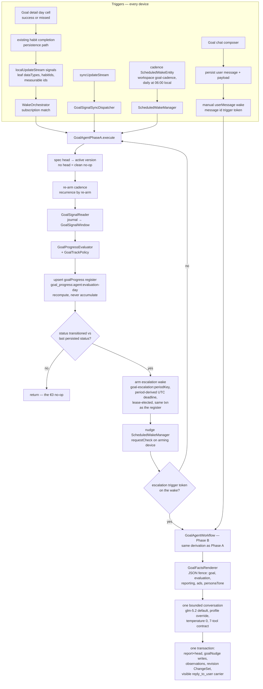

# Goal Agents — Runtime

One long-lived agent per user goal (ADR 0053), built deterministic-first
(ADR 0054): the invariant is that **a tick that changes nothing costs €0
and writes no messages**. Phase A is the model-free tier that runs on
every wake; Phase B is the lease-elected LLM tier that consumes the
escalation wakes Phase A arms, speaking the contract that was validated
in the eval harness *before* this runtime existed (the prompt and tool
definitions live in `goal_agent_contract.dart` and the eval suite imports
them — one artifact, zero drift). The banner surface, Agents tab, rolling
progress detail, and the first durable two-way chat slice are visible behind
the rollout flag.

## Runtime flow

## Invariants

- **Convergence over coordination.** The register row id is deterministic
  per `(agentId, evaluation-day)`; every device recomputes the same
  content from the same journal, so concurrent Phase A runs converge
  instead of duplicating. A recompute over a synced row carries that
  row's vector clock forward — dropping it would make the write causally
  concurrent with its own input.
- **Transitions compare against the last persisted status** — today's own
  earlier row first, yesterday's otherwise — so an escalation wake that
  re-runs Phase A is a no-op, not a self-re-arming loop.
- **Banner expiry can be LLM-worthy without a status transition.** Phase A's
  deterministic staleness sweep records an overdue active banner as expired.
  When the unchanged goal still qualifies for automatic copy (off track, or
  at risk on the initial/worsening path), that expiry re-arms the period's
  escalation so Phase B creates or reuses a replacement. Healthy expiry stays
  a EUR0 maintenance event.
- **The register and its escalation commit in one transaction.** A register
  write acknowledging a transition without its escalation would be
  permanent: the next run reads the new status as `previousStatus` and
  never re-arms the missed Phase B wake. The escalation deadline is
  derived from the period (its UTC day key), never from the arming
  device's wall clock, so every device arming the same logical escalation
  writes an identical record and the concurrent resolver's later-deadline
  preference cannot resurrect a consumed wake.
- **Grace history is a consecutive, same-spec-version streak**: prior-row
  collection stops at the first missing day and at the first row computed
  under a superseded spec version.
- **Borrowed data semantics.** Quantitative day totals follow the health
  charts' per-type aggregation (`cumulative_step_count` day total is the
  daily max), point-sample types keep the day's latest sample, habit days
  follow the habits UI's latest-completion-per-day collapse with
  success-only counting, and day keys re-stamp the local calendar date as
  midnight UTC. The goal agent must never disagree with the chart the
  user is looking at.
- **Automatic Phase B is reachable only through the lease; direct chat and
  detail-page refreshes are explicit user wakes.** Sync-received signals run Phase A directly (the
  orchestrator deliberately listens local-only); automatic LLM-worthy work
  becomes a `goal-escalation:<periodKey>` scheduled wake whose lease election
  picks exactly one device. A durable source chat turn instead carries a
  `goal-chat-message:<messageId>` trigger on a manual `userMessage` wake. The
  source exists before enqueue, the wake bypasses throttling, and no chat UI
  owns an inference loop. A successful exact-day habit edit also enqueues a
  workspace-scoped `goal-report-refresh` wake; its workspace does not supersede
  the ordinary subscription wake, and it routes to Phase B to refresh the
  standing report even when the coarse status did not change.
- **Phase B re-derives, never trusts.** The workflow calls the same
  `deriveWakeFacts` Phase A used to arm the escalation and renders every
  number into the FACTS block; the prompt forbids the model to recompute.
  A wake with zero tool calls is legal (the no-op policy row) — the
  strategy never nags for output. Two deterministic exceptions are forced
  with one pinned retry each: a transition/detail-refresh wake missing its
  report, and policy row P5 (offTrack, no fresh ad, no cooldown) or an explicit
  new-banner request missing its ad. A first evaluation that lands at risk is
  also ad-eligible, so a newly created goal does not wait for a three-day trend
  before receiving its initial banner.
- **The escalation carries its own baseline and period.** The wake record
  encodes the PRE-transition status as a `goal-baseline:<status>` trigger
  token (Phase A's register write hides it from any re-derivation, and a
  same-day double transition makes the prior-day row an insufficient
  reconstruction) and is evaluated at ITS period — a stale escalation
  resolves the spec version its register row recorded, and an older
  period never advances the current report head. A failed Phase B wake
  re-arms its escalation with a later deadline (the resolver's supported
  reschedule-beats-consume path), so a transient failure cannot orphan
  the period.
- **Ad contracts are enforced at persistence, not just in the prompt.**
  `persistOutputs` re-reads the nudge rows (a dismissal during inference
  must count), and suppresses creates/re-runs during the same-day dismissal
  cooldown, while a fresh active ad exists (ads retired in the same wake
  don't count — the P14 swap stays legal), and for duplicate brief
  digests. Automatic transition ads keep their period/baseline identity;
  chat-created replacements add the durable source message id so a retired
  transition ad cannot silently collide with the requested replacement.
  An affirmative chat request for a new banner is recognized from direct
  want/need/show language, replacement language, or a missing-banner report in
  the durable user message before inference. A short affirmation also qualifies
  when the immediately preceding visible assistant reply offered a banner.
  For every language, a typed create/re-run tool action on an interactive turn
  is the structured intent carrier and upgrades the same permission before
  persistence; the English heuristic is only the early force-action path.
  These interactive requests override
  the automatic dismissal cooldown and automatic health gates, and remain
  ad-eligible for the whole wake, so a recovering or healthy goal can serve
  explicitly requested positive copy without its persistence pass retiring the
  banner it just created. Negated
  requests, unrelated courtesy, and explanation prompts do not trigger that
  exception. The current active banner
  retires only after a sanitized, non-duplicate create or valid retired-ad rerun
  has been identified,
  so a replayed/invalid candidate cannot leave the goal bannerless. If the
  primary model replies with a cooldown refusal and omits the tool, the workflow
  forces `create_goal_ad` and withholds the now-contradictory refusal. A
  temporary-hide request instead calls `snooze_goal_ad` with any future instant
  carrying an explicit UTC marker or numeric offset, and an id from the
  active-ad subset (a retired reusable ad is not a snooze target): the same active nudge
  keeps its activation and rating history, stores `snoozedUntil` in provenance,
  disappears from every banner surface, and returns when the active-banner
  provider's deadline timer invalidates the projection. Snooze extends the
  activation's `staleAt` past that reveal instant so the hidden interval cannot
  consume its remaining visible lifetime. A re-run clears stale snooze
  provenance. After a chat wake commits, the controller reads the persisted
  snooze deadlines into a short-lived local suppression map before invalidating
  the async projection; retained stale-while-revalidate data therefore cannot
  flash the hidden banner, and unrelated active banners remain visible.
  The three-day worsening requirement remains the automatic `atRisk` gate;
  an interactive `atRisk` wake that emits a structured create/rerun action
  honors the user's request while still enforcing duplicate-copy and stale-spec
  guards. Report prose passes
  `sanitizeAgentReportText`.
- **The goal spec never mutates in a wake.** `propose_goal_revision`
  lands as a pending ChangeSet for user approval; ad state is validated
  in-conversation against the ids the FACTS offered, and all outputs
  commit in one transaction.
- **Revision is approval-gated and conservative.** Accepting the proposal
  (`goalChangeSetConfirmationServiceProvider` → `GoalToolDispatcher` →
  `GoalSpecRevisionService`) applies the changes to the criteria tree via
  `applyGoalRevisionChanges` — which REJECTS anything ambiguous (two
  candidate leaves and no name, unparseable period/cadence, free-form
  `successCriteria` alone) rather than guessing — then supersedes the
  current version, mints `v(n+1)` with full provenance (`authoredBy:
  goal_agent`, `diffFromVersionId`, the proposal's rationale) and moves
  the head in one transaction. Grace history resets naturally: Phase A's
  prior-row streak breaks at the version change. The revision service rechecks
  that the identity is still an active goal inside the serialized path;
  inactive details hide the approval card as well. After acceptance the
  signal subscription re-registers from the NEW criteria; on other
  devices the synced-in head triggers the same re-registration through
  the sync processor's identity re-offer.
- **Owner edits are versioned, never in-place.** The explicit edit route uses
  `GoalSpecRevisionService.reviseFromOwner` with the complete user-authored
  title, intention, persona name and criteria tree. It serializes against the
  current head, refuses a no-op or a save whose loaded base version is no
  longer the head, supersedes the current version and mints `v(n+1)` with
  `authoredBy: user` and `diffFromVersionId`. The create/edit UI
  only rewrites rolling-seven-day habit leaves and the supported at-least
  rolling-average steps metric; richer trees and opposite-direction step
  criteria are retained exactly and shown read-only. Supported trees retain
  authored leaf titles, composite wrappers and stable collision-free node ids.
  Manual mapping choices
  survive back-navigation while the intention is unchanged, and saving
  reconciles selected habits against the latest active-habit stream so a paused
  or removed habit cannot be minted into a dead criterion. After a minted edit,
  the runtime re-registers the new signal set and enqueues an immediate
  `goal revised` wake so the report and health do not describe the old spec.
- **Nudge accumulators are CRDTs.** Dismissal is terminal in the
  concurrent resolver, and exposure counters (per-host G-counters),
  rating histories and shown-at watermarks merge losslessly on concurrent
  sync — the labeled ad library must survive whole-row LWW.
- **Calendar arithmetic is component-based** (`DateTime(y, m, d ± n)`),
  never `Duration` math, so DST transitions cannot shift the cadence hour,
  skip a prior-day register key, or truncate a 25-hour day's query range.

## The visible layer (PR 5)

- **Banners** (`ui/goal_banner_*.dart`): procedural text banners per
  ADR 0058 — model-authored copy, code-owned animation presets (all
  degrade to plain text under reduced motion) and accent presets bound to
  design-system tokens. The register TINTS the accent (`goalBannerStyle`):
  one hue at graded washes (`SurfaceAlphas.washBorder/washChip/washControl`
  plus the `tint` fill) for the card fill, border, persona chip and CTA
  pill, so the banner's state reads before a word is (celebrate green,
  restart teal, nudge ember, roast the hand-authored `GoalAccentHues.neon`
  lime). Rendered in a single **shell-level dock** (`GoalBannerDock`,
  mounted in `beamer_app.dart`) — one rotating slot at the bottom of the
  content region on desktop (beside the sidebar) and above the bottom nav
  on mobile, on the main working tabs only (Tasks, DailyOS, Habits). One
  shared rotation state cycles every standing banner ~15s each; a fresh
  acknowledgment (a re-run) jumps the queue;
  hover/touch and app-backgrounding pause the cycle; the dock collapses to
  nothing when no goal is speaking. The goal detail page shows that goal's
  banners uncycled via `GoalBannerCard` directly. Tapping a banner opens
  its goal's detail page (the banner→conversation flow); the star button
  — rendered only while an outcome is due — opens the per-activation
  rating prompt (one outcome per activation, skips count). Dismissal (X
  or swipe) is terminal and quiets ads for the rest of the local day.
  Exposure is measured in visibility episodes by
  `GoalBannerExposureTracker` gated on THREE signals — the tracker's
  stopwatch runs only while the app lifecycle is `resumed`, `TickerMode`
  reports the host tab on screen, AND the banner intersects its enclosing
  viewport (rechecked on scroll events, lifecycle changes and post-rebuild
  frames, never per frame; the dock and other non-scrollable hosts use the
  other two signals alone). Every
  visible→hidden transition — backgrounding, tab switch, scroll-out,
  unmount — flushes its own episode into the per-host G-counters, so
  returning starts a new episode. Writes per nudge are serialized in
  `GoalNudgeInteractions` so a rapid flush/dismiss pair cannot lose an
  update to a stale read.
  The dock and the full detail card both render the selected animation through
  `GoalBannerAnimatedText`; the dock and its animated tenant span their host,
  and both desktop and compact docks show the complete authored headline with
  no avatar, secondary tagline, or line cap; compact dismissal remains at the
  trailing edge. A chat-requested snooze accepts an arbitrary future duration
  or date/time and automatically restores the exact banner at that deadline.
  The card keeps `cardPadding` on its lateral and bottom edges but uses
  `spacing.step2` above the fixed-height action header, preventing the rating
  and dismissal tap targets from creating a visually double-padded top edge.
- **The Agents tab** (`enable_agents_page` flag, `/agents`): one card per
  goal agent with health at a glance — a coarse-health chip
  (`coarseHealthOf` collapses the runtime `GoalTrackStatus` into Healthy /
  Behind / Restarting / Not enough data; `recovering` reads Restarting, never
  a failure), the report one-liner, a pending-proposal badge and a trend
  arrow (`GoalHealthDirection`, computed in `goalAgentHealthProvider` from the
  two most-recent non-deleted registers for the ACTIVE spec version with a
  0.02 deadband — withheld when either register is insufficient-data, and only
  for rolling-window goals, since calendar/day windows reset attainment each
  period and a consecutive-register delta there is a boundary reset, not a
  decline). The detail header surfaces that independent direction as a second
  semantic pill, allowing combinations such as Behind + Trending up and
  Healthy + Trending down. The row shows a coarse chip rather than a raw attainment
  percentage; the one-liner is the agent's own prose, so keeping percentages
  out of it is a matter for the agent's instructions, not widget-level
  filtering. Below the one-liner a rolling-window habit goal shows a
  deterministic hint — days-to-recovery when behind (`deficit`) or the buffer
  before the oldest success ages out when exactly at rate (`buffer`; surplus
  completions do not receive an aging warning) — lifted from the
  root leaf to `GoalEvaluation`, persisted on the `goalProgress` register, and
  surfaced through `goalAgentHealthProvider`. A row whose per-agent
  health has not resolved shows no chip rather than a false "Not enough data",
  and the settled-empty state is a first-run explainer whose CTA is the sole
  creation affordance (the global FAB hides). When a spec is available,
  `goalAgentProgressViewProvider` reads the evaluator's daily aggregates and
  adds a seven-cell compact strip to the list. The detail page expands the
  same source into a habit grid or metric series using each leaf criterion's
  actual day/rolling/week/month range; rolling habit projections keep the
  immediately preceding slipped day separate from active-period arithmetic,
  and periods longer than seven days scroll horizontally instead of being
  relabelled as a trailing week. Metric satisfaction is folded with the same
  configured aggregation (`sum`, `count`, average, or max) as
  `GoalProgressEvaluator`, rather than comparing each raw daily contribution
  with the period target. Composite detail keeps every metric and measurable
  leaf instead of silently collapsing the evidence to the first one, and the
  habit-only legend is omitted when no habit grid is rendered. The compact
  strip combines rolling success with daily accomplishment: a cell is green
  when `GoalProgressEvaluator` says the rolling criterion was satisfied as of
  that day, or when the authored `allOf`, `anyOf`, or `atLeastCount` tree folds
  to true over that day's habit completions. A fully completed routine day can
  therefore be green while the current goal remains Behind or Restarting.
  Numeric leaves still respect `atLeast` versus `atMost` direction, and missing
  samples never count as successful days.
  The provider invalidates itself at the next local midnight so Today,
  ages-out and window boundaries cannot remain stuck on yesterday. The detail
  view also carries an explicit Watching section. A reliability tail is shown
  only for an authored rolling-seven-day habit; other windows do not reinterpret
  their period as weekly reliability. Every
  habit day in that grid — including previous days — opens success/missed
  actions only when the selected day lies inside the habit's active lifetime
  and is not in the future; future calendar cells stay read-only and the
  persistence service enforces the same boundary.
  Both the detail callback and persistence service gate edits on an active goal
  identity, so a dormant or destroyed direct route cannot mutate habit history.
  Selecting the already-recorded outcome is a no-op. The write goes through
  `GoalHabitCompletionService` into the existing habit-completion path, so
  privacy, sync and reminder behavior remain shared. Historical corrections
  keep the selected calendar day but use the current wall-clock fields so
  deterministic entry ids do not collide when an outcome is changed back.
  The resulting local journal signal wakes Phase A immediately. The detail edit
  additionally queues a fact-grounded report refresh, so the standing report is
  updated even without a material status transition; the Update now control
  uses the same refresh token and shows the shared running state while the
  active agent works, and is absent after the goal leaves the active lifecycle.
  The detail page also carries active banners and, only while active, the
  revision-approval card (`ChangeSetSummaryCard.selfTargeted`). Mobile opens durable conversation
  at `/agents/details/:agentId/chat`; desktop renders the same
  `GoalAgentChatPane` beside detail. The mobile route mounts the composer only
  for an active goal identity, keeps the goal statement visible in its compact
  chat header, clears the overlaid navigation bar, and persists the detail
  route after system/gesture back. `agentChatProjectionProvider`
  filters and sorts the log first, retains the latest fifty durable visible
  candidates, and only then reads their payloads (no automatic `runKey`);
  projected turns are user messages and content-bearing `reply_to_user` actions;
  thoughts, system FACTS, legacy run-scoped FACTS rows, and tool bookkeeping
  never enter the visible history. Visible replies pass through the report
  sanitizer before persistence, so internal ids and annotations cannot leak
  into chat. Draft state is keep-alive per agent, waiting comes from the wake
  completion, and failure keeps the source turn available for retry by
  re-enqueueing its existing message id rather than duplicating it. A failure
  before the durable append returns an id retries by sending the retained draft
  as a new durable turn. The chat service rechecks active goal identity before
  writing that source turn. Payload ownership is checked before inference, chat failures
  cannot re-arm scheduled escalations, and a user wake cannot complete without
  a visible reply. Agent turns render through `AgentMarkdownView`; replies
  over 360 characters or eight line breaks start at an eight-rendered-line
  clamp with a localized Show more / Show less control, while user turns stay
  literal. Goal FACTS include the local timestamp, UTC offset, and time-zone name
  beside their canonical UTC generation time, allowing relative snooze requests
  to be interpreted against the user's clock. A successful chat wake explicitly
  invalidates the visible-chat, active-banner, and history projections because
  workflow writes bypass the
  interaction notifier; the colored card therefore appears in the mounted
  desktop split without a route round-trip. Interactive reply payload/message
  ids are deterministic per `(agentId, runKey)`; if the output transaction
  committed and only the deferred outbox flush failed, the reply is re-read as
  the commit marker and the turn completes without another billed inference.
  Creation and owner editing share a three-stage intention → mapping →
  confirmation route. The mapping stage matches observable active habits and
  the supported steps metric, gives every selected habit its own one-to-seven
  rolling-week cadence, waits for the active-habit snapshot before caching a
  match, uses whole-word matching, and explicitly refuses an intention for which
  no observable proxy exists. Existing criteria outside the form's representable
  range stay losslessly read-only. Confirmation names the goal and its
  conversational persona and states the inference-cost contract. Editing opens
  only for active goal agents, preloads the current values, explains the next
  immutable version, and preserves version history. A successful owner edit
  retracts any pending agent-authored goal-revision proposal based on the old
  version, preventing a later approval from overwriting the owner's newer
  intent. A supported MULTI-habit routine is stored as an `allOf` composite;
  deletion cancels queued work, aborts an in-flight local wake, and soft-retires
  the whole agent through
  `GoalAgentService.deleteGoalAgent`. The shared drain lifecycle guard rejects
  any queued non-active goal wake that survives a race or arrives from sync and
  emits an aborted completion, so an interactive caller never waits forever for
  a lifecycle-dropped request. Every explicit cancellation or superseding queue
  removal emits the same aborted completion, so a waiting interactive caller
  also terminates. A source-message append that committed before an outbox error
  is reconciled by id and reused rather than duplicated. Deletion first performs
  the durable lifecycle transition; only a successful transition cancels queued
  work, aborts an in-flight wake, and removes the goal's in-memory signal
  subscription, preventing future matching journal updates from
  repeatedly enqueueing work that the lifecycle guard would only discard.
  Goal-list rows and banner semantics resolve the active spec title; the
  identity display name remains the conversational persona used by chat.
- **Conversation scope is the goal.** The contract identifies the agent as a
  dedicated coach rather than a general assistant. Coding, trivia and other
  unrelated requests receive a short purpose reminder and a redirect to the
  goal; the agent does not attempt the off-topic answer. Chat entry points are
  mounted only for active goal agents. If the spec head moves while an
  interactive inference is running, output fencing fails the wake so the
  durable user turn remains retryable instead of completing without a reply.
- **Standing reports and governance remain visible.** The detail page always
  renders the report referenced by the authoritative current-scope report head;
  a delayed historical row cannot displace it merely by carrying a later local
  timestamp. Active banner interactions appear after the report rather than
  replacing it. Its top-level pills query the AI-consumption ledger
  by `agentId` over the full recorded lifetime. The shared consumption pill is
  the same component used by Task Details: provider-reported Melious credits,
  energy and carbon when available, otherwise tokens, with water and the full
  breakdown and localized compute duration in the tooltip. A second pill sums
  recorded invocation duration as lifetime compute time, including a localized
  sub-minute threshold. The compute-time pill is withheld when legacy usage has
  no positive recorded duration. No model price table or invented monetary
  estimate is involved.
- **Agent Internals attributes only actual inference.** Conversation wake rows
  resolve their model from persisted token usage first, then the wake-run
  snapshot. A source-only user-message thread has no model label: it did not run
  Gemini (or any model), while the separately enqueued goal wake can correctly
  show GLM. Live agent config is never projected backward onto a source turn.
- **Interaction writes bypass the notifier by design** (they go through
  the sync service): the banner handlers invalidate
  `activeGoalNudgesProvider` after dismiss/rate.

## Gotchas

- `agent_wiring.dart` silently routes unregistered kinds to the
  task-agent workflow; the bootstrap merges the Daily OS and Goals runner
  maps, and `test/app_bootstrap_test.dart` pins both registrations — do
  not turn that merge back into a replacement.
- Subscriptions are in-memory: `GoalRuntimeMaintenance.restoreSubscriptions`
  rebuilds them at startup, and `onIdentityReceived` (the
  `AgentRuntimeMaintenance` hook the sync processor offers every
  contributor) mirrors a goal agent synced in mid-session.
- Imported workout rules currently produce metric leaves whose dataTypes
  only match `QuantitativeEntry` rows; workout-entry signals are a
  documented follow-up.

## Related

- [Agents](agents/) — the shared runtime this plugs into.
- [Daily OS](daily_os_next/) — the reference plug-in implementation.
- ADRs 0053–0058 in `docs/adr/` — the decision record for this feature.
