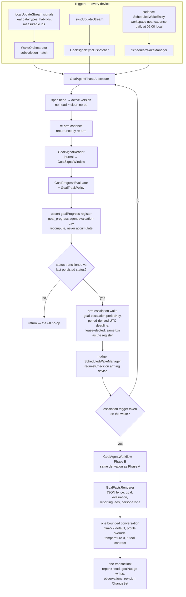

# Goal Agents — Runtime

One long-lived agent per user goal (ADR 0053), built deterministic-first
(ADR 0054): the invariant is that **a tick that changes nothing costs €0
and writes no messages**. Phase A is the model-free tier that runs on
every wake; Phase B is the lease-elected LLM tier that consumes the
escalation wakes Phase A arms, speaking the contract that was validated
in the eval harness *before* this runtime existed (the prompt and tool
definitions live in `goal_agent_contract.dart` and the eval suite imports
them — one artifact, zero drift). The banner surface (ADR 0058) and the
goal chat are later increments.

## Runtime flow

## Invariants

- **Convergence over coordination.** The register row id is deterministic
  per `(agentId, evaluation-day)`; every device recomputes the same
  content from the same journal, so concurrent Phase A runs converge
  instead of duplicating. A recompute over a synced row carries that
  row's vector clock forward — dropping it would make the write causally
  concurrent with its own input.
- **Transitions compare against the last persisted status** — today's own
  earlier row first, yesterday's otherwise — so an escalation wake that
  re-runs Phase A is a no-op, not a self-re-arming loop.
- **The register and its escalation commit in one transaction.** A register
  write acknowledging a transition without its escalation would be
  permanent: the next run reads the new status as `previousStatus` and
  never re-arms the missed Phase B wake. The escalation deadline is
  derived from the period (its UTC day key), never from the arming
  device's wall clock, so every device arming the same logical escalation
  writes an identical record and the concurrent resolver's later-deadline
  preference cannot resurrect a consumed wake.
- **Grace history is a consecutive, same-spec-version streak**: prior-row
  collection stops at the first missing day and at the first row computed
  under a superseded spec version.
- **Borrowed data semantics.** Quantitative day totals follow the health
  charts' per-type aggregation (`cumulative_step_count` day total is the
  daily max), point-sample types keep the day's latest sample, habit days
  follow the habits UI's latest-completion-per-day collapse with
  success-only counting, and day keys re-stamp the local calendar date as
  midnight UTC. The goal agent must never disagree with the chart the
  user is looking at.
- **Phase B is reachable only through the lease.** Sync-received signals
  run Phase A directly (the orchestrator deliberately listens local-only);
  anything LLM-worthy becomes a `goal-escalation:<periodKey>` scheduled
  wake whose lease election picks exactly one device. The wake-runner
  signature carries no workspace key, so the escalation record stores its
  workspace key as a trigger token and the runner routes on it.
- **Phase B re-derives, never trusts.** The workflow calls the same
  `deriveWakeFacts` Phase A used to arm the escalation and renders every
  number into the FACTS block; the prompt forbids the model to recompute.
  A wake with zero tool calls is legal (the no-op policy row) — the
  strategy never nags for output. Two deterministic exceptions are forced
  with one pinned retry each: a transition wake missing its report, and
  policy row P5 (offTrack, no fresh ad, no cooldown) missing its ad.
- **The escalation carries its own baseline and period.** The wake record
  encodes the PRE-transition status as a `goal-baseline:<status>` trigger
  token (Phase A's register write hides it from any re-derivation, and a
  same-day double transition makes the prior-day row an insufficient
  reconstruction) and is evaluated at ITS period — a stale escalation
  resolves the spec version its register row recorded, and an older
  period never advances the current report head. A failed Phase B wake
  re-arms its escalation with a later deadline (the resolver's supported
  reschedule-beats-consume path), so a transient failure cannot orphan
  the period.
- **Ad contracts are enforced at persistence, not just in the prompt.**
  `persistOutputs` re-reads the nudge rows (a dismissal during inference
  must count), and suppresses creates/re-runs during the 24h dismissal
  cooldown, while a fresh active ad exists (ads retired in the same wake
  don't count — the P14 swap stays legal), and for duplicate brief
  digests. Report prose passes `sanitizeAgentReportText`.
- **The goal spec never mutates in a wake.** `propose_goal_revision`
  lands as a pending ChangeSet for user approval; ad state is validated
  in-conversation against the ids the FACTS offered, and all outputs
  commit in one transaction.
- **Revision is approval-gated and conservative.** Accepting the proposal
  (`goalChangeSetConfirmationServiceProvider` → `GoalToolDispatcher` →
  `GoalSpecRevisionService`) applies the changes to the criteria tree via
  `applyGoalRevisionChanges` — which REJECTS anything ambiguous (two
  candidate leaves and no name, unparseable period/cadence, free-form
  `successCriteria` alone) rather than guessing — then supersedes the
  current version, mints `v(n+1)` with full provenance (`authoredBy:
  goal_agent`, `diffFromVersionId`, the proposal's rationale) and moves
  the head in one transaction. Grace history resets naturally: Phase A's
  prior-row streak breaks at the version change. After acceptance the
  signal subscription re-registers from the NEW criteria; on other
  devices the synced-in head triggers the same re-registration through
  the sync processor's identity re-offer.
- **Nudge accumulators are CRDTs.** Dismissal is terminal in the
  concurrent resolver, and exposure counters (per-host G-counters),
  rating histories and shown-at watermarks merge losslessly on concurrent
  sync — the labeled ad library must survive whole-row LWW.
- **Calendar arithmetic is component-based** (`DateTime(y, m, d ± n)`),
  never `Duration` math, so DST transitions cannot shift the cadence hour,
  skip a prior-day register key, or truncate a 25-hour day's query range.

## Gotchas

- `agent_wiring.dart` silently routes unregistered kinds to the
  task-agent workflow; the bootstrap merges the Daily OS and Goals runner
  maps, and `test/app_bootstrap_test.dart` pins both registrations — do
  not turn that merge back into a replacement.
- Subscriptions are in-memory: `GoalRuntimeMaintenance.restoreSubscriptions`
  rebuilds them at startup, and `onIdentityReceived` (the
  `AgentRuntimeMaintenance` hook the sync processor offers every
  contributor) mirrors a goal agent synced in mid-session.
- Imported workout rules currently produce metric leaves whose dataTypes
  only match `QuantitativeEntry` rows; workout-entry signals are a
  documented follow-up.

## Related

- [Agents](agents/) — the shared runtime this plugs into.
- [Daily OS](daily_os_next/) — the reference plug-in implementation.
- ADRs 0053–0058 in `docs/adr/` — the decision record for this feature.
