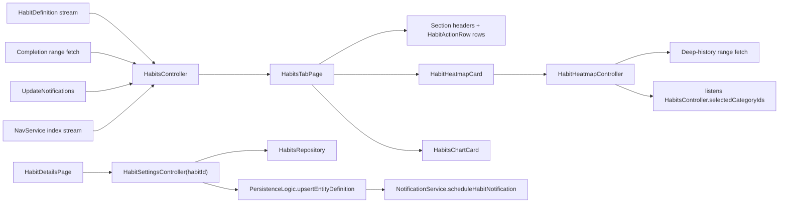
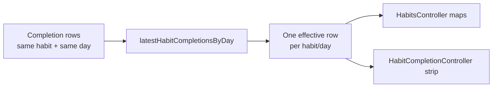
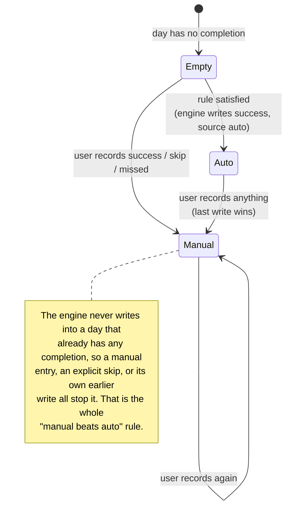
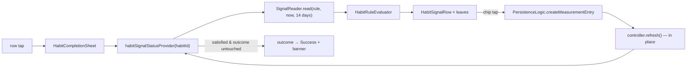

Habits sit on top of **two different records**: `HabitDefinition`, describing the
recurring thing, and `HabitCompletionEntry` — a `JournalEntity` variant wrapping
`HabitCompletionData` — recording what happened on a concrete day.

**Most of the feature exists to reconcile those two streams into "what should the
user see right now?"** That is why the code is far more about derivation than
CRUD.

# Three read models, on purpose

| Controller | Owns |
|------------|------|
| `HabitsController` | The whole tab-level query model — buckets, summary, chart, streaks |
| `HabitHeatmapController` | The combined consistency heatmap over a multi-year range |
| `HabitCompletionController` | One **dashboard** habit card's history strip for a date range |

That split keeps tab state coherent without turning every card refresh into a
full-page recomputation, and **keeps the heatmap's deep fetch off the tab's
completion hot path**.

# Last write wins per habit/day

Completion is **append-style journal data, not a mutable field on the
definition** — a user can record the same habit/day more than once.

The durable contract is **last write wins per `(habitId, dateFrom.ymd)`**: read
models collapse repeated rows and keep the entry with the newest metadata write
timestamp before deriving UI state.

The goal-details quick picker uses that contract to clear a day without
deleting history: it appends a newer `HabitCompletionEntry` whose nullable
`completionType` is empty. The goal signal reader treats that latest empty
outcome as no goal-day entry. The habits tab retains its older legacy-null
semantics described below; clearing from the goal surface does not redefine
statistics or streak policy.

**That resolver is deliberately pure**, covered by both example tests and Glados
properties. It protects the tab maps, streak inputs, card strips, repository reads
and direct `JournalDb` reads from **database row-order differences** when multiple
writes share the same effective day.

# Completions are read as a three-field projection

Both the tab controller and the heatmap read completions through
`JournalDb.getHabitCompletionRecordsInRange`, which returns
`HabitCompletionRecord` — **`habitId`, `dateFrom`, `completionType`** — and not
the `HabitCompletionEntry` entity.

Those three fields are all any consumer ever touched. Carrying the whole entity
was the cost: the read averaged **636 ms** in the 2026-06/07 slow-query logs
while the SQL itself measures ~29 ms on a comparable 10,000-row / 1,460-result
set. The gap is ~20 columns per row — including the fat `serialized` JSON blob —
crossing the isolate port, which the interceptor measures because it wraps the
executor on the calling side. Decoding those blobs into `JournalEntity` then
costs the *calling* isolate more work again, outside that measurement.

The ranking contract is unchanged: one winning row per habit/day, last write
wins, ordered `updated_at DESC, created_at DESC, date_to DESC, id DESC`.

An unrecognised `completionType` decodes to `null` rather than throwing, so one
completion type synced from a newer peer cannot take out the whole heatmap.

**`null` is not a synonym for success.** It is the value legacy entries already
carry, and the consumers treat it as *recorded and streak-extending, but not a
success*: it counts in `allByDay`, `habitSuccessDays` and the heatmap
denominator, while staying out of `successfulByDay`, `successfulToday` and the
heatmap's success numerator. So an unknown type closes the habit for that day
without contributing to its success rate. That asymmetry predates the
projection; it is how legacy `null`s have always behaved.

# What the tab controller derives

From active definitions plus completions in range: `completedToday`,
`successfulToday`, `openHabits`, `openNow`, `pendingLater`, `completed`,
`successfulByDay`, `skippedByDay`, `failedByDay`, `allByDay`,
`shortStreakCount` (trailing 3 days), `longStreakCount` (trailing 7 days), plus
chart labels and `minY`.

**Streaks require every day in the window.** `countHabitsWithStreak` counts
habits whose success-day set covers *every* day — a single missing day
disqualifies. **Skips and `null`-type completions count toward a streak the same
as explicit successes; only an explicit `fail`, or a missing day, breaks it.**

**The controller filters to `habit.active == true` immediately.** Archived habits
still exist in settings and storage, but the main tab derives only from active
definitions.

# The data model is more ambitious than the editing surface

The model supports `daily`, `weekly` and `monthly` schedules, but the UI is
effectively daily-first:

- New habits are created with `HabitSchedule.daily(requiredCompletions: 1)`.
- The settings page exposes only `showFrom` and `alertAtTime`, for daily habits.
- `showHabit()` checks only the daily `showFrom` time when deciding between
  `openNow` and `pendingLater`.

This is stated plainly rather than pretending the weekly/monthly UI exists.

The same is true of the signal side. `HabitDefinition.autoCompleteRule` — the
`AutoCompleteRule` tree of measurable / health / workout leaves under
`and` / `or` / `multiple` — is persisted, synced and now evaluated by the
engine below, but **there is no editor for it yet**: only
`lib/logic/habits/autocomplete_update.dart` rewrites the tree and
`GoalCriterion.fromAutoCompleteRule` reads it as a goal seed. The habits
rework makes that tree the habit ↔ signal association; the model already
carries the fields it needs:

- `AutoCompleteRule.workout.valueType` (`WorkoutValueType?`) chooses which
  workout value a threshold applies to; `null` means "any workout of that
  type". An unknown value from a newer peer decodes to `null`.
- `HabitDefinition.autoCompleteNotify` (default `true`) gates the
  auto-completion notification.
- `HabitCompletionData.source` (`manual` | `auto`, default `manual`, unknown
  values decode as `manual`) and `autoCompleteReason` record who wrote a
  completion.

# Auto-completion: the engine only fills empty days

`HabitAutoCompletionService` (`service/habit_auto_completion_service.dart`,
started from `registerSingletons`) checks habits off from recorded data. It
reads the same journal series the goals runtime does, through the neutral
[signals logic](../architecture/signals.md), and writes an ordinary
`HabitCompletionEntry` through `PersistenceLogic` with
`source: auto` — so the result syncs, resolves and renders like a manual one.

Triggers, in order of what actually happens:

1. **Launch.** `start()` runs a pass over every active habit with a rule.
2. **Journal updates.** The engine listens to `UpdateNotifications.updateStream`
   (local *and* sync batches) and matches the tokens `JournalEntity.affectedIds`
   emits — a measurable id, a health data type, a workout type, another
   habit's id — against each rule's `SignalNeeds`. A hit queues the habit; a
   2 s debounce collapses an import of many samples into one evaluation.
3. **Midnight.** A timer to the next local midnight runs a full pass and
   re-arms, so a day whose data was already there is checked off as soon as it
   begins.

Each evaluation covers **today and yesterday**: a health import that lands
after midnight still counts for the day it belongs to, and such a completion
is written at the last instant of that day (`23:59:59.999`) and flagged
`isLate` for the notification wording. Today's completion is stamped with
the current instant.

The `autoCompleteReason` stored on the entry names the satisfied leaves —
`Water · 750`, `Steps · 7412`, `running` — resolving measurable names through
`EntitiesCacheService` and health types through the dashboard health config,
so the habit row can say what checked it off without another read.

Consumers: the `completions` stream and `autoCompletedToday`, which
`HabitsSummaryCard` consults so a day the engine finished does not play the
all-done flourish — the notification covers it.

`HabitAutoCompletionNotifier` (`service/habit_auto_completion_notifier.dart`)
is the stream's consumer. It drops habits whose `autoCompleteNotify` is off,
collects the rest for 3 s after the first completion of a batch — a health
import that completes three habits should be heard about once — and writes
**one durable inbox row per batch and day** through
`NotificationRepository.createHabitAutoCompletion`, which the scheduler
projects to an OS banner on write (see
[notifications](notifications.md#where-a-notification-leads)). A single
completion reads `✓ {habit} done` / `Checked off automatically from {signal}.`;
a late one names the day it counted for; a group reads
`{n} habits checked off automatically` with the names as the body.

**Gotcha — its own write is a trigger.** The completion emits the habit's id,
which is a legitimate token for any *other* habit whose rule references this
one. The existing-entry guard, not token filtering, is what prevents a loop.

# Page composition

`HabitsTabPage` is a `CustomScrollView` of **three slivers**. Reading content —
header, summary, single-column habit list, chart — sits in a centred column
capped at **1100 px**: once the window exceeds that plus side padding, horizontal
padding becomes `(width - 1100) / 2`, and below it the padding is one spacing
step.

**Between the list and the chart, the consistency heatmap breaks out to the full
window width** in its own sliver, so a wide screen shows more history while the
action content stays a comfortable column.

Tab rows are lean **action rows**: icon, name, swipe, one-tap complete — **no
per-row history**. Per-day history reads from the heatmap instead. The older
per-row history strip survives only inside the dashboard habit chart. A row
whose completion today came from the engine wears an **auto** pill and a
caption naming the signal and the time (`HabitsState.autoCompletedToday` and
`autoCompletedAt`); tapping it still opens the sheet, because a manual entry
always overrides.

# The completion sheet shows the habit's own signals

`HabitCompletionSheet` (`ui/sheets/habit_completion_sheet.dart`, opened from
the row body, the done check and the long-press "other day" path) replaced
the old dialog that embedded a whole linked dashboard. It renders **one
`HabitSignalRow` per leaf of the habit's `autoCompleteRule`** — status pill
("≥ 500 ml · 250 so far", "any workout · done"), quick-record chips for a
measurable (its three most-logged values, from the same ranking the
measurement dialog uses, plus *Other* for the full capture), and a two-week
`SignalSparkline` — above the unchanged form (date, comment, Success / Skip /
Missed, Record).

The status provider is the sheet's single source: it reads through the same
`SignalReader` and `HabitRuleEvaluator` the engine uses, so a pill can never
say "done" while the engine would not write. It refreshes **in place** on
journal updates touching the rule's series (never a loading shell), and a
chip tap refreshes it explicitly after the write. A chip that satisfies the
rule flips an *untouched* outcome to Success and shows the auto banner; an
outcome the user picked is never overridden, and the sheet stays open so a
comment can still be added. Only today shows signals — a past `dateString`
gets the plain form.

# Write paths are shared

Read access is abstracted behind `HabitsRepository`, but **habit-definition saves
and completion writes both go through shared `PersistenceLogic`** — and definition
saves additionally schedule notifications.
