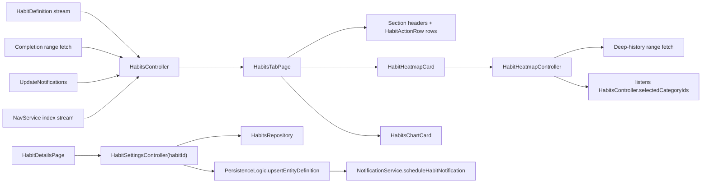
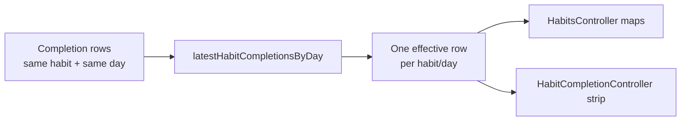

Habits sit on top of **two different records**: `HabitDefinition`, describing the
recurring thing, and `HabitCompletionEntry` — a `JournalEntity` variant wrapping
`HabitCompletionData` — recording what happened on a concrete day.

**Most of the feature exists to reconcile those two streams into "what should the
user see right now?"** That is why the code is far more about derivation than
CRUD.

# Three read models, on purpose

| Controller | Owns |
|------------|------|
| `HabitsController` | The whole tab-level query model — buckets, summary, chart, streaks |
| `HabitHeatmapController` | The combined consistency heatmap over a multi-year range |
| `HabitCompletionController` | One **dashboard** habit card's history strip for a date range |

That split keeps tab state coherent without turning every card refresh into a
full-page recomputation, and **keeps the heatmap's deep fetch off the tab's
completion hot path**.

# Last write wins per habit/day

Completion is **append-style journal data, not a mutable field on the
definition** — a user can record the same habit/day more than once.

The durable contract is **last write wins per `(habitId, dateFrom.ymd)`**: read
models collapse repeated rows and keep the entry with the newest metadata write
timestamp before deriving UI state.

The goal-details quick picker uses that contract to clear a day without
deleting history: it appends a newer `HabitCompletionEntry` whose nullable
`completionType` is empty. The goal signal reader treats that latest empty
outcome as no goal-day entry. The habits tab retains its older legacy-null
semantics described below; clearing from the goal surface does not redefine
statistics or streak policy.

**That resolver is deliberately pure**, covered by both example tests and Glados
properties. It protects the tab maps, streak inputs, card strips, repository reads
and direct `JournalDb` reads from **database row-order differences** when multiple
writes share the same effective day.

# Completions are read as a three-field projection

Both the tab controller and the heatmap read completions through
`JournalDb.getHabitCompletionRecordsInRange`, which returns
`HabitCompletionRecord` — **`habitId`, `dateFrom`, `completionType`** — and not
the `HabitCompletionEntry` entity.

Those three fields are all any consumer ever touched. Carrying the whole entity
was the cost: the read averaged **636 ms** in the 2026-06/07 slow-query logs
while the SQL itself measures ~29 ms on a comparable 10,000-row / 1,460-result
set. The gap is ~20 columns per row — including the fat `serialized` JSON blob —
crossing the isolate port, which the interceptor measures because it wraps the
executor on the calling side. Decoding those blobs into `JournalEntity` then
costs the *calling* isolate more work again, outside that measurement.

The ranking contract is unchanged: one winning row per habit/day, last write
wins, ordered `updated_at DESC, created_at DESC, date_to DESC, id DESC`.

An unrecognised `completionType` decodes to `null` rather than throwing, so one
completion type synced from a newer peer cannot take out the whole heatmap.

**`null` is not a synonym for success.** It is the value legacy entries already
carry, and the consumers treat it as *recorded and streak-extending, but not a
success*: it counts in `allByDay`, `habitSuccessDays` and the heatmap
denominator, while staying out of `successfulByDay`, `successfulToday` and the
heatmap's success numerator. So an unknown type closes the habit for that day
without contributing to its success rate. That asymmetry predates the
projection; it is how legacy `null`s have always behaved.

# What the tab controller derives

From active definitions plus completions in range: `completedToday`,
`successfulToday`, `openHabits`, `openNow`, `pendingLater`, `completed`,
`successfulByDay`, `skippedByDay`, `failedByDay`, `allByDay`,
`shortStreakCount` (trailing 3 days), `longStreakCount` (trailing 7 days), plus
chart labels and `minY`.

**Streaks require every day in the window.** `countHabitsWithStreak` counts
habits whose success-day set covers *every* day — a single missing day
disqualifies. **Skips and `null`-type completions count toward a streak the same
as explicit successes; only an explicit `fail`, or a missing day, breaks it.**

**The controller filters to `habit.active == true` immediately.** Archived habits
still exist in settings and storage, but the main tab derives only from active
definitions.

# The data model is more ambitious than the editing surface

The model supports `daily`, `weekly` and `monthly` schedules, but the UI is
effectively daily-first:

- New habits are created with `HabitSchedule.daily(requiredCompletions: 1)`.
- The settings page exposes only `showFrom` and `alertAtTime`, for daily habits.
- `showHabit()` checks only the daily `showFrom` time when deciding between
  `openNow` and `pendingLater`.

This is stated plainly rather than pretending the weekly/monthly UI exists.

# Page composition

`HabitsTabPage` is a `CustomScrollView` of **three slivers**. Reading content —
header, summary, single-column habit list, chart — sits in a centred column
capped at **1100 px**: once the window exceeds that plus side padding, horizontal
padding becomes `(width - 1100) / 2`, and below it the padding is one spacing
step.

**Between the list and the chart, the consistency heatmap breaks out to the full
window width** in its own sliver, so a wide screen shows more history while the
action content stays a comfortable column.

Tab rows are lean **action rows**: icon, name, swipe, one-tap complete — **no
per-row history**. Per-day history reads from the heatmap instead. The older
per-row history strip survives only inside the dashboard habit chart.

# Write paths are shared

Read access is abstracted behind `HabitsRepository`, but **habit-definition saves
and completion writes both go through shared `PersistenceLogic`** — and definition
saves additionally schedule notifications.
