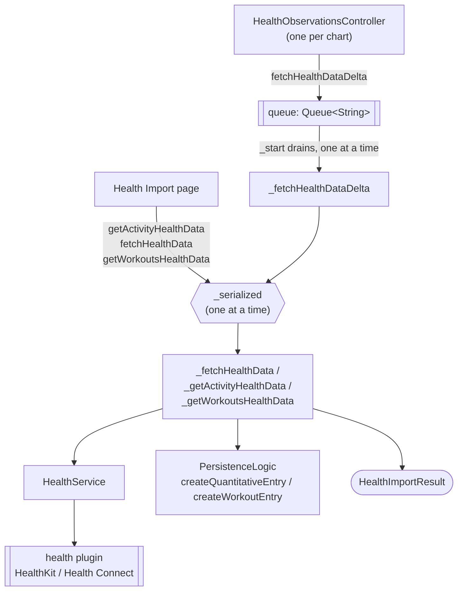
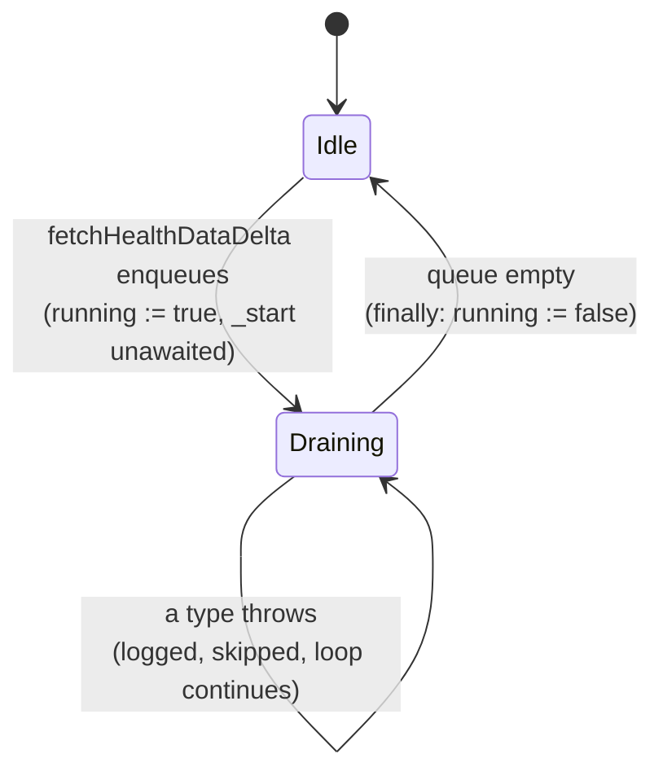

Health data is the one journal source Lotti does not author. Samples are read out
of Apple HealthKit or Google Health Connect through the `health` plugin and
written as `QuantitativeEntry` and `WorkoutEntry` records, after which they are
ordinary journal entities — [dashboards](dashboards.md) chart them with no idea
where they came from.

**Everything funnels through one `HealthImport` singleton**, and that is
load-bearing rather than incidental. See [One request at a time](#one-request-at-a-time).

# Two callers, different urgencies

| Caller | Entry point | Range | Awaited? |
|--------|-------------|-------|----------|
| A dashboard chart | `fetchHealthDataDelta(type)` / `getWorkoutsHealthDataDelta()` | newest stored sample → now | No — returns as soon as the type is queued |
| Settings → Health Import | `getActivityHealthData` / `fetchHealthData` / `getWorkoutsHealthData` | user-chosen | Yes — the page renders the outcome |

`HealthObservationsController`'s constructor schedules a delta fetch for its
health type after a short jittered delay, so **a dashboard with six health cards
asks for six imports within a second of opening**. That is the load the queue and
the gate exist to absorb.

Both paths converge on the same fetchers; only the range and whether anyone waits
differ.



# One request at a time

**HealthKit presents a single authorization sheet.** A second
`requestAuthorization` raised while the first is on screen replaces it, and what
the user sees is a sheet that appears and vanishes before it can be answered.
Reaching that takes no user error at all — a dashboard schedules background
deltas while the settings page starts an import on tap.

`_serialized` is therefore not an optimization. Every public import method wraps
its private implementation in it; each caller awaits its predecessor's baton and
publishes its own:

```dart
final predecessor = _healthAccessGate;
final baton = Completer<void>();
_healthAccessGate = baton.future;
try {
  if (predecessor != null) await predecessor;
  return await operation();
} finally {
  baton.complete();          // never with an error
}
```

Two properties are contract:

- **The baton completes in a `finally`, never with an error.** A failing import
  propagates to *its own* caller and releases the lock; it cannot wedge the
  requests queued behind it.
- **The baton is created lazily, not seeded with a resolved future.** A `Future`
  captures the zone it was constructed in, so one built in the constructor would
  schedule every continuation on that zone forever — which, among other things,
  makes the queue undrainable under `fakeAsync` and the whole subsystem
  untestable.

Public methods must not call each other: the callee would wait on a gate its own
caller holds. That is why each has a private `_`-prefixed twin, and why
`_fetchHealthDataDelta` calls `_fetchHealthData`, not `fetchHealthData`.

# The delta queue

`fetchHealthDataDelta` never blocks its caller — a chart must not wait on the
health store to paint. It queues the type, and a single drain loop works through
the queue.



**`running` is cleared in a `finally`, and each type is guarded individually.**
Without both, the first type that threw escaped the loop and left `running`
permanently `true`: the queue went on accepting types that nothing would ever
process again, so every health import for the rest of the session silently did
nothing while charts kept rendering stale data. `workoutImportRunning` guards
`getWorkoutsHealthDataDelta` the same way, for the same reason.

Cumulative (activity) types are re-fetched at most every ten minutes, because
their per-day totals move continuously; discrete samples are not throttled.

# What a request returns

Import methods return a `HealthImportResult` rather than throwing, so one failing
data type cannot abort a batch and the settings page has something concrete to
render per row.

| Status | Meaning | Page treatment |
|--------|---------|----------------|
| `imported` | Reached the store and completed. `sampleCount` may be `0` — a successful import of nothing | success tone |
| `unsupportedPlatform` | Desktop: there is no health store | warning tone |
| `permissionDenied` | The store refused read access; only the user can change it | warning tone |
| `noMatchingTypes` | No requested type resolved to a value of the plugin's enum — a stale dashboard configuration | error tone |
| `failed` | The store threw; `error` carries what | error tone |

`sampleCount` counts **source samples the database accepted**. Two consequences
follow, and both are deliberate:

- A staged sleep sample stored twice (see below) counts once — it is one
  measurement, not two.
- Re-importing a range that is already stored counts **zero**. Health entries
  carry deterministic `uuidV5` ids and `createDbEntity` writes with
  `overwrite: false`, so each duplicate row is rejected;
  `createQuantitativeEntryImpl` returns `null` for a rejected write and the
  counters honour it. Counting attempts instead would tell the user it had
  imported samples it had not.

# Type strings, and the two composites

Dashboards store a health type as a string. Most are the plugin enum's
`toString()` (`HealthDataType.STEPS`); a few are synthetic.

- `cumulative_step_count`, `cumulative_distance`, `cumulative_flights_climbed`
  are Lotti's own — written by `addActivityEntries` as one aggregated entry per
  calendar day. Any type containing `cumulative` routes to the activity fetcher
  rather than to a per-sample read.
- `compositeStorageTypes` expands the two composite chart keys before the store
  is queried: `BLOOD_PRESSURE` → systolic + diastolic, and `BODY_MASS_INDEX` →
  **weight**. The second looks wrong and is not: the "Weight vs. Body Mass Index"
  card plots the weight series (see `DashboardHealthBmiChart`), so BMI samples
  are never needed.

`resolveHealthDataTypes` drops names the plugin no longer defines. Resolving to
an empty list is reported as `noMatchingTypes` and logged as an error, because
silently importing nothing is indistinguishable from a broken import.

# Sleep is stored twice on purpose

Apple splits sleep into core, deep and REM from iOS 16 / watchOS 9 onward
(`SLEEP_LIGHT`, `SLEEP_DEEP`, `SLEEP_REM` in plugin terms — `SLEEP_LIGHT` is
Apple's *core*, category value 3) and reserves the generic `SLEEP_ASLEEP`
category for `asleepUnspecified`, which is all an older phone or a hand-entered
Health-app record ever writes.

The "Asleep" dashboard charts the generic type. So each staged sample is
persisted a second time under `HealthDataType.SLEEP_ASLEEP`, keeping one
comparable series across both eras. `sleepStagesDuplicatedAsAsleep` is that set.

**Gotcha, and the reason this section exists:** the set previously named
`SLEEP_ASLEEP_CORE` and `SLEEP_ASLEEP_UNSPECIFIED`, which are not values of the
plugin's enum. Deep and REM matched by luck; core — the largest stage of a
typical night — did not, so the chart showed roughly half of every staged night.
A membership test against a string is a test nothing type-checks; the test suite
now asserts every member resolves to a real `HealthDataType`.

# Platform gates

Three different notions of "platform" meet here, and conflating them is easy:

- **`isDesktop` / `isIOS` / `isAndroid` from `lib/utils/platform.dart`** — mutable
  top-level flags, deliberately so tests can drive both branches. All
  platform-dependent logic in `HealthImport` reads these, not `dart:io`'s
  `Platform`.
- **Companion permissions** (`activityRecognition`, `location`) are a *Health
  Connect* requirement and are requested on Android only. On iOS
  `activityRecognition` has no strategy at all — it resolves to
  permanently-denied without prompting — and `location` would raise an unrelated
  Location dialog in front of the HealthKit sheet.
- **`platform` / `deviceType` stamped on each entry** are descriptive metadata,
  resolved once at construction into `_platformReady` and awaited before any
  sample is persisted. A failure resolving them is logged and the import
  continues: losing a device model must not lose the data.

# The plugin seam

`HealthService` wraps the plugin's `Health` facade so the import logic stays
mockable, and owns its one initialization requirement: `Health.configure()` is
documented as mandatory and populates the plugin's cached device id. Some read
paths recover a missing id themselves; the Android BMI computation dereferences
it unconditionally. Every method here awaits `_ensureConfigured` first, once per
service, and a failed handshake is not cached — a transient error must not poison
every later call.

# Related

* [Dashboards](dashboards.md) — where imported samples are charted, and what
  schedules the background deltas.
* [Logging and diagnostics](../architecture/logging-and-diagnostics.md) —
  `LogDomain.health` is where every import outcome is recorded.
