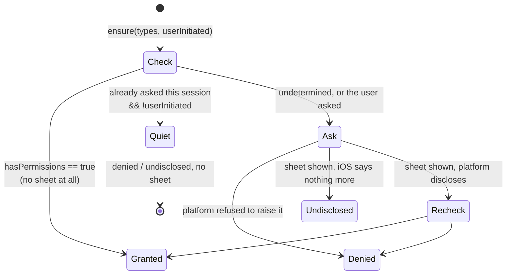
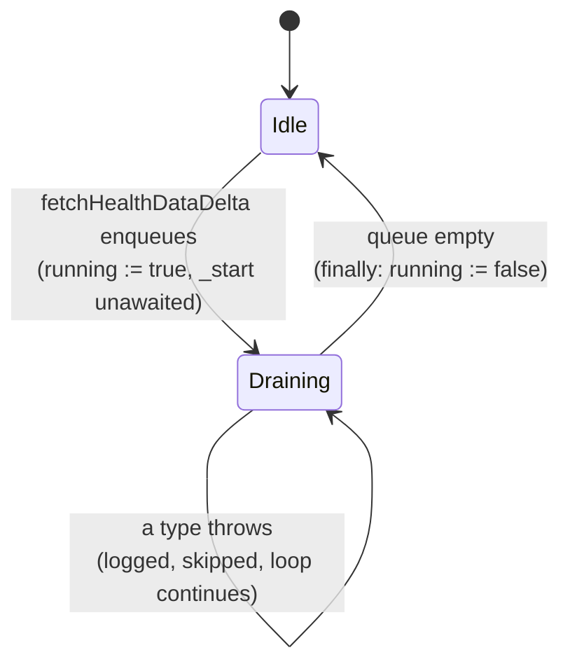
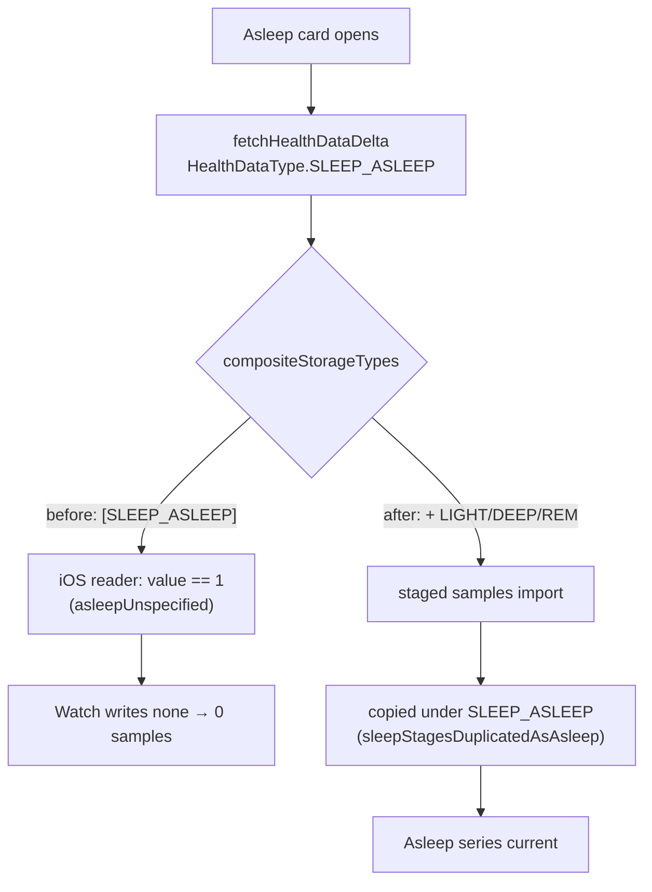

Health data is the one journal source Lotti does not author. Samples are read out
of Apple HealthKit or Google Health Connect through the `health` plugin and
written as `QuantitativeEntry` and `WorkoutEntry` records, after which they are
ordinary journal entities — [dashboards](dashboards.md) chart them with no idea
where they came from.

**Everything funnels through one `HealthImport` singleton**, and that is
load-bearing rather than incidental. See [One request at a time](#one-request-at-a-time).

# Two callers, different urgencies

| Caller | Entry point | Range | Awaited? |
|--------|-------------|-------|----------|
| A dashboard chart | `fetchHealthDataDelta(type)` / `getWorkoutsHealthDataDelta()` | newest stored sample → now (cumulative types: the day **before** the newest stored day → now) | No — returns as soon as the type is queued |
| Settings → Health Import | `getActivityHealthData` / `fetchHealthData` / `getWorkoutsHealthData` | user-chosen | Yes — the page renders the outcome |

`HealthObservationsController`'s constructor schedules a delta fetch for its
health type after a short jittered delay, so **a dashboard with six health cards
asks for six imports within a second of opening**. That is the load the queue and
the gate exist to absorb.

Both paths converge on the same fetchers; only the range and whether anyone waits
differ.


# One request at a time

**HealthKit presents a single authorization sheet.** A second
`requestAuthorization` raised while the first is on screen replaces it, and what
the user sees is a sheet that appears and vanishes before it can be answered.
Reaching that takes no user error at all — a dashboard schedules background
deltas while the settings page starts an import on tap.

`_serialized` is therefore not an optimization. Every public import method wraps
its private implementation in it; each caller awaits its predecessor's baton and
publishes its own:

```dart
final predecessor = _healthAccessGate;
final baton = Completer<void>();
_healthAccessGate = baton.future;
try {
  if (predecessor != null) await predecessor;
  return await operation();
} finally {
  baton.complete();          // never with an error
}
```

Two properties are contract:

- **The baton completes in a `finally`, never with an error.** A failing import
  propagates to *its own* caller and releases the lock; it cannot wedge the
  requests queued behind it.
- **The baton is created lazily, not seeded with a resolved future.** A `Future`
  captures the zone it was constructed in, so one built in the constructor would
  schedule every continuation on that zone forever — which, among other things,
  makes the queue undrainable under `fakeAsync` and the whole subsystem
  untestable.

Public methods must not call each other: the callee would wait on a gate its own
caller holds. That is why each has a private `_`-prefixed twin, and why
`_fetchHealthDataDelta` calls `_fetchHealthData`, not `fetchHealthData`.

# Asking for permission

Serializing the requests was only half of it: **nothing decided whether to ask at
all.** `requestAuthorization` ran on every import, background deltas included, so
opening a dashboard raised a system sheet each time — and once a data type is
determined (allowed, or switched off in Settings → Privacy & Security → Health)
that sheet has nothing in it the user can answer. `HealthPermissionGate` is the
decision, and every import now goes through it.

**Read access is a tri-state, and the third value is the common one on iOS.**

| Platform | `hasPermissions` (READ) | `requestAuthorization` |
|---|---|---|
| Health Connect | `true` / `false` — definitive | did the user grant it |
| HealthKit | **`null`** — Apple will not disclose it | only that a sheet was *shown* without error |

Apple's refusal is deliberate: knowing an app had been denied would itself leak
health information. `HealthAuthorization.undisclosed` is that answer, and it means
"read anyway and let the result speak".



Two rules, each fixing a visible defect:

- **Ask for the family, not the type.** `expandToPermissionFamilies` widens a
  request to the whole family in `health_data_types.dart` before anything is
  asked. The blood-pressure card mounts one `HealthObservationsController` *per
  series*, so it starts two independent imports — systolic and diastolic — and
  each used to raise its own request: two prompts, back to back, for one switch
  in the user's mind. Families are disjoint, which the test suite asserts;
  overlapping ones would make the authorized set depend on which type asked.
- **Ask once per session, unless the user asked.** The gate remembers what it has
  requested and stays quiet afterwards. `userInitiated: true` bypasses that memory
  and is passed by the three public entry points — the Health Import page's
  methods — while `_fetchHealthDataDelta` and `getWorkoutsHealthDataDelta` pass
  `false`. A tap on a row is the user saying "try again"; a chart they are merely
  looking at is not.

The memory is per-instance and per-session on purpose: a permission granted in
system settings while Lotti was backgrounded is picked up on the next launch
without ceremony.

# The delta queue

`fetchHealthDataDelta` never blocks its caller — a chart must not wait on the
health store to paint. It queues the type, and a single drain loop works through
the queue.



**`running` is cleared in a `finally`, and each type is guarded individually.**
Without both, the first type that threw escaped the loop and left `running`
permanently `true`: the queue went on accepting types that nothing would ever
process again, so every health import for the rest of the session silently did
nothing while charts kept rendering stale data. `workoutImportRunning` guards
`getWorkoutsHealthDataDelta` the same way, for the same reason.

Cumulative (activity) types are re-fetched at most every ten minutes, because
their per-day totals move continuously; discrete samples are not throttled.

# What a request returns

Import methods return a `HealthImportResult` rather than throwing, so one failing
data type cannot abort a batch and the settings page has something concrete to
render per row.

| Status | Meaning | Page treatment |
|--------|---------|----------------|
| `imported` | Reached the store and completed. `sampleCount` may be `0` — a successful import of nothing | success tone |
| `unsupportedPlatform` | Desktop: there is no health store | warning tone |
| `permissionDenied` | The store refused read access; only the user can change it | warning tone |
| `noDataOrAccess` | Read nothing, and this category has never yielded a sample — access is the likeliest cause | warning tone |
| `noMatchingTypes` | No requested type resolved to a value of the plugin's enum — a stale dashboard configuration | error tone |
| `failed` | The store threw; `error` carries what | error tone |

**`noDataOrAccess` exists because iOS makes `permissionDenied` undetectable.**
With a type switched off, HealthKit reports the authorization as successful and
then returns nothing, so a genuine refusal was rendered as a green tick reading
"No new samples" — identical to being up to date. The discriminator is history:
an empty read is only reported this way when the category has **never** produced
a stored sample, checked against `latestQuantitativeByType` (or `latestWorkout`).
It is a suspicion, not a verdict — someone who has never recorded a blood-pressure
reading gets it too — so it is worded as something to check, and it is never
raised when `hasPermissions` confirmed access, because then an empty read really
does mean there is nothing there.

The activity path checks **before writing**. It writes one aggregated entry per
calendar day regardless of value, so noticing afterwards would already have left
a run of fabricated zero-step days behind, which then chart as real.

`HealthImportState.needsAccessCheck` raises the page's access callout on either
of the two access outcomes, and `HealthImportController.openHealthSettings` is
the escape hatch: once a type has been answered for, HealthKit will not present
it again, so only the system settings can turn it back on.

`sampleCount` counts **source samples the database accepted**. Two consequences
follow, and both are deliberate:

- A staged sleep sample stored twice (see below) counts once — it is one
  measurement, not two.
- Re-importing a range that is already stored counts **zero**. Discrete
  samples carry deterministic `uuidV5` ids over their payload and
  `createDbEntity` writes with `overwrite: false`, so each duplicate row is
  rejected; `createQuantitativeEntryImpl` returns `null` for a rejected write
  and the counters honour it. Counting attempts instead would tell the user it
  had imported samples it had not.
- A cumulative day whose total **changed** counts as one. Those rows are keyed
  by type, local date and importing device (`cumulativeQuantityEntryId`), and
  `createQuantitativeEntryImpl` rewrites the stored day in place when the total
  differs and returns `null` when it does not. See [Late-syncing
  sources](#late-syncing-sources) for why.

# Late-syncing sources

A wearable that uploads its day once, overnight, lands yesterday's final step
count *after* yesterday already has a row — the phone's own count at bedtime,
written by the last background delta. Two things used to keep that stale figure
on screen:

- **Nothing replaced the day.** The day's row was keyed by its payload, so a
  new total became a second row beside the old one. The readers' per-day
  maximum hid that most of the time, but the journal accumulated a row per
  refresh of the day in progress, and a day whose store-side total went
  *down* could never be corrected. `addActivityEntries` now writes each day
  under `cumulativeQuantityEntryId` — type, local date, device — and the
  create op updates that row in place when the total differs. The device is
  part of the key so two phones importing the same day do not race for one
  row through sync; their rows still merge through the readers' maximum, as
  the payload-keyed rows did.
- **The delta never looked back.** A cumulative delta started at the newest
  stored day, which is today, so yesterday was only ever re-read by a manual
  import. It now starts one day earlier.

`fetchAndProcessActivityDataForDay` also reads the raw `STEPS` samples next to
the store's merged total and takes the larger of the merged figure and the best
single source (`resolveDailySteps`). HealthKit's merged sum resolves
overlapping samples by the *Data Sources & Access* priority, which can drop a
wearable ranked below the phone; the guard cannot lower a figure, only restore
one that priority discarded, and never sums across sources.

# Type strings, and the composites

Dashboards store a health type as a string. Most are the plugin enum's
`toString()` (`HealthDataType.STEPS`); a few are synthetic.

- `cumulative_step_count`, `cumulative_distance`, `cumulative_flights_climbed`
  are Lotti's own — written by `addActivityEntries` as one aggregated entry per
  calendar day. Any type containing `cumulative` routes to the activity fetcher
  rather than to a per-sample read.
- `compositeStorageTypes` expands a chart key into the types actually read
  before the store is queried: `BLOOD_PRESSURE` → systolic + diastolic,
  `BODY_MASS_INDEX` → **weight**, and `SLEEP_ASLEEP` → itself plus the three
  staged types. The weight one looks wrong and is not: the "Weight vs. Body Mass
  Index" card plots the weight series (see `DashboardHealthBmiChart`), so BMI
  samples are never needed. The sleep one is explained below — it is the fix for
  a chart that could never catch itself up.

  Expansion order matters: the delta window is computed from `actualTypes.first`
  (`latestQuantitativeByType`), so the generic series being caught up has to
  lead. A stage sorting first would start the window at the stage's newest
  sample and skip exactly the nights the chart is missing.

`resolveHealthDataTypes` drops names the plugin no longer defines. Resolving to
an empty list is reported as `noMatchingTypes` and logged as an error, because
silently importing nothing is indistinguishable from a broken import.

# Sleep is stored twice on purpose

Apple splits sleep into core, deep and REM from iOS 16 / watchOS 9 onward
(`SLEEP_LIGHT`, `SLEEP_DEEP`, `SLEEP_REM` in plugin terms — `SLEEP_LIGHT` is
Apple's *core*, category value 3) and reserves the generic `SLEEP_ASLEEP`
category for `asleepUnspecified`, which is all an older phone or a hand-entered
Health-app record ever writes.

The "Asleep" dashboard charts the generic type. So each staged sample is
persisted a second time under `HealthDataType.SLEEP_ASLEEP`, keeping one
comparable series across both eras. `sleepStagesDuplicatedAsAsleep` is that set.

**Gotcha, and the reason this section exists:** the set previously named
`SLEEP_ASLEEP_CORE` and `SLEEP_ASLEEP_UNSPECIFIED`, which are not values of the
plugin's enum. Deep and REM matched by luck; core — the largest stage of a
typical night — did not, so the chart showed roughly half of every staged night.
A membership test against a string is a test nothing type-checks; the test suite
now asserts every member resolves to a real `HealthDataType`.

**Correcting the set repaired new imports and nothing else, which is the second
half of the story.** The copy is made at import time, and a delta import only
looks forward from the newest stored sample — so every staged row written during
the broken window is still sitting in the database with no generic twin, and
nothing would ever give it one. For roughly fourteen months the Asleep series
therefore holds deep and REM alone: about 40% of a real night.

`SleepAsleepBackfillService` closes that, and is reached from
*Settings → Advanced → Maintenance → Restore missing sleep*. Two properties are
contract:

- **It adds rows and never rewrites one.** Each missing copy is rebuilt by
  putting the stored stage row's own data back through
  `createQuantitativeEntry` with the type swapped — the same call the import
  makes, with the same argument.
- **Idempotence comes from the id, not from bookkeeping.** Health entries carry
  deterministic uuidV5 ids over their content, and `createDbEntity` writes with
  `overwrite: false`, so a copy that already exists is rejected rather than
  duplicated. Running the backfill twice, or re-importing the range afterwards,
  is a no-op instead of a source of double-counted nights.

**The consequence for the background delta, which is the second bug this
duplication caused.** HealthKit keeps every stage under one category type, and
the plugin's iOS reader selects a stage by filtering on the sample's category
value — so a read of `SLEEP_ASLEEP` matches only `asleepUnspecified` (value 1),
which an Apple Watch on iOS 16+ never writes. The Asleep card's own delta
therefore read *nothing*, and the series grew only when a stage card happened to
be fetched, or from a manual import in Settings, which requests the whole family
at once. Left alone, the chart froze at the last manual import and drifted
further behind every night.



The fix is the `SLEEP_ASLEEP` entry in `compositeStorageTypes` rather than a
change at the call site, and it costs no extra authorization sheet:
`expandToPermissionFamilies` already widens any sleep type to the whole family.

# Platform gates

Three different notions of "platform" meet here, and conflating them is easy:

- **`isDesktop` / `isIOS` / `isAndroid` from `lib/utils/platform.dart`** — mutable
  top-level flags, deliberately so tests can drive both branches. All
  platform-dependent logic in `HealthImport` reads these, not `dart:io`'s
  `Platform`.
- **Companion permissions** (`activityRecognition`, `location`) are a *Health
  Connect* requirement and are requested on Android only. On iOS
  `activityRecognition` has no strategy at all — it resolves to
  permanently-denied without prompting — and `location` would raise an unrelated
  Location dialog in front of the HealthKit sheet.
- **`platform` / `deviceType` stamped on each entry** are descriptive metadata,
  resolved once at construction into `_platformReady` and awaited before any
  sample is persisted. A failure resolving them is logged and the import
  continues: losing a device model must not lose the data.

# The plugin seam

`HealthService` wraps the plugin's `Health` facade so the import logic stays
mockable, and owns its one initialization requirement: `Health.configure()` is
documented as mandatory and populates the plugin's cached device id. Some read
paths recover a missing id themselves; the Android BMI computation dereferences
it unconditionally. Every method here awaits `_ensureConfigured` first, once per
service, and a failed handshake is not cached — a transient error must not poison
every later call.

Its surface is `requestAuthorization`, `hasPermissions`, `getTotalStepsInInterval`
and `getHealthDataFromTypes`. `hasPermissions` is the one the plugin documents as
the check to make *before* requesting authorization, and not making it is what
raised a sheet on every import.

# Related

* [Dashboards](dashboards.md) — where imported samples are charted, and what
  schedules the background deltas.
* [Logging and diagnostics](../architecture/logging-and-diagnostics.md) —
  `LogDomain.health` is where every import outcome is recorded.
