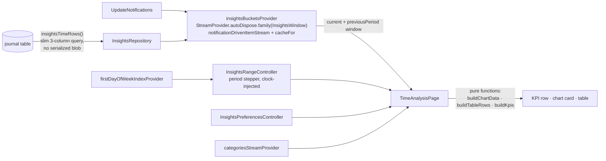

A full-screen time-analysis dashboard at `/calendar/time`, answering three
questions — where did my time go this week, how much per category per day, and
cumulative versus non-cumulative — over 10k+ time entries with **sub-200 ms
(measured ~5 ms) range switching**.

**The speed comes from the shape, not from caching alone**: a slim three-column
query that never deserializes the entity blob, bucketed once per **year window**,
then sliced in memory for every step.

# Data semantics

These rules are where the numbers come from, and each has a reason:

- **What counts as time:** non-deleted `JournalEntry` rows with
  `date_to > date_from`. **`JournalAudio` is excluded** — a recording made during
  a running timer would double-count. There is **no minimum-duration floor**; the
  legacy 15-second floor elsewhere is a noise heuristic, not a totals semantic.
- **Category attribution:** the linked task's category wins, the entry's own
  category is the fallback. The SQL resolves the link with a **correlated
  subquery**, never a joined fan-out — which would double-count entries with
  multiple incoming links.
- **Integer-seconds arithmetic:** `date_from`/`date_to` are Unix seconds.
  **`julianday()` on these columns returns NULL and silently drops every row**, so
  the duration guard is a plain `j.date_to > j.date_from`.
- **Union-merge:** overlapping intervals within one (day, category) cell are
  merged before summing, so nested or parallel entries in the same category do
  not double-count. Overlaps *across* categories count toward each — whole-day
  totals can exceed wall-clock, which is standard for category breakdowns.
- **Midnight splitting** uses calendar-constructor arithmetic
  (`DateTime(y, m, d + 1)`), exact across 23h and 25h DST days. **Property tests
  assert duration conservation.**

# Period navigation

`InsightsRangeController` holds a granularity — day, week, month, quarter, year —
plus the resolved range and a compare flag. Snapping takes the first weekday;
**shifting does not**, so an aligned week stays aligned under a ±7-day move and
week stepping is independent of the first weekday — which matters because that
resolves asynchronously.

**Every step is an in-memory slice within the year window**, so the dashboard
updates with no database round trip.

**To-date shortcuts.** Two pills jump to month-to-date and year-to-date — period
start through *today inclusive*, rather than the full calendar period, so the
chart is not padded with empty future days and avg/day divides by elapsed days
only. They read as plain "This month" / "This year" rather than MTD/YTD jargon,
and the period label shows the actual day span. Stepping back from a to-date
range lands on the full previous period.

**Region-aware week start.** Weeks start on the device region's first weekday.
The provider is a `FutureProvider` (native region lookup on macOS), so the
controller `ref.read`s it once in `build` and holds the index in a field —
**watching would re-run `build` on resolution and discard any step, jump or
compare the user made in that window.** A `ref.listen` re-anchors instead: when
the region resolves it re-derives the period under the new first weekday **only
while the user is still on the current period**, preserving unit and compare and
never clobbering navigation.

Tapping the period label opens a calendar picker that **stays open while the
dashboard updates live behind the dimmed scrim**, so days can be browsed and the
data watched before dismissing.

Below the desktop breakpoint the stepper stays one navigation cluster while the
shortcuts and Compare move into a wrapping row underneath — same controls and
semantics, no clipping or horizontal scrolling.
