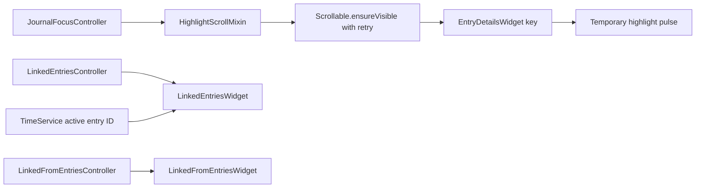
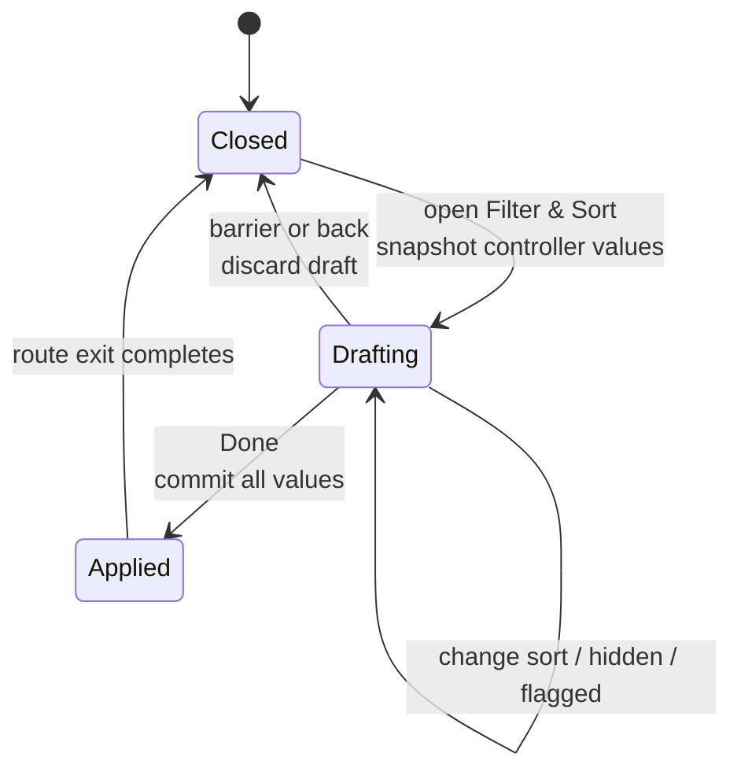

# One controller, two tabs

`InfiniteJournalPage` is hardcoded to `journalPageControllerProvider(false)` and
wired only into the journal route. The tasks tab has its **own page widget**,
`TasksTabPage`, watching `journalPageControllerProvider(true)`.

**What is shared between the tabs is the controller — keyed by `showTasks` — not
the page widget.**

The journal page body is a column: the shared `TabSectionHeader` (the same titled
header Tasks and Projects use), an optional `LogbookSearchModeRow` when the
vector-search flag is on, and the paged feed in an expanded scroll view. The
filter icon opens a two-page Wolt modal. **There is no sliver app bar on this page
any more.**

The controller owns the `PagingController`, filter state, search mode, and
feature-flag gating for entry types and vector search.

## What it persists

Selected entry types, category filters, task status filters, project filters,
label filters, priority filters, task sort option, visual toggles (creation date,
due date, cover art, projects header, vector distances), and the
agent-assignment filter.

**Tasks filter persistence is tab-aware**: `TASKS_CATEGORY_FILTERS` for the tasks
tab, `JOURNAL_CATEGORY_FILTERS` for the journal tab.

# Two search modes

`fullText` and `vector`. **Vector mode is feature-gated**, and if the flag is
disabled while the controller is in vector mode it **falls back to full-text
rather than leaving the UI in a dead state.**

Vector search behaves differently from normal paging:

- It **bypasses the DB paging pipeline**.
- It **only runs on the first page**.
- It stores elapsed time, result count and per-entry distance values in
  `JournalPageState`.

# Post-filter pagination

Two filters are **not** pushed into the main task query: selected projects, and
the agent-assignment filter.

When either is active, the controller fetches raw task pages from `JournalDb`,
filters them **in memory**, and tracks a **separate raw offset** so pagination
does not repeat or skip rows.

A small implementation detail with a large bug-prevention payoff.

# Due-date sorting happens in SQL

- The v41 migration backfilled a denormalized `due_at` column for every task with
  a non-null `data.due`, **regardless of status**.
- The partial `idx_journal_tasks_due_open` index covers the open-task subset;
  closed tasks stream from the priority/date task indexes.
- `JournalQueryRunner` routes `TaskSortOption.byDueDate` to
  `JournalDb.getTasksSortedByDueDate` — raw SQL ordering by
  `CASE WHEN due_at IS NULL THEN 1 ELSE 0 END, due_at ASC, date_from DESC` with
  `LIMIT`/`OFFSET`.

Because the ordering happens in the database against the indexed column,
**results are globally stable across page boundaries**. The static in-memory
`JournalQueryRunner.sortByDueDate` helper still exists but is exercised only by
tests, not by the live query path.

# Linked entries, focus and highlighting

The journal feature owns the **generic** linked-entry machinery used in detail
pages.

Runtime details that matter:

- Outgoing links are fetched from `JournalRepository.getLinksFromId(...)`, and
  hidden links can be included or excluded without changing the rest of the page.
- The Filter & Sort modal can narrow the outgoing list to **flagged entries only**
  (`meta.flag == EntryFlag.import`). The check runs **per row** against the
  watched entry, so flagging or unflagging updates the filtered list reactively.
- **Outgoing links are ordered by the linked entity's editable `dateFrom`, not by
  link creation time**, with a user-selectable direction via
  `LinkedEntriesSortController`. Links whose target has not resolved yet fall back
  to `link.createdAt`.
- **`LinkedEntriesWithTimer` only reacts to active-timer entry-id changes, not
  every timer tick.**
- **`HighlightScrollMixin` retries scroll-to-entry until the target widget is
  actually mounted**, then applies a temporary highlight pulse.

## The Filter & Sort draft

The modal snapshots sort, hidden and flagged state into **one route-local draft**.
Done commits all three together; barrier or back dismissal discards it. **The
notifier lives until Wolt removes the route subtree**, so its exit fade cannot
observe disposed state.

The sort trigger includes a visible count when Hidden or Flagged-only is active,
while its semantics name enumerates the active filters.

## Pill treatment

The activity and sort controls reuse the same 28 px bordered `DsPill` shell as the
task header, including its bounded hover treatment. Active activity pills apply
their Timer, Audio, Images or Code accent to **both** icon and outline; inactive
pills return to the quiet `decorative.level02` outline, while the sort trigger
always keeps that neutral border. Labels stay at medium text emphasis.

**The Code pill only exists when at least one linked entry contains a coding
prompt.** Pills wrap as compact units rather than expanding into full-width rows.
