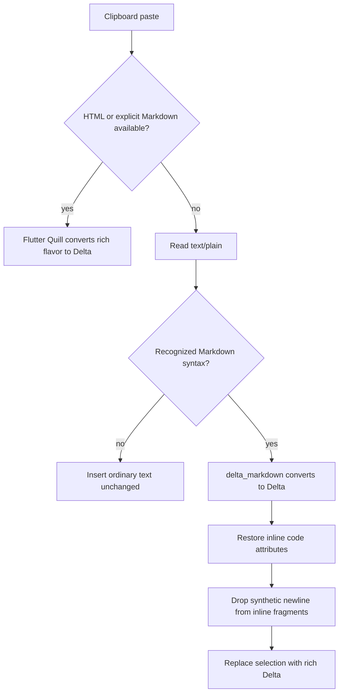
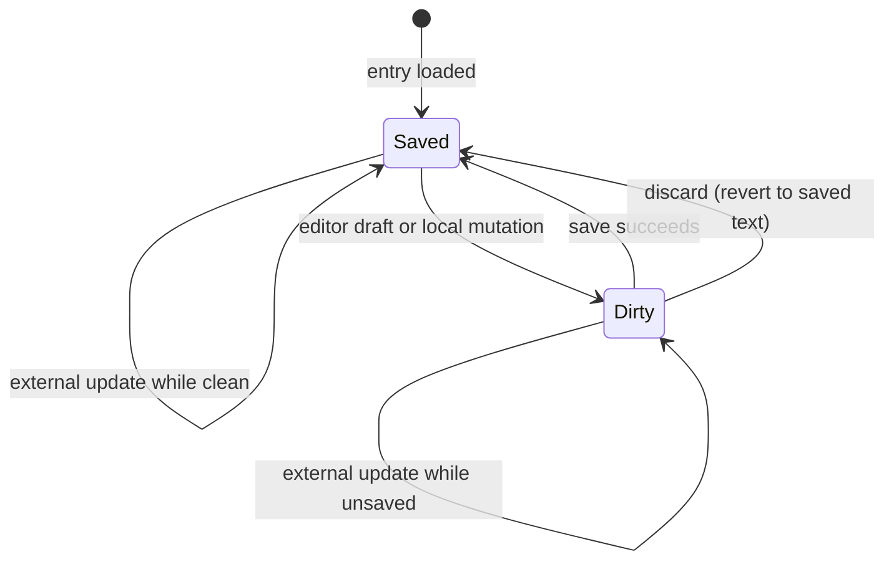
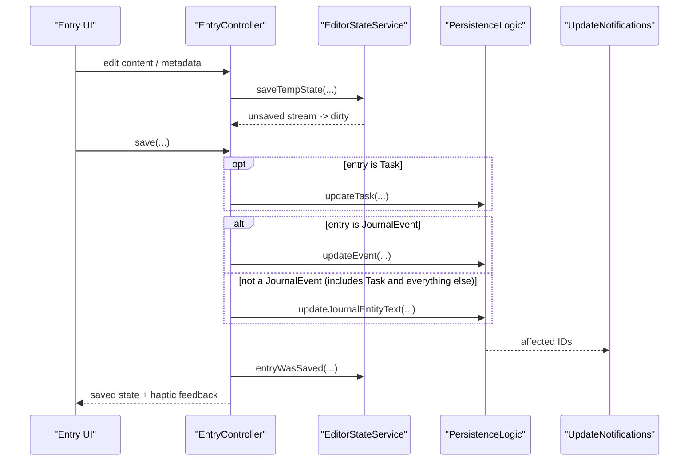
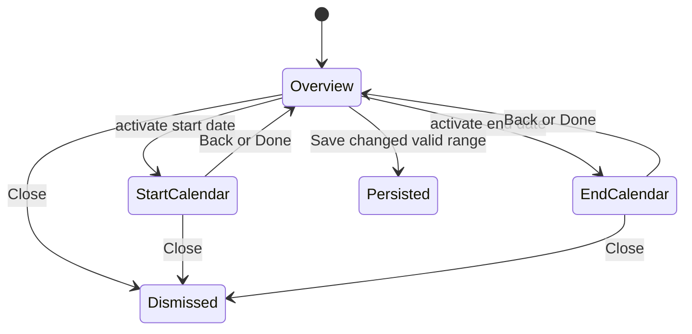
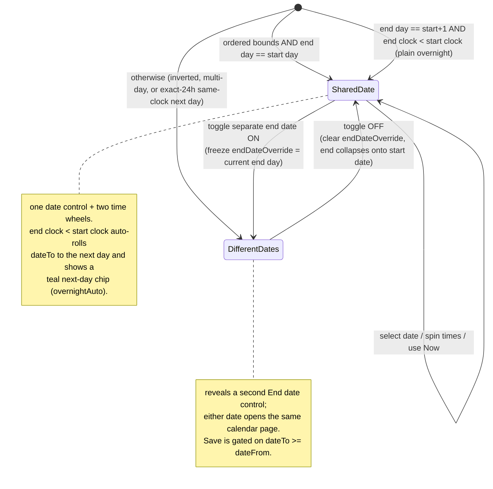

`EntryController` is the detail-side brain for **one** entry. It loads the
`JournalEntity`, restores editor content from draft state, listens to unsaved-draft
state and to `UpdateNotifications` for external changes touching the same entry,
keeps focus and toolbar visibility in sync, routes saves to the correct
persistence path, and exposes focused mutations — task status and priority, event
stars, checklist ordering, cover art, privacy, starring, flagging, copying,
deletion.

`EditorWidget` contributes the lifecycle-bound **Primary+S** handler next to the
reusable rich-text editor, so the same command reaches `EntryController.save()`
whether the editor is on the entry page, in a journal card, or inside a task form.

# Rich-text clipboard precedence

Every live entry controller enables Lotti's Markdown-aware plain-text callback.
Flutter Quill still owns clipboard dispatch and keeps richer formats first:

The syntax gate recognizes supported block constructs (ATX headings,
blockquotes, rules, fenced code and lists) and inline constructs (emphasis,
strikeout, code and links). It deliberately does not claim ordinary prose,
`#hashtags`, arithmetic asterisks or emoji. The canonical `delta_markdown`
converter supplies the same headings, emphasis, list, quote and custom divider
representation already used when loading Markdown-only entries. Its decoder
predates Flutter Quill's inline-code attribute, so paste protects code spans
during conversion and restores them as `code: true` operations afterward,
including spans whose longer delimiters contain shorter backtick runs. Quill's
editor exposes three rendered heading sizes, so ATX levels four through six
use the third heading style; fenced-code contents are never normalized as
headings.
Inline fragments shed only the converter's synthetic document newline, while
explicit newlines and block-attributed newlines remain intact. Inline code
normalizes line endings and CommonMark's optional single outer padding space,
but preserves repeated spaces and tabs inside the code payload.

# The state machine has two real states

**Deletion does not produce a third state.** The controller clears its async state
to `null`, which is an *exit* from the machine rather than another node inside it.

# The save path writes twice for a task

The branching uses **two independent `if` blocks, not one exclusive switch**:

1. `if (entry is Task)` → `updateTask`, with **no `else`**.
2. `if (entry is JournalEvent)` → `updateEvent`, `else` →
   `updateJournalEntityText`.

Because a `Task` is not a `JournalEvent`, it falls into the trailing `else` as
well — so **a task save performs two persistence writes**: `updateTask` for the
task data and `updateJournalEntityText` for the editor text. Events save through
`updateEvent` only; every other type through `updateJournalEntityText` only.

## Behaviours that are easy to miss

- **Updating a category from the detail controller also propagates that category
  to currently linked outgoing entries.**
- Saving with `stopRecording: true` updates the text first, then stops the timer
  after a short delay.
- When an external update arrives and the entry is **not** dirty, the editor
  controller is rebuilt from the saved value.
- When the entry **is** dirty, the controller keeps the user's unsaved editor
  state instead of bluntly resetting it.
- **`discard()` is the inverse of `save()` without persisting**: it drops the
  in-memory and persisted draft, rebuilds the editor controller from the saved
  text, drops focus, hides the toolbar, and clears the dirty flag. The toolbar
  surfaces it beside Save only while there are unsaved changes.

# The start/end date-time editor

`entry_datetime_multipage_modal.dart` edits `dateFrom`/`dateTo` and commits via
`EntryController.updateFromTo`. Its Wolt modal has two reusable pages **rather
than stacking a date dialog over the editor**:

1. The **overview** shows a full-weekday date control, an optional separate end
   date, paired Start/End time wheels, endpoint-specific **Now** actions, and the
   live range status.
2. Activating either date transitions to an **in-sheet calendar page** with Back,
   Close, Today and Done.

## The bounds cannot desync

The editable model is the pure, testable `EntryDateTimeRange` — a `startDate` (day
only), `startTime`, `endTime`, and an optional `endDateOverride` — **from which
`dateFrom`/`dateTo` are derived**.

Date decomposition and recomposition retain the entry's timezone semantics,
including UTC, device-local and named zones. **Now** and **Today** read the
injectable clock and normalize it to that same timezone before changing an
endpoint, so shortcuts are deterministic in tests and cannot mix timezone kinds.

Endpoint-level **Now** preserves the opposite absolute endpoint. If *Start Now*
moves past the stored end, the model **exposes that exact inverted range as
invalid** instead of silently rolling the end into tomorrow.

The glass Save footer stays fixed while the regular Wolt page owns overflow
scrolling. Content padding reserves the footer's occupied height, and the status
reserves the next-day chip row in **both** states, so neither crossing midnight
nor exposing the chip moves the sheet. Save stays disabled until the range both
changed **and** is valid.

## Which mode an existing entry opens in

