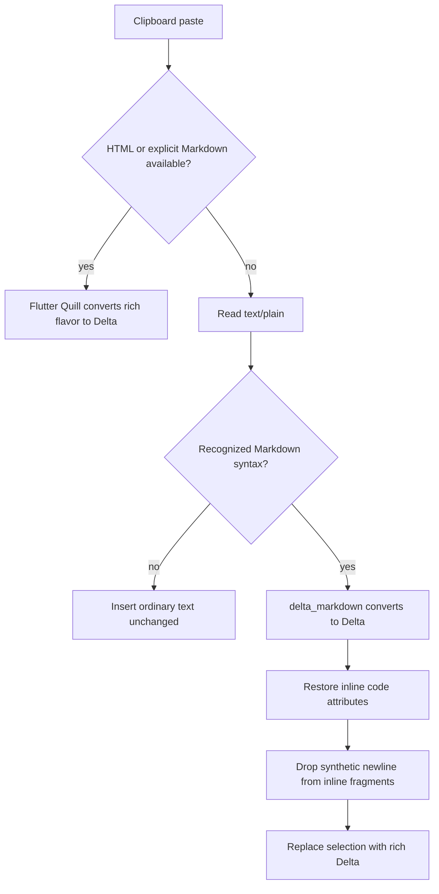
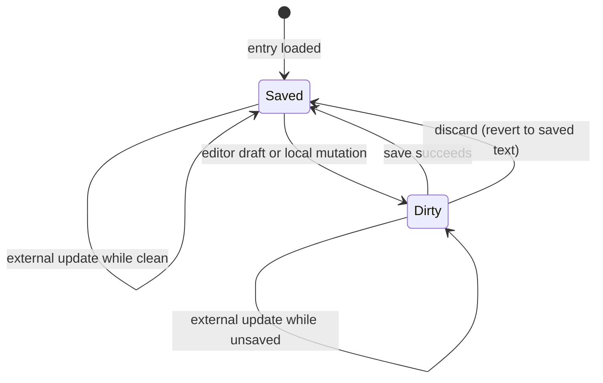
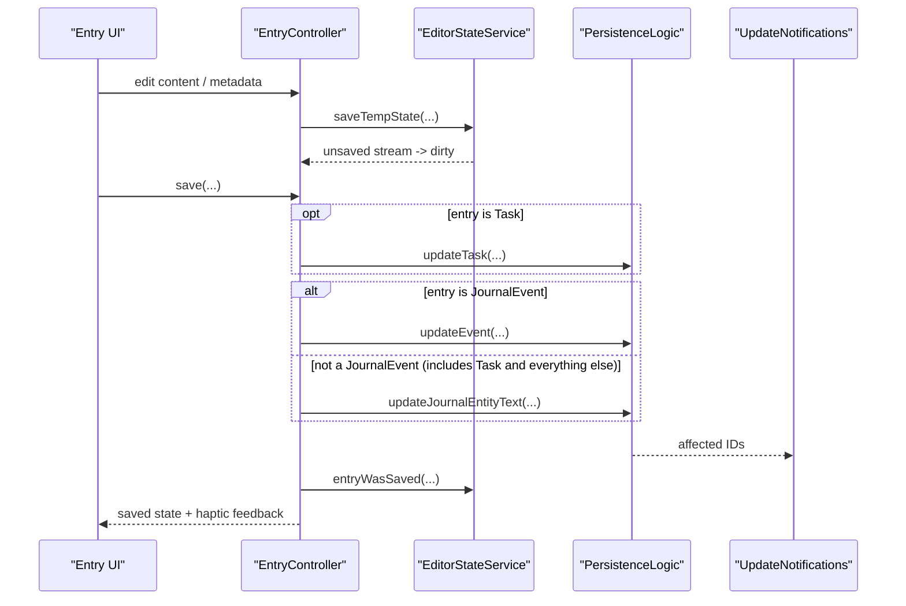
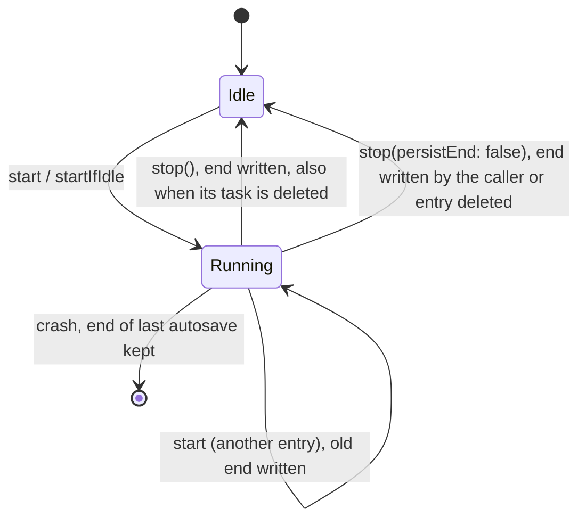
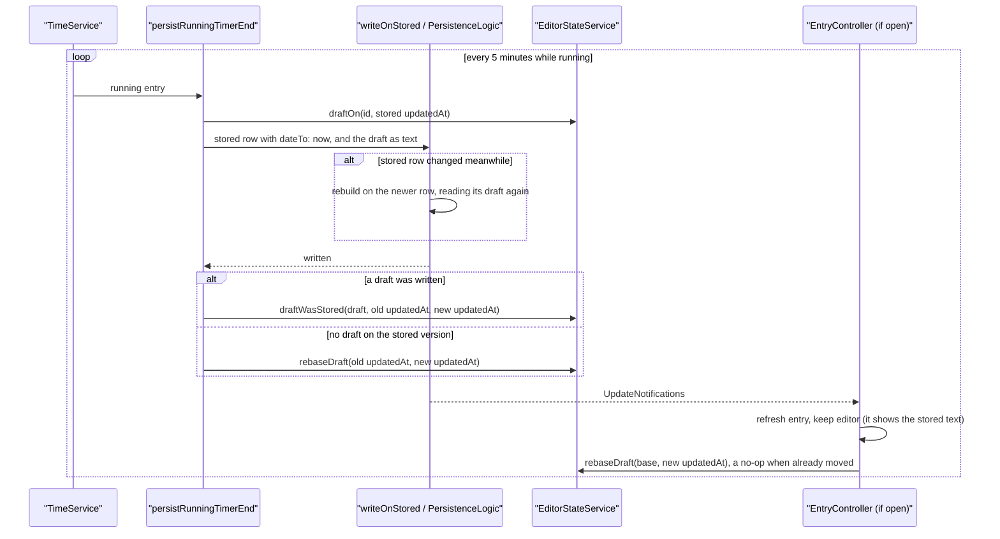
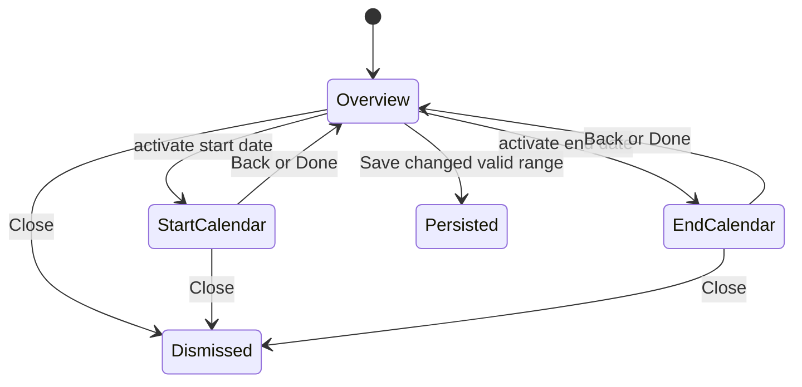
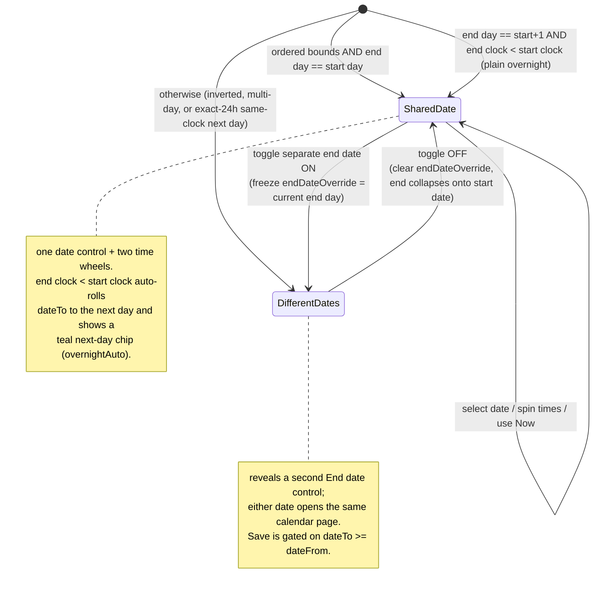

`EntryController` is the detail-side brain for **one** entry. It loads the
`JournalEntity`, restores editor content from draft state, listens to unsaved-draft
state and to `UpdateNotifications` for external changes touching the same entry,
keeps focus and toolbar visibility in sync, routes saves to the correct
persistence path, and exposes focused mutations — task status and priority, event
stars, checklist ordering, cover art, privacy, starring, flagging, copying,
deletion.

`EditorWidget` contributes the lifecycle-bound **Primary+S** handler next to the
reusable rich-text editor, so the same command reaches `EntryController.save()`
whether the editor is on the entry page, in a journal card, or inside a task form.

# Rich-text clipboard precedence

Every live entry controller enables Lotti's Markdown-aware plain-text callback.
Flutter Quill still owns clipboard dispatch and keeps richer formats first:

```mermaid
flowchart TD
  Paste[Clipboard paste] --> HTML{HTML or explicit Markdown available?}
  HTML -->|yes| Quill[Flutter Quill converts rich flavor to Delta]
  HTML -->|no| Plain[Read text/plain]
  Plain --> Detect{Recognized Markdown syntax?}
  Detect -->|no| Verbatim[Insert ordinary text unchanged]
  Detect -->|yes| Convert[delta_markdown converts to Delta]
  Convert --> Code[Restore inline code attributes]
  Code --> Fragment[Drop synthetic newline from inline fragments]
  Fragment --> Insert[Replace selection with rich Delta]
```

The syntax gate recognizes supported block constructs (ATX headings,
blockquotes, rules, fenced code and lists) and inline constructs (emphasis,
strikeout, code and links). It deliberately does not claim ordinary prose,
`#hashtags`, arithmetic asterisks or emoji. The canonical `delta_markdown`
converter supplies the same headings, emphasis, list, quote and custom divider
representation already used when loading Markdown-only entries. Its decoder
predates Flutter Quill's inline-code attribute, so paste protects code spans
during conversion and restores them as `code: true` operations afterward,
including spans whose longer delimiters contain shorter backtick runs. Quill's
editor exposes three rendered heading sizes, so ATX levels four through six
use the third heading style; fenced-code contents are never normalized as
headings.
Inline fragments shed only the converter's synthetic document newline, while
explicit newlines and block-attributed newlines remain intact. Inline code
normalizes line endings and CommonMark's optional single outer padding space,
but preserves repeated spaces and tabs inside the code payload.

# The state machine has two real states

```mermaid
stateDiagram-v2
  [*] --> Saved: entry loaded
  Saved --> Dirty: editor draft or local mutation
  Dirty --> Saved: save succeeds
  Dirty --> Saved: discard (revert to saved text)
  Saved --> Saved: external update while clean
  Dirty --> Dirty: external update while unsaved
```

**Deletion does not produce a third state.** The controller clears its async state
to `null`, which is an *exit* from the machine rather than another node inside it.

# The save path writes twice for a task

```mermaid
sequenceDiagram
  participant UI as "Entry UI"
  participant Ctl as "EntryController"
  participant Draft as "EditorStateService"
  participant Persist as "PersistenceLogic"
  participant Notify as "UpdateNotifications"

  UI->>Ctl: edit content / metadata
  Ctl->>Draft: saveTempState(...)
  Draft-->>Ctl: unsaved stream -> dirty
  UI->>Ctl: save(...)
  opt entry is Task
    Ctl->>Persist: updateTask(...)
  end
  alt entry is JournalEvent
    Ctl->>Persist: updateEvent(...)
  else not a JournalEvent (includes Task and everything else)
    Ctl->>Persist: updateJournalEntityText(...)
  end
  Persist-->>Notify: affected IDs
  Ctl->>Draft: entryWasSaved(...)
  Ctl-->>UI: saved state + haptic feedback
```

The branching uses **two independent `if` blocks, not one exclusive switch**:

1. `if (entry is Task)` → `updateTask`, with **no `else`**.
2. `if (entry is JournalEvent)` → `updateEvent`, `else` →
   `updateJournalEntityText`.

Because a `Task` is not a `JournalEvent`, it falls into the trailing `else` as
well — so **a task save performs two persistence writes**: `updateTask` for the
task data and `updateJournalEntityText` for the editor text. Events save through
`updateEvent` only; every other type through `updateJournalEntityText` only.

A task's `updateTask` is a change of the stored task, not the controller's
copy of it: it sets only the title, estimate and due date `save` was given,
and the body only while the editor holds unsaved edits, so a field the agent
or sync set since the page loaded is kept (see
[task data](../tasks/data-model.md#writing-a-tasks-fields)).

## Behaviours that are easy to miss

- **Updating a category from the detail controller moves everything that
  belongs to the entry with it** (`EntryCategoryMove`): the entries linked from
  it, a task's checklists and their items — not one another task shows too —
  and, last, the project link of a moved task whose project is not in the new
  category. The move is recorded in the settings database before its first
  write and finished at the next start if the app died in it, while the entry
  still holds that category (`specs/tla/TaskCategoryMove.tla`, ADR 0122).
- Saving with `stopRecording: true` updates the text and the end first, then
  stops the timer after a short delay, without writing the end again
  (`stop(persistEnd: false)`).
- When an external update arrives and the entry is **not** dirty, the editor
  controller is rebuilt from the saved value — **but only when the stored text
  differs from what the editor shows**. An update that leaves the text alone (a
  new end time, a flag), or that stored the very text the editor holds (the
  timer's autosave of its draft), keeps the live controller, so the cursor of an
  open editor does not jump.
- **A draft is keyed to the entry version it was typed against** (`updatedAt`,
  the `lastSaved` of its `EditorDb` row), and is only restored onto that
  version. `EditorStateService` records that version for every draft it holds
  (`draftVersion`: typed, restored at startup, or loaded for an open editor),
  and the controller tracks it as its draft base for when it holds none. A
  write that leaves the editor's text alone advances the base and moves an
  unsaved draft onto the new version (`EditorStateService.rebaseDraft`, which
  also re-keys a debounced write still pending), so the draft survives a
  restart. A write that changed the text leaves the draft keyed to the old
  version — it was typed against text that no longer exists — and so does
  every later write: the draft follows only a write that replaced the version
  the editor is based on. Moved onto a later version, a draft typed against
  text sync has replaced would be written over it by the next timer
  autosave. The controller
  keys new drafts, `save()` and `discard()` to the held draft's version before
  its own base, so a draft the autosave moved on without the editor is
  followed there.
- When the entry **is** dirty, the controller keeps the user's unsaved editor
  state instead of bluntly resetting it.
- **`discard()` is the inverse of `save()` without persisting**: it drops the
  in-memory and persisted draft, rebuilds the editor controller from the saved
  text, drops focus, hides the toolbar, and clears the dirty flag. The toolbar
  surfaces it beside Save only while there are unsaved changes.

# Every stop writes the end

Whichever way a timer stops, its entry ends when it stopped. Only a crash,
or an end write that fails (logged; the timer stops all the same), loses
time: at most one autosave interval. The decision, and why the agent's
tool starts a timer only while none runs, is
[ADR 0120](../../../docs/adr/0120-every-stop-writes-the-timers-end.md); the
model is `specs/tla/RunningTimer.tla`. At runtime: `TimeService.stop` writes
the end through the same `persistRunningTimerEnd` the autosave uses, so the
sidebar, a profile switch and quitting (`ServiceDisposer`'s first step) go
through it. The entry page's stop saves the end with the editor's text, then
stops its own timer, if it still runs, with `persistEnd: false`. Deleting the
running entry stops it without writing; deleting the task it runs for
(`TimeService.linkedFrom`) stops it and writes the end, since the entry stays
(`JournalRepository.deleteJournalEntity`).

```mermaid
stateDiagram-v2
  [*] --> Idle
  Idle --> Running: start / startIfIdle
  Running --> Running: autosave (every 5 min), end written
  Running --> Running: start (another entry), old end written
  Running --> Idle: stop(), end written, also when its task is deleted
  Running --> Idle: stop(persistEnd: false), end written by the caller or entry deleted
  Running --> [*]: crash, end of last autosave kept
```

# A running timer autosaves

While a timer runs, only `TimeService` knows how long it has been going: the
live duration ticks from its one-second ticker, and the stored `dateTo` stays
where the entry was last saved. Every calendar — this device's, and every
other device's through sync — reads the stored value, so without help a
two-hour session shows as a sliver until the timer is stopped.

`TimeService` therefore runs a second cadence next to the ticker:
every `runningTimerAutosaveInterval` (five minutes) it hands the running entry
to the injected `autosave` callback. The app's instance comes from
`buildPersistingTimeService()`, whose callback — for autosave and for a
replaced timer alike — is `persistRunningTimerEnd`. It writes the end time,
and the unsaved editor draft as the entry's text:

```mermaid
sequenceDiagram
  participant TS as "TimeService"
  participant Persister as "persistRunningTimerEnd"
  participant Persist as "writeOnStored / PersistenceLogic"
  participant Draft as "EditorStateService"
  participant Ctl as "EntryController (if open)"

  loop every 5 minutes while running
    TS->>Persister: running entry
    Persister->>Draft: draftOn(id, stored updatedAt)
    Persister->>Persist: stored row with dateTo: now, and the draft as text
    alt stored row changed meanwhile
      Persist->>Persist: rebuild on the newer row, reading its draft again
    end
    Persist-->>Persister: written
    alt a draft was written
      Persister->>Draft: draftWasStored(draft, old updatedAt, new updatedAt)
    else no draft on the stored version
      Persister->>Draft: rebaseDraft(old updatedAt, new updatedAt)
    end
    Persist-->>Ctl: UpdateNotifications
    Ctl->>Ctl: refresh entry, keep editor (it shows the stored text)
    Ctl->>Draft: rebaseDraft(base, new updatedAt), a no-op when already moved
  end
```

- **The draft typed so far is written with the end time.** What the calendar
  shows on every device is the session with its notes to date, not a note
  that appears only when the timer stops. Only a draft typed against the
  stored version is written (`EditorStateService.draftOn`): one typed against
  text that sync has since replaced is left unsaved, and the stored text kept.
- **A written draft is saved** (`draftWasStored`): it is dropped from memory,
  its `EditorDb` rows are marked saved — under the old version, or the new one
  if an open controller moved them first — and the editor is told it is no
  longer unsaved, so the Save and Discard actions go away. `discard()` then
  reverts only what was typed since the last autosave. Text typed while the
  write ran is not what was written: it stays unsaved, moved onto the new
  version.
- **What is typed right after that write is keyed to the stored version.**
  The editor only learns of the write once its update notification is
  handled, so `EditorStateService` records the version the draft was stored
  as (`storedDraftVersion`, until the entry is saved or discarded). The
  controller keys a new draft to the later of that version and its own base,
  so a keystroke in between is not orphaned on the superseded version.
- **Without a draft, the write moves any draft on** (`rebaseDraft`), so it is
  still restored when no editor for the entry is open to follow the write. An
  open controller moves it too, which is a no-op once the rows are moved, and
  also covers a draft restored from `EditorDb` that `EditorStateService` has
  not loaded yet.
- **The write is built on the stored row, and only lands on it**
  (`writeOnStored`). The entry the timer was started with is never written
  back, and a text save landing between the read and the write is built on
  rather than put back — the stored end time never moves backwards either,
  since a rebuilt write takes the time again.
- **The cadence belongs to the session.** `stop()` cancels it, and a replacing
  `start()` restarts it for the new entry, whose first autosave is five
  minutes after it started. The outgoing entry gets its stop time through the
  separate `persistTimerStop` callback instead.
- **A failed write is logged, never thrown** (`autosaveRunningTimer` sub-domain
  under `LogDomain.persistence`), and the next tick tries again.

# The start/end date-time editor

`entry_datetime_multipage_modal.dart` edits `dateFrom`/`dateTo` and commits via
`EntryController.updateFromTo`. Its Wolt modal has two reusable pages **rather
than stacking a date dialog over the editor**:

```mermaid
stateDiagram-v2
    [*] --> Overview
    Overview --> StartCalendar: activate start date
    Overview --> EndCalendar: activate end date
    StartCalendar --> Overview: Back or Done
    EndCalendar --> Overview: Back or Done
    Overview --> Persisted: Save changed valid range
    Overview --> Dismissed: Close
    StartCalendar --> Dismissed: Close
    EndCalendar --> Dismissed: Close
```

1. The **overview** shows a full-weekday date control, an optional separate end
   date, paired Start/End time wheels, endpoint-specific **Now** actions, and the
   live range status.
2. Activating either date transitions to an **in-sheet calendar page** with Back,
   Close, Today and Done.

## The bounds cannot desync

The editable model is the pure, testable `EntryDateTimeRange` — a `startDate` (day
only), `startTime`, `endTime`, and an optional `endDateOverride` — **from which
`dateFrom`/`dateTo` are derived**.

Date decomposition and recomposition retain the entry's timezone semantics,
including UTC, device-local and named zones. **Now** and **Today** read the
injectable clock and normalize it to that same timezone before changing an
endpoint, so shortcuts are deterministic in tests and cannot mix timezone kinds.

Endpoint-level **Now** preserves the opposite absolute endpoint. If *Start Now*
moves past the stored end, the model **exposes that exact inverted range as
invalid** instead of silently rolling the end into tomorrow.

The glass Save footer stays fixed while the regular Wolt page owns overflow
scrolling. Content padding reserves the footer's occupied height, and the status
reserves the next-day chip row in **both** states, so neither crossing midnight
nor exposing the chip moves the sheet. Save stays disabled until the range both
changed **and** is valid.

## Which mode an existing entry opens in

```mermaid
stateDiagram-v2
    [*] --> SharedDate: ordered bounds AND end day == start day
    [*] --> SharedDate: end day == start+1 AND end clock < start clock (plain overnight)
    [*] --> DifferentDates: otherwise (inverted, multi-day, or exact-24h same-clock next day)

    SharedDate --> SharedDate: select date / spin times / use Now
    note right of SharedDate
      one date control + two time wheels.
      end clock < start clock auto-rolls
      dateTo to the next day and shows a
      teal next-day chip (overnightAuto).
    end note

    SharedDate --> DifferentDates: toggle separate end date ON<br/>(freeze endDateOverride = current end day)
    DifferentDates --> SharedDate: toggle OFF<br/>(clear endDateOverride, end collapses onto start date)
    note right of DifferentDates
      reveals a second End date control;
      either date opens the same calendar page.
      Save is gated on dateTo >= dateFrom.
    end note
```
