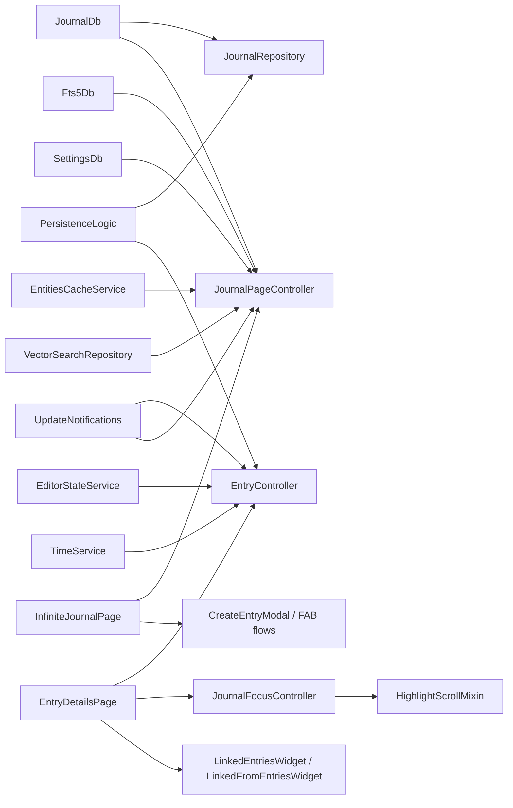
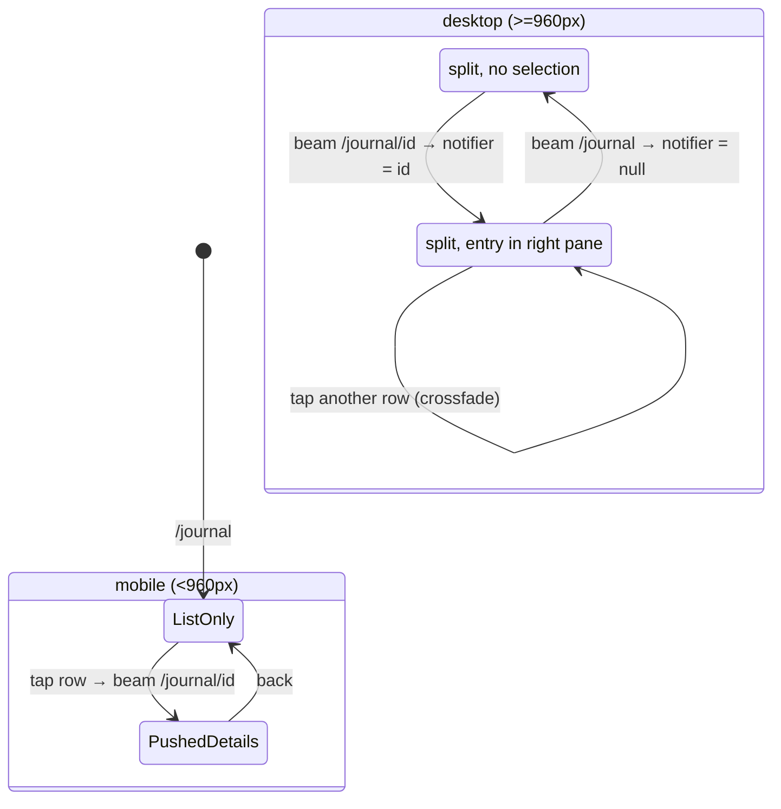

The journal feature is Lotti's **entry workspace layer**. Most other product
features eventually depend on it, because this is where entries are loaded,
created, edited, paged, filtered, linked, highlighted and deleted.

Even when another feature owns the domain-specific widget, journal usually still
owns the surrounding runtime: the page shell, the controller, the repository
facade, the linked-entry plumbing, or the list substrate.

# Two controller centers

- **`EntryController`** for one entry detail surface.
- **`JournalPageController`** for paged browse and search surfaces.

Everything else is glue around those two: entry-type dispatch, linked-entry
composition, create/import actions, and scroll/focus behaviour.

# The model boundary

The layer operates on `JournalEntity` **variants**, not one canonical entry type:
`JournalEntry`, `Task`, `JournalEvent`, `JournalAudio`, `JournalImage`,
`MeasurementEntry`, `SurveyEntry`, `WorkoutEntry`, `HabitCompletionEntry`,
`Checklist`, `ChecklistItem`, `AiResponseEntry`, `RatingEntry`, among others.

**That breadth is why the feature is large.** It is not "the text note feature" —
it is the shared create/edit/browse substrate for a whole family of entry types.

# Split layout and routing

`journal_root_page.dart` is the responsive entry point at `/journal`.

Below the shared 960 px desktop breakpoint it is just the full-width
`InfiniteJournalPage`, and `JournalLocation` pushes `EntryDetailsPage` as its own
route on entry taps. On desktop it renders the same list beside a resizable detail
pane, with pane width from its **own** persisted `PANE_WIDTH_JOURNAL_LIST` key,
independent of the tasks and projects list widths.

**Selection is URL-driven.** Journal rows beam to `/journal/<id>`, while task and
event rows route to their **home tabs** (`/tasks/<id>`, `/events/<id>`).
`JournalLocation` branches on desktop mode and either pushes the details route or
writes `NavService.desktopSelectedEntryId` in a microtask. `CardWrapperWidget`
listens to the same notifier to highlight the selected row, and the detail pane
cross-fades between entries at 200 ms, matching tasks.

**There is one non-URL write.** `_AutoSelectNewestEntry` watches the feed's paging
controller and, whenever the selection is null and the feed has loaded, selects
the newest non-task/non-event entry post-frame — so the desktop split opens on
"read the latest entry" with zero taps. Tasks and events are skipped because they
open in their own tabs; their rows carry a small trailing `open_in_new` glyph with
a destination tooltip to signal that.

In the split, the detail page is embedded with `showBackButton: false` and
`showFloatingActionButton: false` — the list pane provides both.

## Empty states share one grammar

All use `DesignSystemEmptyState` (glyph, `subtitle1` title, `caption` hint,
optional action). The list's zero-state distinguishes a **genuinely empty
logbook** — first-run copy plus an inline "Create new entry" button wired to the
same modal as the FAB, while the corner FAB hides so there is a single create
affordance — from a **search/filter-narrowed feed** ("No entries match" plus a
recovery hint, no CTA).

The desktop detail pane's empty state shows whenever no eligible entry is selected
— a genuinely empty feed, but **also** one whose loaded entries are all
tasks/events, since those are never auto-selected — and defers with a
caption-tier "New entries will open here." rather than echoing the list's title.

# Concepts

* [Entry detail and saving](detail-and-saving.md) - the entry controller, its state machine, the save path's double write, and the date-time editor.
* [Browse, search and linking](browse-and-linking.md) - the page controller, search modes, post-filter pagination, and the linked-entry machinery.

# The repository is a facade

`JournalRepository` is deliberately **not** a second persistence layer. It loads
entries by id, updates category ids and dates, soft-deletes, updates full
entities, creates text and image entries, updates and removes links, and fetches
outgoing, reverse and task-linked images.

It delegates actual storage and sync to `JournalDb`, `PersistenceLogic`,
`VectorClockService`, `OutboxService`, `NotificationService` and `TimeService`.

## Side effects that matter

The feature looks like basic CRUD until you follow the side effects:

- Deleting an image **clears any task `coverArtId`** referencing it.
- Deleting a currently running entry **stops the timer**.
- Deleting an entry updates the badge through `NotificationService`.
- Updating a link emits `UpdateNotifications` **and** writes a sync outbox message
  with a fresh vector clock.
- Creating image entries can invoke higher-level callbacks such as automatic
  analysis.

That is normal for an entry hub. Quiet side effects would be stranger than visible
ones.

# Create, import and paste

The feature owns the generic creation surfaces above domain-specific creation
logic — `CreateEntryModal`, `FloatingAddActionButton`, `create_entry_items.dart`
and `ImagePasteController` — covering text entries, tasks, events, audio
recordings, timer entries inside a parent, image import, screenshots, clipboard
paste, and drag-and-drop onto the detail page.

Three integration details are easy to miss:

- **Image import and paste can trigger automatic image-analysis callbacks**
  supplied by the AI feature.
- **Image imports preserve JPEG and PNG bytes.** On platforms with HEIC/HEIF
  conversion support, high-efficiency inputs convert to JPEG — **unless the HEIF
  metadata declares an alpha auxiliary image**, in which case they convert to PNG
  so transparency survives.
- **Creating a timer from a linked context polls for the new linked entry** and
  then publishes a focus intent, so the page scrolls to the fresh timer entry.

Image and audio entries add a desktop-only file-manager reveal action to the
existing Actions sheet without changing the entity model.

# Constraints

- The feature owns the shared surface, not every per-entity widget.
- Browse state for journal and tasks lives in **one** controller, because the
  pagination and search substrate is shared.
- Vector search depends on the embedding stack and only runs as a first-page
  mode.
- Cross-feature behaviours — AI, ratings, tasks, speech — are **layered onto**
  journal surfaces rather than reimplemented elsewhere.
