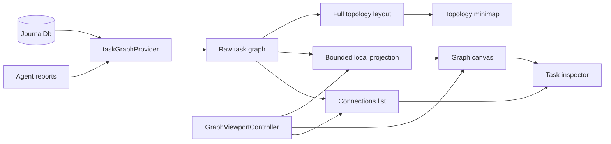
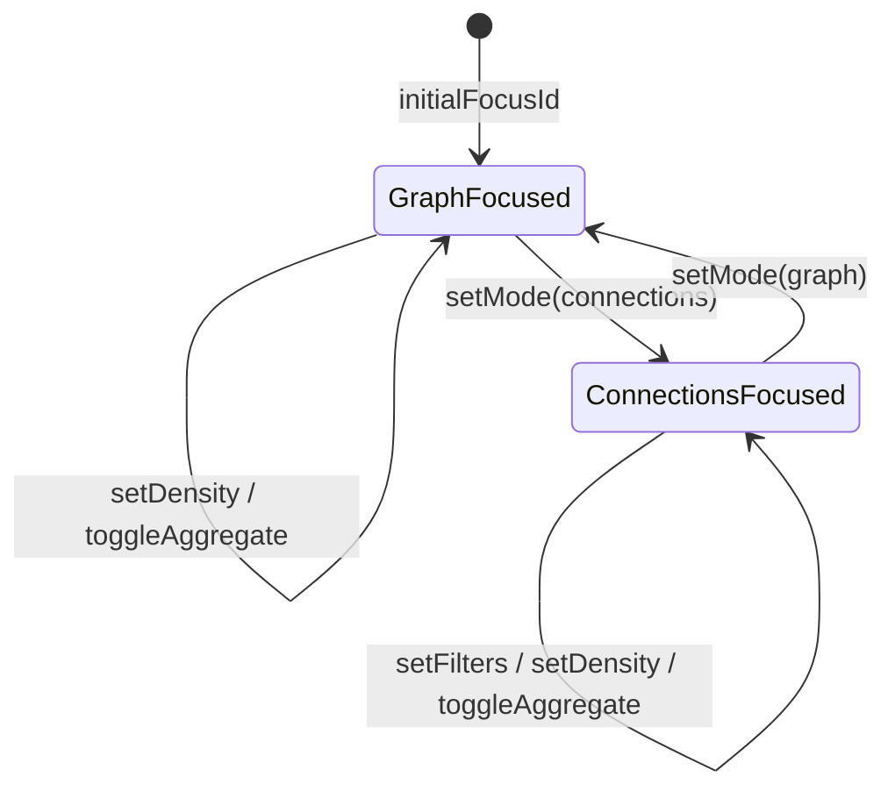

The task knowledge-graph explorer described in ADR 0029.

It is a **walkable, local-first** graph view drawn with a 2D `CustomPainter`.
You "stand on" a focus node; the main canvas projects a bounded 1–2-hop
neighbourhood around it. Tapping a node makes the camera **walk the link** to
it. The full provider graph remains visible as a small topology map in the
corner, where any node can reseed the local workspace.

The same `GraphViewportController` state drives a non-spatial Connections list.
It groups direct neighbours by typed relationship and direction, preserving
the user's focus, history, filters, and next walk.

# Why walking rather than a force-directed layout

A whole-graph force layout over a real journal produces a hairball. The
ego-centric projection in `graph_projection.dart` inverts that: the main view is
bounded by hops and a density node budget. Direct photos collapse into one media
aggregate. Large relation/type groups retain a recent preview and an exact-count
aggregate, which the user can expand independently. The topology minimap uses
the full precomputed provider layout, so global position is still available
without sacrificing local legibility.

# Rendering and interaction

`knowledge_graph_painter.dart` paints nodes, typed edges, labels, focus trails,
and media mosaics in screen space. A task with cover art uses that image as its
circular node body, with the stored horizontal focal crop. Cover-backed tasks,
image entries, and media collections render at twice the ordinary node diameter
so their imagery acts as a useful landmark. The same radius calculation drives
edge clipping, label clearance, hit testing, and semantics.

The local layout also receives each rendered body's world-space collision
radius, calculated at the camera's minimum automatic framing scale. After the
short force relaxation, a deterministic pairwise pass separates intersecting
circles while leaving the focused node pinned. This keeps enlarged media nodes
useful as visual landmarks instead of allowing their images to overlap in dense
hub sectors; the full topology layout remains point-based because the minimap
renders its nodes at a separate, small fixed radius.

A media collection's circular body is tiled by `mediaMosaicCells`, whose layout
depends on the photo count (one full, two halves, a hero plus a stacked pair,
or quadrants), so no cell is ever left unpainted. The collection previews
exactly the entries it collapses — the focus's own cover art is not one of its
members — which keeps the tile count equal to the "Photo · N" label.

Relation classes are separable without colour: containment and note/log are
solid at different weights, linked-task is long-dashed, evaluation short-dashed,
checklist dotted, and provenance sparse-dotted. A test asserts no two classes
share a colour-free signature, since a greyscale or low-contrast reader
navigates by relation.

`knowledge_graph_view.dart` reads each image's encoded dimensions before
decoding it. It preserves the source aspect ratio and bounds the longest decoded
side to the visual spec's maximum media-node extent multiplied by the device
pixel ratio; source-sized phone photos are never retained for node-sized canvas
thumbnails.

Decoded thumbnails live in a `GraphImageCache`
(`state/graph_image_cache.dart`) that `task_knowledge_graph_page.dart` owns
across the view's scenario-keyed remounts. Every data refresh — walking to a
linked task, a sync or DB notification — replaces the scenario and remounts
`KnowledgeGraphView`; the remounted state seeds its painter map from the cache
synchronously in `initState`, so established node images paint on the first
frame instead of flashing away while they re-decode. The cache owns image
disposal (`put` hands a displaced image back for deferred disposal; mounting
prunes entries the new scenario no longer references), and tracks the decode
extent plus a source-file signature (size + mtime) per path so only missing,
too-small, or changed-on-disk thumbnails are re-decoded — media files are
overwritten in place at deterministic paths (photo re-import, sync
self-healing fetch), so extent alone cannot prove freshness. An entry whose
source file disappears (stat fails where a signature was recorded) is
evicted, so a deleted photo falls back to the type glyph instead of rendering
its stale thumbnail forever, and the page clears the cache when a refresh
collapses the graph to the empty state (no view mounts there to run the
mount-time prune). A standalone view without a host-provided cache owns a
private one that dies with its state.

`graph_label_layout.dart` measures labels and places them at one of eight anchors
using deterministic priority and collision avoidance. Focus, selection,
aggregates, direct neighbours, and second-hop context descend in priority;
non-essential labels cull at low semantic zoom.

Three rules keep the canvas readable and honest:

- **Required labels.** The focus, the selection and every direct neighbour are
  named at any zoom (`graphLabelIsRequired`), because those are the choices the
  walk offers next; the semantic-zoom cull (`graphLabelCulledAtScale`) applies
  from the second hop outward. A required label that finds no free anchor takes
  the least-obstructed one rather than being dropped.
- **Chrome is an obstacle, not a guess.** `knowledge_graph_view.dart` measures
  the toolbar, title card, legend and minimap after each frame (`_measureChrome`)
  and feeds those rects to the solver, so no callout can be placed under them.
  A required label that still has nowhere to go is pushed clear of the reserved
  rects instead of being clamped onto them.
- **The same rects drive the camera.** `_chromeReserve` frames the focus
  neighbourhood into the space that is actually visible. The previous fixed
  reserves (84px top, 104px bottom) were far smaller than the real legend and
  minimap column, so the framing ran the neighbourhood into it. Until the first
  measurement lands, the historical constants are used and the opening framing
  is re-derived once real sizes are known — unless the user has already moved
  the camera.

The toolbar changes local density and hop depth, and filters by relationship,
node type, category, recency, and task status. Arrow keys move the selection in
screen-space direction, Enter or Space walks to it, and Escape walks back.
Painter semantics expose every visible node as a labelled button with a
minimum-size accessibility target. Reduced-motion and high-contrast media
preferences change motion and relationship stroke strength respectively. The
topology minimap exposes one labelled orientation region rather than claiming a
screen-reader button action that has no meaningful single destination.

The full-detail sidebar embeds the app's real entry page in a nested
`Navigator`. `KnowledgeGraphView` may reserve the responsive sidebar slot from
its root `LayoutBuilder`, but it must activate `EntryDetailSidebar` only in a
later frame. Mounting the nested Navigator while that ancestor is performing
layout mutates the overlay render subtree during layout and triggers Flutter's
render-object mutation assertion. Once activated, the sidebar stays mounted
through later viewport resizes; only its reserved width is recomputed.

The inspector's photo carousel is tappable: a tile opens the app's shared
full-screen viewer (`showFullscreenImageViewer` in
`lib/features/journal/ui/widgets/entry_image_widget.dart`) in gallery mode —
chevron buttons on both edges and the left/right arrow keys move through the
node's media list, a counter chip shows the position, and zoom, rotation and
download apply to the image currently shown.

# Inspector data

`task_graph_provider.dart` projects journal entities and typed `EntryLink`
variants into graph nodes and edges. For each task it resolves:

- cover art path and horizontal crop from `TaskData.coverArtId` and
  `coverArtCropX`;
- directly linked `JournalImage` paths, ordered after cover art and deduplicated;
- generated task status;
- the latest assigned-agent one-liner and TL;DR/report content.

The provider's update subscription watches loaded journal entity ids, report
ids, and report agent ids, so task media and AI context refresh with the graph.
The inspector renders a cover-first horizontal media carousel only when media
exists, keeps the full title visible, and collapses the longer AI brief by
default. Its linked-entry timeline remains another way to walk the graph.

The timeline scrolls, so the panel says so: the bottom fade and a "More below"
control appear only while content actually continues past the edge, and the
control scrolls to the end. Overflow state follows the scroll controller rather
than the build, because scrolling alone does not rebuild the panel. A fade that
was always on read as a dimmed section, which is why the "LINKED · N" count
looked larger than the list it sat above.

**It ships, ungated on desktop.** Both task-detail app bars —
`TaskCompactAppBar` and `TaskExpandableAppBar` — render a desktop-only hub-icon
action that pushes `TaskKnowledgeGraphPage`, and the gate in front of it,
`knowledgeGraphEntryPointEnabledProvider`, is `Provider<bool>((_) => true)` with
no config flag behind it. Users can reach it from desktop task details, so treat
changes here as user-facing.
