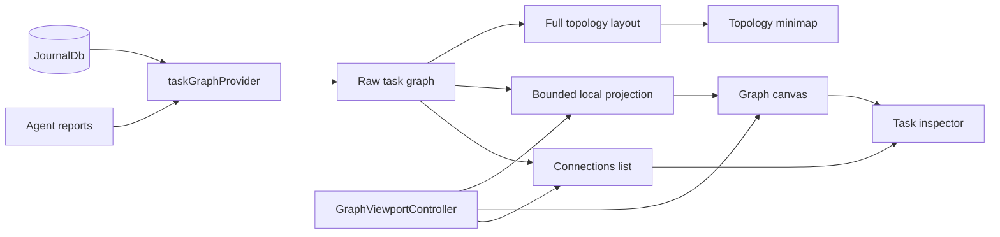
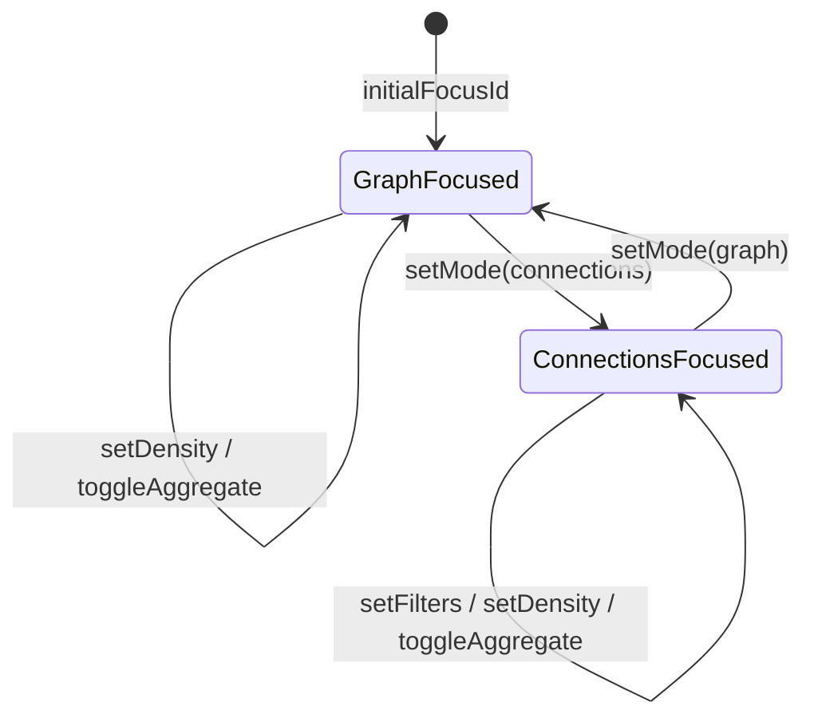

The task knowledge-graph explorer described in ADR 0029.

It is a **walkable, local-first** graph view drawn with a 2D `CustomPainter`.
You "stand on" a focus node; the main canvas projects a bounded 1–2-hop
neighbourhood around it. Tapping a node makes the camera **walk the link** to
it. The full provider graph remains visible as a small topology map in the
corner, where any node can reseed the local workspace.

The same `GraphViewportController` state drives a non-spatial Connections list.
It groups direct neighbours by typed relationship and direction, preserving
the user's focus, history, filters, and next walk.

# Why walking rather than a force-directed layout

A whole-graph force layout over a real journal produces a hairball. The
ego-centric projection in `graph_projection.dart` inverts that: the main view is
bounded by hops and a density node budget. Direct photos collapse into one media
aggregate. Large relation/type groups retain a recent preview and an exact-count
aggregate, which the user can expand independently. The topology minimap uses
the full precomputed provider layout, so global position is still available
without sacrificing local legibility.

# Rendering and interaction

`knowledge_graph_painter.dart` paints nodes, typed edges, labels, focus trails,
and media mosaics in screen space. A task with cover art uses that image as its
circular node body, with the stored horizontal focal crop. Cover-backed tasks,
image entries, and media collections render at twice the ordinary node diameter
so their imagery acts as a useful landmark. The same radius calculation drives
edge clipping, label clearance, hit testing, and semantics.

`knowledge_graph_view.dart` reads each image's encoded dimensions before
decoding it. It preserves the source aspect ratio and bounds the longest decoded
side to the visual spec's maximum media-node extent multiplied by the device
pixel ratio; source-sized phone photos are never retained for node-sized canvas
thumbnails.

`graph_label_layout.dart` measures labels and places them at one of eight anchors
using deterministic priority and collision avoidance. Focus, selection,
aggregates, direct neighbours, and second-hop context descend in priority;
non-essential labels cull at low semantic zoom.

The toolbar changes local density and hop depth, and filters by relationship,
node type, category, recency, and task status. Arrow keys move the selection in
screen-space direction, Enter or Space walks to it, and Escape walks back.
Painter semantics expose every visible node as a labelled button with a
minimum-size accessibility target. Reduced-motion and high-contrast media
preferences change motion and relationship stroke strength respectively. The
topology minimap exposes one labelled orientation region rather than claiming a
screen-reader button action that has no meaningful single destination.

# Inspector data

`task_graph_provider.dart` projects journal entities and typed `EntryLink`
variants into graph nodes and edges. For each task it resolves:

- cover art path and horizontal crop from `TaskData.coverArtId` and
  `coverArtCropX`;
- directly linked `JournalImage` paths, ordered after cover art and deduplicated;
- generated task status;
- the latest assigned-agent one-liner and TL;DR/report content.

The provider's update subscription watches loaded journal entity ids, report
ids, and report agent ids, so task media and AI context refresh with the graph.
The inspector renders a cover-first horizontal media carousel only when media
exists, keeps the full title visible, and collapses the longer AI brief by
default. Its linked-entry timeline remains another way to walk the graph.

**It ships, ungated on desktop.** Both task-detail app bars —
`TaskCompactAppBar` and `TaskExpandableAppBar` — render a desktop-only hub-icon
action that pushes `TaskKnowledgeGraphPage`, and the gate in front of it,
`knowledgeGraphEntryPointEnabledProvider`, is `Provider<bool>((_) => true)` with
no config flag behind it. Users can reach it from desktop task details, so treat
changes here as user-facing.
