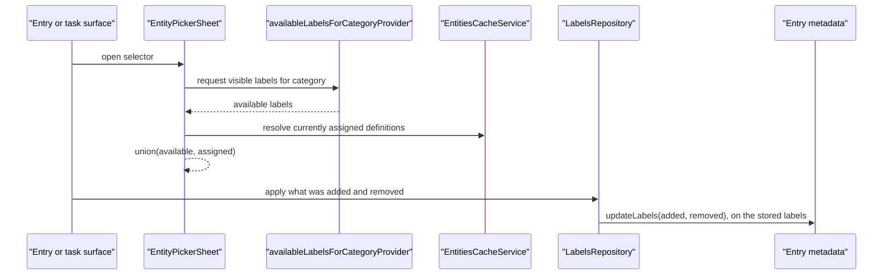
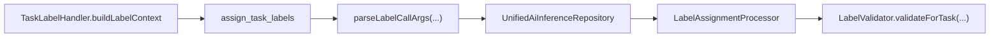

Labels are the app's lightweight taxonomy: more flexible than a single status,
less structural than categories, cheap enough to attach directly to entries. They
matter most around tasks, but **the assignment plumbing is deliberately reusable
across entry types**.

The feature keeps two concerns separate:

- **Definitions** — what labels exist, how they look, whether they are private,
  which categories they apply to.
- **Assignment** — which entry metadata carries which label ids, plus which
  labels AI should stop suggesting for a specific task.

# Three persistence concerns

| Concern | Where |
|---------|-------|
| Label definitions | `label_definitions` |
| Assignment lookup rows | `labeled` |
| Per-task AI suppression | `Task.data.aiSuppressedLabelIds` |

**The `labeled` table exists because filtering and usage counts must stay cheap.**
Recomputing label membership from serialized entity blobs on every filter change
would be the wrong trade.

**Suppression is task-local state, not definition state.** It records "do not
suggest this label again for this task" after a user or workflow explicitly
rejected it.

# The model

`LabelDefinition` carries `id`, `name`, `color`, `description`, `private`,
`applicableCategoryIds`, `deletedAt`, `createdAt`, `updatedAt`.

`sortOrder` exists on the entity, **but the current UI exposes no ordering
controls** — most surfaces sort alphabetically by name.

Category scope is intentionally simple: `null` or empty `applicableCategoryIds`
means **global**; a non-empty list means the label is in scope only for those
categories.

# The write boundary

`LabelsRepository` handles streaming definitions, reading single labels,
definition CRUD, the two assignment writes (the agent's and the picker's),
and task suppression maintenance. Usage counts are read directly by `labelsListControllerProvider`
from the journal database's `labeled` lookup table.

**Definition writes normalize category scope before persisting**: trim ids, drop
empties, remove duplicates, discard unknown categories, and **sort surviving ids
by category name for stable diffs**.

**Delete is soft-delete** — `deleteLabel()` sets `deletedAt` and re-upserts.

## Assignment writes are stricter than a chip picker

- `assignLabels()` is the agent's write (the label assignment processor's).
  It adds the ids the task **as stored** neither carries nor suppresses, leaves
  the suppressed set alone, and returns what it added. A label the user took off
  after the processor read the task stays off; the processor reports it skipped
  as `changed_since_read`, and a failed write as `write_failed`.
- `updateLabels()` is the label picker's write. It takes what the user
  **added and removed** — the difference between the picker's selection and
  the labels it opened with — and applies it to the labels as stored, so a label
  another writer put on while the picker was open is kept. It resolves each id
  **first against `EntitiesCacheService`** — which retains soft-deleted
  definitions, so cached deleted labels are kept — and otherwise against the
  DB, where only non-deleted definitions are accepted, and stores ids **sorted
  by label name**. An edit that changes nothing writes nothing.

For tasks, the picker's write also updates suppression, against the stored
labels:

- Taking a label off **adds** it to `aiSuppressedLabelIds`.
- Putting a label on **removes** it from `aiSuppressedLabelIds`.

**That coupling is deliberate.** "I removed this label from this task" is useful
feedback for later AI suggestions. The agent's write never unsuppresses: only
the user lifts a suppression. `specs/tla/TaskLabels.tla` checks both rules
(`RemoveWins`, `NoSilentRemoval`); the decision is ADR 0123.

All three writes — `assignLabels()`, `updateLabels()` and
`suppressLabelOnTask()` — go through `_writeOnStored`: the
change is built on the stored entry under a new vector clock and applied only
while that entry is still the stored one (a `precondition` in the write's
transaction). When another version synced in meanwhile, the change is built
again on it, up to three times. Before
[ADR 0083](../../docs/adr/0083-model-checked-journal-replication.md) a refused
write was forced with `overrideComparison` over the version that had arrived,
and a suppression kept the task's own clock, so peers refused it as equal and
it never synced.

# Assignment UI



The picker is the **shared** `EntityPickerSheet` — the same one categories use —
opened as a Wolt sheet, scoped to the entry's category but **unioned with
already-assigned labels**.

Two runtime rules matter:

- **The selector unions currently assigned labels back in, even when they are now
  out of scope**, so the user can still remove them. Without this rule, category
  scoping would create stranded labels the UI can hide but not undo.
- **Inline quick-create is allowed from the selector**, and a newly created label
  is immediately selected.

`LabelChip` is intentionally modest: neutral chrome, a coloured dot, and a
tooltip preferring the description over the bare name. The task-specific
"Add Label" surface lives in [tasks](tasks/detail-composition.md), where
assigned labels render as filled pills.

# AI label assignment

Task-side AI assignment is **layered on top of** the general system rather than
baked into the picker.

The tool is `assign_task_labels`, whose preferred payload carries structured
labels with confidence:

```json
{"labels": [{"id": "bug", "confidence": "very_high"}]}
```

Legacy `labelIds` input is still accepted, but current parsing prefers the
structured form.



Validation and suppression run **before** anything is written, so an AI
suggestion cannot resurrect a label the user already rejected for that task.
The processor reads the task fresh for its suppressed set. If that read fails,
or does not return a task (deleted since the caller read it), it **fails
closed**: nothing is assigned, and every requested ID comes back as
skipped with reason `suppression_unknown`. Reading an unreadable suppressed set
as empty would do exactly the resurrecting this guard exists to prevent.
