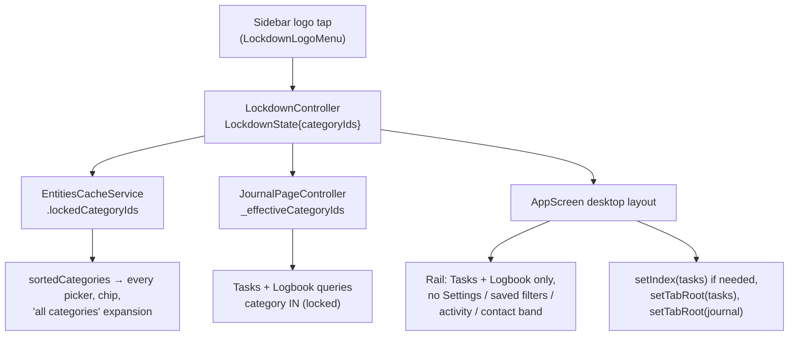

Lockdown is one Riverpod notifier, `LockdownController`, holding a
`LockdownState` whose only field is a **set** of category ids. Empty means
inactive. Everything else is a consumer of that set.

# The model is a set on purpose

The picker is single-select today, so `lockToCategory` always produces a
one-element set — but `restrict`, `allows`, the cache scope and the query
clamp are all written against the set. A multi-category picker later is a UI
change only.

`restrict(selected)` is the one rule every filter goes through: the overlap of
the user's selection with the locked set, falling back to the **whole locked
set** when nothing overlaps. That fallback is what makes an empty selection
(which the query runner otherwise expands to *all* categories plus the
unassigned `''` sentinel) resolve to exactly the locked content.

# Session-only, deliberately

The state is never persisted. A demo that ends with the app closed must not
reopen locked down, and a lockdown surviving a crash would look like data loss.
Restart is therefore always an exit.

# Where it bites

- **`JournalPageController`** reads `_effectiveCategoryIds` — the raw selection
  clamped by `restrict` — for its query params and for the `selectedCategoryIds`
  it emits, and re-queries on every lockdown change. The **raw** selection is
  what gets persisted, so a demo never rewrites the user's own filter. Both the
  Tasks tab and the Logbook tab are instances of this controller, which is why
  they are the two tabs allowed to stay.
- **`EntitiesCacheService.sortedCategories`** drops categories outside the
  locked set while `lockedCategoryIds` is non-empty. `getCategoryById` is
  **not** scoped: the locked category's own content still has to resolve its
  definition. The controller mirrors the set into the cache on every change.
- **The desktop shell** keeps only Tasks and Logbook in the rail, strips their
  under-row subtrees (saved filters, the month calendar), and drops Settings,
  the utility row, the activity disclosure and the contact band. On entering
  lockdown it switches to Tasks if the active tab is not an allowed one and
  resets both allowed tabs to their roots so no pre-lockdown detail pane
  survives. The content stack itself is untouched — only the active index and
  the rail change — so leaving lockdown restores every tab's state.
- **The logo menu** lists all active categories while inactive, and **only the
  locked one plus the exit row** while active: the exit menu must not spell out
  what it is hiding.

# Cut, not filtered

Every tab other than Tasks and Logbook is hidden outright rather than filtered
because none of them can be made category-safe cheaply: the day plan, insights
and habits list definitions by name, projects and people are category-agnostic,
and Settings enumerates everything. Hiding is the only guarantee that holds
without touching a dozen query paths.

# Known gaps

- The task filter modal still lists **projects and labels** by name; those are
  not category-scoped and may name things outside the lockdown.
- A task's detail pane can show **linked entries** from other categories.
- Below the desktop breakpoint the **mobile navigation** is unrestricted; the
  feature is desktop-only and the collapsed rail has no logo to tap, so a
  collapsed sidebar has to be expanded to exit.
