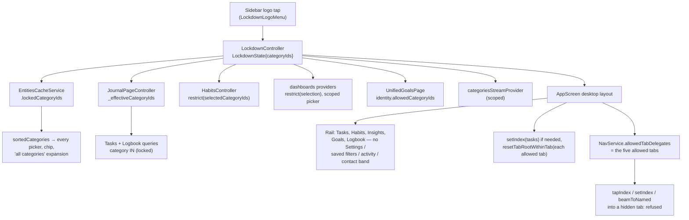

Lockdown is one Riverpod notifier, `LockdownController`, holding a
`LockdownState` whose only field is a **set** of category ids. Empty means
inactive. Everything else is a consumer of that set.

# The model is a set on purpose

The picker is single-select today, so `lockToCategory` always produces a
one-element set — but `restrict`, `allows`, the cache scope and the query
clamp are all written against the set. A multi-category picker later is a UI
change only.

`restrict(selected)` is the one rule every filter goes through: the overlap of
the user's selection with the locked set, falling back to the **whole locked
set** when nothing overlaps. That fallback is what makes an empty selection
(which the query runner otherwise expands to *all* categories plus the
unassigned `''` sentinel) resolve to exactly the locked content.

# Session-only, deliberately

The state is never persisted. A demo that ends with the app closed must not
reopen locked down, and a lockdown surviving a crash would look like data loss.
Restart is therefore always an exit.

# Where it bites

- **`JournalPageController`** reads `_effectiveCategoryIds` — the raw selection
  clamped by `restrict` — for its query params and for the `selectedCategoryIds`
  it emits, and re-queries on every lockdown change. The **raw** selection is
  what gets persisted, and while lockdown is active the setter behind
  `_selectedCategoryIds` **drops category writes** (chip toggles, the filter
  sheet's Apply, saved-filter activation) — the sheet is seeded from the
  effective scope and would otherwise write it back as the raw value on Apply.
  Persisted loads bypass the guard. So exiting lockdown restores exactly the
  filter the user had. Both the Tasks tab and the Logbook tab are instances of
  this controller.
- **`HabitsController`** runs `restrict` over `selectedCategoryIds` when it
  buckets habits and recomputes on every lockdown change; the raw selection is
  left alone. **Insights** does the same in `filteredSortedDashboardsProvider`,
  and its category picker (`dashboardCategoriesProvider`) lists only locked
  categories. **Goals** filters the active and archived identities on
  `allowedCategoryIds` in `UnifiedGoalsPage` — deliberately *not* in the agent
  providers, which the runtime watchers share and which must keep every goal
  alive. A goal with no category is hidden, like an unassigned entry. The
  page's *recordable* habit set — which feeds both the orphan group and every
  goal card's rows — is intersected with `lockdown.allows(habit.categoryId)`
  too, so an unclaimed habit from another category cannot surface there.
- **`categoriesStreamProvider`** emits only locked categories while active, so
  the goal-creation wizard and the logo menu inherit the scope.
- **`EntitiesCacheService.sortedCategories`** drops categories outside the
  locked set while `lockedCategoryIds` is non-empty. `getCategoryById` is
  **not** scoped: the locked category's own content still has to resolve its
  definition. The controller mirrors the set into the cache on every change.
- **The desktop shell** keeps Tasks, Habits, Insights, Goals and Logbook in
  the rail, strips their under-row subtrees (saved filters, the AI impact
  entry), and drops Settings, the utility row, the activity disclosure, the
  contact band. The docked day-view column beside the task list **stays**, so
  the day still reads as a whole: `DayViewSidePanel` hands `DayTimeline` an
  `isRedacted` predicate, and every block outside the locked category is
  drawn by `DayBlock` as a plain `background.level03` slab — right time and
  height, no title, no category colour, no live task projection, no tap,
  edit, rename, move or resize, and an accessible name of only the time range
  and tracked/planned. The unassigned fallback category counts as outside. On entering lockdown it sets `NavService.allowedTabDelegates`
  to the allowed tabs, switches to Tasks if the active tab is not an allowed
  one, and resets every allowed tab to its root **without activating it**
  (`resetTabRootWithinTab`, built on `beamWithinTab`) so no pre-lockdown detail
  pane survives while the user stays on the tab they were on. The content
  stack itself is untouched — only the active index and the rail change — so
  leaving lockdown (which clears the guard) restores every tab's state,
  minus the detail panes that were reset.
- **`NavService.allowedTabDelegates`** is the one seam that keeps *every*
  route into a hidden tab shut for the whole active period — keyboard
  shortcuts, the command palette, the desktop menu and path-based
  `beamToNamed` all end in `_setIndexInternal` or `beamToNamed`, both of which
  refuse a disallowed tab. It is keyed by delegate, not index: a feature flag
  toggling a tab ahead of Logbook shifts every later index, and a guard of
  indices would then authorise the wrong tab. The rail cut alone would only
  have covered sidebar taps. The guard is **desktop-only**: the shell
  re-evaluates it on every build (`_syncLockdownGuard`), so crossing the
  desktop breakpoint mid-lockdown lifts it — the mobile shell has no logo to
  exit through and keeps its full navigation, which is why the feature is
  documented as desktop-only rather than half-applied there.

# Cut, not filtered

The day plan, projects, people, events and Settings are hidden outright rather
than filtered: they are category-agnostic or enumerate everything, and none of
them can be made category-safe without touching a dozen query paths. A tab
stays only when its content is scoped at its own source.

# Known gaps

- The task filter modal still lists **projects and labels** by name; those are
  not category-scoped and may name things outside the lockdown.
- A task's detail pane can show **linked entries** from other categories, and
  a dashboard's charts show whatever measurables it references regardless of
  their category.
- Below the desktop breakpoint the **mobile navigation** is unrestricted; the
  feature is desktop-only and the collapsed rail has no logo to tap, so a
  collapsed sidebar has to be expanded to exit.
