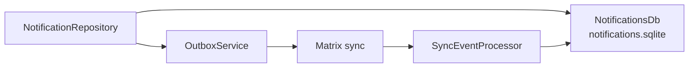
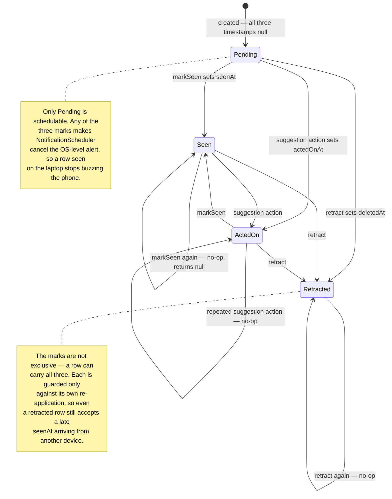
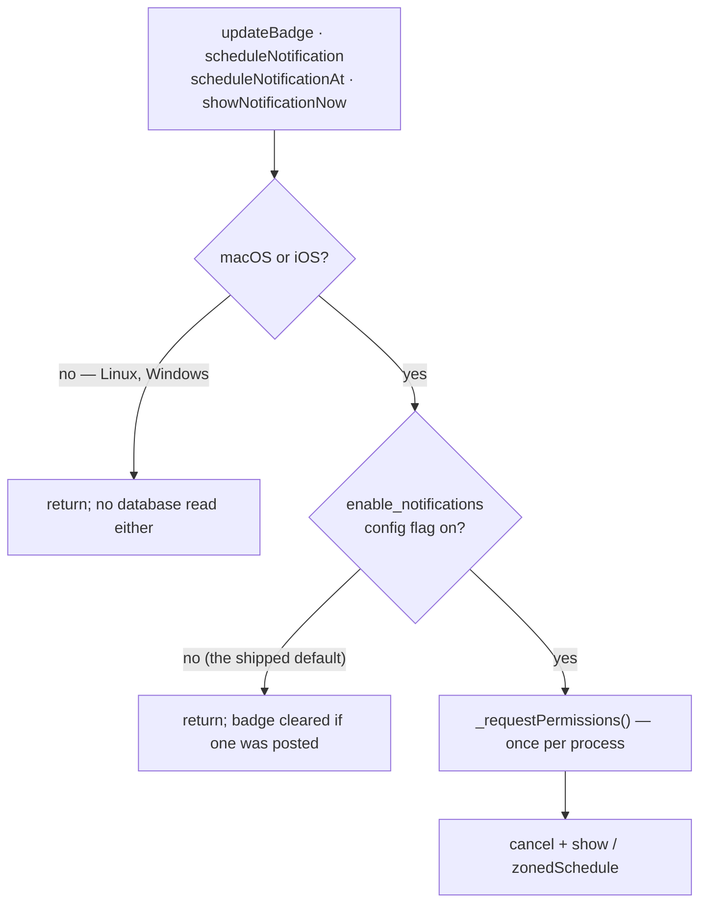
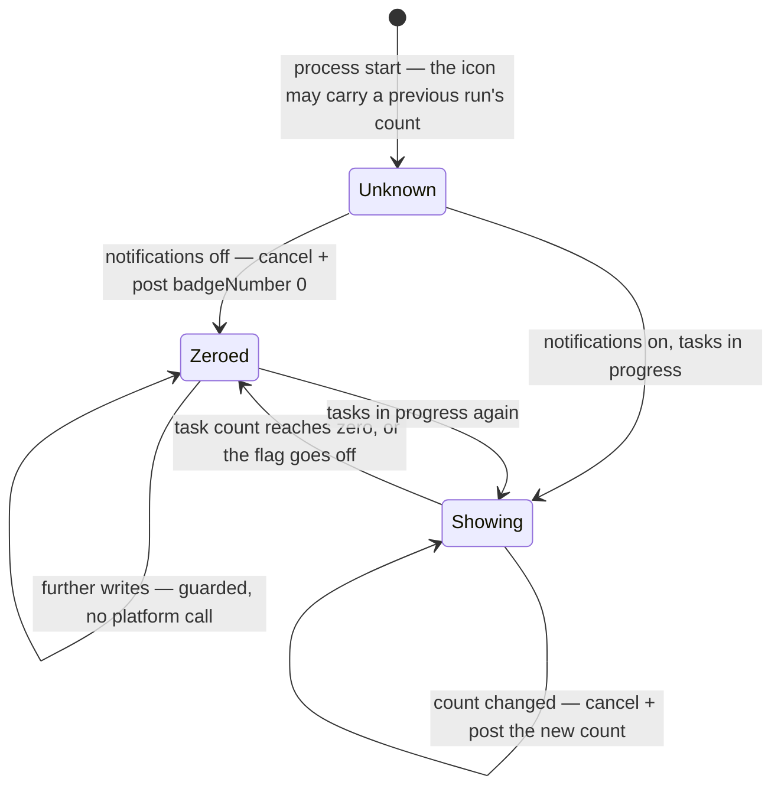

Synced notifications are durable app-level alerts stored **outside the journal
database**. They carry AI and task suggestions across devices, then use
**monotonic state timestamps** to converge when a user dismisses, acts on, or
retracts an alert on any device.

# Why a separate database

An alert is not user content. Keeping it out of `db.sqlite` means notification
churn — created, delivered, dismissed, retracted — never competes with journal
reads for the same write lock, and a notification schema change never touches the
primary store.

# Why monotonic state, not last-write-wins on the row

Dismissal is a **state transition**, not a field edit. Two devices can act on the
same alert in different orders; comparing whole rows would let an older
"delivered" overwrite a newer "acted on".

Carrying the state timestamp separately means the lifecycle only ever moves
forward, so the alert leaves the inbox on every device and stays gone.

Each transition is a separate nullable timestamp on the row — `seenAt`,
`actedOnAt`, `deletedAt` — and `_statePatchWouldChange` only lets a patch through
when the field it sets is still null. That is what makes the lifecycle a lattice
rather than a sequence: the three marks are independent, so replaying a
transition is a no-op and reordering two of them converges either way.

Read the states as *which marks are set*, not as a single-valued status column:
there is no status field, and `Seen --> ActedOn` and `ActedOn --> Seen` are the
same end state reached in either order.

The three marks differ in what they *hide*, not in what they permit:
`actedOnAt` and `deletedAt` both drop a suggestion out of the open set, while
`seenAt` only clears the badge and stops the OS alert.

A no-op returns `null` before touching the vector clock, so it enqueues no
outbox message either — a device re-marking what it already marked produces no
sync traffic at all.

Only a transition that actually changed something advances the vector clock,
enqueues a `notificationStateUpdate`, reschedules and notifies listeners; the
four steps happen inside one `withVcScope` so a failure part-way commits nothing.

Both `notification` and `notificationStateUpdate` are **sequence-tracked**
[sync message families](sync/message-model.md), so a missed transition is a
detectable gap rather than silent divergence.

The scheduler and the platform-plugin boundary live in `lib/services/`, lazily
registered so a sandboxed build does not initialise the plugin until something
actually schedules — see [bootstrap](../architecture/bootstrap-and-di.md).

# Nothing reaches the OS before the config flag says so

`NotificationService` is the only place Lotti talks to the OS notification
system, and every one of its entry points passes through a single gate before
anything crosses the platform channel:

**The order is the invariant, not an optimisation.** Requesting permission is
what raises the OS "…would like to send you notifications" dialog, so anything
that asks before consulting the flag prompts a user who has switched
notifications off. `enable_notifications` ships **off**, which makes that the
default experience rather than an edge case.

Two things conspired to make the prompt appear during a user's *first task*.
`updateBadge` runs after every entry write, and it is what first resolves the
lazily registered service — so construction and the first gate evaluation both
happen inside that write. `DarwinInitializationSettings` then defaults all three
of `requestAlertPermission`, `requestBadgePermission` and
`requestSoundPermission` to `true`, and the native `initialize` forwards them
straight to `UNUserNotificationCenter.requestAuthorization`; initialisation must
pass all three as `false`, or the prompt arrives before any gate can run. With
every option false the native side returns without calling
`requestAuthorization` at all, so this makes `initialize` silent rather than
merely quieter.

Permission is requested at most once per process. The OS shows its dialog for
the first request only, so later calls are channel round trips returning a
decision already on file; memoising the *future* rather than a boolean also
collapses concurrent callers into one request.

**A failed request is logged, swallowed, and not memoised.** Both halves are
load-bearing. Asking is best-effort but the callers are not — `createDbEntity`
runs `updateBadge` as post-commit work, and `NotificationRepository` schedules
inside a vector-clock scope that commits only when its body returns, so an
error escaping the request would abort notification creation and every
lifecycle transition. Memoising a *rejected* future would then make that abort
permanent for the life of the process rather than transient.

The badge follows the flag rather than outliving it, and taking it down is
**two calls, not one**. `cancel` removes the delivered record — the "3 tasks in
progress" entry in Notification Center — but on Darwin the number on the icon
is carried by a notification's own `badge` field (`content.badge` natively),
and `removeDeliveredNotifications` does not reset it. Only a `badgeNumber: 0`
post actually clears the icon.

Posting that while notifications are off is not a notification in any sense the
user sees: empty, `presentAlert: false`, and existing only to zero the number.
It also cannot prompt — the dialog comes from `requestAuthorization`, never
from posting — and without authorization it silently does nothing, which is
correct, because then there is no badge either.

The clear is guarded on a flag tracking whether the icon is *known to read
zero*, which starts **false**. It cannot be guarded on the task count, and it
cannot start true: the icon outlives the process that set it, so a run that
inherited a badge from the previous one must still take it down. The guard
bounds the cost at one pair of platform calls per process rather than one pair
per entry write.

`updateBadge` is the only thing that reconciles the icon with the flag, and
outside entry creation nothing else called it — so toggling the flag left the
count on the icon until the user happened to write something.
`setConfigFlagImpl` therefore refreshes the badge when
`enable_notifications` actually changes, next to the `private` hook it already
carries. That is also what makes the permission prompt land at the moment the
user switches notifications on, rather than at some later write. A failure
there is logged and swallowed: the setting the user asked for is already
saved, and a badge refresh that cannot reach the platform is not a reason to
report it as unsaved.

Cancelling is the one thing that stays ungated: removing an alert must keep
working after notifications are switched off.
