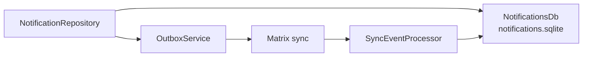
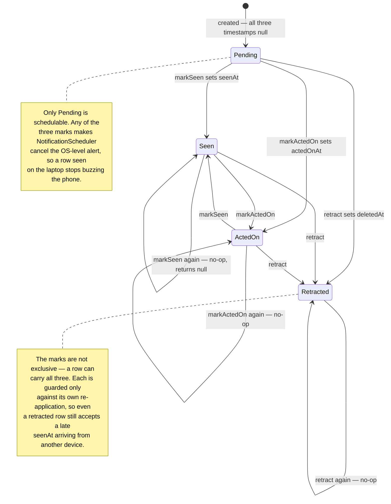

Synced notifications are durable app-level alerts stored **outside the journal
database**. They carry AI and task suggestions across devices, then use
**monotonic state timestamps** to converge when a user dismisses, acts on, or
retracts an alert on any device.

# Why a separate database

An alert is not user content. Keeping it out of `db.sqlite` means notification
churn — created, delivered, dismissed, retracted — never competes with journal
reads for the same write lock, and a notification schema change never touches the
primary store.

# Why monotonic state, not last-write-wins on the row

Dismissal is a **state transition**, not a field edit. Two devices can act on the
same alert in different orders; comparing whole rows would let an older
"delivered" overwrite a newer "acted on".

Carrying the state timestamp separately means the lifecycle only ever moves
forward, so the alert leaves the inbox on every device and stays gone.

Each transition is a separate nullable timestamp on the row — `seenAt`,
`actedOnAt`, `deletedAt` — and `_statePatchWouldChange` only lets a patch through
when the field it sets is still null. That is what makes the lifecycle a lattice
rather than a sequence: the three marks are independent, so replaying a
transition is a no-op and reordering two of them converges either way.

Read the states as *which marks are set*, not as a single-valued status column:
there is no status field, and `Seen --> ActedOn` and `ActedOn --> Seen` are the
same end state reached in either order.

The three marks differ in what they *hide*, not in what they permit:
`actedOnAt` and `deletedAt` both drop a suggestion out of the open set, while
`seenAt` only clears the badge and stops the OS alert.

A no-op returns `null` before touching the vector clock, so it enqueues no
outbox message either — a device re-marking what it already marked produces no
sync traffic at all.

Only a transition that actually changed something advances the vector clock,
enqueues a `notificationStateUpdate`, reschedules and notifies listeners; the
four steps happen inside one `withVcScope` so a failure part-way commits nothing.

Both `notification` and `notificationStateUpdate` are **sequence-tracked**
[sync message families](sync/message-model.md), so a missed transition is a
detectable gap rather than silent divergence.

The scheduler and the platform-plugin boundary live in `lib/services/`, lazily
registered so a sandboxed build does not initialise the plugin until something
actually schedules — see [bootstrap](../architecture/bootstrap-and-di.md).
