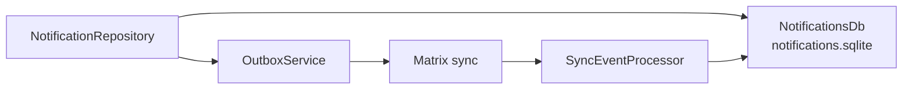
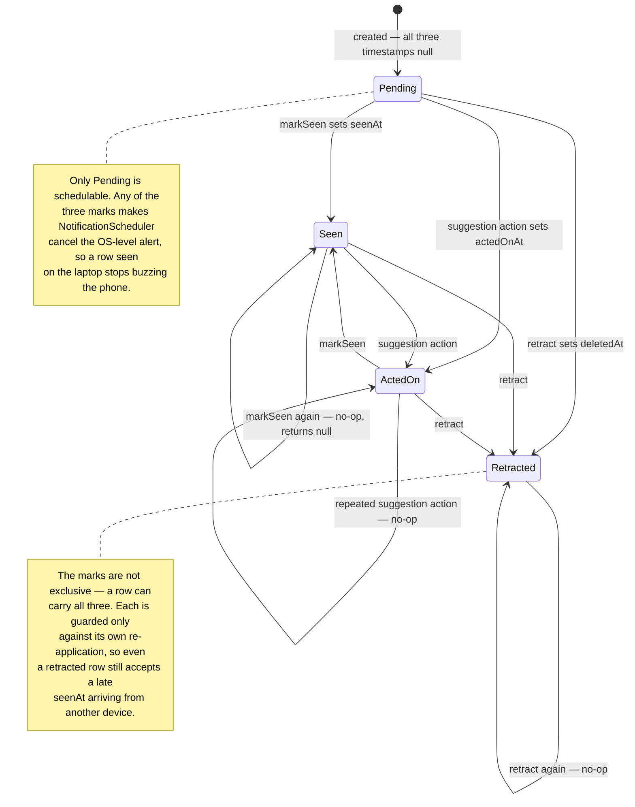
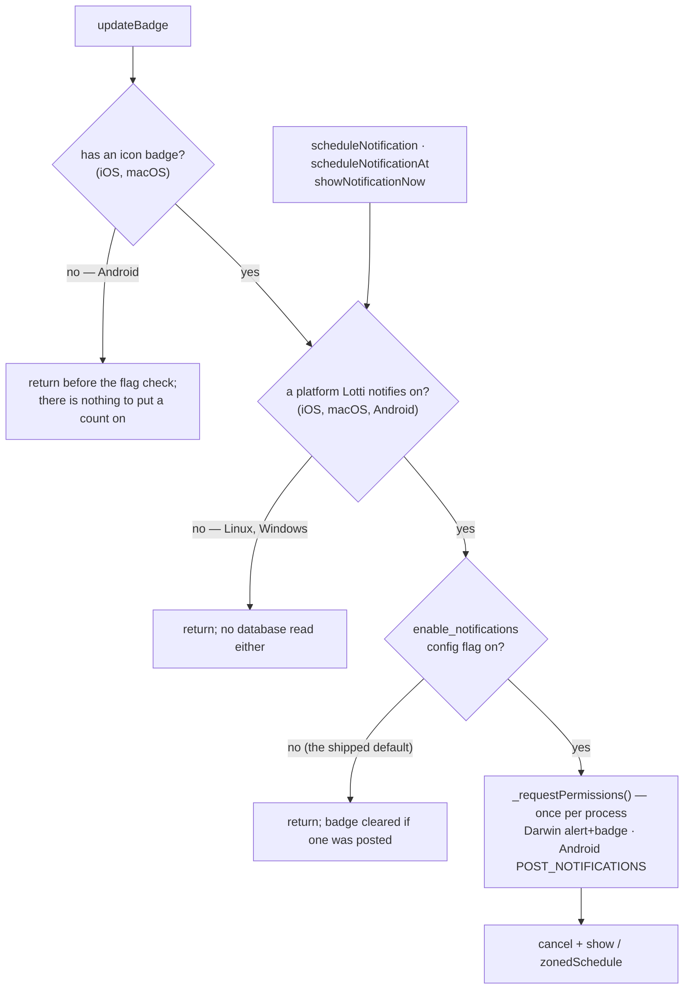
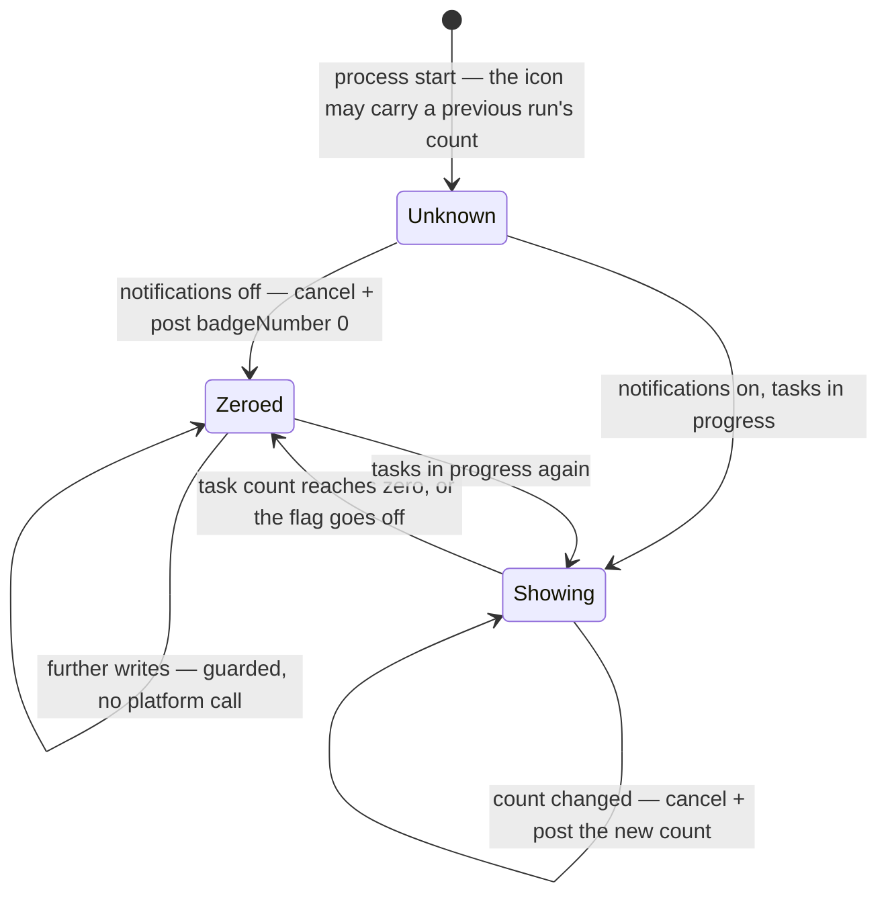
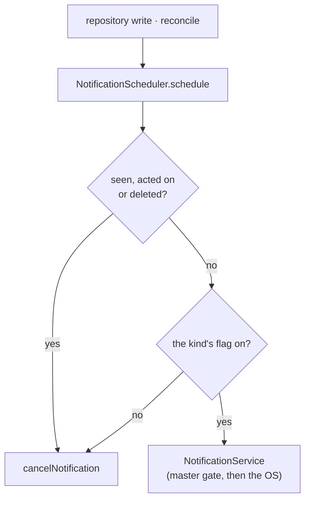
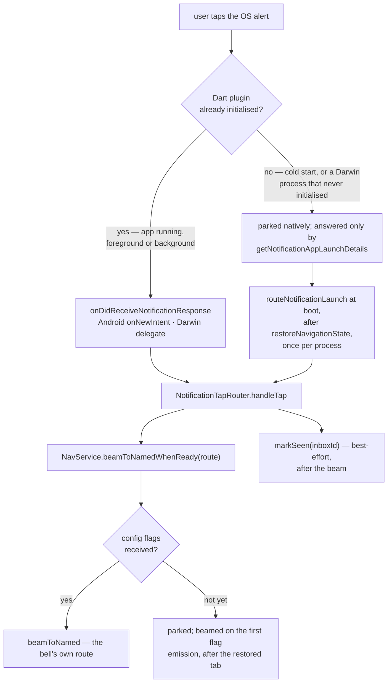
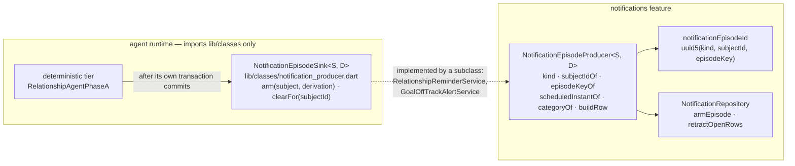
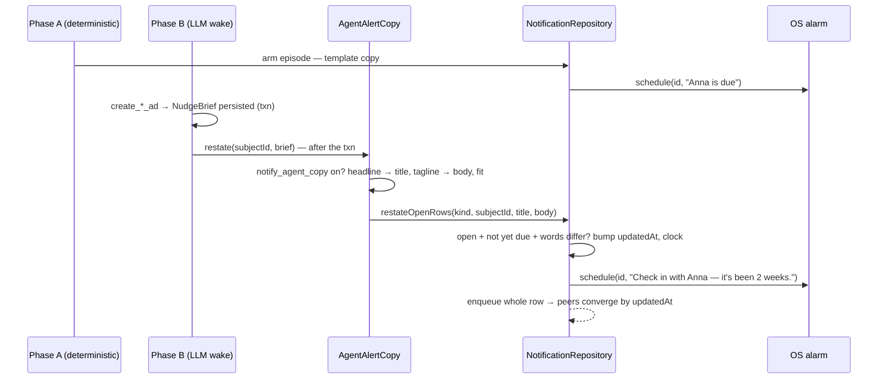

Synced notifications are durable app-level alerts stored **outside the journal
database**. They carry AI and task suggestions across devices, then use
**monotonic state timestamps** to converge when a user dismisses, acts on, or
retracts an alert on any device.

# Why a separate database

An alert is not user content. Keeping it out of `db.sqlite` means notification
churn — created, delivered, dismissed, retracted — never competes with journal
reads for the same write lock, and a notification schema change never touches the
primary store.

# Two rows never leave the device

Most rows sync, because what they say is true on every device and dealing
with one on any device must clear it on the others. Two say something that is
only true *here*, and `NotificationEntityFields.isDeviceLocal` — exhaustive
over the union, so every variant has to choose — keeps them home:

| Variant | Written by | Why it cannot sync |
|---------|-----------|--------------------|
| `dayPlanOutcome` | `DayPlanReadyNotifier`, when a Daily OS draft or refine job succeeds or gives up while the app is in the background | the [job ledger](daily_os_next/processing-outbox.md) is this device's, and "open Lotti to try again" is only true here |
| `syncConflict` | `ConflictNotificationObserver`, once per burst of newly detected conflicts | a conflict is this device's disagreement with a peer, and the [list the row opens](sync/vector-clocks-and-conflicts.md#proactive-surfacing) is this device's |

For such a row `NotificationRepository` skips the outbox on create **and on
every lifecycle mark**. The second half is the load-bearing one: a peer that
receives a `notificationStateUpdate` for a row it never got treats it as a
base row that has not arrived yet and keeps the event pending, retrying
forever. Everything else is unchanged — the row is stored, scheduled onto the
OS, shown in the bell, and cleared by a tap like any other.

Both are "due on arrival" and keyed per episode through the same
`notificationEpisodeId` the producers use: a plan outcome by the job and its
status (a job that failed and then succeeded on retry is two rows), a
conflict row by the burst's new ids. A later row for the same day, or the
next burst, retracts the earlier open one through `retractOpenRows` — which
is what the single OS notification id these two used to post directly did by
replacement, now with a row behind it that survives the banner.

**Snapshots apply one at a time.** Conflicts arriving during a sync land one
by one, each emitting its own snapshot, and `ConflictNotificationObserver`
chains them: two applied side by side would each arm a row and then retract
the other's, leaving no row at all. Serialised, the last burst's row is the
one that survives — the same outcome the single OS id used to give.

# Why monotonic state, not last-write-wins on the row

Dismissal is a **state transition**, not a field edit. Two devices can act on the
same alert in different orders; comparing whole rows would let an older
"delivered" overwrite a newer "acted on".

Carrying the state timestamp separately means the lifecycle only ever moves
forward, so the alert leaves the inbox on every device and stays gone.

Each transition is a separate nullable timestamp on the row — `seenAt`,
`actedOnAt`, `deletedAt` — and `_statePatchWouldChange` only lets a patch through
when the field it sets is still null. That is what makes the lifecycle a lattice
rather than a sequence: the three marks are independent, so replaying a
transition is a no-op and reordering two of them converges either way.

The union has seven variants — `taskSuggestion`, `taskOverdue`,
`relationshipCheckIn`, `habitAutoCompleted` (one row for every habit the
[auto-completion engine](habits.md#auto-completion-the-engine-only-fills-empty-days)
checked off in one batch; its `linkedEntityId` is `null` because a grouped row
leads to the habits page, not to one habit), `goalOffTrack` (a goal that
slipped, linked to its agent; see
[goal agents](goals.md#the-os-alert-for-a-slipped-goal)), and the two
[device-local](#two-rows-never-leave-the-device) ones, `dayPlanOutcome` and
`syncConflict` — and the discriminator strings are the sync wire format,
so renaming one would make every already-synced row of that kind undecodable on
upgrade. A peer too old to know a variant throws in `fromJson`, which
`SyncEventProcessor` turns into `UnrecoverableSyncPayloadException` and skips:
the row is dropped with a log rather than retried forever. There is no
`unknown` fallback variant, unlike the nudge substrate.

Read the states as *which marks are set*, not as a single-valued status column:
there is no status field, and `Seen --> ActedOn` and `ActedOn --> Seen` are the
same end state reached in either order.

The three marks differ in what they *hide*, not in what they permit:
`actedOnAt` and `deletedAt` both drop a suggestion out of the open set, while
`seenAt` only clears the badge and stops the OS alert.

A no-op returns `null` before touching the vector clock, so it enqueues no
outbox message either — a device re-marking what it already marked produces no
sync traffic at all.

Only a transition that actually changed something advances the vector clock,
enqueues a `notificationStateUpdate`, reschedules and notifies listeners; the
four steps happen inside one `withVcScope` so a failure part-way commits nothing.

Both `notification` and `notificationStateUpdate` are **sequence-tracked**
[sync message families](sync/message-model.md), so a missed transition is a
detectable gap rather than silent divergence.

The scheduler and the platform-plugin boundary live in `lib/services/`, lazily
registered so a sandboxed build does not initialise the plugin until something
actually schedules — see [bootstrap](../architecture/bootstrap-and-di.md).

# Nothing reaches the OS before the config flag says so

`NotificationService` is the only place Lotti talks to the OS notification
system, and every one of its entry points passes through a single gate before
anything crosses the platform channel:

**The order is the invariant, not an optimisation.** Requesting permission is
what raises the OS "…would like to send you notifications" dialog, so anything
that asks before consulting the flag prompts a user who has switched
notifications off. `enable_notifications` ships **off**, which makes that the
default experience rather than an edge case.

**The badge is a count, not an alert.** `updateBadge` posts the number of
tasks in progress with an empty title and body, `presentAlert: false` on both
Darwin platforms: a notification whose only content is its badge updates the
icon and shows nothing, in the foreground or the background. It has a switch
of its own, `show_task_badge`, beneath the master one; either off clears the
icon. macOS used to
alert for a non-zero count so that a "3 tasks in progress" line was delivered
with it — which made every entry write that changed the count post a
notification, in hard-coded English, about a number the icon already shows.
The alerts are the inbox rows.

Two things conspired to make the prompt appear during a user's *first task*.
`updateBadge` runs after every entry write, and it is what first resolves the
lazily registered service — so construction and the first gate evaluation both
happen inside that write. `DarwinInitializationSettings` then defaults all three
of `requestAlertPermission`, `requestBadgePermission` and
`requestSoundPermission` to `true`, and the native `initialize` forwards them
straight to `UNUserNotificationCenter.requestAuthorization`; initialisation must
pass all three as `false`, or the prompt arrives before any gate can run. With
every option false the native side returns without calling
`requestAuthorization` at all, so this makes `initialize` silent rather than
merely quieter.

Android's runtime `POST_NOTIFICATIONS` permission is requested from the same
place and for the same reason. Its `initialize` does not ask for anything —
only the icon — so the ordering invariant costs nothing there, but the request
still has to come after the flag rather than at launch.

Permission is requested at most once per process. The OS shows its dialog for
the first request only, so later calls are channel round trips returning a
decision already on file; memoising the *future* rather than a boolean also
collapses concurrent callers into one request.

**A failed request is logged, swallowed, and not memoised.** Both halves are
load-bearing. Asking is best-effort but the callers are not — `createDbEntity`
runs `updateBadge` as post-commit work, and `NotificationRepository` schedules
inside a vector-clock scope that commits only when its body returns, so an
error escaping the request would abort notification creation and every
lifecycle transition. Memoising a *rejected* future would then make that abort
permanent for the life of the process rather than transient.

The badge follows the flag rather than outliving it, and taking it down is
**two calls, not one**. `cancel` removes the delivered record, but on Darwin
the number on the icon is carried by a notification's own `badge` field
(`content.badge` natively), and `removeDeliveredNotifications` does not reset
it. Only a `badgeNumber: 0` post actually clears the icon.

Posting that while notifications are off is not a notification in any sense the
user sees: empty, `presentAlert: false`, and existing only to zero the number.
It also cannot prompt — the dialog comes from `requestAuthorization`, never
from posting — and without authorization it silently does nothing, which is
correct, because then there is no badge either.

The clear is guarded on a flag tracking whether the icon is *known to read
zero*, which starts **false**. It cannot be guarded on the task count, and it
cannot start true: the icon outlives the process that set it, so a run that
inherited a badge from the previous one must still take it down. The guard
bounds the cost at one pair of platform calls per process rather than one pair
per entry write.

`updateBadge` is the only thing that reconciles the icon with the flag, and
outside entry creation nothing else called it — so toggling the flag left the
count on the icon until the user happened to write something.
`setConfigFlagImpl` therefore refreshes the badge when
`enable_notifications` actually changes, next to the `private` hook it already
carries. That is also what makes the permission prompt land at the moment the
user switches notifications on, rather than at some later write. Switching
the flag *on* additionally runs the scheduler's reconcile (below): rows
written while the flag was off never armed an OS alarm — the platform calls
are gated on the flag — and the repository's idempotent creates skip existing
rows on every later tick, so without this only the next app start would arm
them. A failure in either hook is logged and swallowed: the setting the user
asked for is already saved, and a badge refresh or re-arm that cannot reach
the platform is not a reason to report it as unsaved.

Cancelling is the one thing that stays ungated: removing an alert must keep
working after notifications are switched off.

# Which kinds reach the OS is the user's to choose

`enable_notifications` is the master switch; beneath it, one config flag per
kind of alert decides whether the scheduler projects that kind's rows onto the
OS channel. The flags are seeded **on** — a user who switches notifications on
has asked for alerts, not for a second round of opting in — and are edited on
the Notifications page under Settings → Preferences (`/settings/notifications`,
`lib/features/settings/ui/pages/notification_settings_page.dart`), which also
carries the master switch. The Config Flags page no longer lists it.

| flag | governs |
|---|---|
| `notify_task_suggestions` | task suggestions **and** overdue tasks — two faces of "an agent has something to say about a task" |
| `notify_check_in_reminders` | relationship check-ins |
| `notify_goal_alerts` | a goal slipping off track |
| `notify_habit_reminders` | the reminders armed from a habit's alert time |
| `notify_habit_auto_completions` | habits the engine checked off |
| `notify_day_plan_outcomes` | a plan job's outcome |
| `notify_sync_conflicts` | newly detected sync conflicts |
| `show_task_badge` | the task count on the app icon — offered on iOS and macOS only, where there is an icon to put it on |
| `notify_agent_copy` | whether an agent may re-word an armed alert with its banner's words — **off** by default, see [below](#the-agent-may-re-word-an-armed-alert) |

`notificationFlagFor` in
`lib/features/notifications/model/notification_kind_flags.dart` maps a row to
its flag with an exhaustive switch, so a new variant does not compile until it
names its switch. The scheduler consults it on every arm, **before** the
service's master gate:

**The row is untouched either way.** A kind switched off still lands in the
inbox and the bell; the flag decides whether the OS is told, not whether Lotti
remembers — which is what the page says beneath the switches.

**A flip takes effect at once, through the hook the master switch already
used** — `setConfigFlagImpl` in `lib/logic/persistence_definition_ops.dart`.
Every consequence is best-effort: logged, never surfaced as an unsaved
setting.

| change | consequence |
|---|---|
| a kind flag, either way | `reconcile`: `schedule` re-arms the upcoming rows of a kind switched on and cancels the alarms of one switched off |
| `notify_habit_reminders` off | every habit's alarm is cancelled by id — a reminder has no row for the reconcile to find |
| `notify_habit_reminders` on | every active habit's next reminder is armed; a habit already completed today reminds once more, until the next completion skips ahead again |
| `show_task_badge`, either way | `updateBadge`, which clears the icon when either switch is off |
| `enable_notifications` off | `cancelAllNotifications` sweeps every pending and delivered alert, **then** the badge is cleared — the zero-badge post is itself a notification and would be swept in the other order |
| `enable_notifications` on | badge first (where the permission prompt surfaces), then `reconcile`, then the habit reminders |

Habit reminders take their gate inside `scheduleHabitNotification` itself:
with the flag off it cancels the habit's alarm and arms nothing, so a save or
a completion while the switch is off withdraws a reminder armed before it.

Config flags sync between devices (`SyncMessage.configFlag`), so a kind
silenced on one device is silenced on all of them — the reach the master
switch already had.

# Habit reminders retain their calendar date

`scheduleHabitNotification` interprets the daily alert time in the resolved
local zone. Completion requests the next calendar day; saving settings uses
today if the alert time is still ahead, otherwise tomorrow. Calendar
construction, rather than a 24-hour duration, preserves the intended day
through daylight-saving changes and month/year boundaries. Subsecond clock
values do not leak into the configured reminder time.

`scheduleNotification` preserves that entire calendar date and wall-clock time
when constructing the zoned alarm. Reusing today's date here would discard the
completion caller's tomorrow: before the alert time it would ring again today,
and after the alert time the plugin would reject the replacement after the
previous alarm had been cancelled. This wall-clock contract differs from
`scheduleNotificationAt`, which converts an absolute instant into the device
zone. Both replace the prior alarm with the same notification ID.

# Android needed settings before it needed anything else

`InitializationSettings` carried `linux`, `macOS` and `iOS` but no `android`,
and the plugin throws `ArgumentError('Android settings must be set…')` in
exactly that case. Because `_initializePlugin` deliberately swallows its own
failures — a sandboxed flatpak build must stay startable — that throw was
caught, logged, and never surfaced. The result was not a degraded Android
experience but an absent one: the plugin stayed uninitialised, so habit
reminders, the Daily OS plan-ready banner and sync-conflict alerts (both
inbox rows since; see above) were all discarded silently.

Three things follow from switching it on, and none of them are cosmetic:

- **The small icon must be a monochrome drawable.** Android masks it by its
  alpha channel and paints the result white, so `@mipmap/ic_launcher` — 95%
  opaque — renders as a solid white square. `ic_stat_lotti.xml` is the ring
  glyph lifted verbatim out of `brand_logo_light.svg`.
- **The channel's name and description are frozen at first creation.**
  `channelAction` defaults to `createIfNotExists`, so Android stores whatever
  the first notification carried and ignores later posts. They come from the
  ARB catalogs because they are user-visible in system settings, but switching
  the app's language does *not* rename an existing channel — only
  `AndroidNotificationChannelAction.update` would, and some channel properties
  are immutable even then. Resolving that copy also degrades to English rather
  than throwing: it runs inside `NotificationRepository`'s vector-clock scope,
  where an escaping exception would abort the notification row itself.
- **`updateBadge` is Darwin-only, and that is a behavioural guard.** The badge
  is a *number on the icon*, carried by a notification's own `badge` field and
  posted with `presentAlert: false`. Android has no such thing: the same call
  would post a visible notification after every entry write. The early return
  sits *before* the flag check, because this is not a "notifications are off"
  path — there is simply nothing to put a count on.
- **Scheduling is inexact on purpose.** The exact modes need
  `SCHEDULE_EXACT_ALARM`, which Android 13+ does not grant on install and the
  Play Store accepts only from apps whose core function is alarms or calendars.
  Nothing Lotti schedules is that. `inexactAllowWhileIdle` keeps the half that
  matters — without `allowWhileIdle`, Doze defers the reminder on exactly the
  idle phone it exists for.

The manifest's `ScheduledNotificationReceiver` is what actually posts a
notification when its time arrives; without it `zonedSchedule` accepts the
alarm and nothing is ever shown. `ScheduledNotificationBootReceiver` re-arms
pending alarms after a reboot or an app update.

# Alarms outlive their rows, so startup re-arms them

`schedule` runs only on a write. An OS-level alarm, though, does not survive an
app update, a reinstall or an Android reboot, while the row describing it sits
untouched in `notifications.sqlite`. Nothing reconciled the two, so a reminder
armed weeks ahead silently stopped existing at the OS level.

`NotificationScheduler.reconcile()` closes that at startup — and again when
`enable_notifications` is switched on, which re-arms rows written while the
flag was off (see the badge section above). The query
already filters to unseen/unacted/undeleted rows — so a row dealt with on any
device is never revived. It is called fire-and-forget through
`reconcileScheduledNotifications`, which swallows and logs: a notification
database that cannot be read is not a reason to fail a launch. An empty inbox
costs one indexed query and does **not** materialise the lazily registered
`NotificationService`, which is what keeps the sandboxed-build guarantee above
intact through startup.

**It re-arms only rows that are still in the future**, and the asymmetry is the
whole point. Showing a notification does not mark its row — only `markSeen`,
`actedOnAt` or `deletedAt` do, all of which come from user action: a tap in
the bell, or a tap on the OS alert itself (below). An alert nobody taps
therefore never clears itself, and re-announcing already-due rows would fire a
banner for each of them on *every* launch, permanently, for alerts the user
can already see in the inbox on the device in their hand. A due row needs no
alarm; a future one is the only thing standing between a closed app and a
missed reminder.

# Where a notification leads

`_deepLinkFor` switches over the union rather than reading the shared
`linkedEntityId` getter. Every variant answers that getter, so reading it and
appending `/tasks/` silently produced a dead route for anything that was not a
task — which is what happened the moment a second entity kind got a
notification. The same trap exists in the bell, where `_InboxRow` routes
through `onSelectEntry` with the whole entity for the same reason. An
auto-completion row leads to `/habits`, a slipped-goal row to the goal's page
at `/goals/details/<agentId>` — not its chat — a plan outcome to `/calendar`
and a sync conflict to `/settings/advanced/conflicts`, on both channels.

**A task row in the bell beams to `/tasks/<id>`** through `beamToNamed`, the
route the task list, the logbook cards and the Daily OS lanes use, so the
router owns the task on every form factor and the back chevron walks the
Tasks tab's own history — the list, unless that tab already held a task. A
suggestion row publishes the suggestions focus intent on the task's
`taskFocusControllerProvider` *before* the beam, so a detail page that this
very beam mounts finds the intent after load, and one already on screen
scrolls at once. Why the rows must not go through `openLinkedTaskDetail`, and
what its pageless push does to every exit the shell offers, lives with the
shell under
[a pageless push is invisible to the router](../architecture/navigation.md#a-pageless-push-is-invisible-to-the-router).

# A tap on the OS alert opens the same place

What the plugin hands back on a tap is the string the alert was armed with,
so everything a tap needs has to travel in it. `NotificationTapPayload` is
that string: a JSON object carrying the `route` to open and, for an inbox row,
the row's `inboxId`, written by the scheduler for every row it projects. The
one producer without a row — the habit reminder, a recurring device-local
alarm re-armed from the synced habit definition, which a row per habit per day
would only turn into bell noise — passes a bare route instead, and the decoder
accepts both, which also keeps every alarm armed before tap routing existed
decodable rather than turning it into a dead tap on upgrade.

Two paths bring a tap into Dart, and they are disjoint by the plugin's design
rather than by care:

Three consequences shape the wiring:

- **The plugin is initialised at boot on every platform Lotti notifies on.**
  iOS parks *any* tap that arrives before `initialize`, including one on a
  process alive in the background, and only ever hands it out as launch
  details. A lazily materialised service would swallow warm taps until the
  first entry write happened to construct it. `routeNotificationLaunch`
  therefore resolves the service during `registerSingletons` — awaited before
  `runApp`, so the first frame is already the tapped screen — and skips Linux
  and Windows before touching it, which is what keeps the sandboxed-build
  guarantee the lazy registration exists for.
- **The launch is read once per process.** `registerSingletons` runs again on
  a profile switch, and the launch details describe the same tap every time
  they are read; a second read would replay a tap the user already acted on
  into the new world.
- **A route is parked until the config flags say which tabs exist.** At boot
  every flag reads `false`, and `NavService`'s normalisation would drop
  `/people/<id>` or `/goals/details/<id>` to Tasks without a word — the same
  trap the restored tab already had to defer around. `beamToNamedWhenReady`
  parks the route and the first flag emission beams it, after the restored
  tab has been selected, so the tap wins over where the app was left. A tab
  still disabled once the flags arrive falls back to Tasks, and a tab that
  lockdown hides drops the beam, exactly as the bell's route would.

The response callback routes only a tap on the notification itself. Lotti
defines no action buttons, so the other response types cannot occur today;
one added later has to decide its own destination rather than inherit the
body tap's. The launch read is deliberately **not** gated on
`enable_notifications`: the alert already exists and the user has already
tapped it.

Marking the row seen is what makes a tap on the phone clear the badge and
cancel the alarm on the laptop, the way a tap in the bell does. It runs after
the beam, and its failure is logged rather than surfaced: the screen is what
the user tapped for.

# Producers share one episode contract

Every producer that arms an alert ahead of time faces the same four questions
— which row is *this* episode, what to do when the row already exists, what to
do with the episode it supersedes, and what a failure may cost the caller —
and answering them per kind is how the repository grew one create, one retract
and one id helper per variant. ADR 0061 collapses that into one contract with
three layers:

- **The sink is the runtime's only dependency, and it lives in `lib/classes`**
  so the runtime never imports this module. A kind names its own alias beside
  its derivation — `RelationshipReminderSink` is
  `NotificationEpisodeSink<RelationshipEntry, RelationshipCadenceDerivation>`
  — and the producer implements the alias and imports the runtime: the
  direction ADR 0039's amendment fixed, now enforced by where the type is
  declared rather than by care.
- **The base owns the choreography.** `arm` derives the episode id, arms it
  through `armEpisode` only while `scheduledInstantOf` is still ahead — a
  lapsed episode would fire a banner on the spot, one per subject on the tick
  that first evaluates a set of overdue subjects — then retracts every other
  open row of its kind for the subject. `clearFor` retracts them all. Both log
  and swallow, because the wake that called has already committed its real
  work. A subclass supplies seven hooks and nothing else.
- **The repository offers two primitives instead of one method per kind.**
  `armEpisode` is create-if-absent: an existing row is left exactly alone and
  `build` is never invoked, so a producer re-deriving its verdict every tick
  costs no write, no outbox message and no listener refresh, and never
  resurrects a dismissed row. `retractOpenRows` is kind-scoped because
  `forLinkedEntity` is not; it treats a seen row as still open (its alert is
  cancelled, its inbox entry is not) and leaves acted-on and deleted rows
  alone. Task suggestions keep their own serialised, replace-the-previous
  path: a suggestion wave is not an episode.
- **Identity is `uuid5(kind, subjectId, episodeKey)`**, with `kind` the
  variant's wire discriminator from `NotificationKinds` — the same scheme and
  the same value the check-in rows already synced under, so nothing in a
  mixed fleet changes. The kind is also what the base checks every built row
  against before writing: a row of another kind, or linked to another entity,
  is a row nothing could ever retract, and is refused.

What stays per kind is the union variant itself. A generic route-carrying row
would have been shorter, but the exhaustive switches over the union are what
force a new kind to decide its inbox behaviour and its tap route rather than
inherit one. A new kind is a variant, a subclass, and a call from its tier —
which is exactly what the slipped-goal alert (ADR 0062) added, and nothing
else: `GoalOffTrackAlertService` supplies the kind, the agent as subject, the
transition day as episode key, the next 09:00 as instant and the copy, and
`GoalAgentPhaseA` calls the sink after its transaction on a status
transition.

# Not every variant may surface before it is due

`inboxNotificationsProvider` concatenates due rows *and* upcoming ones. That is
right for the task variants, which are written with `scheduledFor` = now and
only land in the upcoming set through clock skew between synced devices —
hiding them would make a suggestion vanish until the local clock caught up.

It is wrong for a check-in reminder, which is armed a whole cadence ahead
precisely so the OS alarm exists before the app closes. Surfacing it on arrival
would park "Check in with Anna?" in the bell for the entire cadence, turning a
once-per-episode nudge into the ambient noise the banner channel was chosen
over an inbox to avoid. `showsBeforeScheduledTime` is the per-variant gate, and
it is exhaustive over the union so a new variant has to make the choice rather
than inherit one. `habitAutoCompleted` chose like the task rows: it is written
at the moment of completion, so it is due on arrival. `goalOffTrack` chose like
the check-in reminder: it is armed on the tick that saw the slip for the next
alert hour, and the bell would otherwise say "off track" hours before the
alert does.

# Copy is baked, not composed

A notification row carries its own `title` and `body`, written in the arming
device's locale and then synced verbatim — so a two-device, two-locale setup
reads the armer's language on both.

This knowingly departs from [localization](../conventions/localization.md)'s
rule to persist structured facts and compose the sentence at render time. The
reason is that there is no render moment: the OS holds the alarm for weeks with
the app closed, and what it will show has to be a string by then. Every
variant does this; `HabitAutoCompletionNotifier` bakes its copy through
`deviceMessages()` like the check-in reminder does.

Baked does not mean final: a producer's deterministic template can be
**restated** by the agent's LLM tier before the alarm fires, if the user
allows it — the next section.

# The agent may re-word an armed alert

The goal and relationship agents' LLM tier authors a banner brief on an
escalation wake — `create_goal_ad`, `create_relationship_ad` — and that wake
follows the deterministic tier that armed an alert for the same subject. ADR
0063 lets the brief lend the alert its words: the headline becomes the title,
the tagline (or else the call to action) the body, fitted to one line each
within lock-screen room. Nothing is minted and nothing is decided: *whether*
and *when* an alert exists stays the deterministic tier's.

The seam is `NotificationEpisodeRestater` in
`lib/classes/notification_producer.dart` — the narrow interface the workflows
get, which every `NotificationEpisodeSink` extends — and the producer base
routes it to `restateOpenRows` under its own kind, best-effort like `arm`.
`AgentAlertCopy` (`lib/features/notifications/producer/agent_alert_copy.dart`)
reads the `notify_agent_copy` flag at the moment of the wake, fits the brief,
and hands it to the restater; each workflow holds one, bound to its own
producer, and calls it once its output transaction has committed, only for a
banner that wake created.

**Three rows are never re-worded**: one already due (its alert went out;
rescheduling would announce it again), one seen, acted on or deleted, and one
whose words already read this way (a re-run wake writes nothing). The
re-worded row keeps its id — the OS alarm is replaced, not doubled — and
travels whole; `NotificationMerge` picks content by `updatedAt`, so the new
words win on every peer whatever order the create and the re-wording arrive
in. A peer applies the words but re-arms only a row still ahead: a
re-wording that lands after that peer's own alarm fired — the device was
offline across it — would otherwise be announced on the spot a second time
(`schedule` shows a due row at once), so the inbound handler skips the
scheduler for a content-only update to a due row it already held; a row
arriving with a lifecycle mark still schedules, which cancels. A
device-local row is re-worded but never enqueued, like every write to it.

**Off by default.** The banner brief can carry the facts the banner is about,
and an alert lands on the lock screen, so ADR 0039 Decision 6's
content-minimal rule stands until the user flips the wording switch on the
Notifications page. Flipping it has no immediate consequence — alarms already
armed keep their words — which is why the settings hook does nothing for it.
