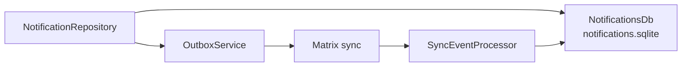

Synced notifications are durable app-level alerts stored **outside the journal
database**. They carry AI and task suggestions across devices, then use
**monotonic state timestamps** to converge when a user dismisses, acts on, or
retracts an alert on any device.

# Why a separate database

An alert is not user content. Keeping it out of `db.sqlite` means notification
churn — created, delivered, dismissed, retracted — never competes with journal
reads for the same write lock, and a notification schema change never touches the
primary store.

# Why monotonic state, not last-write-wins on the row

Dismissal is a **state transition**, not a field edit. Two devices can act on the
same alert in different orders; comparing whole rows would let an older
"delivered" overwrite a newer "acted on".

Carrying the state timestamp separately means the lifecycle only ever moves
forward, so the alert leaves the inbox on every device and stays gone.

Both `notification` and `notificationStateUpdate` are **sequence-tracked**
[sync message families](../sync/message-model.md), so a missed transition is a
detectable gap rather than silent divergence.

The scheduler and the platform-plugin boundary live in `lib/services/`, lazily
registered so a sandboxed build does not initialise the plugin until something
actually schedules — see [bootstrap](../../architecture/bootstrap-and-di.md).
