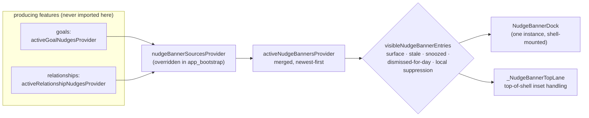
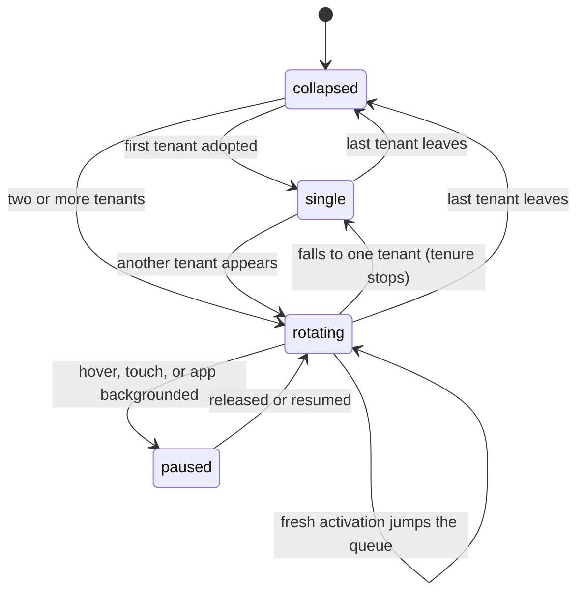

A **nudge** is one banner an agent puts in front of the user: model-authored
copy, a code-owned animation and accent preset, and a whole recorded life —
activations, snoozes, day dismissals, per-activation ratings, and accumulated
screen time. The channel is quiet by default and dismissal is data, not a
delete (ADR 0055).

This module owns the **channel**. Each agent kind owns its **producer**: what
generates a nudge, what its banners advertise, and where a tap lands. Nothing
here imports a producing feature — the coupling runs one way, through a
registry (ADR 0059 Decision 6).

# Two variants, no supertype

`AgentDomainEntity` carries `goalNudge` and `relationshipNudge` as sibling
freezed union members with identical banner-facing fields. Freezed gives them
no common supertype, and inventing one would mean changing the persisted union.
So the substrate reads and writes through **`NudgeEntityView`**, an extension
type over `AgentDomainEntity` whose only constructor path is `of`:

```dart
NudgeEntityView? view = NudgeEntityView.of(entity);   // null for anything else
```

Three properties of it are contract rather than detail:

- **`of` is the only gate.** A non-nudge entity never becomes a view, so every
  getter's internal fold is total and its `default` branch unreachable.
- **It is zero-cost.** An extension type erases at runtime; a
  `List<NudgeBannerEntry>` holds the real entities, and equality is the
  underlying entity's.
- **`copyWith` distinguishes "not passed" from "explicitly null"** with an
  `_unset` sentinel, because a snooze must *clear* `dismissedForDayAt` and a
  day dismissal must *clear* `snoozedUntil`. Only the fields the substrate
  writes are exposed.

# One channel, one source per kind



Each source is a `FutureProvider<List<NudgeBannerEntry>>` producing that kind's
**active** banners, newest first. `app_bootstrap.dart` overrides the registry
with the list — the `agentWakeRunnersProvider` pattern. **A source missing from
that list simply never speaks**, which is what makes the registry testable: the
default is empty, so headless containers need no override.

A `NudgeBannerEntry` is the substrate's whole view of a tenant: the nudge, the
subject's title (a goal title, a person's name), its `NudgeBannerKind`, and the
route a tap opens. Nothing downstream knows the kind's domain.

The merge preserves a single source's order untouched and only re-sorts when
more than one kind contributes — with goals and relationships both registered,
the multi-kind re-sort is the live path. Each source's retained value survives its
own background refresh (`.value` on a reloading `FutureProvider`), so the dock
never flashes empty on sync.

# Visibility is one function, used twice

`visibleNudgeBannerEntries` is the render-time contract, and the shell's
`_NudgeBannerTopLane` calls the *same* function. That is deliberate: if the lane
decided a banner was speaking by a different rule than the dock renders by, it
would strip the child's top padding for a banner that never appeared — leaving
the shell tucked under the status bar with nothing covering it.

An entry is visible when **all** of these hold:

| Gate | Rule |
|------|------|
| Surface | `nudgeKindShowsOn(kind, surface)` — goal banners on Tasks / DailyOS / Habits, relationship banners everywhere including People. A `null` surface skips the gate, for subject-owned pages like a goal's detail page. |
| Staleness | `staleAt` is unset or still in the future. Stale copy never renders, even from retained data. |
| Snooze | not inside a persisted quiet interval (`nudgeBannerIsSnoozed`). |
| Day dismissal | not on the same **local calendar day** as `dismissedForDayAt` — component-based, so a DST day stays 23 or 25 hours. |
| Local suppression | not in `locallySnoozedNudgeDeadlinesProvider` **for this activation**. A chat-committed snooze suppresses the row before the async projection reloads; a *newer* activation of the same row is never suppressed by an older deadline. |

# The dock's rotation

One dock instance is mounted by the shell and **survives tab switches**; the
shell swaps its `surface` property rather than remounting it. Its rotation is
therefore state that outlives any single page.



The reconcile pass (`_reconcile`) is what keeps that machine honest:

- **Cold start adopts, it does not jump.** The first snapshot after mount fills
  the seen-activations map without treating any entry as an acknowledgment.
  The flag is captured *before* the loop, or entry #2 would read entry #1's
  insertion as evidence the dock was already rotating.
- **A fresh acknowledgment jumps the queue** — a re-run (higher
  `activationCount`) or a banner that appeared after rotation began. Entries
  arrive newest-first, so the first match wins.
- **A departed tenant advances to its successor**, resolved against the last
  rendered order, never rewinding to the first entry — rewinding would replay
  a banner the user just moved past.
- **A surface change is a reconcile.** A surface where every tenant is filtered
  out (People, until a relationship agent ships) empties the dock with no
  provider event behind it; without reconciling on `didUpdateWidget` the tenure
  would elapse there, the advance would bail on the empty list, and the
  rotation would never restart on the way back.

# The lane is structural, not an overlay

The dock is mounted **once**, at the top of the shell, by `_NudgeBannerTopLane`
— above the desktop sidebar and above the mobile content, immediately beneath
the demo-mode strip when both are up (the lane nests inside `DemoModeScaffold`,
so the two stack with no coordination between them).

It is the first child of a `Column` whose second child is the whole shell, so a
speaking banner **displaces** everything below it. Three properties follow from
that, none of which needed code of their own:

- scrolling content cannot pass underneath the banner — there is no space under
  it to scroll into;
- the banner cannot collide with the bottom navigation bar or a page-owned
  action bar, because it is nowhere near the bottom edge;
- rotation and window resizes re-lay-out normally; the lane holds no cached
  geometry.

The lane absorbs the top safe-area inset itself (a `SafeArea` around the dock)
and hands the shell a zero top padding via `MediaQuery.removePadding` — the
same mechanism, for the same reason, as the demo strip one level up.

**The shell's slot never changes shape.** `Column` → `Expanded` →
`MediaQuery.removePadding` → shell is the hierarchy in every case, including a
surface no banner speaks on; only `removeTop` follows whether a banner speaks.
Wrapping the shell only while a banner is up would change the widget type in
that slot, so Flutter would deactivate the subtree and inflate a fresh one —
and a banner arriving from sync mid-edit would reset the shell's Beamers,
scroll offsets and in-progress input.

The dock's slot is stable *within* an eligible surface — `SafeArea` stays
mounted, only its `top` varies — which is what carries the dock's rotation and
tenure state across a tenant arriving or leaving. On an ineligible surface the
slot holds a `SizedBox.shrink()` and no dock at all, exactly as the bottom dock
behaved. A `Column` reconciles positionally, so that slot changing type cannot
disturb the shell beside it.

# Interactions: serialized, transactional, durably committed

`NudgeInteractions` is the user's side of the contract: snooze, dismiss for
today, rate once per activation, and account exposure. Every mutation is a
read-modify-write of the whole row, which forces three rules:

- **Per-nudge serialization.** A `_writeTail` future chain per nudge id; two
  overlapping calls would otherwise both read the same snapshot and the later
  upsert would drop the earlier increment — or a dismissal. The stored tail
  swallows its own errors, or every later write would rethrow the first one.
- **Read and write inside one transaction.** `upsertEntity` awaits before the
  actual write, so without the transaction a synced terminal state could land
  in that gap and be clobbered by a bookkeeping upsert carrying a newer clock —
  unrecoverable by the resolver. The host key is resolved *outside* the
  transaction and cached, because it is immutable for the install.
- **A durable commit is success, even on a thrown error.** Each path re-reads
  the row and treats "my event id is already in the history" as done. Reporting
  failure would prompt a retry that the idempotency guards silently drop, and
  the user would be told their choice did not stick when it did.

Exposure is metered per episode, not per frame, and stamped at the *start* of
the episode (`now - visibleFor`): stamping `now` would push `firstShownAt` past
a dismissal that raced the disposal flush and corrupt time-to-dismiss metrics.
The flush is fire-and-forget from `dispose`, so its failure is logged, never an
uncaught async error.

Interaction writes go through the sync service, which deliberately does **not**
notify. The UI handlers therefore call `invalidateNudgeBannerSources` after a
visibility or rating action.

# Concurrent sync: dominance first, then a lossless join

Two devices editing one nudge without seeing each other produce concurrent
vector clocks. Whole-row LWW alone would erase one side's exposure counters and
rating outcomes — and those accumulate across years of activations, so losing
one side is permanent damage rather than noise.

The resolution runs in two stages, both shared by every variant and applied
per-variant:

1. **`resolveConcurrentNudgeLifecycle`** picks the winning row by dominance,
   in order: a dismissal is terminal and outranks everything; supersession
   (the subject itself moved on) outranks even a higher activation; the higher
   `activationCount` is the newer run and its lifecycle metadata must win; and
   at equal activation, terminal states beat concurrent live writes. Returning
   `null` defers to ordinary LWW.
2. **`mergeNudgeAccumulators`** then joins the convergent fields into that
   winner: G-counters element-wise, snooze and day-dismissal histories unioned
   by stable event id, ratings collapsed to **one outcome per activation**, and
   the shown-at watermarks widened. Its clock is the *join* of both branches —
   keeping only the winner's would let that device's next pre-merge write
   causally dominate and overwrite the other branch through the ordinary path.

The variants have no supertype, so `NudgeAccumulatorView` — a plain record —
is the working set, and thin per-variant adapters project into it and apply the
result back with `copyWith`. **The merge rules exist exactly once.** A
cross-variant id collision matches no adapter and defers to the standard
whole-row path.

Every ordering used in that merge is a *total* order over all distinguishing
fields. Replicas build these sets local-first, so a comparator tie between two
distinct records would let them serialize differently on two devices and
diverge permanently under equal-clock sync.

# Gotchas

- **Mixed fleets are safe by construction, not by care.** A peer too old to
  know `relationshipNudge` decodes it as `AgentUnknownEntity` and never
  surfaces it. Existing `goalNudge` rows are never converted or renamed.
- **The vocabulary is kind-agnostic, some copy is not.** The snooze and rating
  sheets read `nudgeBanner*` strings, which are deliberately kind-neutral. The
  semantic label is per kind (`goalBannerSemanticLabel`,
  `relationshipBannerSemanticLabel`) because it names the subject.
- **The dock may mount on a surface with nothing to say.** People mounts it
  today and it renders collapsed, because no producer writes
  `relationshipNudge` rows yet.
- **Validation lives at the decode gate, not in constructors.** Assertions
  vanish in release builds, so `_validateNudgeJson` refuses a malformed
  rating, snooze, or day-dismissal payload with a `FormatException` for every
  nudge variant.

# Related

- [Goal agents](goals.md) — the first producer, and the goal-owned banner card.
- [Relationships](relationships.md) — the second subject kind; its agent
  workflow produces `relationshipNudge` rows and registers
  `activeRelationshipNudgesProvider`.
- [Agents](agents/) — the runtime that writes these rows and the sync layer
  that replicates them.
- [ADR 0060](../../docs/adr/0060-banner-dock-as-app-shell-structural-band.md) —
  why the dock moved from a bottom mini-player to the top structural band.
