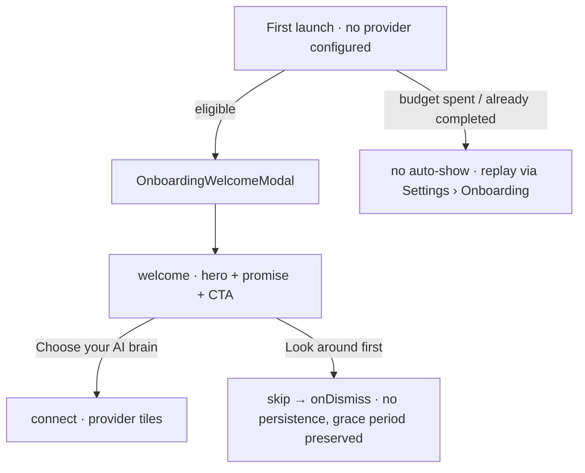

Onboarding guides a brand-new user to the core moment — **speak a thought, watch
it become a structured task** — and measures whether that landed.

**Status:** the measurement substrate, the welcome and connect-your-brain front
door, the live voice→task moment, the auto-show trigger and re-show cadence, and
the Settings → Onboarding replay entry are implemented. The D1 return loop is
not.

**The welcome has no config flag** — it is released to everyone, with cadence and
completion state as its only gates. It is the **sole** first-run setup path; the
pre-FTUE provider-selection modal and setup-prompt service have been deleted.

The separate [Daily OS walkthrough](daily_os_next/ui-surfaces.md) remains in a
dark launch behind its own flag.

# The flow

**Skipping preserves the grace period** — it records no completion, so the
welcome remains eligible to reappear within its cadence budget.

It is not, however, storage-neutral: the modal records a `welcomeSkipped` event,
and the auto-show path has already written the shown count and first-shown
timestamp *before* opening. What "look around first" costs you is a slot in the
cadence budget, not the offer itself.

# A dedicated measurement store

Onboarding metrics live in their **own** database (`onboarding_metrics.sqlite`),
not in the journal. The separation is deliberate: activation measurement is
device-local, never synced, and must not entangle itself with user content.

**The first-seen signal is recorded at startup**, not when the welcome shows —
that way users upgrading into the build are tagged as the baseline cohort even if
they never trigger the welcome, which is essential for a clean before/after
retention comparison. The write is fire-and-forget with its own try/catch so a
metrics failure cannot surface as an uncaught startup error.

**Two funnel derivations are partitioned by event vocabulary**, so Daily OS
walkthrough events never shift the general FTUE active-day or activation metrics
even though both reuse the same store.

# Cadence

Auto-show is bounded: a small number of shows within a fixed window, persisted
under a private settings key prefix, and **retired entirely on completion**. The
Daily OS walkthrough mirrors the same cadence shape with its own prefix, so the
two never spend each other's budget.

Eligibility for the Daily OS walkthrough additionally requires a **real
readiness check** — the exact planner template, model/profile and provider chain
must resolve a thinking route — evaluated **read-only**, never creating the
planner. See
[Daily OS onboarding](daily_os_next/ui-surfaces.md).

# Where the consent flag is written

Onboarding sets a category's `automaticInferenceEnabled` to `true` at the moment
it creates the areas: having just connected a provider and picked those areas *is*
the consent. It is written **before** the first capture, not because of it —
otherwise the flow would teach "speak and it transcribes" while the app stopped
doing so the next day.

It is not the only writer — the category settings form carries a switch for the
same flag — but it is the only place the flag is set *without* the user touching
one, which is why the consent has to be established by the step itself.

**Reused categories are the exception**: an existing `false` is the user having
switched automation off, so onboarding only fills in a `null`. See
[categories](categories.md).
