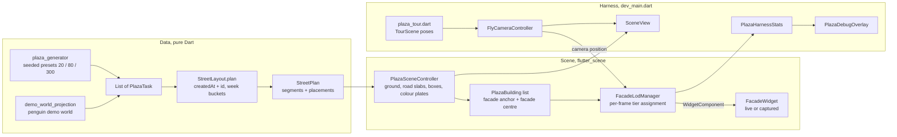
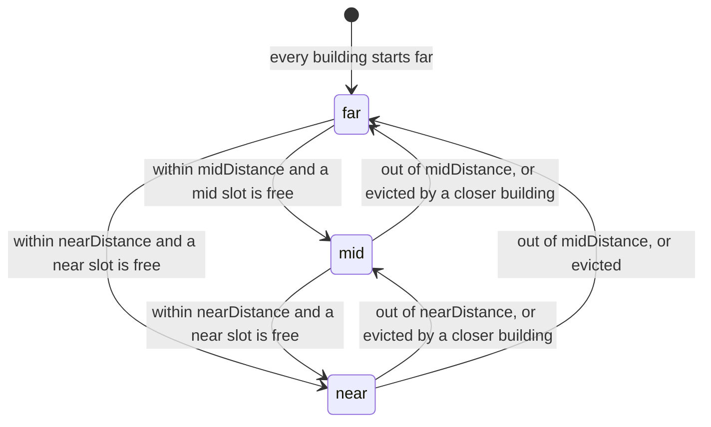

The prototype behind the plan to replace the knowledge-graph hairball with a
spatial map of a project. **It is a developer harness, not a feature**: not
routed, not registered in DI, not reading the database. What it is for, what
it looks like today and why it is not usable yet are in the
[M0 handover](../../docs/plaza/HANDOVER.md); the proposal for making it
usable is [DESIGN.md](../../docs/plaza/DESIGN.md). This concept is the map of
what actually runs.

# Runtime flow

Every frame the harness advances the camera, hands its position to the LOD
manager, which re-ranks every building by distance and promotes or demotes
facade surfaces, then publishes rolling stats to the overlay four times a
second.

# The layout: nothing ever moves

Lotti is local-first with concurrent task creation on several devices, so
there is no global creation order to lay a street out by. `StreetLayout.plan`
is therefore a pure function of data that merges identically everywhere:

- Tasks sort by `(createdAt, id)` and fall into **UTC week buckets** anchored
  on Monday 00:00 UTC (a local calendar would break the invariant across time
  zones). One bucket is one 46 m plot group; an empty week collapses to a 7 m
  gap segment drawn darker.
- Inside a bucket, tasks alternate road sides in order and split the group's
  usable length by a per-id FNV-1a hash weight (`stableHash`; `String.hashCode`
  is not stable across VM versions). Widths are clamped so crowded weeks
  yield to the slot and neighbours never intersect.
- The road bends after roughly every third bucket by a hash of
  `(projectSeed, bucketIndex)`, never of task data.
- Building height is content-driven (title lines, meta row, cover art, open
  checklist items, capped) but still a function of merged data only.
- Deleted tasks keep their plot as a fenced empty lot.

The invariants are property tests in `street_layout_test.dart`: shuffled
arrival yields an identical street, appending never moves an existing
building, a late-syncing task jostles only its own bucket. **Known edge**: a
task syncing into a previously empty week turns the gap into a plot group and
shifts everything downstream; accepted for the prototype and documented in
the tests. An explicit `epoch` can be passed to `plan` so a task older than
all known ones cannot shift bucket zero; the harness does not pass one.

# Facade tiers

The whole point of M0 was to find the ceiling for live widgets on meshes.
Hosting a widget subtree is nearly free; **capturing** it to a texture costs
about 0.6 ms per widget per frame on weak hardware, so tiers are enforced by
construction:

- **far**: no widget. A flat colour plate on the box front encodes state.
- **mid**: `WidgetComponent` hosting a non-interactive `FacadeWidget`,
  captured on a 3 s interval so late-arriving cover art still shows up.
- **near**: the same widget, interactive, captured every frame. Checkbox
  ticks are widget-local state; nothing is written anywhere.

Ranking uses distance to the facade centre with a 15 % hysteresis for
surfaces already promoted, so tiers do not thrash at the boundaries. Caps
(`nearCap`, `midCap`) and distances are overlay sliders; `forceAllLive` is
the naive version the benchmark disproves. Detaching a surface removes its
`WidgetComponent` from the building's facade anchor node.

# Harness modes

| Mode | Trigger | What it does |
|---|---|---|
| Interactive | default | WASD walk, drag look, overhead blend, preset cycling, overlay knobs |
| Benchmark | `PLAZA_BENCH=1` | Forces the 300-task preset, auto-walks from the frontier through six LOD configurations of 14 s each (4 s warm-up), prints `PLAZA_BENCH result` lines with fps, p99 and worst frame |
| Tour | `PLAZA_TOUR=1` | Steps through the fixed poses in `plaza_tour.dart` (large preset first, then the penguin world), prints `PLAZA_TOUR ready <i> <name>` after 5 s, advances after 9 s, ends with `PLAZA_TOUR done`. Benchmark wins if both are set. |

Tour poses are functions of a `TourScene`, a plain-data projection of the
built scene, so the pose maths is unit-tested without a GPU; the harness
builds the projection from its `PlazaSceneController`.
`tool/plaza/capture_tour.py` drives the tour on Linux/X11 and grabs one PNG
per stop.

# Gotchas

- **Flutter GPU must be enabled.** `--enable-flutter-gpu` is a `flutter run`
  flag; a built binary needs `FLUTTER_ENGINE_SWITCHES=1
  FLUTTER_ENGINE_SWITCH_1=enable-flutter-gpu` in its environment.
- **`flutter_scene` 0.23 winds `WidgetComponent`'s quad clockwise** while the
  engine now culls clockwise faces, so `facade_lod_manager.dart` supplies its
  own counter-clockwise quad. Drop it when upstream fixes the primitive.
- **`flutter_scene` pins `code_assets ^1.2.1`.** `code_assets` and
  `native_toolchain_c` are held current under `dependency_overrides` in
  `pubspec.yaml`; re-check on every `flutter_scene` bump.
- **Scene classes need a GPU context.** `PlazaSceneController` builds
  meshes on construction; `FacadeLodManager` creates GPU-backed
  `WidgetComponent`s inside `update()` when it promotes a surface. Both live
  under `scene/`, which `codecov.yml` excludes along with `dev_main.dart`, so
  keep logic that needs tests in the pure layers (`domain/`,
  `ui/plaza_tour.dart`). The tier ranking itself is plain arithmetic and could
  be tested by injecting the surface factory; nothing does yet.
- **The facade palette is local on purpose.** Like the knowledge-graph
  explorer's `graph_style.dart`, `FacadeStyle` is scene content in a dev
  harness, not app chrome; it moves onto design-system tokens only if the
  prototype graduates.
- **Fixtures are the demo world only.** The `waddle` preset projects
  `ManualDemoWorld.penguinLogistics`; never point the harness at user data.
